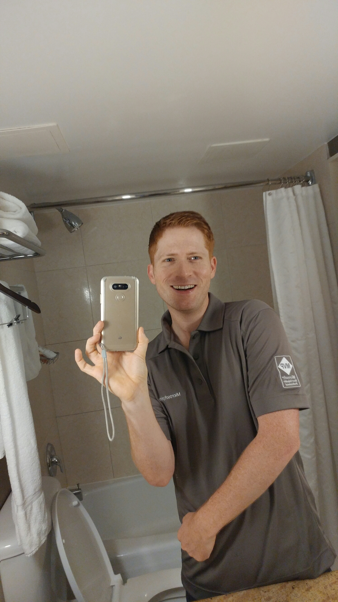
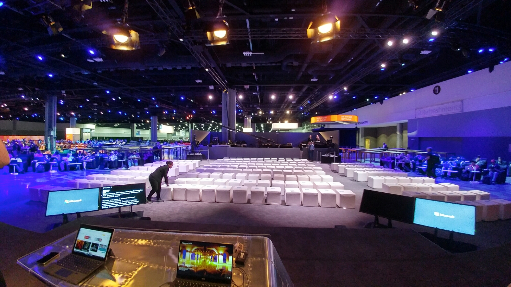

Last week, I was able to attend my first big IT Conference, a dream of mine since I first got into IT almost ten years ago.  I got to attend Microsoft Ignite!

##### **IT WAS AWESOME!**

In this post, I'll recap some of my experiences attending...and being able to speak there as well!

#### On the value of Ignite

Ignite is Microsoft's gigantic combination of TechEd and MMS, a far-reaching summit covering all of Microsoft's technology stack, from devices to SQL, asp.net to Azure, everything is here.

It is HUGE. Just overwhelmingly big. You simply cannot attend every session, and you'll probably find yourself triple or quadruple booked for sessions.  Keep in mind that conferences like Ignite commonly take place in massive convention centers like the Georgia World Congress Center.  Actually, while I'm talking about it:

#### The GWCC

The Georgia World Congress Center is absolutely unfathomably big.  It is the fourth biggest convention center in the United States.  If you're in Hall A, the walk to Hall C will easily take you twenty minutes or more.  And the session might be full by the time that you get there.

Enter the Ignite app.  One AWESOME feature of this app is the ability to livestream any session live from your app.  Very convenient.  I used this a lot, as my feet got progressively more sore and I became lazier and lazier.  There is also an area full of comfortable couches, bean bags, tables and chairs called the 'Hangout'.  In this area, you can chat and have snacks and watch sessions on a colossal, wall filling screens.

I spent a lot of time here!

#### The Expo Hall

Ignite features an absolutely amazing and gigantic vendor hall.  Something like...a lot of Vendors were here.

Actually, for a Windows / Microsoft guy, the Expo hall is amazing.  I instantly recognized the vast majority of vendor names and had good conversations with the vendors, or learned of cool new features, like the v3.0 release of SquaredUp, which now works on the HoloLens!

I also got to try on the HTC Vive, which blew my socks off.  As one of the 10% of people who experience [SIM Sickness](https://www.wikiwand.com/en/Simulator_sickness), which makes me very ill if I have a bad VR session, I was afraid that I'd never be able to play VR at all.

However, those fears were all alleviated when I put on the Vive.  Fully immersive, head and motion tracking VR meant that I could move around as I wanted and my inner ear accepted the experience as reality.  AWESOME!  I learned that room scale VR is a must for me.

Roughly half of the floor space of the expo hall was reserved for Microsoft, who filled the space with dozens of booths which had high-tech displays and whiteboards to help diagram solutions.  If you need help with a Microsoft expert for ANY issue, you can find that answer here on the Expo Hall floor.

For organizations with pressing IT challenges who want to get a lot of highly qualified answers, the expo hall alone is worth the price of admission to Ignite.

But people don't go to the hall for the swag or vendors..they go for the AMAZING SESSIONS!

#### My favorite sessions

There were SO many incredibly good sessions at Ignite.  I made this YouTube playlist (seems Ignite is more hosted on YouTube this year rather than on Channel 9).

https://www.youtube.com/playlist?list=PLifVgbGzYBEwUt8hNzRylHuVn3G0S9L72

To draw attention to my favorites of these

[System Center 2016 - What's new](https://www.youtube.com/watch?v=AikRP1wUxUk&index=3&list=PLifVgbGzYBEwUt8hNzRylHuVn3G0S9L72) : a great one hour session cataloging all of the nice new features of mostly SCOM, which I need for my customers

[Monitor your Datacenter with SCOM](https://www.youtube.com/watch?v=AikRP1wUxUk&index=3&list=PLifVgbGzYBEwUt8hNzRylHuVn3G0S9L72) : again, I need to stay on top of changes in SCOM.  I love all the new changes.

[Notes from the field, how real people deployed nano server](https://www.youtube.com/watch?v=L6t06rnhOfY&index=8&list=PLifVgbGzYBEwUt8hNzRylHuVn3G0S9L72): I love to hear how things actually break in the wild!

[PowerShell Unplugged - Jeffrey Snover and Don Jones](https://www.youtube.com/watch?v=Ab46gHXNm8Q) : the two best PowerShell speakers of all time, delivering a GREAT session commemorating the ten year anniversary of PowerShell

#### On speaking

The first time I taught a class of PowerShell, I spent a month working on my course and practicing for it. I found out in September of that year that I'd be doing this training in three months.

I pretty much have no memory of those months, other than laying down in bed with my heart pounding. I lost so much sleep and felt queasy all the time, so I actually lost weight!

Just attending a conference like Ignite had always been a dream of mine, to meet those people who helped me so much, and thank them or get my questions answered. It never even occurred to me that I might one day be giving  a talk at Ignite, and I definitely never expected to have more than a few people sign up for it.

I was humbled greatly to see the numbers of people sign up and knew I had to focus and do my best. I spent hours and hours listening to great public speakers like Simon Peeriman, Don Jones and Jason Helmick, and listened over and over to James Whitaker.

I practiced my full session with demoes more than ten times all the way through, working on whittling the content down and practicing my transitions.

I used that fear to motivate me, and on the day of the talk, woke up full of energy and no worries.

The crowd packed in! But for my first session I had no mic so I had to yell! Very, very tough.

For my second session of the day, I had a mic! Life was much better.

#### On being recorded

One of my dreams was to have my session from Ignite be recorded, kind of like proof of having been there. I never expected to be recorded in a studio though! Seeing the massive Ignite studio, which took up a huge section of Hall C, in the Hangout section, I immediately felt my heart start pounding again.

](http://foxdeploy.files.wordpress.com/2016/10/wp-image-1600035927jpg.jpg) My thoughts " boy I hope no one comes!"\[/caption\]

The morning of, I met the awesome [Jeremy Chapman](https://twitter.com/deployjeremy?ref_src=twsrc%5Egoogle%7Ctwcamp%5Eserp%7Ctwgr%5Eauthor), who makes the wonderful Microsoft Mechanics videos. Then I got miced up and ready. I was hoping that, with this being the last day of Ignite, crowds wouldn't be too big.

NOPE.

All in all, I feel good about how my session went.  I think I'd even like to speak at more conferences!  Once the nerves died down, I found speaking to be very, very exciting and rewarding.  I know that at the end of the day, I did my absolute best to make this the highest quality twenty minute introduction to PowerShell that I could make it.

Here's my session, if you'd like to watch it!

https://www.youtube.com/watch?v=YHtZY6pASAI
