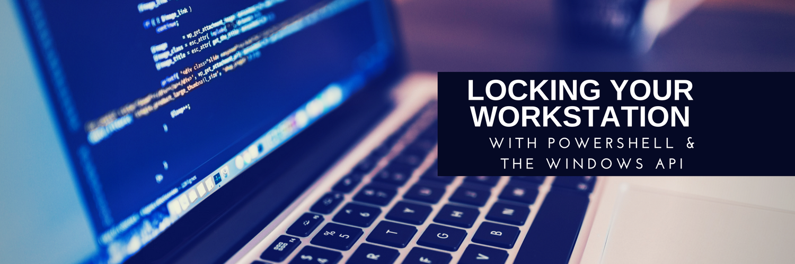
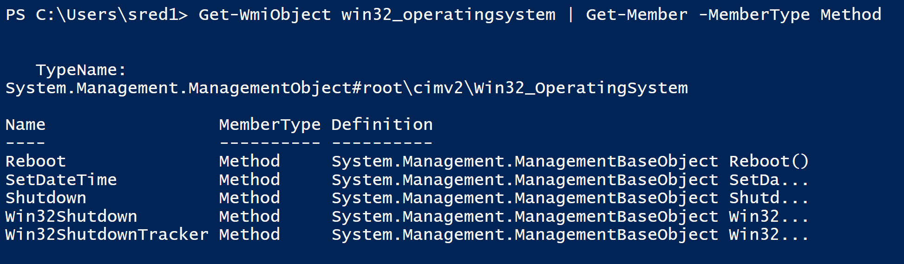
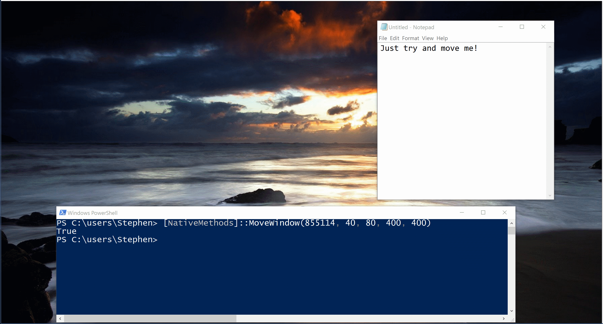

Locking a workstation using PowerShell?  It sounds like an easy task, right?  That's what I thought too...and told the customer...but NO!  Friends, it wasn't easy...before now.

As it turns out, some tasks in Windows just aren't accessible via WMI.  For instance, the useful Win32\_OperatingSystem class has some nifty methods for working with the system's power state, like Reboot and Shutdown...but strangely none for locking the system!

Then I stumbled upon [this useful post by Ed over at The Scripting Guys,](https://blogs.technet.microsoft.com/heyscriptingguy/2004/11/15/can-i-lock-a-workstation-using-a-script/) but this was back in the dark ages of VBScript, and unfortunately the only answer they found was to use Rundll32.exe to call a method in a dll and that, frankly will not fly.  You'll hear the shrillest high and lowest lows over the radio, and my voice will guide you home, they will see us waving from such great heights--

Sorry, that phrase is still a trigger word for me and takes me back to my deeply embarrassing emo phase...moving right along.

### How to work with native methods easily in PowerShell

If you want to know how this is done...stop right here and read [this awesome blog post by Danny Tuppenny](https://blog.dantup.com/2013/10/easily-calling-windows-apis-from-powershell/) on the topic.  It's eye-wateringly in-depth.  But if you just want an example of how it is done, lets proceed.

Now, we all know by now that we can use Add-Type to work with native C# code...but the brilliant thing that Danny did is create a function which just makes it very easy to import a dll and get at the methods within...then surface those methods as a new class.  It's the bomb.com.

\[code language="powershell"\] # Helper functions for building the class $script:nativeMethods = @(); function Register-NativeMethod(\[string\]$dll, \[string\]$methodSignature) { $script:nativeMethods += \[PSCustomObject\]@{ Dll = $dll; Signature = $methodSignature; } } function Add-NativeMethods() { $nativeMethodsCode = $script:nativeMethods | % { " \[DllImport(\`"$($\_.Dll)\`")\] public static extern $($\_.Signature); " }

Add-Type @" using System; using System.Runtime.InteropServices; public static class NativeMethods { $nativeMethodsCode } "@ } \[/code\]

With that done, we'll now have some a function available to us, `Register-NativeMethod`. To use this, we simply provide the name of the .dll we want to use, and then what's known as the method signature. For instance, let's say I wanted to use User32.dll to move a window, [as described here](https://msdn.microsoft.com/en-us/library/windows/desktop/ms633534(v=vs.85).aspx). Here's the method signature for that method.

\[code language="powershell"\] BOOL WINAPI MoveWindow( \_In\_ HWND hWnd, \_In\_ int X, \_In\_ int Y, \_In\_ int nWidth, \_In\_ int nHeight, \_In\_ BOOL bRepaint ); \[/code\]

The hWnd is kind of a special variable, it means HandlerWindow, or MainWindowHandle. You can get a MainWindowHandle by running Get-Process Name | select MainWindowHandle. All of the other values are just integeres, so that would be the window position in X and Y and the width and height. Finally, you can provide a true, false value with bRepaint (but I didn't bother).

We can implement this in PowerShell by using the `Register-NativeMethod` function, like so:

\[code language="powershell"\] Register-NativeMethod "user32.dll" "bool MoveWindow(IntPtr hWnd, int X, int Y, int nWidth, int nHeight)" \[/code\]

Finally, we call it like so:

\[code language="powershell"\] #Find the first Notepad process' MainWindowHandle $Handle = Get-Process notepad | select -first 1 -expand MainWindowHandle \[NativeMethods\]::MoveWindow($Handle, 40, 80, 400, 400) \[/code\]

And here's how it looks in practice.

If you'd like to know what other Methods are available, you can turn to the lovely [Pinvoke website](http://www.pinvoke.net/) which has a listing of every method available from all of these dlls.  And you can just plug and play them all, easily!

Particularly of note are methods in user32.dll and kernel32.dll, but deep-linking doesn't work, so you'll have to click the dll name on the left column.

### But what about locking the WorkStation?

I didn't forget about you!  To lock the workstation, run

\[code language="powershell"\] Register-NativeMethod "user32.dll" "bool LockWorkStation()"

#Calling the method to lock it up \[NativeMethods\]::LockWorkStation() \[/code\]

#### Complete Code

\[code language="powershell"\] # Helper functions for building the class $script:nativeMethods = @(); function Register-NativeMethod(\[string\]$dll, \[string\]$methodSignature) { $script:nativeMethods += \[PSCustomObject\]@{ Dll = $dll; Signature = $methodSignature; } } function Add-NativeMethods() { $nativeMethodsCode = $script:nativeMethods | % { " \[DllImport(\`"$($\_.Dll)\`")\] public static extern $($\_.Signature); " }

Add-Type @" using System; using System.Runtime.InteropServices; public static class NativeMethods { $nativeMethodsCode } "@ }

\# Add methods here

Register-NativeMethod "user32.dll" "bool LockWorkStation()" Register-NativeMethod "user32.dll" "bool MoveWindow(IntPtr hWnd, int X, int Y, int nWidth, int nHeight)" # This builds the class and registers them (you can only do this one-per-session, as the type cannot be unloaded?) Add-NativeMethods

#Calling the method \[NativeMethods\]::LockWorkStation() \[/code\]
