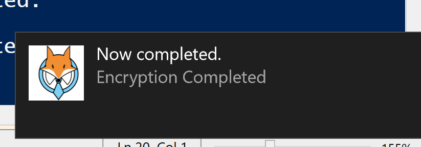
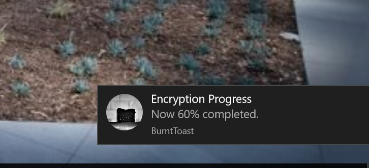

Happy New Years, everyone!

This will be a quick post here, but I just wanted to shine a spotlight on an AWESOME tool that I absolutely love: [Joshua King's](https://twitter.com/WindosNZ) 'BurntToast' PowerShell module, which makes the arduous task of rendering a Windows Toast notification VERY Easy.

Check out his [GitHub repo here](https://github.com/Windos/BurntToast), and view the module's page on the [PowerShell gallery here](https://www.powershellgallery.com/packages/BurntToast/0.5.1).

Here's an example of what I'm talking about



### Why might I want to use this?

Any time you want to provide data to the end-user, but not require them to drop everything to interact. I don't know about you, but I really dislike alert dialog boxes.  Especially if they lock my whole desktop until I quickly ignore it and click the 'X' button...err, read it.

I also believe that toasts are what users expect, especially to receive updates from long-running scripts.  They really do provide a polished, refined look to your scripts.

Finally, you can also provide your own image and play your own sound effects too!

### Real-time encryption notices

At a current customer, we're deploying a device management profile using MDM to use BitLocker encryption on these devices.  We decided that it would be very useful to be able to see updates as a device was encrypting, so I wrote up this script around the BurntToast tool.

```powershell 
install-module BurntToast -Force Import-module BurntToast

$EncryptionStatus = Get-BitLockerVolume -MountPoint c:

While ($EncryptionStatus.VolumeStatus -eq 'EncryptionInProgress'){

if (($EncryptionStatus.EncryptionPercentage % 5)-eq 0){ New-BurntToastNotification -Text 'Encryption Progress', "Now $($EncryptionStatus.EncryptionPercentage)% completed." }

Start-Sleep -Seconds 30

$EncryptionStatus = Get-BitLockerVolume -MountPoint c: Write-host $EncryptionStatus.EncryptionPercentage }

New-BurntToastNotification -Text 'Encryption Completed' 'Now completed.' -Image "C:\\Users\\sred1\\Dropbox\\Docs\\blog\\foxderp - Copy.png"


```

And a screen shot of it in action!


