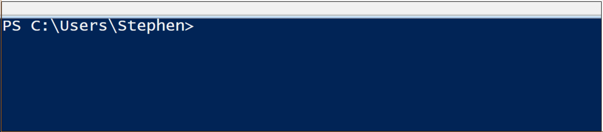
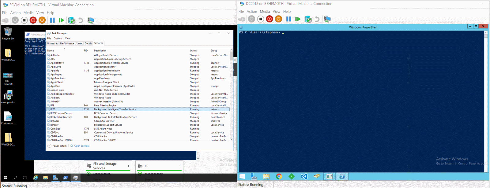

[](/series/powershell-autocompletion)


* * *

Probably my single favorite feature of PowerShell isn't exciting to most people...but I love Auto-Completion.  I have my reasons:

As I have the typing skills of a preying mantis (why did I mention them...they're easily the creepiest and worst insect...ewww) and constantly typo everything, I LOVE auto-completion.
<!--more-->
Add to that the fact that I have lost a memory competition to a gold fish, and I REALLY Depend upon it.

 

If you have a memory like me, and like this guy, you'll love Auto-complete

PowerShell helps deeply flawed people like me by offering tons of built-in help and autocomplete practically everywhere.  Some of it is done for us, automatically, while others require a bit more work from us as toolmakers in order to enable the sweet sweet tab expansion.

In the world of AutoCompletion, there are two real types of AutoComplete that PowerShell offers. In this series, we'll cover these two types of PowerShell autocompletion:

- Part 1  - (This post) Parameter AutoComplete
- Part 2 - (Coming soon) Output AutoComplete

This post is going to be all about the first one.

### Parameter AutoComplete

In PowerShell, when you define a Function, any of your parameter names are automatically compiled and available via autocompletion.  For instance, in this very simple function:

```powershell
Function Do-Stuff { param( $Name,$count)

For($i = 1 ; $i -le $count; $i++){

"Displaying $name, time $i of $count"

}

}
```

As you'll see in the GIF below, PowerShell will compile my function and then automatically allow me to tabcomplete through the available parameter names.


That's nice and convenient, but what if I want to prepopulate some values, for the user to type through those?  There's two ways of doing that (well, at least two).  If we constrain the values a user can provide using `[ValidateSet()]`, we'll automatically get some new autocomplete functionality, like so.

```powershell
  param( [ValidateSet("Don", "Drew", "Stephen")] $Name,

$count)
```



Now, for most of our production scripts...this is actually pretty good. We might only want our code to run one on or two machines, or accounts, or whatever.

But what if we wanted our function to instead display a dynamic list of all the available options?  We can do this by adding dynamic parameters.

### Dynamic Parameters

You can read about it here at the very bottom of the help page entry for [about\_Function\_Advanced\_Parameters](https://msdn.microsoft.com/powershell/reference/5.1/Microsoft.PowerShell.Core/about/about_Functions_Advanced_Parameters), but I don't really like the description they give.  These parameters work by executing a script block and building up a list of the available options at the time of execution, Dynamically.

In our example, we're going to recreate the wheel and make our own Restart-Service cmdlet, and replicate the feeling of it auto-populating the available services.  But this time, it's going to work on remote computers! The code and technique were both originally covered by Martin Schvartzman in his post [Dynamic ValidateSet in DynamicParameters](https://blogs.technet.microsoft.com/pstips/2014/06/09/dynamic-validateset-in-a-dynamic-parameter/) on Technet.

For a starting point, here's a super basic function to use `Get-WmiObject` to start and stop services on remote computers.  There is NO error handling either.

```powershell
Function Restart-RemoteService{ 
    Param($computername=$env:COMPUTERNAME,$srv="BITS")
    ForEach($machine in $computername){ 
      write-host "Stopping service $srv..." -NoNewline 
      Get-WmiObject -ClassName Win32\_Service -ComputerName $machine | 
        Where Name -eq $srv | % StopService | Out-Null write-host "\[OK\]" -ForegroundColor Cyan

      Write-Host "Starting Service $srv..." -NoNewline Get-WmiObject -ClassName Win32\_Service -ComputerName $machine | Where Name -eq $srv | % StartService | Out-Null write-host "\[OK\]" -ForegroundColor Cyan } } 
```

Thus far, it will work, but t doesn't give us Dynamic Autocomplete.  Let's add that.

First things first, in order to have a Dynamic parameter, we have to be using `[CmdletBinding()]` and we also need to define our DynamicParam in its own special scriptblock, after the regular params.

```powershell
Function Restart-RemoteService{ 
    \[CmdletBinding()\] Param($computername=$env:COMPUTERNAME) 
    DynamicParam { #define DynamicParam here } 
```

Now, within our DynamicParam block, we have to do a few things:

- Name the param
- Create a `RuntimeDefinedParameterDictionary` object
- Build all of the properties of this param, including its position, whether it is mandatory or not, etc, and add all of these properties to a new `AttributeCollection` object
- Define the actual logic for our param values by creating a dynamic `ValidateSet` object
- Add these all up and return our completed DynamicParam, and end the dynamic block
- Add a Begin and Process block to our code, and within the Begin block, commit the user input to a friendly variable (otherwise the value lives within `$PSBoundParameters`

First, we name the Param here:

```powershell
  DynamicParam {
  # Set the dynamic parameters' name 
  $ParameterName = 'Service'

```

You know how when we normally define a parameter, we can specify all of these nifty values, like this?

```powershell
[Parameter(Mandatory=$true,
                   ValueFromPipeline=$true,
                   ValueFromPipelineByPropertyName=$true,
                   ValueFromRemainingArguments=$false,
                   Position=0,
                   ParameterSetName='Parameter Set 1')]
        [ValidateNotNull()]
        [ValidateNotNullOrEmpty()]
        [ValidateCount(0,5)]
        [ValidateSet("sun", "moon", "earth")]
        [Alias("p1")]
        $Param1
```

If we want to do this for a dynamic parameter, we have to create a `System.Management.Automation.RuntimeDefinedParameterDictionary` and add all of the properties we want to it.  In fact, that's the next thing we do, and we have to do it.   We make a new Dictionary, then make a new collection of attributes (like Mandatory, Position, etc), then we manually add all of the Parameters to the dictionary.  Yeah, it totally blows.

```powershell
# Create the dictionary
$RuntimeParameterDictionary = New-Object System.Management.Automation.RuntimeDefinedParameterDictionary
 
# Create the collection of attributes
$AttributeCollection = New-Object System.Collections.ObjectModel.Collection[System.Attribute]

```

With that, we're ready to make some attributes. Stick with me, I promise we're about to do something fun. In the next step, we'll make the ServiceName mandatory, and specify a position of 1 if the user is lazy.

```powershell
 # Create and set the parameters' attributes
$ParameterAttribute = New-Object System.Management.Automation.ParameterAttribute
$ParameterAttribute.Mandatory = $true
$ParameterAttribute.Position = 1
 
#Add the attributes to the attributes collection
$AttributeCollection.Add($ParameterAttribute)
```

Alright, finally the cool part! Here's where we populate our dynamic parameter list! We do this by running our arbitrary code (remember, these are values we're specifying, so you need to remember to append `Select -ExpandProperty #YourPropertyName` to the end of your statement, or nothing will happen), and then we take the output of our code (which we want to become the values the user can tab through) and we add them as a custom `ValidateSet`.

Yup, that's all we were doing this whole time, setting up a big structure to let us do a script based ValidateSet. Sorry to spoil it for you.

```powershell 
#Code to generate the values that our user can tab through
$arrSet = Get-WmiObject Win32_Service -ComputerName $computername | select -ExpandProperty Name
$ValidateSetAttribute = New-Object System.Management.Automation.ValidateSetAttribute($arrSet)

```

OK, we're in the home stretch. All that remains is to crete a new Parameter object using all of the stuff we've done in the previous 10 lines, then we add it to our collection, and Bob's your uncle.

```powershell
# Add the ValidateSet to the attributes collection
$AttributeCollection.Add($ValidateSetAttribute)
 
# Create and return the dynamic parameter
$RuntimeParameter = New-Object System.Management.Automation.RuntimeDefinedParameter($ParameterName, [string], $AttributeCollection)
$RuntimeParameterDictionary.Add($ParameterName, $RuntimeParameter)
return $RuntimeParameterDictionary
    }
 
begin {
# Bind the parameter to a friendly variable
$Service = $PsBoundParameters[$ParameterName]
    }
```

Particularly of note is that last bit, in the Begin block. Strangely enough, PowerShell will receive the values the user inputs, but saves them within `$PSBoundParameters`, its up to us to actually commit the value the user inputs into the variable name of `$service` so that we can use it.

Putting that all together, here's the complete `DynamicParam{}` scriptblock.

```powershell
DynamicParam {
 
            # Set the dynamic parameters' name
            $ParameterName = 'Service'
 
            # Create the dictionary
            $RuntimeParameterDictionary = New-Object System.Management.Automation.RuntimeDefinedParameterDictionary
 
            # Create the collection of attributes
            $AttributeCollection = New-Object System.Collections.ObjectModel.Collection[System.Attribute]
 
            # Create and set the parameters' attributes
            $ParameterAttribute = New-Object System.Management.Automation.ParameterAttribute
            $ParameterAttribute.Mandatory = $true
            $ParameterAttribute.Position = 1
 
            # Add the attributes to the attributes collection
            $AttributeCollection.Add($ParameterAttribute)
 
            # Generate and set the ValidateSet
            $arrSet = Get-WmiObject Win32_Service -ComputerName $computername | select -ExpandProperty Name
            $ValidateSetAttribute = New-Object System.Management.Automation.ValidateSetAttribute($arrSet)
 
            # Add the ValidateSet to the attributes collection
            $AttributeCollection.Add($ValidateSetAttribute)
 
            # Create and return the dynamic parameter
            $RuntimeParameter = New-Object System.Management.Automation.RuntimeDefinedParameter($ParameterName, [string], $AttributeCollection)
            $RuntimeParameterDictionary.Add($ParameterName, $RuntimeParameter)
            return $RuntimeParameterDictionary
    }
 
    begin {
        # Bind the parameter to a friendly variable
        $Service = $PsBoundParameters[$ParameterName]
    }
```

And in progress.  Keep your eyes on the birdy here, as you'll see the Services start to populate almost immediately after I hit tab, then the service on the left side will very quickly stop and start.



**Here's the [Completed Function](https://github.com/1RedOne/BlogPosts/blob/master/Restart-RemoteService.ps1).**

### Sources

This was a hard one to write, and really helped me a lot to formalize my knowledge on the matter.  I couldn't have done it without these posts.

- [Martin Schvartzman - DynamicValidateSet in a DynamicParameter](https://blogs.technet.microsoft.com/pstips/2014/06/09/dynamic-validateset-in-a-dynamic-parameter/)
- [Adam Betram - How to implement DynamicParameters](https://mcpmag.com/articles/2016/10/06/implement-dynamic-parameters.aspx)
- [Warren Frame - Quick Hits and DynamicParams](https://ramblingcookiemonster.wordpress.com/2014/11/27/quick-hits-credentials-and-dynamic-parameters/)
- [BeatCracker - Dynamic parameters, ValidateSet and Enums](https://beatcracker.wordpress.com/2015/08/10/dynamic-parameters-validateset-and-enums/)

Join us next post as we delve into how to add additional autocomplete to our function, by means of defining the output type for our function.

**Updated:** [here's a link to part II, adding output types!](https://foxdeploy.com/2017/03/23/advanced-autocompletion-adding-output-types/)
