[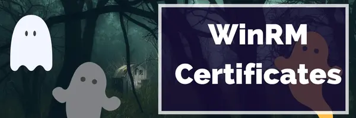](/series/LearningWinRM)

**This post is part of the Learning WinRM Series, here on FoxDeploy. Click the banner to return to the series jump page!**

* * * 


Oh boy, this has been a rollercoaster of emotions.  But guys...we made it.  We have finally, and definitively answered what happens to WinRM with HTTPs when certificates expire.  If you're curious about why this is a big question, see my previous posts on this topic.

- [WinRM HTTPs and the Case of Spooky Certificate](http://foxdeploy.com/2016/09/16/winrm-https-and-the-case-of-ghost-certificate/)
- [WinRM and HTTPs What happens when certs die](http://foxdeploy.com/2016/09/13/winrm-and-https-what-happens-when-certs-die/)

Up until now, I've been able to say, conclusively, that WinRM generally seems to work, even as Certs expire and are renewed.  But I've never known why: did WinRM automatically update the certs?  Does Windows just not care about certs?  What is the purpose of life?

Well, I can now shed light on at least some of those questions.  I knew what I needed to do

Record a WireShark transfer and extract the certificate to tell definitively, which cert is being used to validate the session.  Then we'll know what happens.

### Setting the stage

Two VMs, one domain.  Server 2016 server, connected to from a Server 2012 R2 client. Newly created WinRM capable Certificate Template available to all domain members with a 4 hour expiration and 2 hour renewal period.

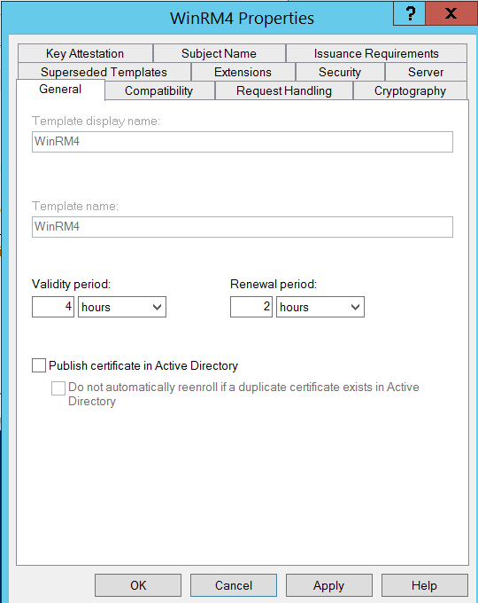

With the stage set, and the cert was present on both machines, I ran `winrm quickconfig -transport:https` on each, then made sure they could see each other, and remoted from one into the other.  I recorded a WireShark trace of the remote session, uh remoting, then ran a command or two, then stopped recording.  Then I opened the trace.

#### Swimming with the Sharks

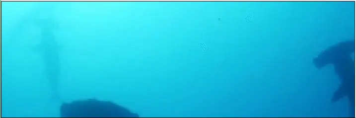 How I felt looking at all of these packets

When you first open WireShark and start recording, you may be a bit dismayed...

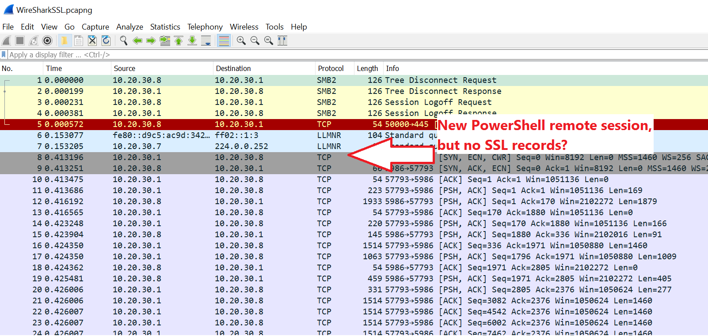

If you were to browse a website, or do other transaction with SSL, WireShark is smart enough to break it down and show you each step in the transaction.  However, with PowerShell remoting using SSL over the non-standard support of `5986`, you have to tell WireShark how to treat this data.  Do this by clicking one of the first SYN \\ ACK \\ ECN commands, then click  `Analyze\ Decode as...`

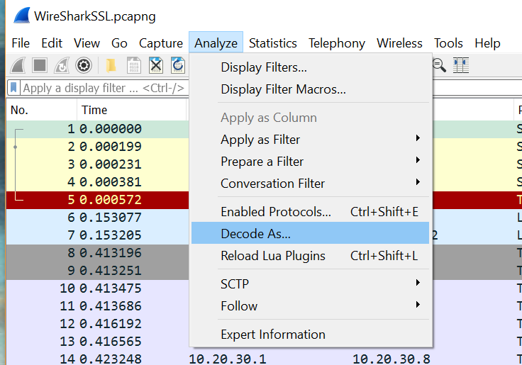

You'll need to provide both the Source and Destination port (don't worry, if you clicked one of the packets as I recommended, you can just select them from the dropdown for Value), and then pick 'SSL' from the dropdown list on the right.

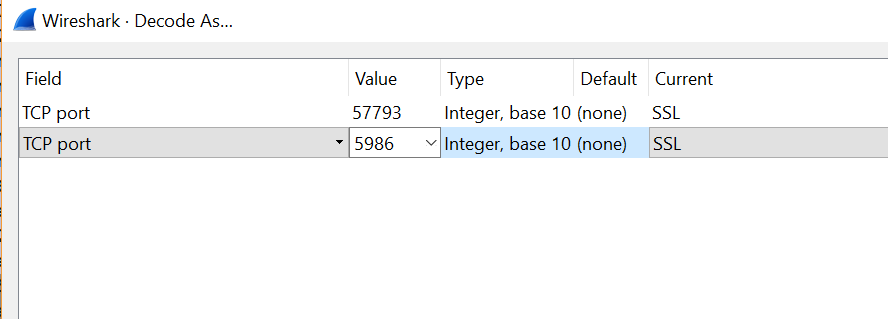

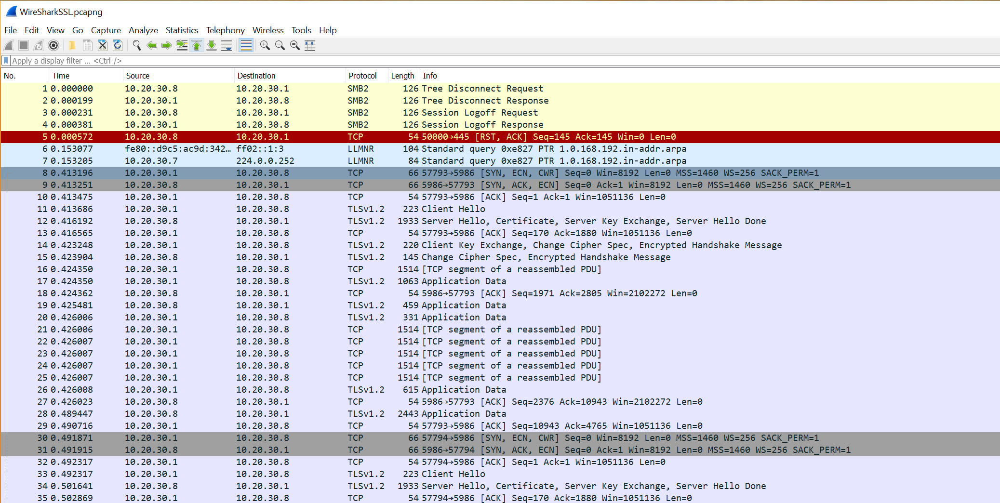 This is a REALLY big image (captured from my 4k), open in it's own tab!

Now you can finally see the individual steps!

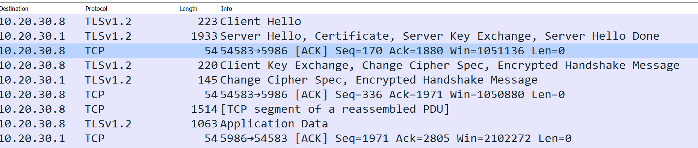

Since we can see these steps, we can now drill down and see which cert is being used.  That's right, we can actually extract the certificate.

### Extracting a certificate

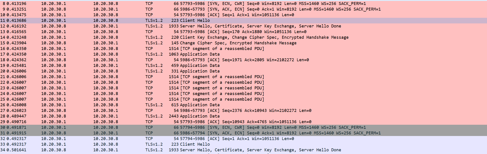

Find the step which has the lines `Server Hello, Certificate ...` and other values in it.

Now, in the Details pane below, click on Secure Sockets Layer

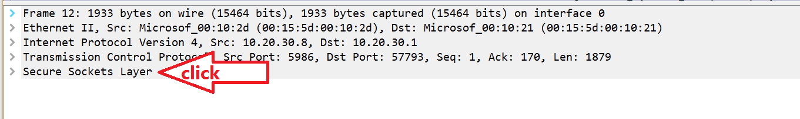

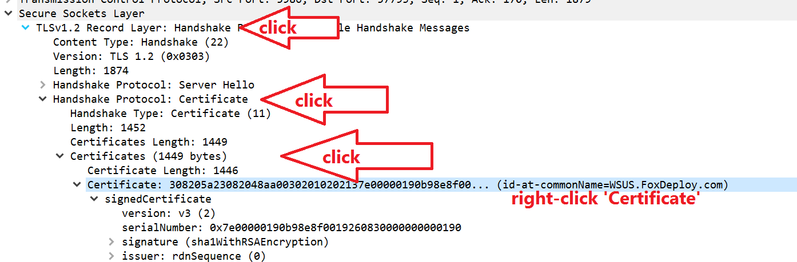

Follow the arrows above, and click through to TLS, Handshake Protocol: Certificate, Certificates, and finally right-click Certificate

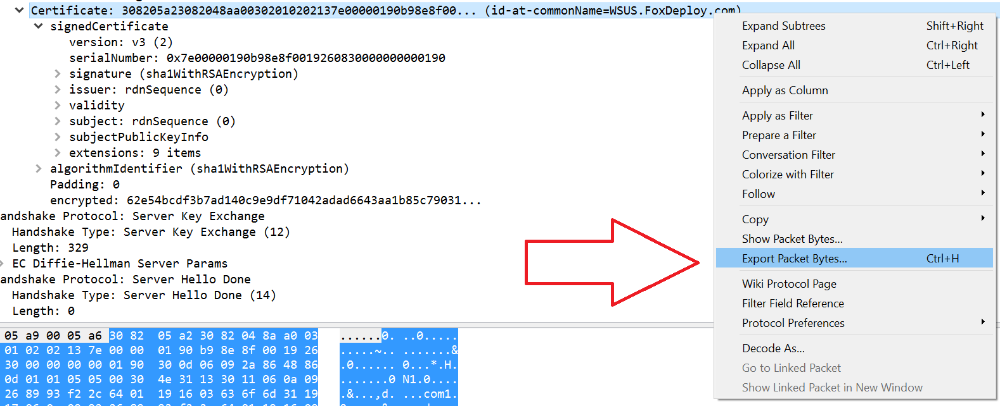

Choose `Extract Packet Bytes` and then choose where to dump the file.

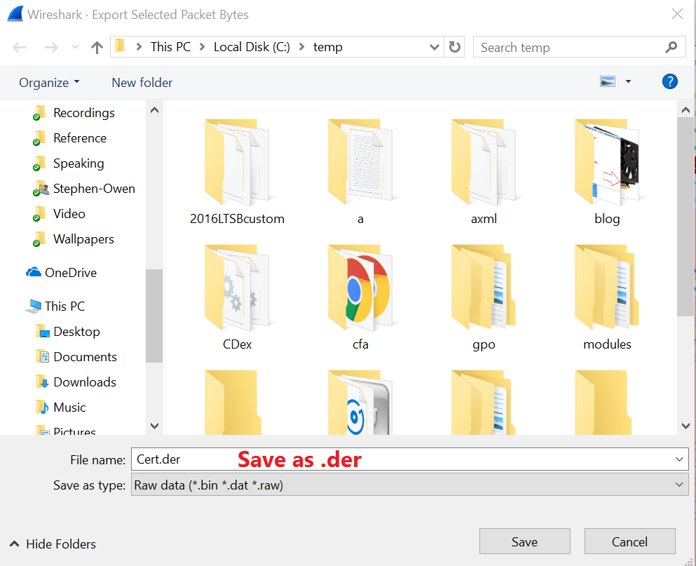 Make sure to save as .DER format

With this done, you can now double-click to open the cert and see what was transmitted over the wire.  Pretty crazy, huh?  This is one reason why man-in-the-middle attacks are so scary.  But then again, they'd have to worry about network timing, cert chains and name resolution too in order to really appear as you.  But anyway, lets look and see which cert was used to authenticate this WinRM Session.

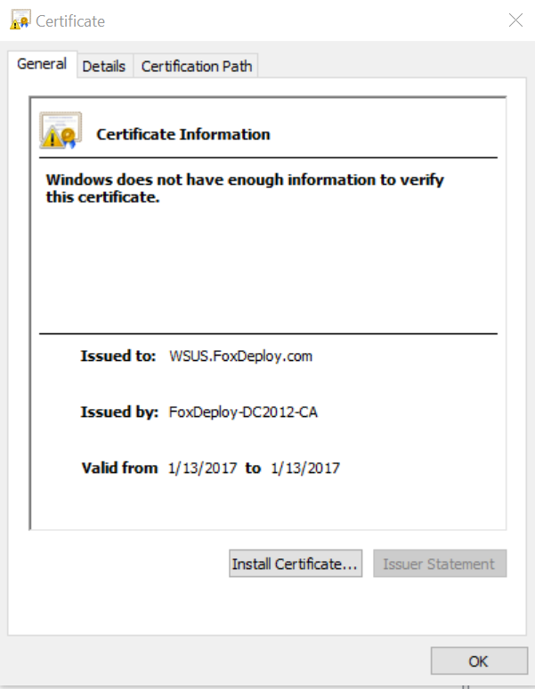 Click over to the details tab

In this next screen shot, on the left is the cert I recovered from WireShark.  The one on the right is the original cert from the MMC from the same computer.

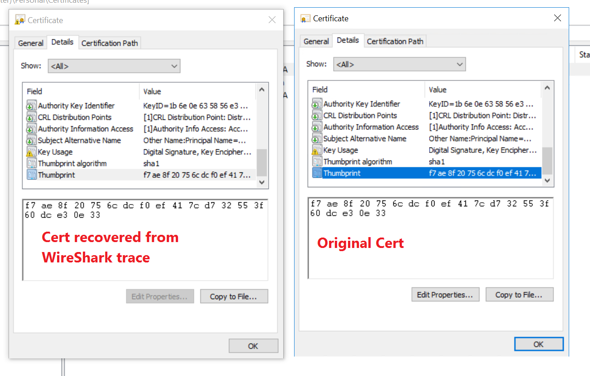 Note that the Cert Thumbprint matches...this will become critical later

So, now we've found out how we can recover certificates from a WireShark trace.  Now all that remains is to wait the four hours for this cert to expire, and see what happens!

### Waiting for the cert to renew


While I was away, I left a little chunk of code running, which will list the valid certs on the computer, and echo out their thumbprints.  It also echoes out the cert listed in the HTTPS listener of WinRM.  By keeping an eye on this, I know when the cert has been renewed.  Here's the code:

```powershell
while ($true){
"
$(get-date | select -expand DateTime) pulsing the cert store"| tee -append C:\temp\Winrm.log ;
 
$cert = get-childitem Cert:\LocalMachine\My |? ThumbPrint -ne '9D9362043DF0027552B1B41F6F68D208F8433152' | ? ThumbPrint -ne 'FEFFA38303FA0A3748683196E350D97F869AD690' | ? ThumbPrint -ne 'A878CC677E87D5FDC852A82ECD6AFDDD6EDC3C5C'| ? ThumbPrint -ne '315E6950EB9B8DD7BCBD8263BACBDB6B35F820DF' |  ? ThumbPrint -ne '232E14112D50209B2575451D63A3F7CA80AFC6EE'
"--current valid thumbprint $(get-childitem Cert:\LocalMachine\My |? ThumbPrint -ne '9D9362043DF0027552B1B41F6F68D208F8433152' | ? ThumbPrint -ne 'FEFFA38303FA0A3748683196E350D97F869AD690' | ? ThumbPrint -ne 'A878CC677E87D5FDC852A82ECD6AFDDD6EDC3C5C'| ? ThumbPrint -ne '315E6950EB9B8DD7BCBD8263BACBDB6B35F820DF' |  ? ThumbPrint -ne '232E14112D50209B2575451D63A3F7CA80AFC6EE' |select -ExpandProperty ThumbPrint)"| tee -append C:\temp\Winrm.log ;
 
"--current WSman thumbprint $((get-item WSMan:\localhost\Listener\Listener_1305953032\CertificateThumbprint | select -expand Value) -replace ' ')" | tee -append C:\temp\Winrm.log ;
 
"--cert valid $([math]::Round(($Cert.NotAfter - (get-date) | Select -expand TotalMinutes),2)) minutes, for pausing for 30 mins"
 
start-sleep (60*30)
 
}


```

So, I was really happy to see this when I came back

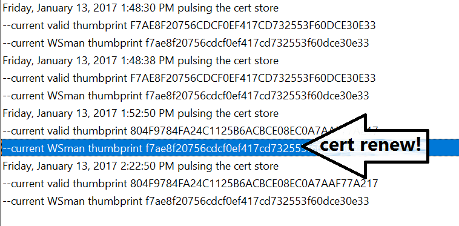

The difference between the current thumbprint and the one listed in WinRM told me that the cert had renewed...but strangely enough WinRM on a Server 2016 machine still references the old thumbprint.

This old thumbprint was listed EVERYWHERE.  Now, the moment of truth, to run a new WireShark trace and extract the cert.  I was sitting there with baited breath, very excited to see the results!  And...

### So...what happened?

Alright, here is what I saw when I opened the cert from the machine and saw what was listed in the MMC.  It's listed side by side with what you see in WinRM or WSMan

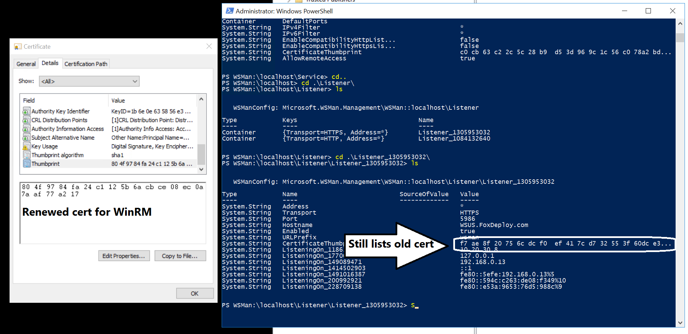 How long are you going to drag this on...

OK, the moment of truth.  Which actual cert was used for this communication?

Did WinRM:

- A: Use the original, now expired cert
- B: Not use a cert at all?
- C: Actually use the renewed cert, even though all evidence points to the contrary?

> To find out, I had to take another WireShark trace and run through all of these steps again.  But what I found shocked me...

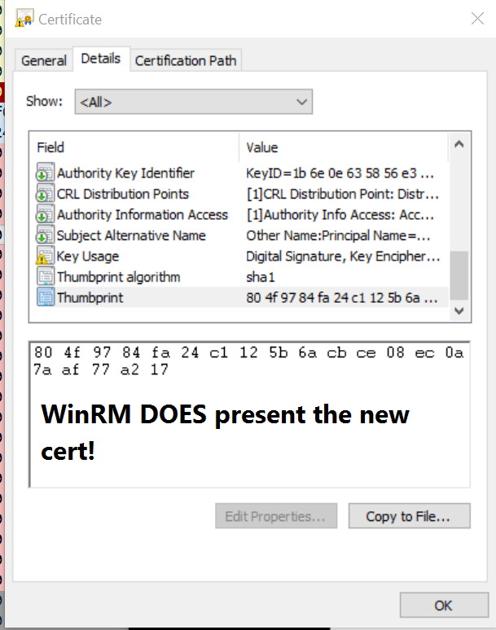

Yep.  Sure enough!  When decoding the certificate on the machine, I found that WinRM does actually use the renewed certificate, even though all evidence (and many sources from MSFT) point to the contrary.  This is at least the case on a Server 2012 R2 machine remoting into Server 2016.  Later today I'll update with the results of 2012 to 2012, 2016 to 2016, and two goats on a chicken while a sheep watches.

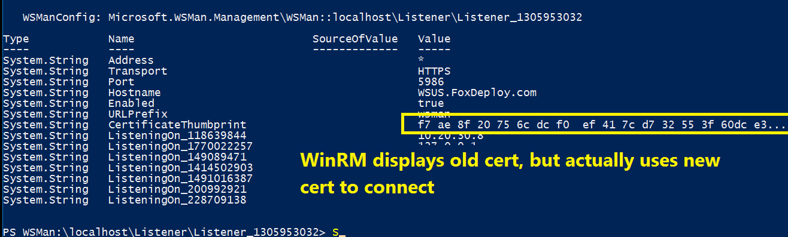

### What does it all mean?

In conclusion, WinRM does actually seem to handle cert expiry gracefully, at least on PowerShell 4 and up and Server 2012 R2 and newer.  I've tested client and server connection mode from Server 2012R2 and 2016 thus far.

Credit to these fellers:

- [Shake Block - WireShark Forums](https://www.wireshark.org/lists/wireshark-users/201003/msg00080.html)
- [Daren Matthews - how to extract a certificate from a WireShark trace](http://mccltd.net/blog/?p=2036)
- http://stackoverflow.com/questions/15814999/decrypting-https-traffic-in-wireshark-not-working
