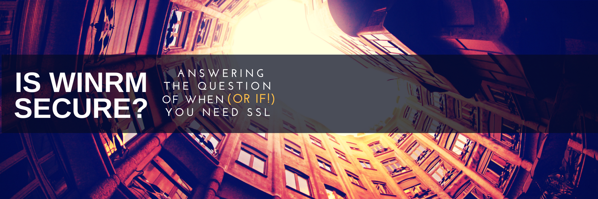

One of the things I absolutely love about my job is being thrown into the deep end of the rapids with little to no time to prepare given the opportunity to try new things and new technologies, pushing me out of my comfort zone.  It normally goes _okay_.

 actual camera footage of my last project

Case in point: a client of ours recently was investigating WinRM and whether or not it was secure, leading me down a rabbit hole of Certificates, Enterprise CA's, SSL Handshakes, WireShark and more.

At the end of the initiative, I was asked to write up a summary to answer the question

In this post, I'll talk us through my findings after days of research and testing, stepping through the default settings and some edge cases, hopefully covering the minimum you need to know in a short little post.

### Authentication Security

Consider the following scenario: two computers, both members of the same domain.  We run `winrm quickconfig` on both computers and don't take any additional steps to lock things down.  Is it secure?  Are credentials or results passed in the clear?  Until stated otherwise, assume HTTP until I mention it again.

From the very first communications and with no additional configuration, connections between the two computers will use Kerberos for initial authentication.  If you're not familiar with it, the bare minimum to know is that Kerberos is a trusted mechanism which ensures that credentials are strongly protected, and has a lot of nifty features like hashing and tickets which are used to ensure that raw credentials never go over the wire.  So, domain joined computers do not pass creds in the clear.

Well, what if the two machines are in a workgroup instead?  Workgroup machines trust each other, but don't have a domain controller to act as the central point of authority for identity, so they have to use the dated NT LAN Manager (NTLM) protocol instead.  [NTLM is known to be less secure than Kerberos](https://blog.varonis.com/closer-look-pass-hash-part-iii-ntlm-will-get-hacked/), and [has it's own vulnerabilities](https://www.wikiwand.com/en/NT_LAN_Manager#/Weakness_and_Vulnerabilities), but still obfuscates credentials with a strong one-way hash.  No credentials go over the wire in the clear in this scenario either.

### On-going Security

For those keeping track, thus far we've found that neither domain joined or workgroup PCs will transmit creds in the clear, or in easily reversed encryption for the initial connection.  But what about further communications?  Will those be in plaintext?

Once the authentication phase has completed, with either Kerberos (used in a domain) or NTLM (when machines aren't in a domain) all session communications are encrypted using a symmetric 256-bit key, even with HTTP as the protocol.

This means that by default, even with plain old HTTP used as the protocol, WinRM is rolling encryption for our data.  Awesome!

#### In that case, when _do_ we need HTTPs

Let's go back to the workgroup / DMZ scenario.  [In this world](https://www.youtube.com/watch?v=U4ThPAW5sd0), NTLM is the authentication mechanism used.  We mentioned earlier however, that NTLM has known issues in that it is relatively trivial for a skilled attacker to impersonate another server.

Fortunately, we have a perfect remedy to this impersonation issue! We can simply use HTTPS as the transport for NTLM communications.  HTTPS' inclusion of SSL resolves issues of Server Identity, but requires some configuration to deploy.   With SSL, both computers must be able to enroll and receiving a valid Server Authentication certificate from a mutually trusted Certification Authority.  These certificates are used to satisfy the need to validate server identity, effectively patching the server impersonation vulnerability of NTLM.

In the world of WinRM over HTTPs, once initial authentication has concluded, client communication is now doubly secured, since we've already got our default AES-256 Symmetric keys from WinRM mentioned earlier, which is within the outer security layer of the SSL secured transport tunnel.

#### I was told it would be in the clear?

In case you're just reading the headings, at no point so far are connections sent in the clear with the steps we've outlined here.

However, if you're really interested in doing it, is possible to allow for cleartext communications…it just requires one taking the safety off, propping one's foot up, and really, really circumventing all of the default security in order to shoot one's self in one's foot.

On both the client and server, one must make a handful of specific modifications to the winrm server and client, to specify Basic Authentication mode and place the service in AllowUnecrypted mode.

If we take these steps, and then force the actual remote connection into Basic mode with

`Enter-PSSession -ComputerName $Name -Authentication Basic`

Then and only then will we pass communications in the clear.  The actual payload of messages will be viewable by anyone on the network, while the credentials will be lightly secured with easily reversible base64 encryption.  Base64 is used SO often to lightly secure things that some folks call it 'encraption'.  In fact, if you're listening on a network and see some base64 packets, you might want to try to decrypt them, could be something interesting.  For more on this topic, read [Lee's excellent article Compromising yourself with WinRM](https://blogs.msdn.microsoft.com/powershell/2015/10/27/compromising-yourself-with-winrms-allowunencrypted-true/).

#### Conclusion

For machines which are domain joined and will have access to a domain controller for Kerberos authentication, SSL is just not necessary.

However, for machines which may be compromised within a DMZ or workgroup, SSL provides an added layer of protection which elevates confidence in a potentially hazardous environment.

**TL:DR** WinRM is actually pretty good and you probably don't need HTTPs
