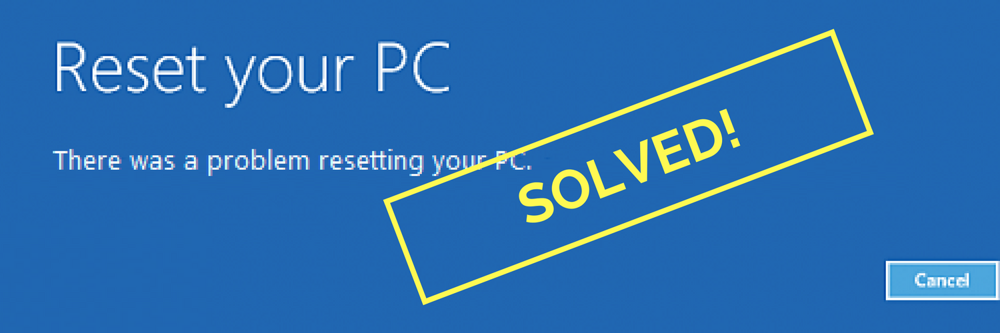
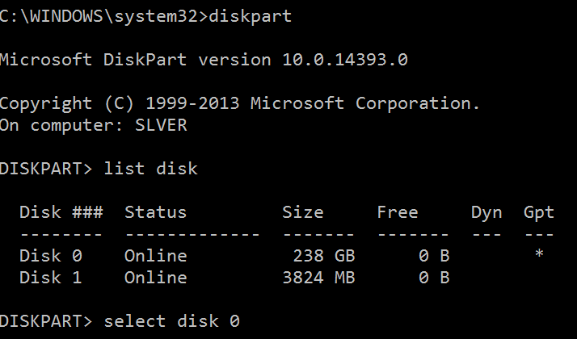
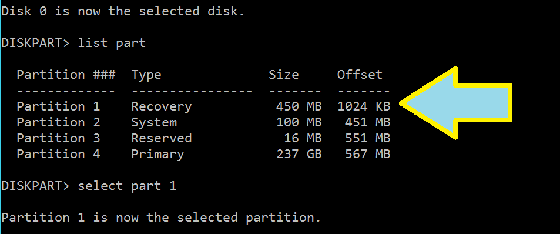
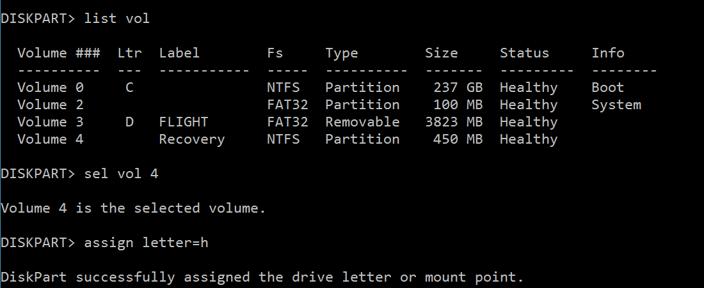
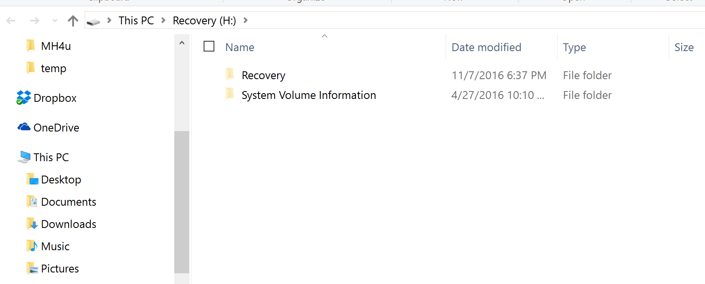
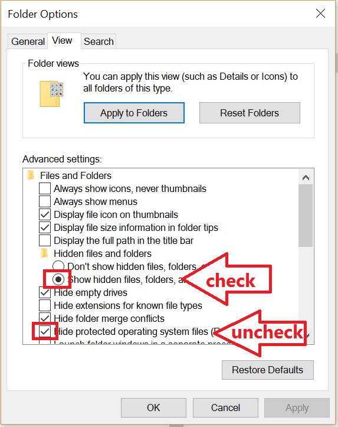

Windows 10 built on the awesome features of Windows 8, and brought over the very powerful 'Refresh My PC' and 'Reset My PC' options.  Truly awesome, they're able to refresh the base OS and forklift over your files, giving you that 'just installed' smell we all love so much.

I love that smell so much in fact, that I buy a new car every few weeks, or sometimes sleep in cars at the CarMax down the road from my house.  Mmmmm plastic and leather offgas.

However, sometimes things go awry, and from no fault of our own, we can end up with a system which will refuse to either reset or refresh.  Read on to see how to fix this problem.  

### Symptom

When trying to run the Refresh or Reset task, both of which call SystemReset.exe, you experience an error like the following

\[caption id="attachment\_4672" align="alignnone" width="510"\] There was a problem resetting your PC

This one is pretty tricky to solve, as it doesn't log any messages in the Event Viewer.

### Diagnosis

While there are no messages in the Event Viewer (shame on you guys, Microsoft, could make this a LOT easier to diagnose), the process does leave behind some nice forensic information for us.  If you enable viewing hidden folders, or run `dir c:\ /a:sh`,  you'll be able to see a `$SysReset` folder created on the root of your OS Drive.

This folder contains some log files which might help, specifically `C:\$SysReset\Logs\Setupact.log`, read this file to see what the issue is.

### Possible Cause

In my case, the error points to either a missing or unsupported version of the recovery image, as seen here:

\[caption id="attachment\_4673" align="alignnone" width="636"\]![Factory: No recovery image registered[gle=0x000000ea] Reset: Unsupported WinRE / OS versions[gle=0x000000ea]](../assets/images/2017/03/images/reset-issue.png) Factory: No recovery image registered\[gle=0x000000ea\]  
Reset: Unsupported WinRE / OS versions\[gle=0x000000ea\]If you see this, a good place to check next is your Windows Recovery configuration settings, found at `c:\windows\system32\Recovery\ReAgent.xml`. When you open this file, you should see something like this:

```xml
<?xml version='1.0' encoding='utf-8'?>

<WindowsRE version="2.0"> <WinreBCD id="{f8d1de0b-0ced-11e6-abf9-db7ac698ead8}"/> <WinreLocation path="\\Recovery\\WindowsRE" id="0" offset="1048576" guid="{6d5c9aaa-fea9-471e-bfa8-5160d1d8c3fa}"/> <ImageLocation path="" id="0" offset="0" guid="{00000000-0000-0000-0000-000000000000}"/> <PBRImageLocation path="" id="0" offset="0" guid="{00000000-0000-0000-0000-000000000000}" index="0"/> <PBRCustomImageLocation path="" id="0" offset="0" guid="{00000000-0000-0000-0000-000000000000}" index="0"/> <InstallState state="1"/> <OsInstallAvailable state="0"/> <CustomImageAvailable state="0"/> <IsAutoRepairOn state="1"/> <WinREStaged state="0"/> <OperationParam path=""/> <OsBuildVersion path="14388.0.amd64fre.rs1\_release.160709-1635"/> <OemTool state="0"/> <IsServer state="0"/> <DownlevelWinreLocation path="" id="0" offset="0" guid="{00000000-0000-0000-0000-000000000000}"/> <IsWimBoot state="0"/> <ScheduledOperation state="5"/> </WindowsRE> 
```

> _To highlight the issue, we're looking at the `GUID` properties for ImageLocation. In a bad system, it will be listed as all zeroes. A good system will have a normal, multi-digit GUID listed there._

 

If so, then the problem is probably that your Windows Recovery Environment image is corrupted or somehow incorrect. Fortunately, this is pretty easy to fix, by copying the WinRE partition from another known good computer.

### Solution

**UPDATE:** I found a MUCH easier way to do this, try this step first before using the old steps, it might 'just work' for you!

You can let Windows automatically repair the WinRE environment by disabling and re-enabling it.  This does not always work, but I've been pleasantly surprised to find it working most of time, and rarely need to use the Manual Method anymore.

This is really simple too.  First, launch a command prompt as administrator, then run.

```
reagentc /disable
<reboot>
reagentc /enable
```

This method will only work if the copy of WinRE listed in ReAgent.xml under ImageLocation is valid, but the GUID is incorrect.  If this is not the case for you, you can still use the manual steps below!

If this worked...you'll quickly be resetting your PC in no time (warning: this gif is at like 400x speed)


#### Manual Method

Here's the general steps we'll be taking:

- Copy WinRE from a known good computer by
    - Finding the hidden recovery partition
    - Setting it as Read/Write by changing the ID
    - Giving yourself permissions to view the files
    - copy them
    - !!Restore the permissions to the Recovery Partition!! (don't skip this!)
- Place them on the issue PC with largely the same steps

First, mount your recovery partition. You do this by launching `cmd` as Administrator.

Next, run Diskpart and select the first disk, first partition. `diskpart` `list disk select disk 0`



Now to pick our partition, which almost always be 0.  However, pick whichever one says 'Recovery' for the type.

`list part select part 1`



For the next few steps, we're going to change the type of this parition, which serves to 'unhide' it, so that we can mount it and REALLY start breaking things.  But first, we need to document the drives current ID so that we don't catch everything on fire.  We're going to detail the partition to see the Type.  Then, highlight it and copy it off into a text editor or something.  (Don't write it down by hand...if that's your approach, there's a whole new world out there!)

`detail part`


### Marking the drive as R/W

Proceed with caution...

If you're on a Windows 10 system, you're most likely working with GUID Partition Table disks (GPT), and not the old fogey MBR disks.  Most of the examples on the internet tell you try running `set ID=07 override` but that just won't work on modern drives.  Before we proceed, here are the valid ID types for GPT drives.

EFI System partition:  `c12a7328-f81f-11d2-ba4b-00a0c93ec93b`
Basic data partition:  `ebd0a0a2-b9e5-4433-87c0-68b6b72699c7`
Hidden / System        `de94bba4-06d1-4d40-a16a-bfd50179d6ac`

However, your System Reserved Partition will have its own unique value.  **Make SURE you copy it down using `detail part` before going any further.**

To mark this partition as unhidden, run this command instead.

`SET ID=ebd0a0a2-b9e5-4433-87c0-68b6b72699c7`


With this done, Windows now sees this as a normal data partition.  All that remains is to assign a drive letter to it.

First, run `list vol` to see which volume your recovery partition ended up with. In my case, it is now Volume 4.  Then run `assign letter=<some letter>`.



As soon as you run this command, the volume will open in Explorer!   

If you don't see these files, open up Folder Options and make sure that you enable 'Show Hidden files, folders', and uncheck 'Hide Protected Operating System Files'.



Now, simply copy the files into here from your known-good reference machine, and ensure that the GUIDs match up.

And finally, make the partition hidden again by running the following command as an admin again.

`SET ID=de94bba4-06d1-4d40-a16a-bfd50179d6ac`

Conclusion

I hope this helps you to recover your, uh, Recovery Partition if you ever get stuck in a similar situation.  For more useful information, check out these links.

- https://technet.microsoft.com/en-us/library/hh825686.aspx
- https://www.terabyteunlimited.com/kb/article.php?id=587
