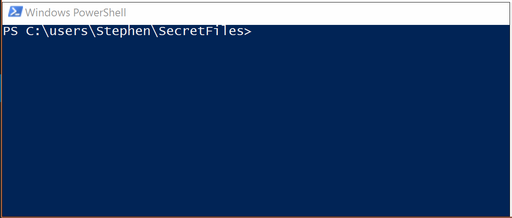
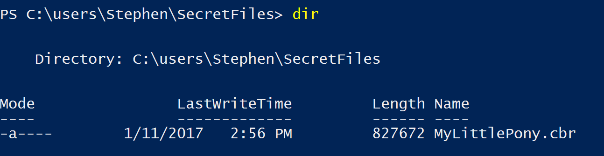
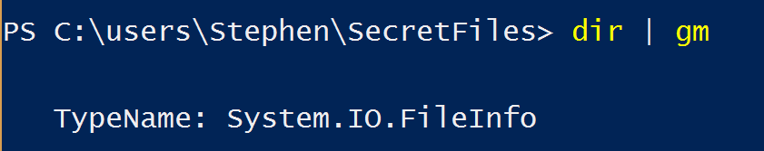
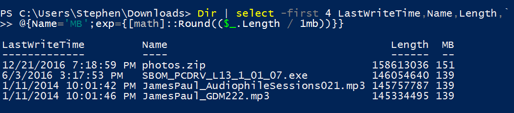
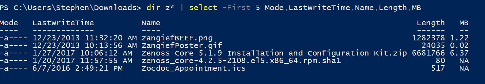
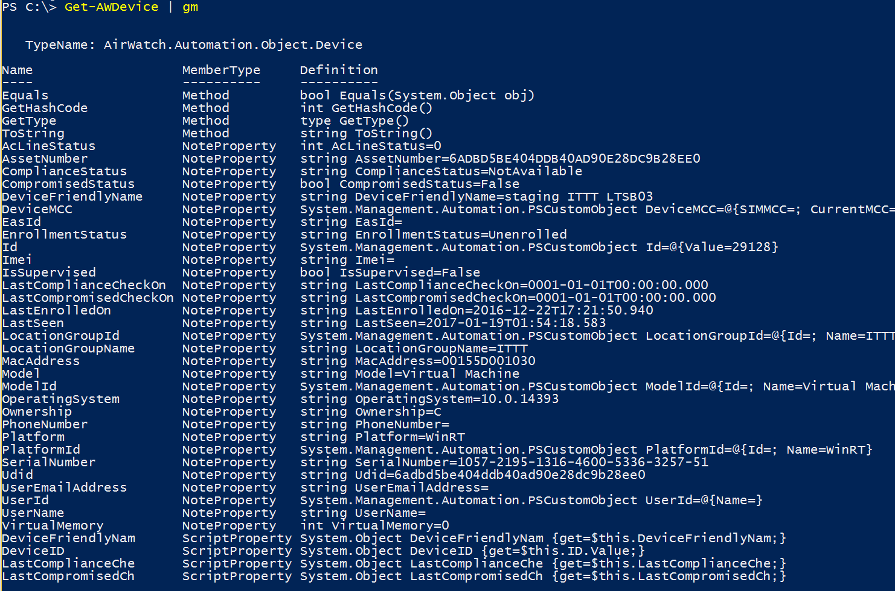

[](/series/powershell-autocompletion)


This post is part of the series on AutoCompletion options for PowerShell! Click the banner for more posts in the series!

* * *

Previously in this series, we [reviewed a few ways to add AutoComplete onto your functions,](http://foxdeploy.com/2017/01/13/adding-tab-completion-to-your-powershell-functions/) covering Param AutoCompletion and Dynamic Parameters.  In this post, we'll spend a LOT of time typing in the present to help our future selves save fractions of a second, because there's no way we'll become less lazy, right?  At the end of the day, we will have achieved the holy grail of Attaboys, and have Output Autocomplete working in our function.

### Output AutoComplete

You know how in PowerShell you can type a cmdlet, then pipe into `Select-Object` or another cmdlet and start tabbing through property names?  This is the type of Autocompletion we are going to add to our function in this post!



Not only does this save you from making mistakes, but it is amazingly convenient and really gives our functions a polished and professional look and feel.  PowerShell's ability to do this highlights one of its distinguishing features as well!

### Dynamic Type System

**Warning: this next part is probably kind of boring**

If you're like me, you read things and then just gloss over all of the words and symbols you don't know, assuming they're unimportant.  If I just described you, then I hate to be the one to tell you this, but that is kind of a tremendous character flaw.  I'll get around to why this is bad and how it relates to PowerShell, but first, take us on a detour into my past.

Back in High School,  I REALLY liked anime and wanted to learn Japanese.  I was a cool kid, believe you me.  So I took a semester of Japanese after which I kind-of, sort-of knew how to read their alphabet.

Well, one of their three.  And only the easy alphabet.  Surely that will not come back to bite me, right?

So, me, being a very cocky and attractive (read 200 lb redhead with braces and a predilection for silky anime shirts with muscle dudes on them) was sure that I knew enough Japanese to survive in Japan and I signed up for the foreign exchange student program.

And on my first night in Japan, was greeted with this in the washroom.


Except mine had only Japanese characters on it...and two of the three were kanji (which I couldn't read at all).  What the heck could the other ones be?  I knew that one was Shampoo but the other two?

I'd seen that my host family had been taking their toothbruses with them into the washroom, so one of these _had_ to be toothpaste, right.  There's no way they had a tooth paste tube in the shower...right?  (Hint: they did).  So one of them has to be toothpaste!

That means the other had to be body wash!

And that's how I spent a week in Japan, brushing my teeth with bodywash and trying to get clean using conditioner.  I will say this though...the hair on my arms was positively luxurious!  Eventually my host mom realized what I was doing and boy did she have a good laugh.

#### How does this relate to PowerShell again?

Well, I was guilty of skipping over things in the PowerShell world too...like the phrase 'dynamically typed scripting language'.  I knew what a scripting language was, but had no clue what the hell types were, or why I'd want them to be dynamic.  If you stop reading right now and go off and google about PowerShell, chances are you'll see it explained like this:

> Windows PowerShell includes a [dynamically typed](https://www.wikiwand.com/en/Dynamically_typed) [scripting language](https://www.wikiwand.com/en/Scripting_language) which can implement complex operations \[...\] - WikiPedia.

 

You'll find it described this way EVERYWHERE, in books, forums, blog posts.  I even used to say the phrase in my training classes, and just hoped no one would ask me what it meant.  If they did ask me what it meant, I would call an emergency bathroom break and hide until they hopefully forget their question.

Now, let's talk about why DynamicTyping is awesome.

#### Why PowerShell's dynamic type system is awesome

In a lot of programming languages, the type of variable or object must be specified before you can use it, like in C#.

```csharp
int i, j, k; 
char c, ch; 
float f, salary; 
double d; 
```

If you want to use these variables, you'd better specify them ahead of time!

In PowerShell, variable types can be inferred based on the type of object. You can even have many types of object living in a variable, like so:

```powershell
$a = 1, "ham", (get-date) 
```

We don't have to define the type of object ahead of time, PowerShell does it all for us.  We can also convert items back and forth into different types as well.  This kind of flexibility is PowerShell's Dynamic Type system in action!

PowerShell further offers an adaptive type system. By default, we can run `Get-ChildItem`, which gives us a list of files, and by default shows us only the Mode, LastWriteTime, Length, and Name properties.



How does PowerShell know what properties to display?  This all comes down to the PowerShell type system again.

If we pull a single object and pipe it over to `Get-Member`, we can see which type of object we're working with:



This means that somewhere, PowerShell knows what type of properties a `System.IO.FileInfo` object should emit, and informs IntelliSense so that we can autocomplete it.  It also knows which properties to display by default and how to display them.  This all comes down to a whole boatload of `.ps1xml` files that live on your system.

However, we don't have to go editing XML files if we want to tweak which properties are displayed, PowerShell is adaptive.  We just need to Adapt...or Update things a bit.

#### But wait, does that mean I can change the properties for the type?

That's a great question and it's one of my absolutely favorite tricks in PowerShell.  And thanks to its Adaptive Type System, we CAN change the properties for a type.

PowerShell 3.0 added the awesome `Update-TypeData` cmdlet, which let's us append new properties to existing types.  And it's SO easy.

I used to always run some code like this, which would allow me to see the file size of a file in MBs, and show me some of the existing properties, then append my own calculated property to it.

```powershell
 Dir | select -first 4 LastWriteTime,Name,Length,\` @{Name='MB';exp={\[math\]::Round(($\_.Length / 1mb))}}
```

Here it is in action:



But...there's a better way!  I took the same logic, and implemented it by modifying the typedata for `System.IO.FileInfo`.  This is done using `Update-TypeData` and providing a scriptblock to instruct PowerShell as to how it should calculate our new property.  Just swap your `$_` references for `$this` and you're golden.

```powershell
 Update-TypeData -TypeName system.io.fileinfo -MemberName MB \` -MemberType scriptproperty -Value { if ($this.Length -le 10000){ 'NA' } else{ \[math\]::Round(($this.Length / 1mb),2)} }
```

_One caveat, you have to manually specify this new property with a select statement, I haven't found a way around it...yet!_



The Type Information we've been talking about here is the key to how PowerShell knows which properties to display, and also how PowerShell cmdlets know which properties your cmdlet will output.  This in turn is how we're able to populate AutoComplete Data!

### How do we tell PowerShell what our cmdlet is going to output?

There are two things we need to do to instruct PowerShell as to what our cmdlet will be emitting, which is needed to enable that cool AutoCompletion.

- Define a new object type by creating a `.ps1xml`  file
- Add the `.ps1xml` file to our module manifest or module file
- Modify our functions to add an `[OutputType()]` value
- Wonder why Stephen can't count to 3

##### PS1XML files aren't that scary

If you're like me, you've avoided `.ps1xml` files for your whole PowerShell career.  Time to buck up cowboy, they're not so bad!

We'll start by modifying one of the built-in files, or [use this one from my soon-to-be-released PSAirWatch PowerShell module](https://github.com/1RedOne/PSAirWatch/blob/master/PSTypes.ps1xml).

Let's look into what we need to define here:

```xml
<?xml version="1.0" encoding="utf-8" ?>
<Types>
  <Type>
    <Name>AirWatch.Automation.Object.Device</Name>
    <Members>
      <ScriptProperty>
        <Name>AcLineStatus</Name>
        <GetScriptBlock>
          $this.AcLineStatus
        </GetScriptBlock>
    </ScriptProperty>
```

First, you define the name of this new type of object. You can pick literally anything but I like the format of `ModuleName.Automation.Object.TypeOfObject`. Next, you add a `<Members>` node and within it you place a pretty self-descriptive block which includes the name of a property, and then the code used to resolve it.

In this syntax, you'll be using the special `$this` variable, which we don't see too often in PowerShell.  Think of it as a stand-in for `$PSItem` or `$_`.

Rinse and repeat, defining each of the properties you want your object to emit.  This is also where you can use a nifty value called the `DefaultDisplayPropertySet` to choose a small subset of your properties as the default values to be displayed.

This is a very nice 'warm-fuzzy' feature to have in your functions, because it makes them act more like standard PowerShell cmdlets.  Go ahead and define a dozen properties for your objects and then also provide a default set, and when the user runs your cmdlet, they'll see just the most relevant properties.  However, a PowerShell PowerUser will know to pipe into  `Get-Member` or `Format-List` and be impressed when they suddenly have a lot of extra properties to choose from.

Here's how it looks to specify a `DefaultDisplayPropertySet`, if you're interested.

```xml
<MemberSet>
  <Name>PSStandardMembers</Name>
  <Members>
    <PropertySet>
      <Name>DefaultDisplayPropertySet</Name>
      <ReferencedProperties>
      <Name>DeviceFriendlyName</Name>
      <Name>DeviceID</Name>
      <Name>Model</Name>
      <Name>LastSeen</Name>
    </PropertySet>
  </Members>
  </MemberSet>
</Members>
</Type>
```

That's it for creating the type in XML.  Now, you need to modify your PowerShell module to import your type file.  You can do this in a Manifests file, (which I'll cover in a future blog post), or you can also very easily do it by adding a line like this to the bottom of your `.psm1` module file.

`Update-TypeData -PrependPath $PSScriptRoot\Types.ps1xml -Verbose`

Finally, we simply modify our Functions in our module like so

```powershell
function Get-AWDevice { \[CmdletBinding()\] \[Alias()\] \[OutputType('AirWatch.Automation.Object.Device')\] Param ( # How many entries to provide, DEFAULT: 100


```

Now when the module is imported, and I pipe into `Get-Member` and now my object type is displayed.



And all of my new properties are there too...but the real test...do I see my values?


VICTORY!

#### One last thing...

If you spent a lot of time in your `.ps1xml` file, or if you went over and above and made a `Format.ps1xml` file, customizing how your objects should be formatted or displayed in `-Table` or `-List` view you might be dismayed to see that PowerShell ignores your beautifully tailored formatting instructions.  I know I was.

So, earlier when we added an `[OutputType()]` to our function, we were providing instructions that the IntelliSense engine uses to provide AutoCompletion services to our end-user.  However, PowerShell **does not force our output or cast it into our desired OutputType**, we've got to do that ourselves.

You could get _really fancy_, and instantiate and instance of your type and use that to cast your object into it...but the really easy way to do this is to scroll to the bottom of your function, wherever you actually emit an output object, and add this line.

```powershell


$output | % {$\_.PSobject.TypeNames.Insert(0,'AirWatch.Automation.Object.Device') }


```

This will instruct PowerShell to interpret your custom object output as the desired type, at which point the formatting rules will be applied.

And if you haven't created a `Format.ps1xml` file, worry not, as we'll be covering it in a later blog post.

#### Sources

This was one of those posts that in the beginning seem deceptively simple and make me say 'hmm, I know enough about the topic...surely I can write this in two hours'.  Incorrect.  I probably spent a solid 40 hours researching and writing this post, easily.  And I had to do a lot of reading along the way.   If you've got this far and wonder how I learned about it, these articles might be of interest to you.

- [PowerShell in Action, Bruce Payette](http://amzn.to/2nL3FpB)
- [http://superuser.com/questions/468782/show-human-readable-file-sizes-in-the-default-powershell-ls-command](http://superuser.com/questions/468782/show-human-readable-file-sizes-in-the-default-powershell-ls-command)
- https://github.com/RamblingCookieMonster/PSStash/blob/master/PSStash/PSStash.Format.ps1xml
- http://ramblingcookiemonster.github.io/Decorating-Objects/
- http://jdhitsolutions.com/blog/tag/update-formatdata/
