We're all adventurers. That's why we wake up in the morning and do what we do in our fields, for that feeling of mastery and uncovering something new. Some of us chart new maps, cross the great outdoors, or [climb mountains](http://outsideinradio.org/shows/episode9).

And some of us explore code.

In this post, I'll outline my own such PowerShell adventure, and show you the tools I used to come out the other side with a working solution. We'll meet in basecamp to prepare ourselves with the needed gear, plan our scaling strategy and climb the crags of an unknown PowerShell module. We'll belay into treacherous canyons, using our torch to reveal the DLLs that make Windows work, then chart new ground using DotPeek and eventually arrive on the summit, victorious and armed with new tools.

__

#### Basecamp - The Background

I've been working through a **big** MDM roll-out concept for a client recently, looking to use Windows 10's new mobile device management capabilities as an interesting and resilient alternative to tools like ConfigMgr, for a new management scenario.

I needed to script the process of un-enrolling and re-enrolling devices in MDM, because we expect that a small percentage of devices will stop responding after a time, and want to be prepared for that contingency. This is done by removing and reinstalling a Provisioning Package, which is new management artifact available to us in Windows 10.

Windows 10 1703 Release (the Creator's update) conveniently has a nice new PowerShell module full of cmdlets we can use for this task!

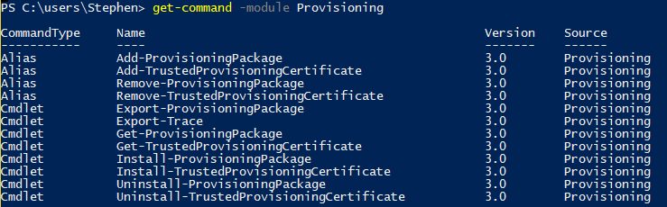

However, we're targeting a different release which doesn't have this module available. When I brought this information to the client, the response was 'we have confidence that you can make this work'. Let's break out the sherpa hats!

First things first, I tried just copying and pasting the module folder, but that didn't work, sadly.

If only there were _some way_ to look inside a cmdlet and see what's going on under the covers....

#### Understanding our Gear

We'll have a few pieces of gear which will be absolutely essential to this expedition.

| Tool | Function |
| --- | --- |
| Get-Command | Retrieves definition of modules and cmdlets |
| DotPeek | Decompiler for binaries |
| Visual Studio Code | Pretty Editor for code screen shots |

### Looking into a Cmdlet the easy way

`Get-Command` is definitely the tried and true method of uncovering what a function does and how it works. Time to break out our handy climbing axe and start picking away here.


Take your command and run it through `Get-Command <cmdname> | select -Expand Definition`. This will show you the compiled version of the cmdlet, which may have some good clues for us.

Any script cmdlets or functions, like the very useful `Out-Notepad,`will have a field called `Definition` which shows exactly how the cmdlet works. You can pick up some neat tricks this way.

```powershell


gcm Out-Notepad | select -ExpandProperty Definition

#this function is designed to take pipelined input #example: get-process | out-notepad

Begin { #create the FileSystem COM object $fso=new-object -com scripting.filesystemobject $filename=$fso.GetTempName() $tempfile=Join-Path $env:temp $filename

#initialize a placeholder array $data=@() } #end Begin scriptblock

Process { #add pipelined data to $data $data+=$\_ } #end Process scriptblock

End { #write data to the temp file $data | Out-File $tempfile

#open the tempfile in Notepad Notepad $tempfile

#sleep for 5 seconds to give Notepad a chance to open the fi sleep 5

#delete the temp file if it still exists after closing Notepad if (Test-Path $tempfile) {del $tempfile} } #end End scriptblock


```

However in this case with our Provisioning Cmdlets, PowerShell was just NOT giving up any secrets.

```powershell


Get-Command Install-ProvisioningPackage | select -exp Definition

Install-ProvisioningPackage \[-PackagePath\] <string> \[-ForceInstall\] \[-QuietInstall\] \[-LogsDirectoryPath <string>\] \[-WprpFile <string> \] \[-ConnectedDevice\] \[<CommonParameters>\] 
```

This will often be the case for binary, or dll-driven cmdlets. We have to climb a little higher to see what's going on here.

### Looking inside a Cmdlet the fun way

When our Command Definition is so terse like that, it's a clue that the actual logic for the cmdlet is defined somewhere else. Running `Get-Command` again, this time we'll return all the properties.

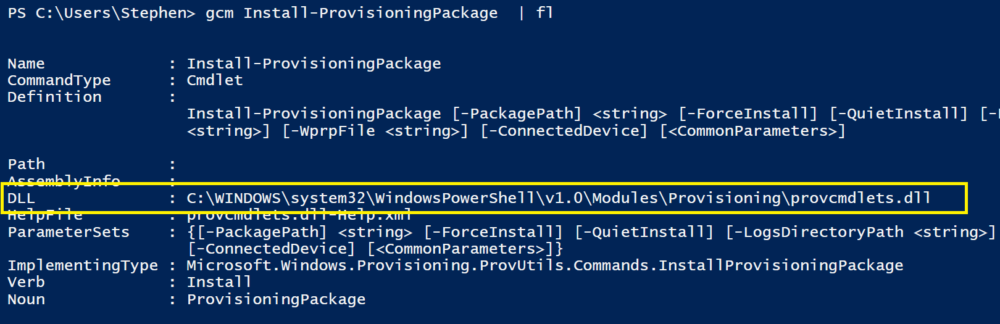

It turns out that the hidden core of this whole Module is this DLL file.

If you've been working around Windows for a while, you have definitely seen a DLL before. You may have even had to register them with `regsvr` but did you ever stop to ask...

### **What the heck** **_is_** **a DLL anyway?**

> DLLs are Microsoft's implementation of a programming concept known as shared libraries.
> 
> In shared libraries, common code which might be present in many applications (like dependencies) are instead bundled into a dynamic link library, and loaded into memory once. In this model, many apps can share the same core functionality (like copy and paste) without having to roll their own solution, or needing to reload the same code.
> 
> This model allows for smaller, more portable applications while also providing more efficient use of a system's resources.

**TL;DR: if code does contains something really useful that might be needed elsewhere(like procedures, icons, core OS behaviors), store it in a DLL so other things can reference it**

And as it turns out, many PowerShell modules do just this!

We can find the path to this module's DLL by running `Get-Command Get-ProvisioningPackage | Select Dll`

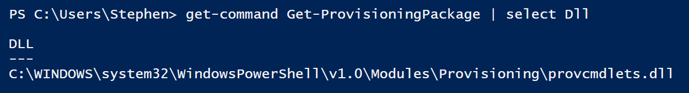

Now, let's open it in my editor of choice, Notepad.

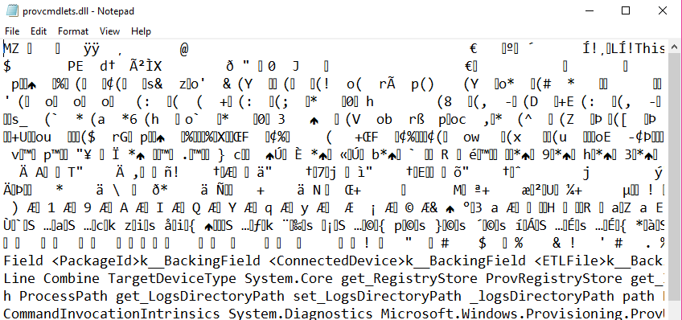

Yeah... we're going to need a different tool.

### Choosing a Decompiler

When it comes to picking a decompiler or text editor, if we're not careful we'll end up looking like this guy:

 I choose mountain climbers because I think their tools look SOO cool. I should buy an ice-axe

There are a lot of options, I worked through .net Reflector and Ida pro before finally stopping on [.Peek, by JetBrains. You can download it here.](https://www.jetbrains.com/decompiler/) I chose .Peek because it's free, and not just a free trial like .net Reflector, and it's very up-to-date and designed with .net in mind. IDA Pro does a good job, but I got the impression that it is SO powerful and flexible that it isn't as good as a tailor made .net tool.

DotPeek is free, as in beer, and is an AWESOME tool for digging into DLL files. Install it, then launch it and click Open.

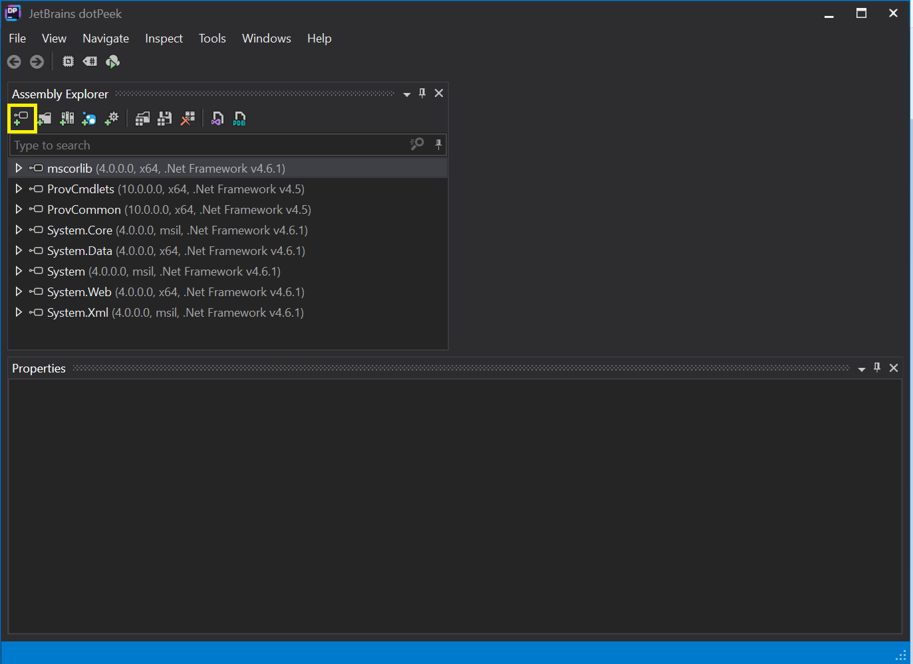

Next, paste in the path to our DLL file, then expand the little arrow next to the ProvCmdlets assembly.

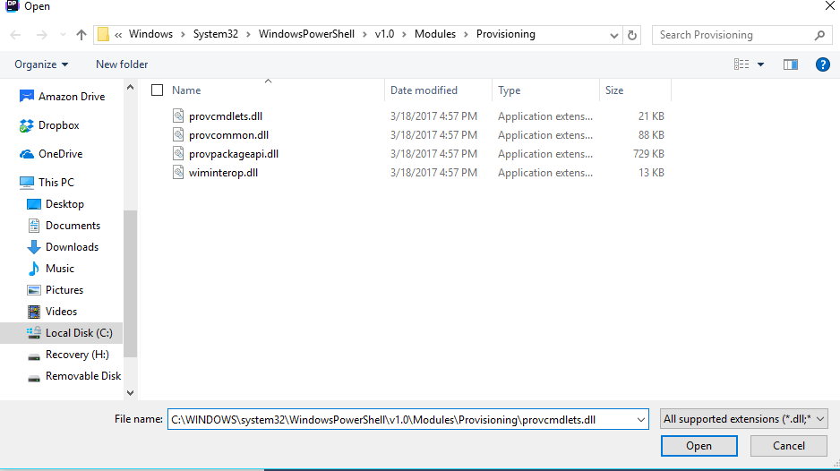

Here's a breakdown of what we're seeing here.

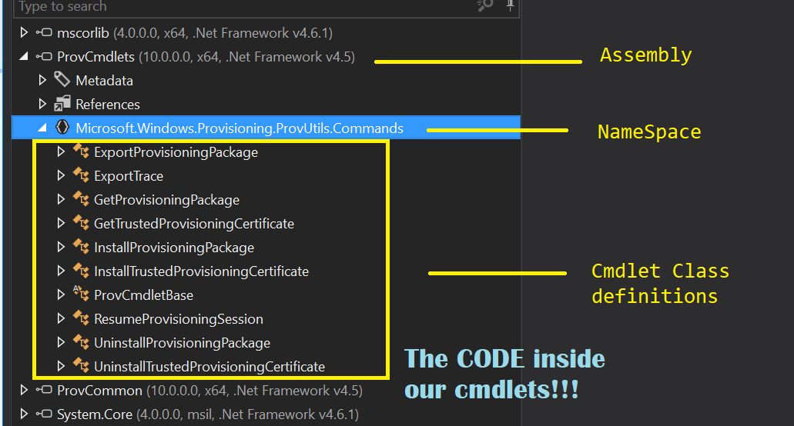

Working our way through this, we can see the loaded Assemblies, or DLL files that we are inspecting. If you expand an Assembly, you'll see the NameSpaces and Metadata inside it. We're more concerned with NameSpaces here.

> **Protip**: the References section lists out all of the assemblies (other DLL files) that this assembly references. If you attempt an ill-advised effort to port a module to another version of Windows, you'll need to bring along all of these files (or ensure they're the right version) at a minimum to prevent errors.

Inside of NameSpaces, you can see Class definitions. Most binary cmdlets are built around namespaces, and will often match the format of the cmdlets themselves.

Since I'm interested in seeing what happens when I call the `Install-ProvisioningPackage` I'll take a look at the Class definition for the `InstallProvisioningPackage` Class by clicking the arrow.

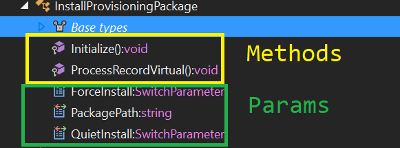

This shows us the Methods and the Params that the class exposes.

We can also double-click the cmdlet itself to see the full source code, which is shown below. I've highlighted the Action bits down below on line 38.

```csharp
// Decompiled with JetBrains decompiler
// Type: Microsoft.Windows.Provisioning.ProvUtils.Commands.InstallProvisioningPackage
// Assembly: ProvCmdlets, Version=10.0.0.0, Culture=neutral, PublicKeyToken=null
// MVID: 2253B8FF-A698-4DE9-A7F2-E34EDF8A357E
// Assembly location: C:\Windows\System32\WindowsPowerShell\v1.0\Modules\Provisioning\provcmdlets.dll
 
using Microsoft.Windows.Provisioning.ProvCommon;
using System;
using System.IO;
using System.Management.Automation;
 
namespace Microsoft.Windows.Provisioning.ProvUtils.Commands
{
[Cmdlet("Install", "ProvisioningPackage")]
public class InstallProvisioningPackage : ProvCmdletBase
{
[Parameter(HelpMessage = "Path to provisioning package", Mandatory = true, Position = 0)]
[Alias(new string[] {"Path"})]
public string PackagePath { get; set; }
 
[Parameter]
[Alias(new string[] {"Force"})]
public SwitchParameter ForceInstall { get; set; }
 
[Parameter]
[Alias(new string[] {"Quiet"})]
public SwitchParameter QuietInstall { get; set; }
 
It feels familiar... it feels just like an Advanced Cmdlet, doesn't it? PowerShell has been sneakily tricking us into becoming Programmers, yet again!
 
Once we scroll past the param declarations, we can see this cmdlets <code>Initialize()</code> method determines if the user provides a valid package path, then <code>.ProcessRecordVirtual()</code> gets called. protected override void ProcessRecordVirtual() { this.WriteObject((object) PPKGContainer.Install(this.TargetDevice, this.PackagePath, (bool) this.ForceInstall, (bool) this.QuietInstall), true); }
```

This line of code determines which params have been provided, then calls the `PPKGContainer` class to use that class' `Install()` method. Let's right-click on `PPKGContainer` , then 'Go To Declaration' to see how that works!

#### Higher and Higher

The `PPKGContainer` useful class is actually defined in a separate DLL file, `Microsoft.Windows.Provisioning.ProvCommon`, and contains a number of its own methods too. We are concerned with `Install()`.

```csharp
public static ProvPackageMetadata Install(TargetDevice target, string pathToPackage, bool forceInstall, bool quietInstall) { {...} int num = target.InstallPackage(pathToPackage, quietInstall);
```

There's a lot to unpack here. When this method is called, the cmdlet creates a new `TargetDevice` object, and refers to it as `target`, as seen in line 1. Then, down on line 4, we call the `target's` own `InstallPackage()` method.

That means just one more step and we'll finally be there, the summit of this cmdlet. We right-click on `TargetDevice` and then 'Go to implementation' and then hunt for the `InstallPackage()` Method. Here it is y'all, feast your eyes!


Oh man, there's a lot going on here...but if we pare it all away we see that it takes params of a path to the PPKG file, and then a switch of QuietInstall. And then we...resolve the path to PROVTOOL.exe...huh, that's weird.

Next...we build a string with the path to the file...then add's a '`/quiet'` to the string...oh no, I see where this is going. Surely the `RemovePackage` method is more advanced, so let's take a look at that!

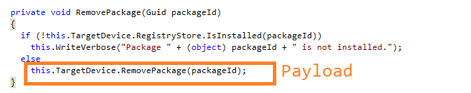

Double-clicking on `TargetDevice,` we can then scroll down to the `RemovePackage` method to see how this one works.

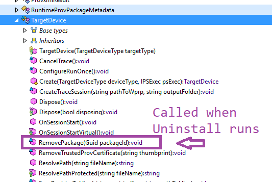

We're so close now guys, I've got a feeling that this will be worth it!

 The closest thing that I could find to a fox in a winter coat.

## The Summit

What do we actually see at the very top of this module? The true payload, hidden from all eyes until now?

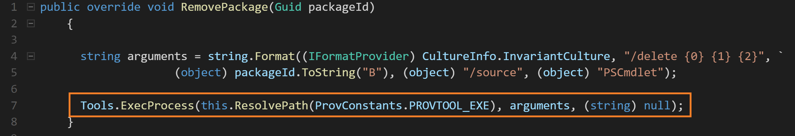

That's it? It just calls `ProvTool.exe <pathtoFile.ppkg> /quiet`?

https://giphy.com/gifs/the-office-no-steve-carell-12XMGIWtrHBl5e

I dunno, I expected a little more, something a bit cooler. It's like climbing Mt Fuji to see only this.

 Image Courtesy of WaneringVegans

Well, after hours of work, I certainly had to see what happened if I just ran that exact command line on another machine. What if we just try that on another machine? Only one way to find out.

I ran it and then pulled the Windows EventLogs and...It worked!

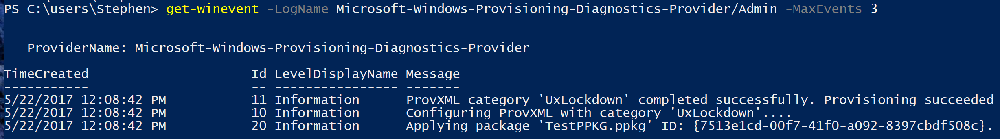

That's it kids, the Tooth Fairy ain't real, I'm beginning to have some doubts about Santa, and sometimes deep, deep within a module is just an old unloved orphan .exe file.

Thanks DotPeek, I guess.

### Where do we go from here?

I hope this post helped you! Later on, I'll be looking for other interesting PowerShell modules, and hope to learn about how they work under the covers! If you find anything interesting yourself, be sure to share it here with us too! Thanks for reading!

Want to read more about Climbing Mt. Fuji? Check these out:

- http://zoomingjapan.com/travel/climbing-mount-fuji-in-august/
- https://wanderingvegans.wordpress.com/tag/nokogiri-yama/
