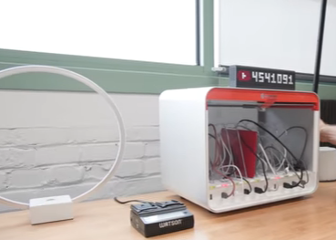
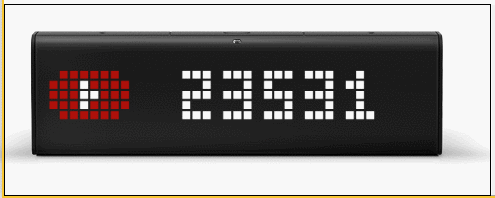
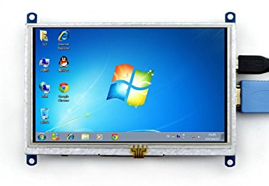
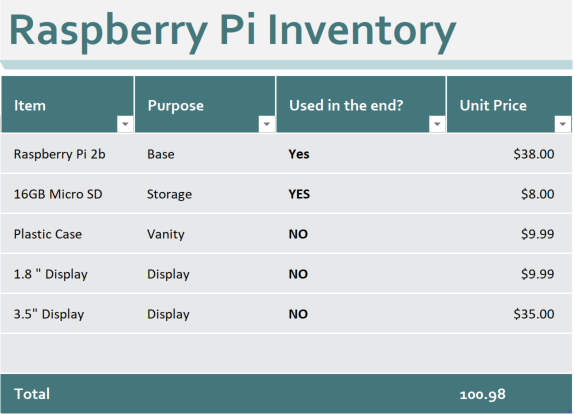
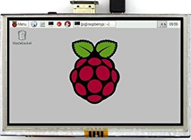
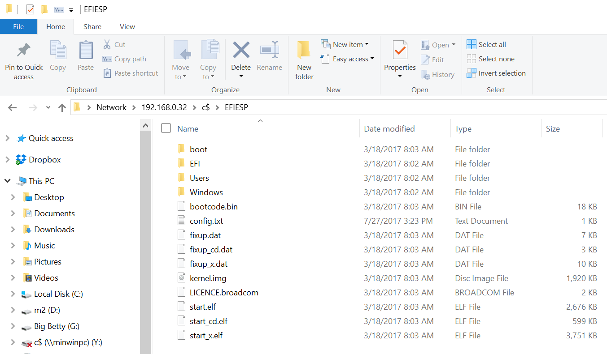
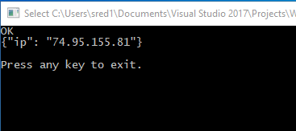
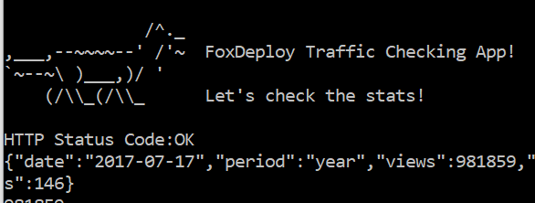
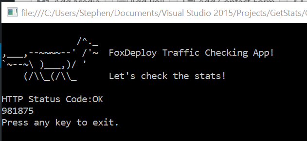

We're counting down here at FoxDeploy, about to reach a traffic milestone (1 Million hits!) , and because I am pretty excited and like to celebrate moments like this, I had an idea...

I was originally inspired by [MKBHD's very cool YouTube subscriber tracker device](https://www.youtube.com/watch?v=hNWz9o6CSyM), which you can see in his video here, and thought, boy I would love one of these!



It turns out that this is the La Metric Time, a $200 'hackable Wi-Fi clock'.  It IS super cool, and if I had one, I could get this working in a few hours of work.  But $200 is $200.



I then remembered my poor neglected rPi sitting in its box with a bunch of liquid flow control dispensers and thought that I could probably do this with just a few dollars instead(spoiler:WRONG)!

It's been a LONGGG time since I've written about Windows IoT and Raspberry Pi, and to be honest, that's mostly because I was getting lazy and hated switching my output on my monitor from the PC to the rPi.  I did some googling and found these displays which are available now, and mount directly to your Pi!



Join me on my journey as I dove into c# and buying parts on eBay from shady Chinese retailers and in the end, got it all working.  And try to do it spending less than $200 additional dollars!

### Necessary Materials

To properly follow along, you'll need a Raspberry Pi of your own. Windows 10 IoT will work on either the Raspberry Pi 2B + or Raspberry Pi 3, so that's your choice but the 3 is cheaper now.  [Click here for one](http://amzn.to/2tQQ9Df)!

You'll also need a micro SD card as well, but you probably have one too.  Get an 8gb or bigger and make sure it is fast/high-quality like a Class 10 Speed card.

Writing an SD Card is MUCH easier than it was in our previous post.  Now, it's as simple as downloading the '[IoT Dashboard](https://developer.microsoft.com/en-us/windows/iot/downloads)' and following the dead simple wizard for Setting up a new device.  You can even embed Wi-Fi Connections so that it will connect to Wi-Fi too, very cool.  So, write this SD Card and then plug in your rPi to your monitor or…

### Optional Get a display:

There are MANY, many options for displays available with the Raspberry Pi and a lot of them work…in Linux.  Or Raspbian.  Or PiBuntu or who knows what.  A lot of them are made by fly-by-night manufacturers who have limited documentation, or worse, expansive documentation that is actually a work of fiction.  I've bought and tried a number of them, here is what I've found.

#### Choosing the wrong display and hating your life

First out the gate, I saw this tiny little display, called the ["LCD MODULE DISPLAY PCB 1.8 " TFT SPI 128 x 160"](https://www.newegg.com/Product/Product.aspx?Item=9SIADG45V29374&ignorebbr=1&nm_mc=KNC-GoogleMKP-PC&cm_mmc=KNC-GoogleMKP-PC-_-pla-_-EC+-+Circuit+Protection-_-9SIADG45V29374&gclid=Cj0KCQjw7pHLBRDqARIsAFyKPa5wiG9_i-D0XuL2L1I15OPXqXDgUv833M5xTajbRDOhWUbH18dBiFcaAghjEALw_wcB&gclsrc=aw.ds).  I immediately slammed that 'BUY' button...then decided to look it up and see if it would work.

 It's literally the size of a postage stamp

While it works in some Linux distros I could not make it work with Windows 10 IoT, as it just display a white screen.  It is well, well below the supported minimum resolution for Windows (it could barely render the start button and File Explorer icon on the start bar, in fact, if we could even get it working) so it was no surprise.  There's $10 down the drain.


Kind of off to a rocky start, at 25% of the price of the bespoke solution...surely, spending more money is the way out of this mess.

Next up, I found this guy, the [3.5" Inch Resistive Touch Screen TFT LCD Display 480x320](http://www.ebay.com/itm/3-5-Inch-Resistive-Touch-Screen-TFT-LCD-Display-480x320-For-Raspberry-Pi-B-2-3-/171882200433?_trksid=p2385738.m2548.l4275).


This one easily worked in Raspian, but at such a low res, I could never get it to display a picture in Windows, just a white screen, indicating no driver.  I contacted the manufacturer and they confirmed support for Linux (via a driver written in Python!) but no Windows support.  At $35, it was more painful to box up,

From what I can tell, these are both Chinese counterfeits of displays made by WaveShare.   So at this point I decided to just legitimately buy the real deal from WaveShare, since they mention on their site that the screen does work with Windows 10 IoT.

If you're doing the math, I was halfway there to the full solution already in pricing.

 Wife: You spent HOW MUCH on this post?!

#### Choosing the right monitor and a sigh of relief

I eventually ponied up the dough and bought the [5inch HDMI LCD V2 800x480 HDMI display](http://amzn.to/2tXRFUQ).  This one uses the HDMI connection on the rPi and also features a touch screen.  The screen even works with Windows 10 IoT!

It implements touch via a resistive touch panel rather than the standard capacitive touch.  And no one has written a driver for the touch panel  :(  So, it works, and it is a great size for a small project, but it doesn't have touch.  At this point, I decided that this was good enough.



When I connected this display, I saw scrolling lines which changed patterns as the content on the screen changed.

\[wpvideo GEKd8kcv\]

This is a great sign, as it means that Windows is rendering to the display, but at the wrong refresh rate or resolution.

To fix this, remote in to your Raspberry Pi via the admin$ share, and change the Video section of your C:\\EFSIS\\Config.txt file.  Once you've made the change, reboot the device and display will _just work!_

```
 # # Video #

framebuffer\_ignore\_alpha=1  # Ignore the alpha channel for Windows. framebuffer\_swap=1          # Set the frame buffer to be Windows BGR compatible. disable\_overscan=1          # Disable overscan

hdmi\_cvt 800 480 60 6 0 0 0 # Add custom 800x480 resolution (group 2 mode 87) hdmi\_group=2                # Use VESA Display Mode Timing over CEA hdmi\_mode=87


```

What we're doing here is adding a new HDMI display mode and assigning it the numerical ID of 87 (since Windows ships with 86 HDMI modes, and none are 800 x 480!) and then telling windows to use that mode.  With all of these changes in place, simply restart your Pi and you should see the following


At this point I decided that I ALSO wanted touch, so I bought the 7" model too (jeeze how much am I spending on this project??).  Here's that one [WaveShare 7inch HDMI LCD (C )](http://amzn.to/2uwHfZG).

I'll follow up on this later about how to get touch working. **Update: scroll down to see how to enable the 7" display as well!** Here's my current balance sheet without the 7" display included.  Don't wanna give my wife too much ammunition, after all.

 

 Intentionally not adding the last display to this list (and hiding credit card statements now too)

So, now that we've got our Pi working, let's quietly set it off to the side, because we've got some other work to do first before we're ready to use it.

**Update: How to enable a 7" Display**

Here's the display I mentioned, the [WaveShare 7inch HDMI LCD (C )](http://amzn.to/2uwHfZG).

**I love this screen!** I wholly recommend using this display for your Pi, it has built in touch which is 100% supported, it's also a capacitive touch model with fused glass, so it looks like a high-end smart phone screen.  It's super sexy.

If you buy this one, you can actually enable support for the screen when you first record the Win10 IoT image.  To do this route, when you write the OS onto the SD Card, open explorer and go to the SD Card's EFIESP partition.

 If your Pi is on and the screen is off, or displaying scan-lines, you can hop in through the admin share instead.  Go to \\\\ipaddress\\c$\\EFIESP if you're in that situation

Next, open Config.txt and add or change the final few lines to match this below.  Again **only if you bought the 7" display.** If you bought a different HDMI display, you can simply change the resolution to match.

```
init_uart_clock=16000000    # set uart clock to 16mhz
kernel_old=1                # load kernel.img at physical memory address 0x0
 
safe_mode_gpio=8            # a temp firmware limitation workaround
max_usb_current=1           # enable maximum usb current
 
gpu_mem=32
hdmi_force_hotplug=1        # enable hdmi display even if it is not connected
core_freq=250               # frequency of gpu processor core in mhz
 
framebuffer_ignore_alpha=1  # ignore the alpha channel for windows.
framebuffer_swap=1          # set the frame buffer to be windows bgr compatible.
 
disable_overscan=1          # disable overscan
hdmi_cvt 1024 600 60 6 0 0 0 # Add custom 1024x600 resolution (group 2 mode 87)
 
hdmi_group=2                # Use VESA Display Mode Timing over CEA
hdmi_mode=87
```

It's that simple.  Be careful using this method, because if you go to the Device Portal on the device and check the Resolution settings there, our custom HDMI mode will not be displayed.  Fiddling with the settings in Device Portal can force your Pi to reboot and erase your settings, forcing you to go through this process again.

## Getting Started with C#

Windows 10 IoT can run apps written in JavaScript, Python and C#.  It can also run PowerShell remoting as well, but if you go that route we cannot use the typical PowerShell and XAML approach we've been doing.  And a GUI was crucial to this whole project. So, for the first time ever, we are going to write this natively in c# and XAML.

Since I was just getting my toes wet, I decided to start super simply with a basic hello world console app in C#.  I followed [this guide here](https://docs.microsoft.com/en-us/dotnet/csharp/programming-guide/inside-a-program/hello-world-your-first-program).  Soon enough, I had my own hello world app! Launch **Visual Studio**, make a **new Project** and then choose **Visual C# \\ Console Application**. Then, erase everything and paste this in.

```csharp
// A Hello World! program in C#. using System; namespace HelloWorld { class Hello { static void Main() { Console.WriteLine("Hello Foxy!");

// Keep the console window open in debug mode. Console.WriteLine("Press any key to exit."); Console.ReadKey(); } } } 
```

If you look through the code, it's not THAT far away from PowerShell. Sure there are way more nested code blocks than we'd normally have in PowerShell, but essentially all we do is call `Console.WriteLine()` which is the c# equivalent of `Write-Host`, and provide an overload which is written to the screen.  Then we end this by waiting for the user to hit something with `Console.ReadKey();.` I hit Compile (F5) and boom!


> What does `using` mean?

C# makes use of Namespaces.  Namespaces are a way of organizing code into different modules that might be importable (on systems that don't have them, you could add new namespaces with DLLs or by installing software) and prevents code collision.  Our new program begins with `using System;` (called a directive, we're directing our program to use the System namespace), which contains a lot of cool functions we need, such as `Console.WriteLine()`.  If we didn't begin the code by importing the System Namespace we'd have to write`System.Console.WriteLine()` everytime, instead of just `Console.WriteLine()`.

* * *

With that out of the way, and now that we are C# experts (let's pause and add 'Developer' to our LinkedIn and StackJobs profiles too) I decided to move on to a basic WebRequest, [following this great example](https://docs.microsoft.com/en-us/dotnet/framework/network-programming/how-to-request-data-using-the-webrequest-class).

#### Babies first WebRequest

I copied and pasted the demo and hit F5, only to see that this is pretty boring, essentially just loads the Contoso page and displays the HTTP status code.  That, frankly will not fly.

To spice things up a bit under the covers, I decided to instead hit the awesome JSONTest.com page, which has a bunch of nifty test endpoints like ip.JSONTest.com.  Hitting this endpoint will give you back your public IP address.  Nifty!  I simply changed the URL on line 18 to `string url ="http://ip.jsontest.com";` and BOOM smash that F5.

```csharp
using System;
using System.Collections.Generic;
using System.Linq;
using System.Text;
using System.Net;
using System.Web;
using System.Threading.Tasks;
using System.IO;

namespace WebHelloWorldGetIp {
  class Program {
    static void Main(string\[\] args) {

        string url = "http://ip.jsontest.com/";

        HttpWebRequest request = (HttpWebRequest) WebRequest.Create(url);

        request.Credentials = CredentialCache.DefaultCredentials; // Get the response. WebResponse response = request.GetResponse();

        // Display the status. Console.WriteLine(((HttpWebResponse)response).StatusDescription); // Get the stream containing content returned by the server. Stream dataStream = response.GetResponseStream(); // Open the stream using a StreamReader for easy access. StreamReader reader = new StreamReader(dataStream); // Read the content. string responseFromServer = reader.ReadToEnd();

        // Write the response out to screen Console.WriteLine(responseFromServer);

        //clean up reader.Close(); response.Close();

        //Wait for user response to close Console.WriteLine("Press any key to exit."); Console.ReadKey(); } } }

```

#### How different things are...

A quickly little note here, as you may have noticed on line 19, when we created a variable with  `string url=".."` we had to specify the type of variable we want.  PowerShell was **dynamically typed**, meaning it could determine the right type of variable for us as we go, but C# is NOT, it is **statically typed.** Keep this in mind, furthermore where PowerShell was very forgiving and case insensitive, C# is case sensitive.  If I define `string name = "Stephen"` and then later write `Console.WriteLine("Hello "  + NAME );` I will get an error about an undefined variable.

We hit F5 and...



Sweet!  Now we've done a working webrequest, the next step is to swap in the URL for WordPress's REST API and see if we can get stats to load here in the console.  If we can, then we move the code over to Windows 10 IoT and try to iron out the bugs there too.

#### Querying WordPress from C#

In my usage case, I wanted to query the WordPress API, and specifically the `/Stats` REST Endpoint.  However, this is a protected endpoint and requires Authentication [as we covered in a previous post on oAuth.](http://foxdeploy.com/2015/11/02/using-powershell-and-oauth/)

WordPress handles Authentication by adding an Authorization property to the header, which is simply a key value pair of this format

| Key | ValueName |
| --- | --- |
| Authentication | Bearer #YourBearerTokenHere |

We are using the [System.Net.Http.Httpclient class](https://msdn.microsoft.com/en-us/library/system.net.http.httpclient(v=vs.118).aspx), which supports adding extra headers using this format as seen below.

```csharp 
request.Headers\["Authorization"\] = "Bearer <YourKeyHere>"; 
```

Then I spiff things up [a bit more as seen here](https://gist.github.com/1RedOne/fbcfde8b17543ae4f14bc605b0e332e8#file-progam_v1-cs) (mostly adding a cool Fox ascii art), and get the following results:



This is nice, but it's JSON and I want just the numerical value for Hits.

Visual Studio 2013 and up integrates Nuget right into the IDE, so it's very easy to reference awesome community tools.  We're going to add NewtonSoft JSON to the project, [following the steps seen here](https://docs.microsoft.com/en-us/nuget/quickstart/use-a-package).

With that in place, all we have to do is create a new `jObject` which has a nifty `.SelectToken()` method you use to pick an individual property when you parse JSON.

```csharp
JObject Stats = JObject.Parse(responseFromServer); Console.WriteLine(Stats.SelectToken("views")); 
```

[If you'd like to see the completed code.  It's here](https://gist.github.com/1RedOne/fbcfde8b17543ae4f14bc605b0e332e8#file-program_v2-cs), and here's the output.



Alright, now all I have to do is make a GUI, and port this over to Raspberry Pi--which runs on .netCore and only uses _some_ of the libraries that full dotnet supports--surely that will be very easy, right?

### A good stopping point

Phew, this was fun! We learned which components to use (and which to avoid) learned a bit about c# background terminology, and even wrote our first WebRequest, parsing JSON using Nuget packages we installed into our application.  This was awesome!

Stay tuned for Part II, dropping later this week! (this will link to Part II when available)
