[](/series/LearningRaspberryPi)

**This post is part of the Learning Windows IoT Toolmaking Series, here on FoxDeploy. Click the banner to return to the series jump page!**

* * *


[Previously](http://foxdeploy.com/2017/07/19/buildyourowniotmonitoringtool/) 🔗, we took off our socks and put our feet into the sand, and wrote our first C# Console application.  We built on it and added the ability to complete a web request and even parsed some JSON as well!  Along the way, we learned a bit of how things work in C# and some background on programming terms and functionality.

In this post, we will take our code and port it over to run on .net core, and hook up the results to the GUI. Stick with me here, and by the end you'll have a framework you can modify to list your Twitter followers, your Facebook Feed, or monitor your own blog stats as well.

**And if you do modify it...**

Then share it!  You'll find a "LookWhatIbuilt" folder in the repository.  You are encouraged to share screenshots, snippets, even your own whole project if you like, by sending a PR.  Once we have a few of these, we'll do a Spotlight post highlighting some of the cool things people are doing,

### Cracking open the IoTDefaultApp

When we imaged our rPi with the Iot Dashboard, it wrote the OS and also delivered the 'IoT Core Default App' to the device.  It's pretty slick looking and gives us a very good jumping off point to reskin things and have our app look nice.  We can view the code for the [🔗 Default App here on the MS IoT GitHub ](https://github.com/1RedOne/IotCoreDefaultApp) .

Since this is 'babies first application' we are going to modify this existing app to suit our purposes.  Download the sample from the link above and then double-click the Visual Studio Project  `.SLN` file.  There's kind of a lot going on when you first open it, but the file we want to edit is `MainPage.XAML`.

Over in the **Solution Explorer** in the right-gutter, expand out to **IotCoreDefaultApp \\ Views** then click **MainPage.xaml.**

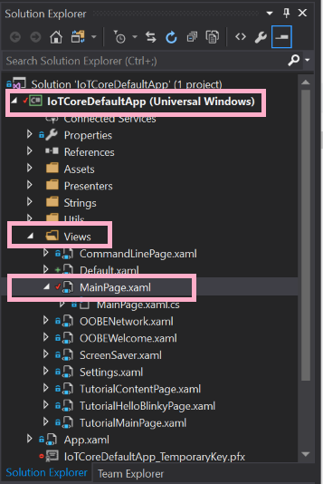

Here is the template we're going to be modifying.

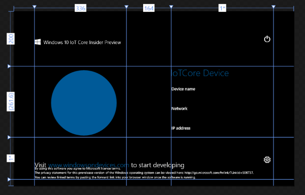

There's kind of a lot going on here too, so I recommend that you power on your Pi now and see what the default app looks like, here's a screen shot...


#### Redecorating the app

Me being me, of course I'm going to make it look pretty before I make it work, so I spent some time adding files, dragging the layout around, that sort of thing.  To add a new file, first, click to the **Solution Explorer \\ Assets** folder, then right-click and choose 'Add Existing Item'

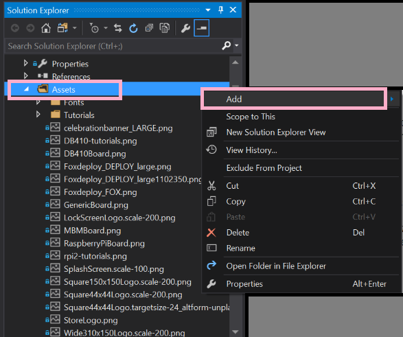

Next, go to the **Left Gutter \\ Toolbox\\** and choose the **Image** Control, then drag the area you'd like your image to appear.

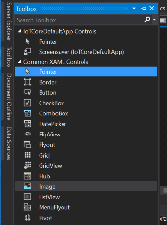

Now, back on the **Right Gutter** \\ **Properties \\ Common**, use the dropdown box **Source** and pick your image.

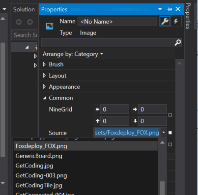

> **PROTIP**: be sure to use this process of adding an image, relatively selecting it, rather than specifying the full-path to the file.
> 
> If you don't, you can end up with the file not getting delivered with the app to your pi.  Not good!

 

I did a little bit of tweaking here, and here is where I ended up


One of the core values of my job is to _Make it work before you make it look pretty._  It really speaks to me, namely because I never do it.

#### We made it look pretty, now, to make it work

Hitting **F7**, or right-clicking and choosing '**View Code**' will show the c# behind this View.  Developers like to call the code behind a view the **code-behind**.

We see here a whole lot of references to assemblies

```csharp

using IoTCoreDefaultApp.Utils; 
using System;
using System.Globalization;
using System.IO;
using System.Net;
using System.Net.Http;
using Windows.Data.Json;
using Windows.Networking.Connectivity;
using Windows.Storage;
using Windows.System;
using Windows.UI.Core;
using Windows.UI.Xaml;
using Windows.UI.Xaml.Controls;
using Windows.UI.Xaml.Media.Imaging; 
using Windows.UI.Xaml.Navigation; 
using MyClasses; 
using Windows.System.Threading;

```

Then we define a namespace for our app, called `IotCoreDefaultApp`, then a class called a `MainPage`, which is where the entirety of the code for this app will live.  We also define a Dispatcher, which might be familiar from our post on [🔗multi-threaded GUIs with PowerShell](http://foxdeploy.com/2016/05/17/part-v-powershell-guis-responsive-apps-with-progress-bars/).  Because our GUI is going to be multithreaded, we can't just say `Label.Text = "New Value"`, we'll use a Dispatcher to enact the change for us.

```csharp 
namespace IotCoreDefaultApp {
  public sealed partial class MainPage: Page {
      public static MainPage Current;
      private CoreDispatcher MainPageDispatcher;
      private DispatcherTimer timer;
      private DispatcherTimer GetStattimer;
      private DispatcherTimer countdown;
      private ThreadPoolTimer timerInt;
      private ConnectedDevicePresenter connectedDevicePresenter;

      public CoreDispatcher UIThreadDispatcher {
        get {
          return MainPageDispatcher;
        }

        set {
          MainPageDispatcher = value;
        }
      }

```

Next a public class called `MainPage()` gets defined, which kicks off some interval timers which run, um, on an interval and update UI info.  We'll skip over some boring stuff [(which you can read here 🔗](https://github.com/1RedOne/IotCoreDefaultApp/blob/master/IotCoreDefaultApp/Views/Default.xaml.cs)) ,which consists of  kind of boring house-keeping functions of this app.  Most of these run when something is clicked, or when a timer interval counts down.

Within the timer, (beginning line 65 or so) you'll see that it gets started, then counts down 20 seconds and calls a function called `timer_Tick`.  All we have to do is define our own method, and then add it to `timer_Tick` and bam, it will automatically run on the interval specified (20 seconds, in this sample).

```csharp
timer = new DispatcherTimer();
timer.Tick += timer\ _Tick;
timer.Interval = TimeSpan.FromSeconds(20);

this.Loaded += async (sender, e) => {
  await MainPageDispatcher.RunAsync(CoreDispatcherPriority.Low, () => {
    UpdateBoardInfo();
    UpdateNetworkInfo();
    UpdateDateTime();
    UpdateConnectedDevices();
    timer.Start();
  });
};
this.Unloaded += (sender, e) => {
  timer.Stop();
};
}

```

Let's see what else happens when timer\_Tick get's called.  Double-click `timer_Tick` and choose 'Go to Definition' to jump there.

```csharp

private void timer\_Tick(object sender, object e) { UpdateDateTime();

}


```

So, every 20 seconds, it runs and calls `UpdateDateTime()`, care to guess what this function does?

Now, that we're familiar with how this works so far, let's make our own method.

#### Making our own Method

I found a nice innocuous spot to add my method, in between two other methods and started typing.

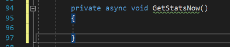

I'm defining this as a `private` method, meaning that only this body of code can use it.  Next, because performing a web request can take a few seconds to complete, and we don't want the code to lockup and freeze here, we add the `async` modifier.  Finally, we add `void` because this code block will run the web request and update the UI, but doesn't return a value otherwise.

> **A word on Async and Await**
> 
> We want our code to be responsive, and we definitely don't want the UI to hang and crash, so running things asynchronously is a necessity.  We can do that using c#'s state machine ([more](https://msdn.microsoft.com/en-us/magazine/hh456401.aspx) [on](https://stackoverflow.com/questions/33731376/why-does-an-async-void-method-run-synchronously) [that here](https://blogs.msdn.microsoft.com/ericlippert/2010/10/28/asynchrony-in-c-5-part-one/)) to ensure that the app will not hang waiting for a slow web request
> 
> When you define a method as asynchronous, you also have to specify an `await` statement somewhere, to identify which code is allowed to run asynchronously while the rest of the app keeps running.

 

Now, let's copy and paste the code we had working previously in the last post into the method and see if we get any squiggles.

#### Copying and Pasting our old code...why doesn't it work?

We will have some squiggles here because we are bringing code from a full-fledged .net app and now targetting .net Core.  Core is cool...but it's only got _some_ of the features of full .net.  Some stuff just won't work.  I am on a mission to kill these red squiggles.


First off, we don't have a Console to write off to, so lets comment out or delete those lines( the double-frontslash `//` is used to comment in c#).

Next, the `HttpWebRequest` class doesn't offer the `GetResponse()` method when we target .Net Core for Universal Windows Apps.

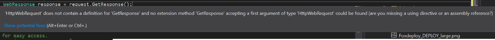

Let's delete `GetResponse()` and see if there is an alternative.

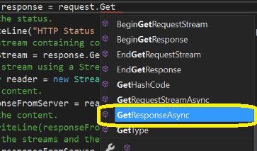

Now that I've swapped this for `GetResponseAsync()`, I get MORE squiggles.  This time, the swiggles are because I'm telling the program to run this asynchronously and keep on going...but I don't tell it to wait for the response anywhere.

The way to fix this is to add an `await` to the command as well.  This makes sense too, because there is always going to be a slight delay when I run a web request.  I want my app to know it can run this method we're writing, and then proceed to do other things and come back when the webrequest has completed to finish the rest of my method.


#### Yay, no more squiggles, time to actually run this badboy

I'm going to want to test the results from this, so I'll set a **breakpoint** within my `Test()` method, so that I can see the values and results when this code runs.  I'm going to highlight this line and hit **`F9`** **to create a breakpoint**, which will tell the debugger and my program to stop right here.


With all that done, I'll add modify the `timer_Tick` method to have it call my code `Test()`

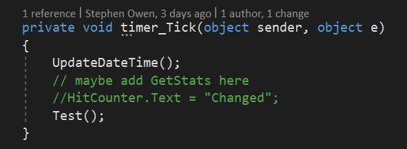

Once every twenty seconds, the timer will expire and it will both update the time, and call our new method!

#### Pushing code to the Raspberry Pi

Pushing code to the Pi is easey peasey.  In the **Right Gutter \\ Solution Explorer** , right-click your project and choose **Properties.**


Next, click **Debug ** then specify the **Target Device** as a **Remote Machine.** Then click **Find**

 Simply click your device and that's it!

 You might not even be asked for credentials. Nope, I don't know why it doesn't need credentials...

Now, finally, hit **F5**!

You'll see a kind of lengthy build process, as the first boot or two of a pi is really pretty slow.  Then you'll see a _**longggggggg**_ Windows OOBE screeen displayed, which counts down and eventually picks the English language and Pacific Time Zone.  You can change this later by plugging in a mouse and keyboard.

[Download link: Our code at this point should look something like this🔗.](https://github.com/1RedOne/IoTTrafficMon/blob/master/WIP/Stage_I/IotGetStats/IoTCoreDefaultApp/Views/MainPage.xaml.cs)

#### Live Debugging

While our code is running, it will eventually swap over to the main page and display something along these lines.


If we have Visual Studio in the foreground, the app will pause when it reaches our breakpoint and we can see the values for each variable, in real time!

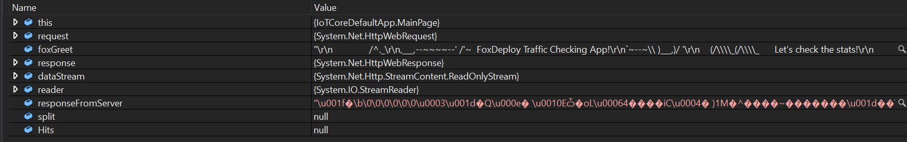

So, it looks like our web request completed sucessfully, but somehow the `responseFromServer` value looks like garbage.  Why might that be? Maybe `HttpClient`  is different between full .net and .net core?

**Spoiler warning: it is different.** 

We're able to hit the endpoint, but then we get this gibberish.

```
�\b\0\0\0\0\0\0�\a`I�%&/m�{J�J��t�\b�`$ؐ@������iG#
```

Fortunately I recognized this Gibberish as looking kind of like what a GZipped payload looks like.  See, all modern browsers support GZip as a pretty good style of compression.  It's so common that event `Invoke-RestMethod` and `HttpClient` just natively support it.  However, in .net core it's an option we have to turn on.

And we'll do it by defining a net `HttpClientHandler` as a way of passing our preferences over to `HttpClient` when we spin up a new one.  Here's how to do it, thanks to this [ StackOverflow Answer](https://stackoverflow.com/questions/20990601/decompressing-gzip-stream-from-httpclient-response).

```
HttpClientHandler handler = new HttpClientHandler()
{
    AutomaticDecompression = DecompressionMethods.GZip | DecompressionMethods.Deflate
};

using (var client = new HttpClient(handler))
{
    // your code
}
```

I simply move all of the HTTP code within the `//your code` space, like so.

```csharp
private async void GetStats() {

  HttpClientHandler handler = new HttpClientHandler() {
    AutomaticDecompression = DecompressionMethods.GZip | DecompressionMethods.Deflate
  };

  using(var client2 = new HttpClient(handler)) { // your code string url = "https://public-api.wordpress.com/rest/v1.1/sites/56752040/stats/summary/?fields=views&period=year&num=5"; //client.DefaultRequestHeaders.Add(); client2.DefaultRequestHeaders.Add("Authorization", "Bearer YourKeyHere");

    HttpResponseMessage response1 = await client2.GetAsync(url);

    //assign the response to a variable called ham string ham = await response1.Content.ReadAsStringAsync();

  }

}


```

Running it again, I can see that the fix worked, and the response isn't GZipped anymore!


But...well, crap, I can't use JSON.net (or if it's possible, I couldn't figure it out). What am I going to do?!?1

#### _Learning how to parse JSON, again_

I hope I didn't leave you hanging with that cliff hanger.  Fortunately, dotnetCore has its own built-in JSON parser, under `Windows.Data.JSON`.

We can instantiate one of these badboys like this.

```csharp

var Response = JsonObject.Parse(ham);


```

This will put it into a better and more parsable format, and store that in `Response`.  The last step is to pull out the value we want.

In PowerShell, of course, we would just run `$Views = $Response.Views`  and it would just work because PowerShell is Love.

In C#, and with Windows.Data.JSON, we have to pull out the value, like snatching victory from the jaws of defeat.

```csharp

var Response = JsonObject.Parse(ham); var hits = Response.GetNamedValue("views").GetNumber();


```

`Response.GetNamedValue("views")` gives us the JSON representation of that property as in `{1000}`, while `.GetNumber()` strips off the JSON envelope and leaves our number in its unadorned natural form like so `1000`.

I am FINALLY ready to update the text block.

#### Crashing the whole thing

I was a bright-eyed summer child, like I was before I started reading Game of Thrones, so I decided to happily just try to update the `.Text` property of my big fancy count-down timer like so:

```csharp

var Response = JsonObject.Parse(ham); var hits = Response.GetNamedValue("views").GetNumber();

var cat = "Lyla"; //this was a breakpoint, named after my cat

HitCounter.Text = hits.ToString("N0");


```

I hit F5, waited, really thrilled to see the number change and...it crashed.  The error message said

> The calling thread cannot access this object because a different thread owns it.

This one was really puzzling, but [this helpful StackPost post explains](https://stackoverflow.com/questions/9732709/the-calling-thread-cannot-access-this-object-because-a-different-thread-owns-it) that it's because the very nature of threading and asynchronous coding means that I can't always expect to be able to change UI elements in real time.

Instead, we have to schedule the change, which is SUPER easy.

#### How to update UI from within a thread

I just modify the call above like so, which makes use of the Dispatcher to perform the update whenever the program is ready.

```csharp

await MainPageDispatcher.RunAsync(CoreDispatcherPriority.Low, () => { //Move your UI changes into this area HitCounter.Text = hits.ToString("N0"); });


```

And now...it works.

#### Publishing the app and configuring Auto Start

When we're finally done with the code (for now), publishing the finished version to the Pi is super easy.  Right click the solution in the right-hand side and choose properties.  In the windows that appears, go to the **Debug** tab and change the **Configuration dropdown** to **Release**.

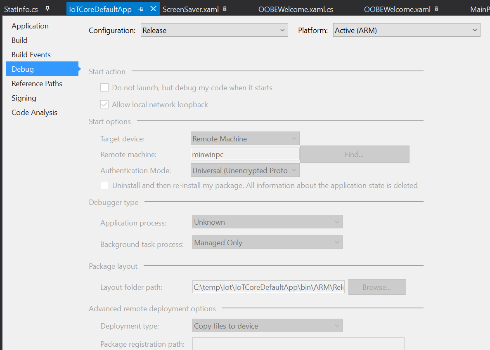 Change the configuration to Release, and then F5 one last time.

Once you do that, the app is written and configured to run without remote debug.  Our little Raspberry is almost ready to run on it's own!

The very last step here is ot configure our app to automatically run on power on.  Since we fiddled with it so much, we'll need to set this again.  You can do this from the **Windows IoT app** by right-clicking the device and choosing **Launch Windows Device Portal.**

This launches a web console that is actually really slick.


You can watch live performance graphs, launch apps, configure wifi and updates and change the time zone here as well.  This is also where we configure which app launches when you turn the Pi on.

From this page, click **Apps \\ App Manager** and find our app (you may have changed the name but I left it as `IoTCoreDefaultApp)`and then click the radio button for **Startup.** 


And now, Restart it.


In just a few minutes, you should see the Pi reboot and automatically launch our monitoring app.  Awesome, we're developers now!

[Completed Code Download Link - Here](https://github.com/1RedOne/IoTTrafficMon/tree/master/IotGetStats) 

#### How to modify this to query your own WHATEVER

Simply change the body of `GetStats()` here to modify this to query whatever you like.  So long as it returns a JSON body, this format will work.

```csharp

private async void GetStats() { //add your own query for ANYTHING here HttpClientHandler handler = new HttpClientHandler() { AutomaticDecompression = DecompressionMethods.GZip | DecompressionMethods.Deflate };

  using(var client2 = new HttpClient(handler)) { // whatever URL you want to hit should be here string url = "https://yourAPIUrlhere.com";

    //if your URL or service uses Bearer Auth, use this example client2.DefaultRequestHeaders.Add("Authorization", "Bearer YourKeyHere");

    HttpResponseMessage response1 = await client2.GetAsync(url);
    string ham = await response1.Content.ReadAsStringAsync();

    var Response = JsonObject.Parse(ham); //var hits = Response.GetNamedValue("views").GetNumber();

    //set a breakpoint here to inspect and see how your request worked.  Depending on the results, use the appropriate value for GetNamedValue() to get the syntax working

    var bestCatname = "Lyla";

    //this block below handles threading the request to change a UI element's value

    /\*await MainPageDispatcher.RunAsync(CoreDispatcherPriority.Low, () => { / / Your UI change here //HitCounter.Text = hits.ToString("N0"); }); \*/ //HitCounter.Text =viewsdesuka.ToString(); cat = "Lyla";

  }

}

```

 

### Resources and thanks!

I could not have done this without the support of at least a dozen of my friends from Twitter.  Special thanks to [Trond Hindes](https://twitter.com/trondhindenes), and [Stuart Preston](https://twitter.com/stuartpreston), and those who took the time to [weigh in on my StackOverflow question](https://stackoverflow.com/questions/45003143/c-sharp-targetting-arm-how-to-deserialize-json).

Additionally, these posts all helped get the final product cobbled together.

- [This forum thread on Hackster contained the clues I needed to eventually learn to draw the display](https://www.hackster.io/dotMorten/windowsiottouch-44af19)
- [How to add a header to a web request C#](https://stackoverflow.com/questions/9842539/add-custom-headers-using-httpwebrequest)
- [How to parse JSON from a Web Request C#](http://www.c-sharpcorner.com/UploadFile/5c2d70/parsing-json-in-uwp-app-without-json-net-windows-10-univ/)
- [How to debug in Visual Studio](https://msdn.microsoft.com/en-us/library/ms173083%28v=vs.90%29.aspx?f=255&MSPPError=-2147217396)
- [How to enable GZIP Decompression in C# HttpClient](https://stackoverflow.com/questions/20990601/decompressing-gzip-stream-from-httpclient-response)

Now, what kind of stuff have you written or do you plan to write with this template?  Be sure to share here, or on Reddit.com/r/FoxDeploy!

Finally, **please share!**  If you come up with something cool, [add it to a subfolder of **Look what I made, ** here!](https://github.com/1RedOne/IoTTrafficMon/tree/master/LookWhatIMade)
