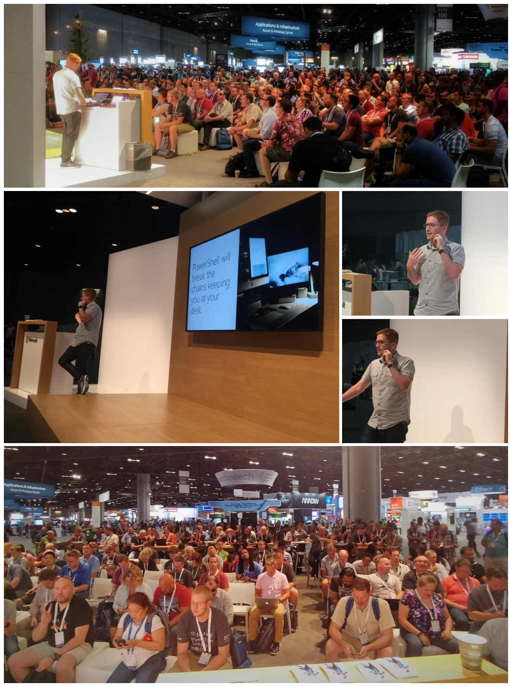

Ignite Orlando WAS AWESOME! In this post, I'll give you some of my fun memories and commentary about the event, and then end with a bunch of the best videos from Microsoft Ignite 2017.

### My sessions

We had a HUGE turn out for the PowerShell Community Event, in fact, it was so big that we had an overflow room with 200 people in it!

There were a lot of folks waiting outside who weren't able to attend, and at this point Adam Bertram and Simon Whalin were the REAL MVPs.  They left the room and lead an impromptu session to get the discussion going in the overflow room.

<blockquote class="twitter-tweet">
The room for BRK1061 - Microsoft Ignite PowerShell Meetup got full so we “borrowed” the lunch area <a href="https://twitter.com/hashtag/MSIgnite?src=hash&amp;ref_src=twsrc%5Etfw">#MSIgnite</a> <a href="https://twitter.com/hashtag/PowerShell?src=hash&amp;ref_src=twsrc%5Etfw">#PowerShell</a> <a href="https://twitter.com/KFConsulting?ref_src=twsrc%5Etfw">@KFConsulting</a> <a href="https://t.co/4XKa4N9hi9">pic.twitter.com/4XKa4N9hi9</a>
&mdash; Johnny Radeck (@Johnny_Radeck) <a href="https://twitter.com/Johnny_Radeck/status/912758204869865472?ref_src=twsrc%5Etfw">September 26, 2017</a></blockquote> 

Not pictured, Adam Bertram standing on a table, shouting into the crowd!  Oh, and did I mention that Jeffrey Snover came on stage as well?  Talk about a dream come true!

 Jeffrey is the four greenish pixels near the screen

Fortunately I was prepared and stammered through a terrible soft-ball question about Azure Cloud Shell.  Jeffrey said 'that's your question, Stephen?'

My final session was at the end of the day on Thursday, which effectively maximized my stress for the entirety of Ignite.  Fortunately I had plenty of time to practice and work on my transitions and I felt that I really gave it my all.

Next year, I'd like to lead a one hour session, or one focused on real world usage of PowerShell as a glue language.  We'll see if they get approved!

Don and Jeffrey filled a colossal 5300 person auditorium to capacity, in their PowerShell Unplugged session.

<blockquote class="twitter-tweet">
Maximum occupancy is 5300, I think we needed every seat! <a href="https://twitter.com/concentrateddon?ref_src=twsrc%5Etfw">@concentrateddon</a> <a href="https://twitter.com/jsnover?ref_src=twsrc%5Etfw">@jsnover</a> <a href="https://twitter.com/hashtag/MSIgnite?src=hash&amp;ref_src=twsrc%5Etfw">#MSIgnite</a> <a href="https://twitter.com/hashtag/Powershell?src=hash&amp;ref_src=twsrc%5Etfw">#Powershell</a> <a href="https://t.co/BbJkwjiLMn">pic.twitter.com/BbJkwjiLMn</a>
&mdash; Stephen Owen 🦊Deploy (@FoxDeploy) <a href="https://twitter.com/FoxDeploy/status/913104259536887815?ref_src=twsrc%5Etfw">September 27, 2017</a></blockquote> 

Even these two unflappable speakers looked a tiny bit overwhelmed (just for a moment) by the colossal turnout!

Brad Anderson continued his 'Lunchbreak With Brad series', but this time opened it up to everyone at Ignite!  I joined and was actually featured in the video (around the 9 min mark)

https://www.youtube.com/watch?v=gVhekNJbYGQ&feature=youtu.be

Getting to meet Brad in person was great, as I've seen him deliver presentations so many times in person and virtually!  I would have liked to have had a full lunch break with him!

#### Other photos

Spinners were...everywhere.

https://twitter.com/FoxDeploy/status/913763013718691840

## My Top Ten Must Watch Sessions

I love the trend of recording all of the bigger sessions.  Here are some of my favorite (which happened to be recorded).

The keynote was...interesting, but ended with an odd deep dive on Quantum computing, which was a bit odd.  I could have done with more explanation on what MSFT365 is...

https://www.youtube.com/watch?v=\_aphl0s4WTs

Fortunately, Brad Anderson explained that here in this session.  Microsoft 365 is essentially a new tier of Office 365 license which now includes Intune, Advanced Threat Protection, and all the O365 goodness we already had.  I _believe_ it includes pricing for Windows Licensing as well.

https://www.youtube.com/watch?v=xPp4fQaviIY

Azure Automation session with Joey Aiello, Hemant and Aemon

https://www.youtube.com/watch?v=oOiwcN6DAwQ

Donovan Devops in any language, with Damian Brady and Donovan Brown.  A dynamic and exciting session talking through VSTS's devops capabilities.

https://www.youtube.com/watch?v=eE6Pb5lOf9M

Expert level Windows 10 Deployment.  Johan and Mikael killed this talk, as expected!

https://www.youtube.com/watch?v=H9HGSVEaqQk

Ask the experts, Windows 10 Deployment.  This was one of those 'deeper word' sessions.  A super, real-world deep dive into how the hell we're supposed to OSD upgrade all of our machines twice a year.

https://www.youtube.com/watch?v=l\_syTjtrqTw

Chris Jackson - Deep dive on Win 10 Fall Update Security Internals

https://www.youtube.com/watch?v=4fsVX6ULKjM

Your attacker thinks like my attacker, an awesome security minded session

https://www.youtube.com/watch?v=Ijz7NHF3l28

Red Teaming Windows

https://www.youtube.com/watch?v=CClpjtgaJVI

I love these business & personal growth style sessions.  Jeffrey had a great one here which covered staying relevant and providing value as keys to always remaining hirable.

https://www.youtube.com/watch?v=MVWjX6LYSZY

Moving 65,000 Microsofties to DevOps, definitely going to be helpful for me in my new role here!

https://www.youtube.com/watch?v=W6dqrvb-Yyw

Securing your data at rest, which had some good info I need.

https://www.youtube.com/watch?v=U51E9Z2hajw&list=PLQXpv\_NQsPIApKVqnW7nfefvBQebIxAW7

Coding at 88MPH, a session full of tricks and tips for working in Visual Studio.  The keyboard shortcuts alone were worth the price of entry.

https://www.youtube.com/watch?v=ccci3xSy1IU

### Conference Feedback

It's important to categorize and honestly think through takeaways for a conference like this one.  Here are my thoughts.

#### Venue

I really liked the venue, but my favorite aspect of it is how close it is to great after hours entertainment and hotels.  A huge jump from Atlanta (ironically, my home city).   Speaking of Hotels, I was placed in the wonderful Orlando Renaissance at Seawold, a beautiful property with stunning rooms and a lovely pool (that my children made use of!)

The architecture was cool and inspiring and I liked the huge outdoor bridges connecting the venues while keeping us up and out of traffic.  I also am relatively young and in shape with brand new nice running shoes.  Many people might not have liked the tremendous amount of walking involved in this venue, so I would understand the negative feedback I'm hearing there.  Additionally, the walk on the bridge could be sweltering!

I didn't mind though, I was freezing my butt off in every session, so I welcomed the sun's warm embrace.

### Food and Snacks

I heard a lot of complaining about this but I eat a LOT of vegatarian food anyway, so I'm accustomed to eating cardboard.  Actually, I thought the veggie options were very good.  We could have used more fresh fruit and veggies though.

The afternoon snacks were pretty good, with nice variation of snacks.  The expo floor could have used more water stations.  I found myself leaving the expo for water, which was odd to have to do.

I loved the pop-up coffee stations around the show floor.  I developed a two-a-day nitro iced coffee habit.

### Session Quality and Topics

This part is challenging.  It was, frankly, shocking that at a conference in which we celebrated the 25th anniversary of SCCM, there were only two ConfigMgr sessions! One was '[Whats new in SCCM](https://www.youtube.com/watch?v=aCNtofxOxmQ)', the other was '[System Center, what's coming](https://www.youtube.com/watch?v=lCFPSE8TRiI)' (in which we learned that Orchestrator and SMA are effectively dead :(  )

Sure, it's not a new product anymore, but the only sessions to truly feature ConfigMgr were ones showcasing add-ons to the product, in the case of Adaptiva and 1E.  I really appreciate what these companies have done for the community, but a drought in content like this has me a bit worried.

This leads me to my main concern.  If you're a seasoned expert, you might find two or three 'deeper word' sessions worthy of attending, like [Deploying Windows 10 in the real world](https://www.youtube.com/watch?v=Pekf96vzBtU).  It feels like the session catalog was heavy on business decision maker, 200 and 300 level content.

If you're a beginner, good luck.  If you're an expert, I dunno, talk to the dev team in the booths.

Do you think I'm approaching this from the wrong angle?  Should a conference like this have a beginners track for lucky newbies to get hands on learning?  Is it meant to be mostly messaging from the sponsors?  Is it really all about swag?
