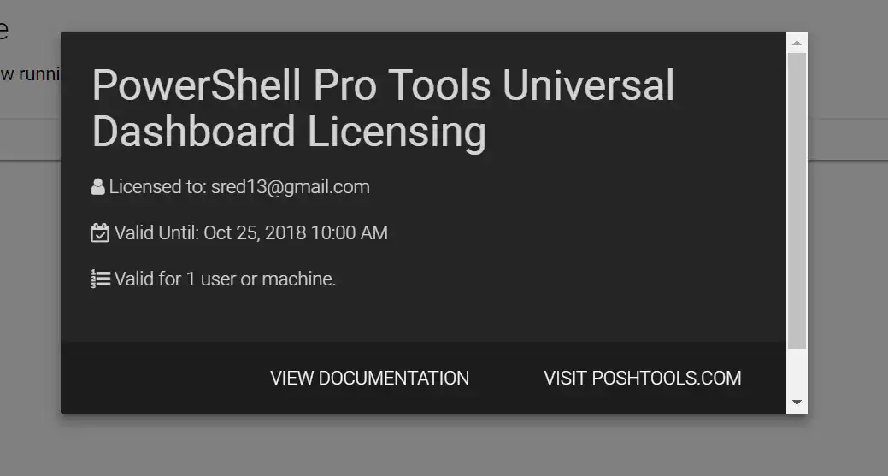

I've covered the topic of dashboards on this blog a few times before, from [layering CSS on PowerShell's built-in HTML capabilities](http://foxdeploy.com/2014/05/23/using-html-formatting-to-create-useful-webpage-reports-from-powershell/), to [hacking together HTML 5 templates with PowerShell](http://foxdeploy.com/2016/04/11/building-better-powershell-dashboards/), as the hunt continues for the next great thing in PowerShell reporting. Guys, the hunt is OVER!  Time to ascend to the next level in reporting...


It's the motherlode!  Adam Driscoll's AWESOME PowerShell Universal Dashboard, a gorgeous and dead-simple dashboard tool which makes it super easy to retrieve values from your environment and spin them into adaptive, animated dashboards full of sexy transitions and colors.   [Click here to see it in action.](http://www.poshud.com/Home) Or just look at these sexy animations and tasteful colors.  Deploy this and then show your boss.  It's guaranteed to impress, blow his pants off, and get you a huge raise or maybe a $5 Starbucks gift card.


In this post, we'll learn what the PowerShell Universal Dashboard is, how to quickly get setup, and I'll share my own TOTALLY PIMPED OUT CUSTOM Dashboard with you free, for you to modify to fit your environment, and get that free Pumpkin Spice, son!

### What is it?

The PowerShell Universal Dashboard is an absolutely gorgeous module created by the great [Adam Driscoll](https://twitter.com/adamdriscoll).  It seeks to make it dead-simple to create useful, interactive dashboards anywhere you can run PowerShell.  It's built using .net Core [Kestrel](https://github.com/aspnet/KestrelHttpServer) and [ChartJS](http://www.chartjs.org/), and you can run it locally for folks to connect to see your dashboard, or deploy right to IIS or even Azure!

If you didn't earlier, you really should [click here to see it in action!!!](http://www.poshud.com/Home)

### Getting Started

To begin, simply launch PowerShell and run the following command.

Install-Module UniversalDashboard

Next, copy the code for A[dam's sample Dashboard from here and run it](https://github.com/adamdriscoll/poshprotools/blob/master/examples/universal-dashboard/azure-dashboard.ps1).  You should see this screen appear


Now, PowerShell Pro Tools IS a paid piece of software.  But the trial license is super generous, so simply put in your e-mail and you'll receive a license automatically in a few minutes.

> Warning --Preachey part--And, between you and me, now that we're all adults, we should put our money where our mouth is and actually support the software we use and love.  In my mind, $20 is an absolute steal for this incredible application.

Once you receive your key, paste it in and you're ready to go



 

 A sign of a happily licensed PowerShell Pro Tools.

Let's start customizing this badboy! 

### Customizing the Dashboard

For my project, I wanted to replace the somewhat aging ("_somewhat"_) front-end I put on my backup Dropbox script, covered here in this post : Automatically move old photos out of DropBox with PowerShell to free up space .  At the time, I thought it was the slickest think since really oiley sliced bread.

 I still think you look beautiful

So, to kick things off, I copied and pasted the code [Adam shares on the PowerShell Universal Dashboard homepage](https://github.com/adamdriscoll/poshprotools/blob/master/examples/universal-dashboard/azure-dashboard.ps1), to recreate that dashboard.  Once it's pasted in, hit F5 and you should see the following, running locally on your machine:


First up, to delete the placeholder 'About Universal Dashboard', let's delete the `New-UDColumn` from lines 15~17.

```powershell
Start-UDDashboard -port $i -Content {
    New-UDDashboard -NavbarLinks $NavBarLinks -Title "PowerShell Pro Tools Universal Dashboard" -NavBarColor '#FF1c1c1c' -NavBarFontColor "#FF55b3ff" -BackgroundColor "#FF333333" -FontColor "#FFFFFFF" -Content {
        New-UDRow {
            New-UDColumn -Size 3 {
                New-UDHtml -Markup "
<div class='card' style='background: rgba(37, 37, 37, 1); color: rgba(255, 255, 255, 1)'>
<div class='card-content'>
<span class='card-title'>About Universal Dashboard</span>
 
Universal Dashboard is a cross-platform PowerShell module used to design beautiful dashboards from any available dataset. Visit GitHub to see some example dashboards.</div>
<div class='card-action'><a href='https://www.github.com/adamdriscoll/poshprotools'>GitHub</a></div>
</div>
"
}
                New-UDColumn -Size 3 {
                    New-UDMonitor -Title "Users per second" -Type Line -DataPointHistory 20 -RefreshInterval 15 -ChartBackgroundColor '#5955FF90' -ChartBorderColor '#FF55FF90' @Colors -Endpoint {
Get-Random -Minimum 0 -Maximum 100 | Out-UDMonitorData
}
```

With that removed, the cell vanishes.


I took a look at the [Components page](http://www.poshud.com/Components) on the PowerShell Universal Dashboard, and really liked the way the `Counter` design looked, so I decided to copy the example for `Total Bytes Downloaded` and use that in-place of the old introduction.  I added these lines:

```powershell
New-UDColumn -Size 4 {
    New-UDCounter -Title "Total Bytes Saved" -AutoRefresh -RefreshInterval 3 -Format "0.00b" -Icon cloud_download @Colors -Endpoint {
            get-content c:\temp\picSpace.txt
        }
    }
 
    New-UDColumn -Size 3 {
```

I also created a new text file at `C:\temp\picSpace.txt` and added the value `1234` to it.  With those changes completed, I hit F5.

 Ohh this is a VERY nice start

Now, to actually populate this value when my code runs.  Editing `Move-FilesOlderThan.ps1`(note: I'm very sorry about this name, I wrote [the script](http://foxdeploy.com/2015/02/02/dropbox-powershell-2/) when my daughter was not sleeping through the night yet...not clue why I choose that name), the function of that code is to accept a cut-off date, then search for files older than that date in a folder.  If it finds files that are too many days old, they get moved elsewhere. Here's the relevant snippet:

```powershell

$MoveFilesOlderThanAge = "-18"
####End user params
 
$cutoverDate = ((get-date).AddDays($MoveFilesOlderThanAge))
write-host "Moving files older than $cutoverDate, of which there are `n`t`t`t`t" -nonewline
$backupFiles = new-object System.Collections.ArrayList
 
$filesToMove = Get-ChildItem $cameraFolder | Where-Object LastWriteTime -le $cutoverDate
$itemCount = $filesToMove | Measure-Object | select -ExpandProperty Count
$FileSize = $filesToMove | Measure-Object -Sum Length


```

In order to sum the file space saved every day, I only had to add these lines.  I also decided to add a tracking log of how many files are moved over time.  I decided to simply use a text file to track this.

```powershell
$itemCount | set-content c:\\temp\\totalmoved.txt 
```

Now, after running the script a few times to move files, the card actually keeps track of how many files are moved!


### Further Customizations

Now, to go really crazy customizing it!

#### Hook up the File Counter

I decided to also add a counter for how many files have been moved.  This was super easy, and included in the code up above.  I simply modified the `Move-FilesOlderThan.ps1` script as depicted up above to pull the amount of files migrated from a file, and add today's number of files to it.  Easy peasey (though at first I did a string concatenation, and instead of seeing the number `14` after two days of moving 7 files, I saw `77`.  Whoops!)

To hook up the counter, I added this code right after the Byte Counter card.

```powershell 
New-UDColumn -Size 4 {
  New-UDCounter -Title "Total Files Moved" -Icon file @colors -Endpoint {
    get-content C:\temp\totalmoved.txt
  }
}
```


#### Modify the table to display my values

Next up, I want to reuse the table we start with in the corner.  I wanted to tweak it to show some of the info about the files which were just moved.  This actually wasn't too hard either.

Going back to `Move-FilesOlderThan.ps1` I added one line to output a `.csv` file of the files moved that day, excerpted below:

```powershell
$backupFiles |
    select BaseName,Extension,@{Name=‘FileSize‘;Expression={"$([math]::Round($_.Length / 1MB)) MB"}},Length,Directory |
        export-csv -NoTypeInformation "G:\Backups\FileList__$((Get-Date -UFormat "%Y-%m-%d"))_Log.csv"
```

This results in a super simple CSV file that looks like this

```
Day,Files,Jpg,MP4
0,15,13,2
1,77,70,7
2,23,20,3
3,13,10,3
4,8,7,1
```

Next, to hook it up to the dashboard itself.  Adam gave us a really nice example of how to add a table, so I just modified that to match my file types.

```powershell
 New-UDGrid -Title "$((import-csv C:\\temp\\movelog.csv)\[-1\].Files) Files Moved Today" @Colors -Headers @("BaseName", "Directory", "Extension", "FileSize") -Properties @("BaseName", "Directory", "Extension", "FileSize") -AutoRefresh -RefreshInterval 20 -Endpoint { dir g:\\backups\\file\*.csv | sort LastWriteTime -Descending | select -First 1 -ExpandProperty FullName | import-csv | Out-UDGridData }
```

And a quick F5 later...


 

#### Add a graph

The final thing to really make this pop, I want to add a beautiful line graph like these that Adam provides on the Components site.


This was daunting at first, but the flow isn't too bad in hindsight.

- Create an array of one or more Chart Datasets, using `New-UDChartDataSet`, the `-DataProperty` defines which property you want to chart, while the `-Label` property let's you define the name of propery in the Legend
- Pass your input data files as the `-Data`  property to the `New-UDChart` cmdlet. and define a `-Title` for the chart as well as the chart type, of either Area, Line, or Pie.

Here's the code sample of what my finished chart looked like:

```powershell
 New-UDChart -Title "Files moved by Day" -Type Line -AutoRefresh -RefreshInterval 7 @Colors -Endpoint {
 import-csv C:\temp\movelog.csv | Out-UDChartData -LabelProperty "Day" -DataProperty "Files" -Dataset @(
 New-UDChartDataset -DataProperty "Jpg" -Label "Photos" -BackgroundColor "rgb(134,342,122)"
 New-UDChartDataset -DataProperty "MP4" -Label "Movies" -BackgroundColor "rgb(234,33,43)"
)
}

```

And the result:


#### Satisfy my Ego and add branding

Now, the most important feature, branding this bad boy.

Up on line 14, change the `-Title` property to match what you'd like to name your dashboard.

```powershell 
New-UDDashboard -NavbarLinks $NavBarLinks -Title "FoxDeploy Space Management Dashboard - Photos"
```

You can also add an image file with a single card.  In my experience, this image needs to already live on the web somewhere.  You could spin up a quick [Node http-server](https://stackoverflow.com/questions/16333790/node-js-quick-file-server-static-files-over-http) to serve up the files, leverage another online host, or use a standalone server like [Abyss](https://aprelium.com/abyssws/).  I always have an install of both Abyss and Node on my machines, so I tossed the file up and linked it.

```powershell 
New-UDImage -Url http://localhost/Foxdeploy\_DEPLOY\_large.webp
```

Finally, to clean up all of the extra cards I didn't use, and fix some layout issues.

### Finished Product

See, wasn't that easy?


And it only took me ~100 tabs to finish it.

 Actual screenshot of my Chrome tab situation after an hour of tweaking

If you want to use my example and modify it, feel free to do so (and please share if you create something cool!)  Here are some ideas:

- Server Health Dashboard
- SCCM Dashboard
- SCOM Dashboard
- Active Directory monitoring dashboard

#### Source Files

The script that actually creates a dashboard and opens it, `Create-BlogDashboard.ps1`, followed by the updated Dropbox backup script, then a sample input file.

[Download here](https://gist.github.com/1RedOne/9c8048b35d2edd557a1d752ee6ff48b3)

#### Afterword

I realized my preaching about paying for software, and yet this whole thing was spawned from my desire to cheaply get away with using Dropbox but not wanting to pay for it.  Ok....I've cracked.  I've actually now paid for Dropbox as well!  Time for me to practice what I preach too!


