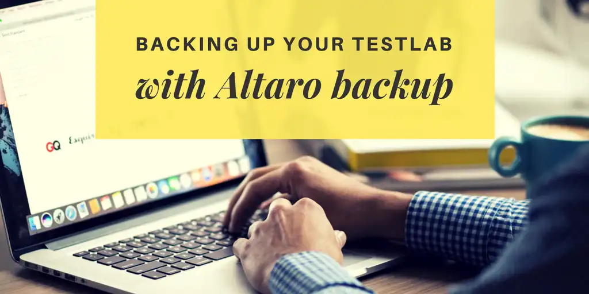

To be a good engineer, you need a Testlab. End of sentence.

You need it so you can peruse flights of fancy, like making some web services, trying out that new language and other endeavors perhaps not specifically related to your day to day work.

It HAS to be your own too!  You can't just use the one at your work.  If things go awry between you and your company, you definitely don't want to lose your livelihood AND your hard-earned testlab in the same stroke!  This is also why you don't want to have your life insurance purchased through your work too (or if you do, make sure you don't get fired and die in the same day).

In consulting, I would get assigned to a project and have a month or so to come up to speed on new technologies. I found that when I had a testlab, it was so much quicker to get working, just make a new VM, domain join it and have SQL installed and ready for a new SCCM, Scorch, Air-Watch, whatever. In fact, the periods when I did the best engineering work over my career closely line up to the times that I had a working testlab available to model my customer's environments and make mistakes on my own time, not theirs.

If you have read this and are convinced that you too need a testlab, _and don't yet have one_, you can click here to read my guide here on [setting up a Domain Controller with one-click!](https://foxdeploy.com/2015/12/02/dsc-the-simplest-domain-controller-config-ever/)

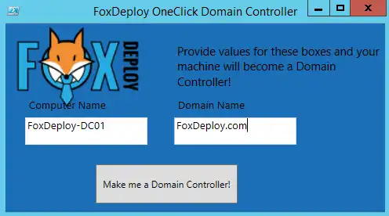 The one-click domain controller UI in action

And what should we do with things that are important? We protect them. In this post I'll walk you through some of the options available to protect and backup your testlab.

_Disclaimer :  This blog has been supported by Altaro for a while now, but I've never written about their product before. I received a free NFR license to use for the purposes of this post ([and MVPs can receive one as well!)](https://www.altaro.com/free-nfr-license.php)_

 _In this post, I feature their Hyper-V backup product, but you should know that I will never recommend or feature any product that I haven't used myself.   All words (and errors!) are my own._

#### Your DR plan should not involve the word 'Hope'

I built my first VM Lab years and years ago.  It was an Intel i7-2600k, with 16GB of RAM and LEDs out the whazoo.  I was so proud of this little guy that I gave him the name BEHEMOTH, which was all caps because of how cool the name was (and I'd also just read [House of Leaves](https://www.amazon.com/House-Leaves-Mark-Z-Danielewski/dp/0375703764/ref=sr_1_1?ie=UTF8&qid=1512243671&sr=8-1&keywords=house+of+leaves) which had some really interesting capitalization of words, not to mention bonkers type-setting.  The perfect /r/iAmVerySmart book for college kids)

I bought LED everything, because I needed to show that I was _serious about performance._   I then bought the cheapest monitors I could find, because Who needs eyeballs, am I right?

#### VM Lab Failure 1

My VM backup approach was pretty nascent as well.  Once a month or so (or every six months...or never) I would launch the Hyper-V console and run an export of VMs onto another folder on the same disk.  Surely this could have no negative ramifications, right?  This lead to my first total loss of an environment, when my $60 Hitachi Deskstar drive died, taking down my VMs AND my Backups.

#### VM Lab Failure 2

I decided to bone up on how real world people do it and quickly became prideful, even though I had no true skills or experience.  I was experimenting with Storage Spaces and thought they were the bee's knees, so I took two cheap OCZ Trion-III SSDs, and put them in a Storage Pool Parity set.   Then I wanted more space, so I re-partitioned 180GB of space from the same drive hosting my VMs and joined that to the Parity Set as well.  Two SSD, one chunk of spinning drive partitioned out of a larger drive.

So, for every write to the volume, Parity writes took place on each drive including the drastically slower spinning disk.  I got absolutely horrible performance (three minute boot times on a Win 8.1 image, 6 hour SCCM Site Install times) and eventually the strain of backups and prod use on the same volume and my moronic partitioning caused my second full loss of VMs and Backups.

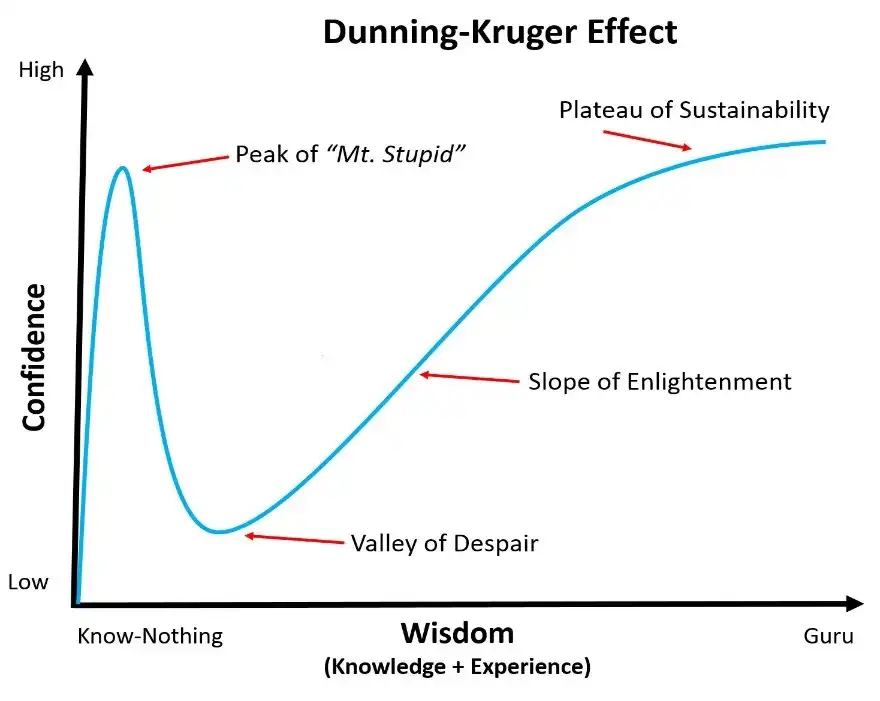 I was flying down mount stupid without any brakes when I came up with that partitioning scheme

Not only did I lose the data on the Storage Space, but the spinning drive would never spin up again, I think I killed its spirit.  One of the SSDs quickly failed later (third loss of VMs, but at least I had backups.)

#### Getting Slightly Serious Now

Redeploying Active Directory over and over was killing me, and it was at this point that I dug into DSC, so that at least my rebuild wouldn't take a full day (I could install AD and get DHCP, DNS and GPO configured as I wanted it in about two hours.  I had memorized the SCCM 2012 Install steps too, so it was a good learning experience).  This time of my life is when I wrote the One-click DSC Guide, linked above.

Here is where I decided to treat my testlab with some more respect.

#### Real World VM Backup

In the real world, most people use a backup product to backup their VMs.  I decided to catalog some of them:

- System Center Virtual Machine Manager
- Data Protection Manager
- Azure Site Recovery
- Veeam
- Altaro VM Backup

Since  I was a System Center guy, I decided to try Virtual Machine Manager and then Data Protection Manager.  Regret.  Both were WAYYY too hard and finnicky for my needs.

Next up was Azure Site Recovery, which provides a method for you to backup your VMs from local Hyper-V or VMware directly into Azure OR to another physical site somewhere.  I deployed Azure Site Recovery to backup my VMs to Azure (at least my most important ones) and it was quite easy to use, but not everyone has a free MSDN license laying around to use.  Still consider this one if that sounds enticing.

Veeam Backup Suite is also really popular, and they have [a number of free products too](https://www.veeam.com/free-virtualization-software-vmware-hyper-v.html)!   I gave their product a test run but never got very far (even though they had good support) and eventually on deploying a new computer, decided to broaden my horizons and try the other big name in the field.

#### New Test Lab + Altaro VM Backup = Perfection

I decided to take my test lab seriously too, no more half-gaming, half-VM lab.  I budgeted out the parts ([listed here](https://pcpartpicker.com/list/LWWNwV)), including two NVMe SSD drives to be deployed in RAID 0 and got to work building it!

\[gallery type="rectangular" ids="5378,5377,5376"\]

Installing Altaro VM Backup was very simple, but it does have some prerequisites, such as **only running on Windows Server**. If your testlab is also your gaming machine, consider moving it to Windows Server instead.  For years, my daily driver (and gaming PC) ran on Server 2012, and it's only become better with Server 2016.

To get started, [download Altaro VM Backup here](https://www.altaro.com/vm-backup/download.php).

#### Installation and Configuring a Host

Setup is an absolute breeze, next, next finish practically the whole way.

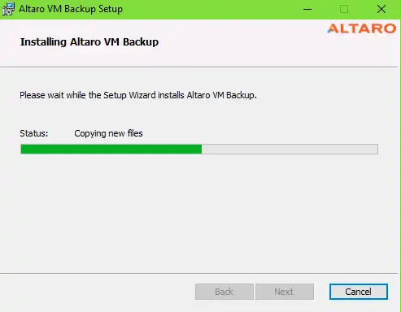

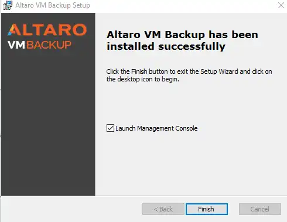

Altaro VM Backup should launch on its own and you simply need to choose to Connect to Local Instance.

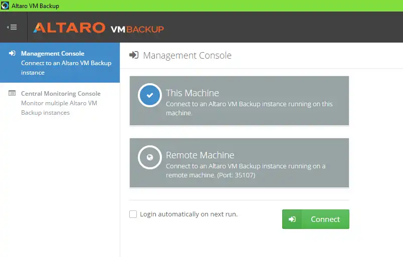

Next, choose to Add Hyper-V / VMware Host.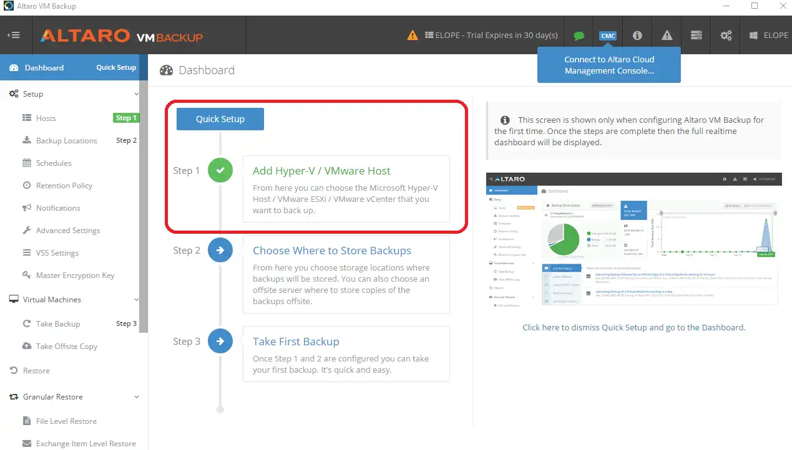

Click Add Host and then provide the name of the Hyper-V host (and credentials if you need to)

(../assets/images/2017/11/images/setupconsole01.webp) Serious props to anyone who knows what my Testlab is named after

#### Configuring Backup Location

Next, click on 'Backup Locations' to decide where to stick the VM Backups.

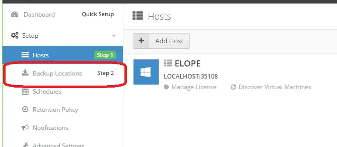

In my case, I have a big spinning disk on my VM Testlab, so I'm using that as my Physical Drive location.  You can also backup over the network too, or configure backup to use both a local disk and a network location for optimal redundancy.

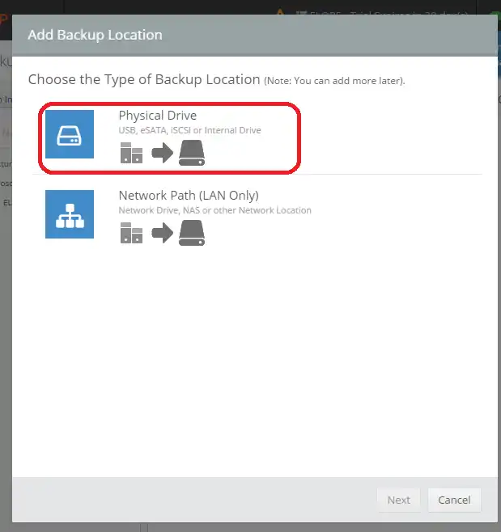

Now to pick the actual drive.

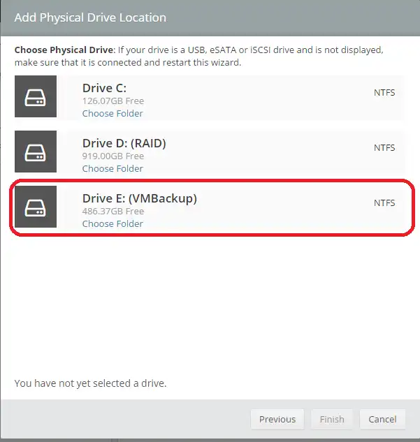 To pick a subfolder, click 'Choose Folder'

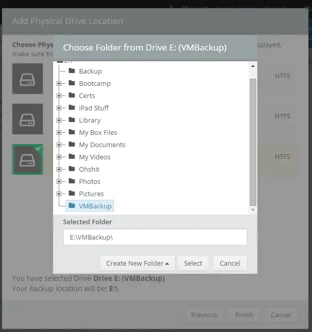 One of the folders here is from another failed VM lab recovery. Care to guess which?

With this completed, click Finish and now you've configured this host for backups.  Now, to actually apply the backup location setting to all of the VMs.  This is really easy.  Just click the host, then drag over to the location, as demonstrated below.

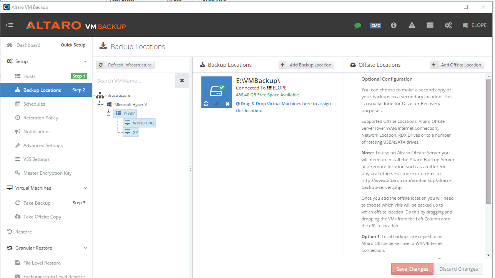

Unfortunately, I haven't yet found a method to apply this setting to all VMs on a host using the GUI, so expect to come back here at least once for each new VM.

#### Take your first backup and setting up a backup schedule

Taking a backup is a total breeze.  Click down to Virtual Machines and select a single VM (or all of them!) and then click 'Take Backup'.  If you neglected to set a backup location, the program will remind you here.

You can also just watch the GIF to see it in action.

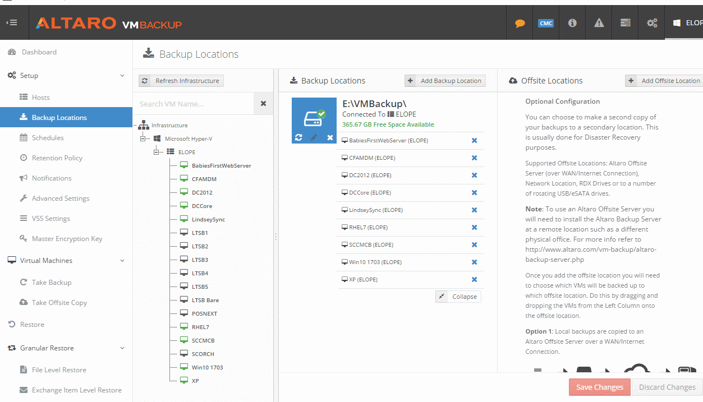

At this point, you're safe!  Of course, you only have this one backup, so it's time to set up a schedule to backup your VMs regularly.

#### Setting a Schedule

I have the memory of a mantis shrimp, I don't want to remember to back things up.  Fortunately it only takes like two minutes to make a backup schedule.  First, click **Schedule,** then **Add Backup Schedule**.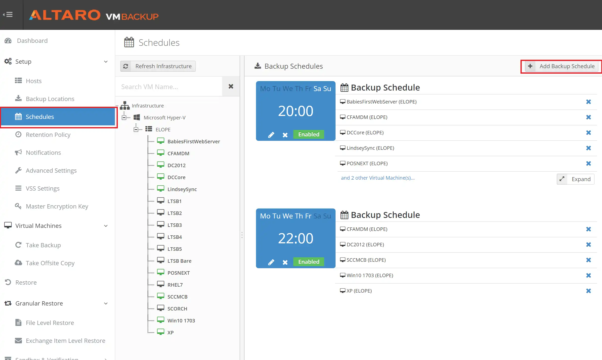

Why can't Recurring Calendars in Outlook be this easy!  Or Scheduled Tasks! Seriously, its so much easier to define a schedule here that I think this should be the new normal.

I want to back these VMs up every Monday, Wednesday, Friday and Sunday, and I want it to happen at midnight.

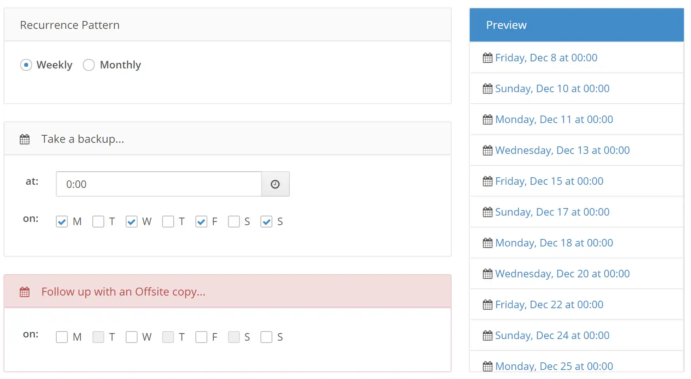 Click Save to Save...caption of the year

Now, for one last GIF.  Just drag the VMs (or the whole Host, or all of your Hosts, if you have more than one)) onto the schedule and you're done.

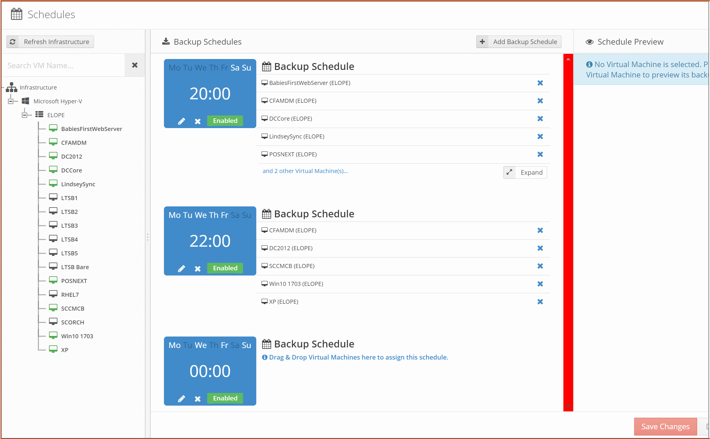

#### Wrapping Up

That's it!  You're done.  Seriously  I did this one time like three months ago and it's been fire and forget ever since then.  It is super nice to get reminder e-mails like this one too.

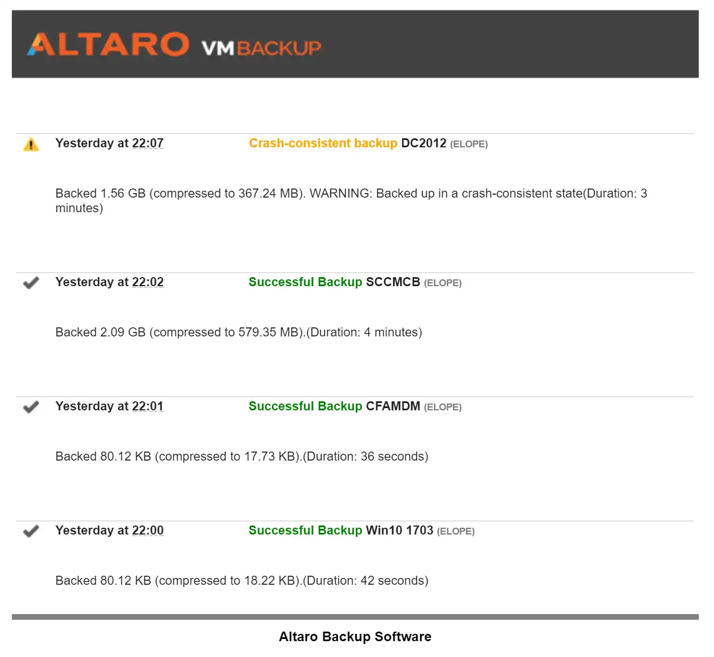

Having difficulties getting up and running?  Let me know!  I can help you out, or introduce you to some folks who can.
