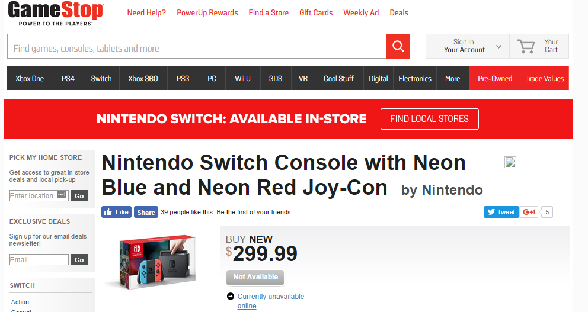
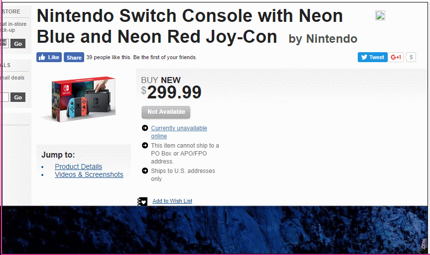
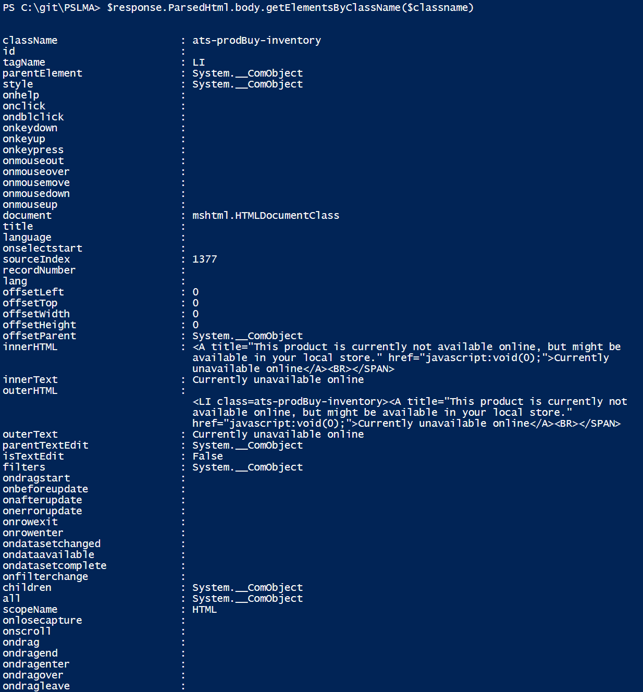

 

This kind of request comes up **all the time** on StackOverflow and /r/PowerShell.

> "How can I extract content from a webpage using PowerShell".

And it's an interesting problem to solve.  However, nothing motivates like greed, and I recently revisited this topic in order to help me track down the newest must-have item, the Switch.

In fact, this post COULD have been called 'Finding a Nintendo Switch with PowerShell'!

I have been REALLY wanting a Nintendo Switch, and since I'll be flying up to NYC next month for Tome's [NYC TechStravaganza](http://www.techstravaganza.com) (come see me if you'll be in Manhattan that day!), it's the perfect justification for She-Who-Holds-The-Wallet for me to get one!

But EVERYWHERE is sold out.  Still!  :(

However, the stores have been receiving inventory every now and then, and I know that when GameStop has it in stock, I want to buy it from them!  With that in mind, I knew I just needed a way to monitor the page and alert me when some text on it changes.

Web scraping, here we go!

> **Caveat**: Scraping a site isn't illegal, but it might void the terms of some sites out there.  Furthermore, if you scrape too often, you might be blocked from the site temporarily or forever.  Don't get greedy in scraping, or try to use it commercially.
> 
> If a site provides an API, go that route instead, as API are sanctioned and provided by the company to use, and require 1% of the resources of loading a full page.
> 
> Finally, some Content Management Systems will never update an existing page, but create a new one with a new URL and update all links accordingly.  If you're not careful, you could end up querying a page that will _never change._ 

[GameStop Nintendo Switch with Neon Joycons](http://www.gamestop.com/nintendo-switch/consoles/nintendo-switch-console-with-neon-blue-and-neon-red-joy-con/141887)

First thing's first, let's load this page in PowerShell and store it in a variable, we'll be using `Invoke-WebRequest` to handle this task.

\[code lang="powershell"\]$url ='http://www.gamestop.com/nintendo-switch/consoles/nintendo-switch-console-with-neon-blue-and-neon-red-joy-con/141887' $response = Invoke-WebRequest -Uri $url\[/code\]

Next, I want to find a particular element on the page, which I'll parse to see if it looks like they have some in stock. For that, I need to locate the **ID** or **ClassName** of the particular element, which we'll do using Chrome Developer Tools.

On the page, right-click '**Inspect Element**' on an element of your choosing.  In my case, I will right-click on the 'Unavailable' text area.

This will launch the Chrome Developer Console, and should have the element selected for you in the console, so you can just copy the class name.  You can see me moving the mouse around, I do this to see which element is the most likely one to contain the value.

 

You want the class name, in this case `ats-prodBuy-inventory`.  We can use PowerShell's wonderful HTML parsing to do some heavy lifting here, by leveraging the `HTMLWebResponseObject`'s useful `ParsedHTML.getElementsByClassName` method.

So, to select only the element in the body with the class name of `ats-prodBuy-inventory`, I'll run:

\[code lang="powershell" light="true"\]$rep.ParsedHtml.body.getElementsByClassName('ats-prodBuy-inventory')\[/code\]

This will list ALL the properties of this element, including lots of HTML info and properties that we don't need.

To truncate things a bit, I'll select only properties which have text or content somewhere in the property name.

\[code lang="powershell" light="true"\]$rep.ParsedHtml.body.getElementsByClassName($classname) | select \*text\*,\*content\*\[/code\]

The output:

innerText         : Currently unavailable online
outerText         : Currently unavailable online
parentTextEdit    : System.\_\_ComObject
isTextEdit        : False
oncontextmenu     : 
contentEditable   : inherit
isContentEditable : False

Much easier to read.  So, now I know that the `innerText` or `outerText` properties will let me know if the product is in stock or not.  To validate, I took a look at another product which was in stock, and saw that it was the same properties.

All that remained was to take this few-liner and and convert it into a script which will loop once every 30 mins, with the exit condition of when the message text on the site changes.  When it does, I'm using a tool I wrote a few years ago [Send-PushMessage](http://foxdeploy.com/2014/11/03/pushbullet-powershell-powerbullet/), to send a PushBullet message to my phone to give me a head's up!

\[code lang="powershell"\]

$url ='http://www.gamestop.com/nintendo-switch/consoles/nintendo-switch-console-with-neon-blue-and-neon-red-joy-con/141887'

While ($($InStock -eq $notInStock)){ $response = Invoke-WebRequest -Uri $url $classname ='ats-prodBuy-inventory' $notInStock = 'Currently unavailable online'

$InStock = $response.ParsedHtml.body.getElementsByClassName($classname) | select -expand innertext "$(get-date) is device in stock? $($InStock -ne $notInStock)\`n-----$InStock" Start-Sleep -Seconds (60\*30) } Send-PushMessage -Type Message -title "NintendoSwitch" -msg "In stock, order now!!!!"

\[/code\]

This is what I've been seeing...but eventually I'll get a Push Message when the site text changes, and then, I'll have my Switch!

## Willing to help!

Are you struggling to extract certain text from a site?  Don't worry, I'm here to help!  Leave me a comment below and I'll do my best to help you.  But before you ask, checkout this post on Reddit to see how I helped someone else with a similar problem.

[reddit/r/powerhsell: Downloading News Articles from the Web](https://www.reddit.com/r/PowerShell/comments/624zzg/downloading_news_articles_from_the_web/)
