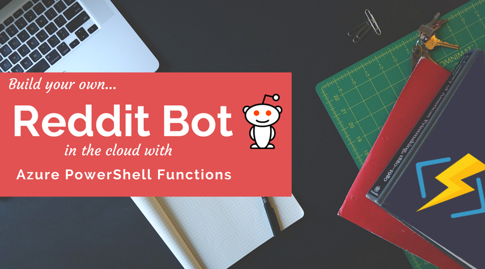

Around the time I was celebrating my 100th post, I made a big to-do about opening my own subreddit at [/r/FoxDeploy.](http://www.reddit.com/r/foxdeploy) I had great intentions, I would help people in an easier to read format than here in the comments...but then, I just kind of, you know, forgot to check the sub for four months.

But no longer!  I decided to solve this problem with the only tool I know...code.
 <!--more-->
#### Azure Functions

A few months ago, I went to 'The Red Shirt' tour with Scott Guthrie in which he talked all about  the new Azure Hotness.  He covered Functions, an awesome headless, serverless Platform as a Service offering which can run a variety of languages including C#, F#, Node.js, Java, and of, course, Best Language, PowerShell.

I was so intrigued by this concept when I first learned of it at an AWS event years ago in Chicago, where they introduced Lambda. Lambda was cool, but it couldn't run bestgirl language, PowerShell.

With this in mind, I decided to think of how to attack this problem.

#### Monitoring a sub for new posts

I did some googling and found that you can get a list of the newest posts in a sub by just adding a `keyword.json` to the subreddit, like so: `https://www.reddit.com/r/FoxDeploy/new.json`, get's me a JSON response back with the newest posts.  You can also use `top.json`, `controversial.json`, etc.

`$posts = Invoke-RestMethod https://www.reddit.com/r/FoxDeploy/new.json`, next I needed a way to track if I'd already processed the post or not.  That means a database of some kind.

#### The best DB is a CSV

At first, I planned to use Azure's new Cosmos DB for this task, but I quickly got bogged down trying to learn my way through creating Graphs, SQL Tables, etc.  All of these sounded cool but pushed me farther away from my goal.  So I decided to roll the worlds simplest Database format, and just track this in a CSV.

Making my schema was simple, just open Notepad and type:

`PostName,Date`

Done, Schema created in five seconds.  Now to write some logic to step through a post and see if it is in my 'database' .

```powershell
#load DB file $Processed = Import-CSV .\processed.txt

#process posts $posts = Invoke-RestMethod https://www.reddit.com/r/FoxDeploy/new.json

ForEach ($post in $posts.data.children){ if ($Processed.PostName -notcontains $post.data.title){ #We need to send a message Write-output "We haven't seen $($post.data.title) before...breaking loop" break }

} 
```

I decided that I didn't want to get bombarded with alerts so I added the `break` command to pop out of the loop when it first encountered a post which was not in the 'database'.   Next, to simply dig back into the Reddit REST API and just send a Message. How hard can that be?

#### Fun with the Reddit API


I dabbled with the Reddit API a few years back, in one of my first PowerShell modules.  It was so hard, poorly documented and so difficult that it turned me off of APIs for months.  I'd always suffered from imposter syndrome, and I felt that **That Day** ( that dark day in which I finally wasn't smart enough to figure it out) had finally come for me.

Honestly, compared to other REST APIs, and especially the fully featured and well documented ones like Zenoss and ServiceNows, Reddit's is terrible to learn.  Don't give up!


In order for this script to work, it needs to access my credentials.  To do that, I have to delegate credentials using oAuth.  I first [covered the topic in this blog post here](http://foxdeploy.com/2015/11/02/using-powershell-and-oauth/) so read here if you have o clue what oAuth is.  If you don't, no worries, you'll be able to gather an idea from our next few steps:

- Create an oAuth Application In Reddit
- Grab my RedirectURI, ClientID, and ClientSecret
- Plug these in to retrieve an AccessToken and RefreshToken
- Send a message
- Handle Refreshing an API token when the token Expires

#### Making an oAuth application

Getting access to Reddit's API is easy.  Log on to your account, then click **Preferences \\ Apps.**

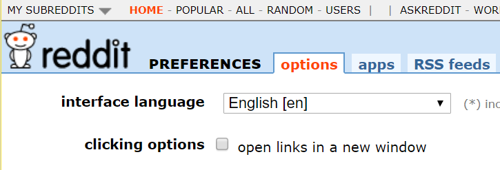 Click 'Apps'

Scroll down to **Create Application** and fill this form in.

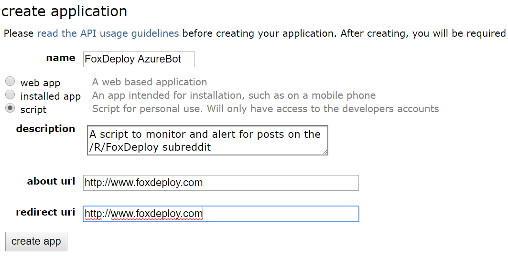 Click "Create App' to finish

The Redirect URI doesn't need to go anywhere specifically (it's used because the assumption is that oAuth will be used when a user grants their DropBox access to their Office account, for instance.  After they click 'OK' to delegate access, they need to be redirected somewhere.) but you must provide one here and you **must use the same value** when you request a token in the next step.

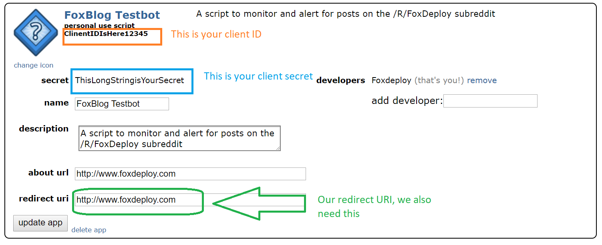

Now, make note of and save each of these in PowerShell.  You'll need these to get your token, then we'll embed them in our script as well.

```powershell
$ClientID = 'ClientIDIsHere12345' $ClientSecret = 'ThisLongStringIsYourSecret' $redirectURI = 'http://www.foxdeploy.com'


#### Getting an oAuth Token
```

Now that we've completed this step, download the [PSReddit module](https://github.com/1RedOne/PSReddit) and run `Connect-RedditAccount` to exchange these IDs for an AccessToken and a RefreshToken.  Let's call the cmdlet and see what happens.

```powershell
Connect-RedditAccount -ClientID $ClientID -ClientSecret $ClientSecret \` -redirectURI $redirectURI
```

and then passes that along to `Show-oAuthWindow`([here's the code](https://github.com/1RedOne/PSReddit/blob/master/Private/Show-oAuthWindow.ps1)), which pops up a browser window like so.

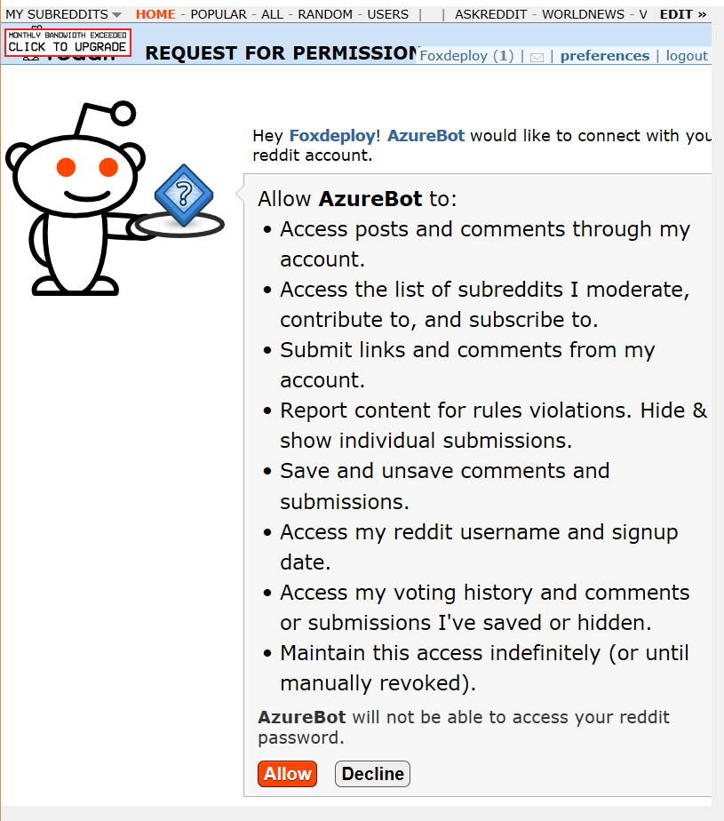

Running the command stands up a number `$global:` variables we can use to interact with the reddit API, including the all important `AccessCode` which we **must provide for any API request**.  Here's [the full list of REST endpoints](https://www.reddit.com/dev/api/), but we're after the `/compose` endpoint.

#### Using our token to send a reddit private message

This part would not have been possible without the awesome help of the awesome [@Mark Kraus](https://twitter.com/markekraus), who helped me figure out the syntax.

We hit the endpoint of `oauth.reddit.com/api/compose`, which has a few restrictions.  First off, you have to provide headers to prove who you are.  Also, reddit insists that you identify yourself with your reddit user name with every API call as well, so you have to provide that info too.  Here's how I handled that.

```powershell
$headers = New-Object "System.Collections.Generic.Dictionary\[\[String\],\[String\]\]" 
$headers.Add("User-Agent", 'AzureFunction-SubredditBot:0.0.2 (by /u/1RedOne)') 
$headers.Add("Authorization", "bearer $AccessToken")
```

Next, here's the body params you MUST pass along.

```powershell
$body = @{ api\_type = 'json' to = '1RedOne' subject = 'Message sent via PowerShell' text= 'Hello World' }
```

Finally, pass all of this along using `Invoke-RestMethod` and you'll see...

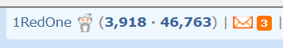 Ohhh yeah, dat envelope.

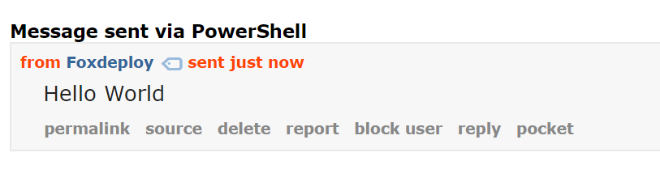

I went ahead and prettied it all up and packaged it as a cmdlet.  Simply provide your values like so:

``Send-RedditMessage -AccessToken $token.access_token -Recipient 1RedOne ` ``    `-subject 'New Post Alert!' -post $post`

This function is highly customized to my needs, thus the kind of weird `-post` param.  You'll want to customize this for your own purposes, but the example usage describes how to pass in a JSON representation of a Reddit API Post object for a full featured body message.

Here's the download for the completed function.  [Send-RedditMessage.ps1.](https://github.com/1RedOne/PSReddit/blob/master/Public/Send-RedditMessage.ps1)  One last wrinkle stands in the way though.

**Don't get too cocky! Reddit API tokens expire in an hour.**

Yep.  Other APIs are reasonable, and expire only after an extended period of inactivity.  Or they last for three months, or forever.  Nope, not reddit's; their tokens expire in one hour.

Fortunately though, refreshing a token is pretty easy.  When we made our initial request for a token earlier using the `Connect-RedditAccount` cmdlet, the cmdlet specified a URL parameter `duration=permanent` which instructed the reddit API to provide us a refresh token.

The cmdlet also helpfully stored this token for you, and can refresh your token as well.

#### How to refresh tokens

Refreshing your token isn't actually that bad.  If you're interested in doing this manually, simply send a REST Post to this URL https://www.reddit.com/api/v1/access\_token with the following as the payload.  You'll need the same values for `scope`, `client_id`, and `redirect_uri`, and should provide the refresh token you received with the first auth token as well.

```javascript
$body= @ {
	client_id = 'YourApiKey'
	grant_type = 'refresh_token'
	refresh_token = 'YourRefreshTokenHere'
	redirect_uri = 'YourRedirectURL duration=  '
	permanent ' scope=  '
	Needs to be the same scope from before '}

```

Finally, need to provide a Basic authentication header.

> What's Basic Auth?

Basic Authentication is a relatively insecure and yet very common method of authenticating a request.  In Basic Auth, you provide credentials in this format `username;password`, and the string is then encoded in base64.  Curious what that looks like?  [Click here to see](https://www.wikiwand.com/en/Base64#/Examples).

It is barely a step up from sending a plaintext string, and in fact, can actually signal that something worth obfuscating is being transmitted.  Still, it's what Reddit wants so...

The easiest way to do this in PowerShell is to instantiate a Credential object and pass that along.  Username should be your clientID, while the ClientSecret should be your password.

```powershell
$tempPW = ConvertTo-SecureString 'YourClientSecret' -AsPlainText -Force $credential = New-Object System.Management.Automation.PSCredential ('YourclientID', $tempPW)
```

Provide all of this in a post like this:

```powershell
Invoke-RestMethod https://www.reddit.com/api/v1/access\_token \` -Body $body -Method Post  -Credential $credential 

```

and you'll receive another authcode you can use for the next hour.

Of course, all of this is done for you with the `PSReddit` module.  On import, it will look in the module path for a pair of `.ps1xml` files, which contain some information about your reddit account, including your oAuth token and Refresh Token, which will be loaded if found as `$PSReddit_accessToken` and `$PSReddit_RefreshToken`.  If you haven't linked an account yet, you're instead prompted on how to do so.

#### Making this work in Azure

With all of the work done locally, all that remained was to find a way to reproduce this in Azure.

I began by logging on to my Azure Portal and then clicking the `+` button to add a new resource.

 Search for 'Function App' (I swear they were called Azure Functions like a week ago...)

Then fill in the mandatory questions.  Be sure to choose a region which makes sense.

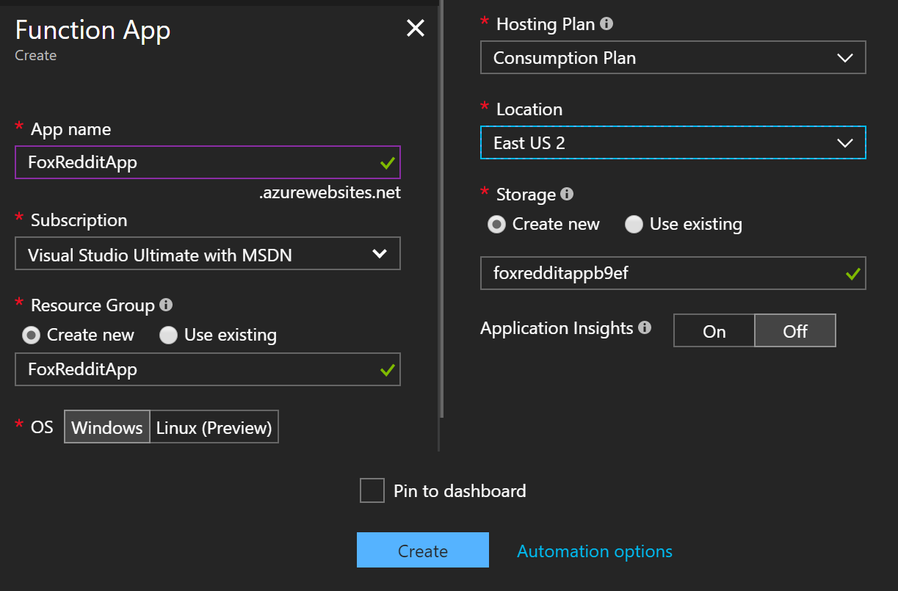 The actual UI is a long vertical panel. I awkwardly cut and paste it into this equally awkward square. It looks bad, but at least it took way too long.

Once you've filled these in, all that remains is to wait a few minutes for the resource to be created.  Click 'Go to resource' when you see the prompt.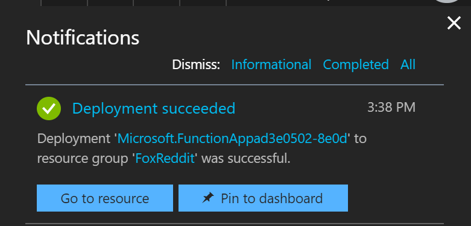

Next, we'll want to click down to 'Functions' and then hit the Plus sign to trigger the wizard.

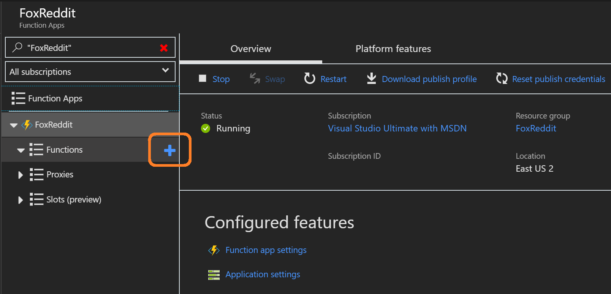

If we wanted to use JavaScript or C# we could choose from a variety of pre-made tools, but instead we'll choose 'Create your own custom function'

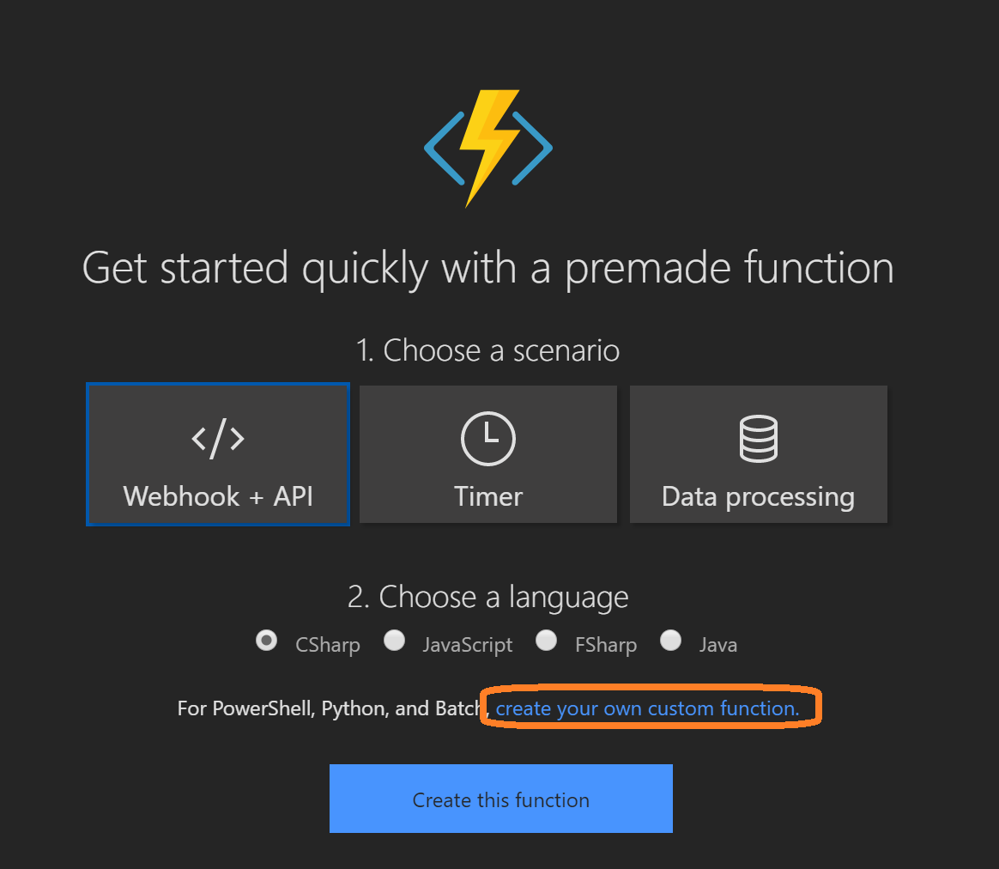

Next we're prompted to choose how we want this thing to run.  Do we want the code to run when a URL is hit (commonly referred to as a 'webhook)', or when a file is uploaded?  Do we want it to run if the face recognition Cortana API finds a new photo of us on Imgur?  The options are endless.  We're going plain vanilla today though, so choose Timer.

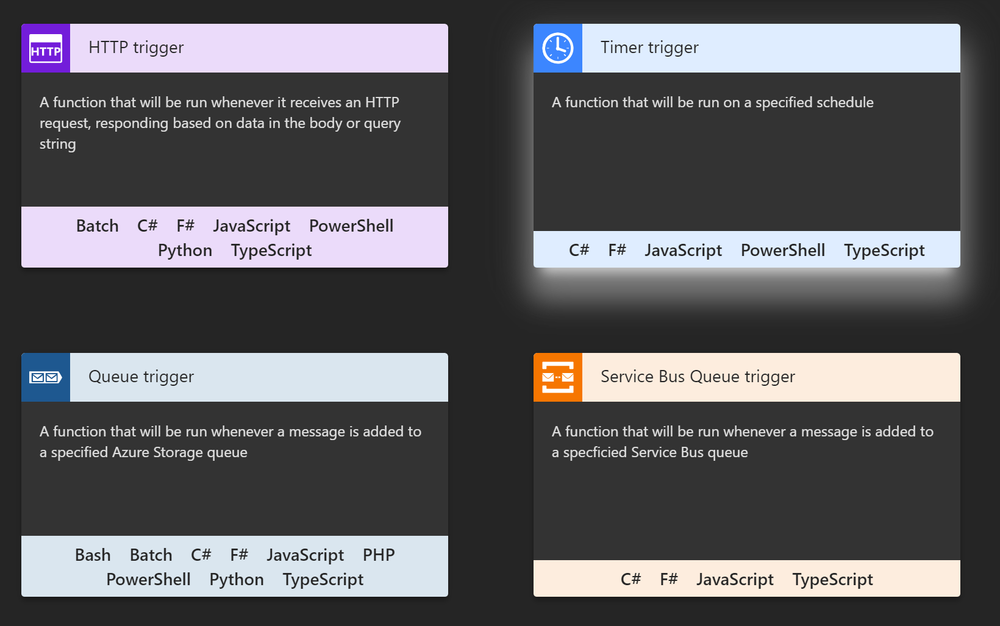

The last pages of the wizard, we're here!  Azure uses the cron standard for formatting dates, which is a nightmare if you've only been around Windows and the **vastly superior** Task Scheduler.  (Except the part where it only generates configurations with XML, ew).  Fortunately you can easily [create your own Cron expression using this site](https://www.freeformatter.com/cron-expression-generator-quartz.html).

I wanted mine to run once an hour from 09:00 to 13:00, and only on Monday through Friday.  I'm in UTC -6, so the expression worked out to:  `0 0 15-20 * * 1-5`.  That translates roughly to `0 minutes, 0 seconds, hours 15 through 20, any month, any year, days 1 - 5`

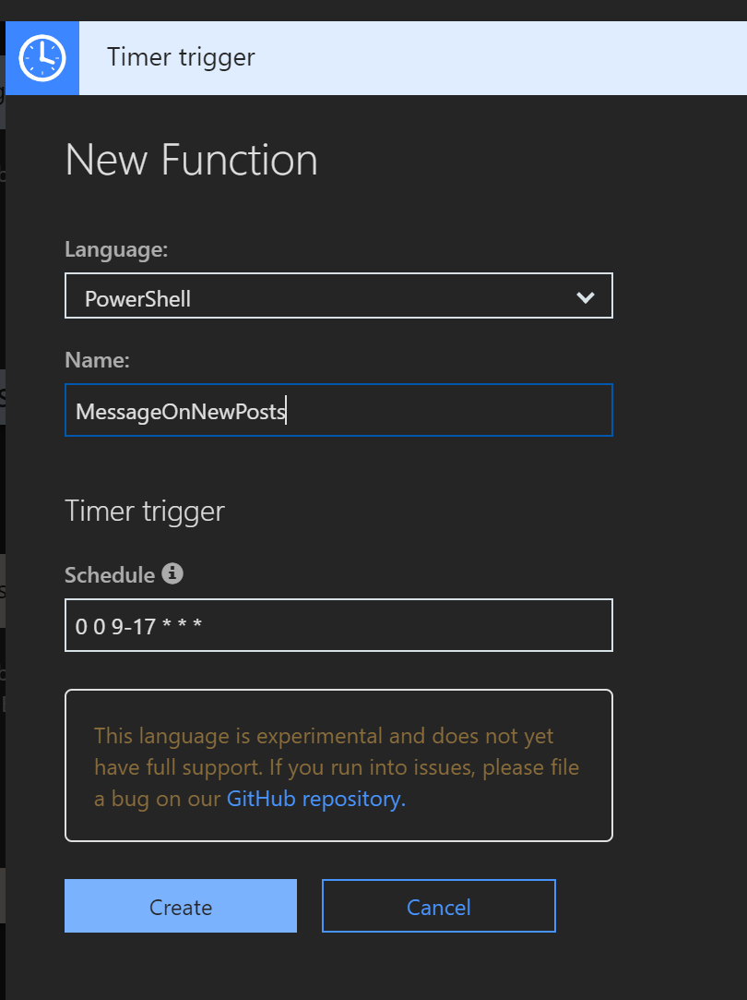

Clicking Create will show you...

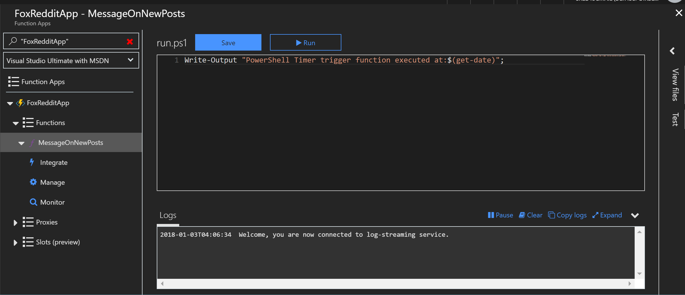

#### Writing PowerShell in (mostly) real-time in Azure

That UI excites me in my deepest nerdy places, down deep where I fantasize about having telekinesis or being able to do cool parkour moves.  I <3 that they provide a PowerShell example for us to start hacking away!

The curious mind SHOULD be tempted to click Run and see what happens. So...

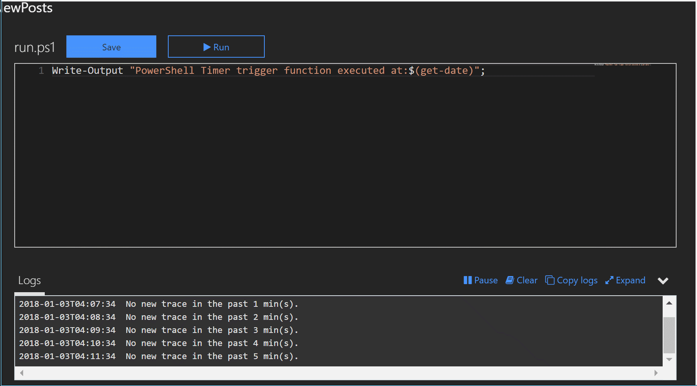

Right from the start, I knew I couldn't use the same method of displaying an oAuth window to authorize the delegated token in Azure, as Azure Functions, much like Orchestrator, SMA and PowerShell workflows do not support interactivity, and thus commands like `Write-Host` (which writes to the console) and `-Debug` are not permitted.  There's simply no console to support that interaction.

Once the UI is displayed to a user a single time, you can forever refresh your token by posting the refresh token and credential back to the right endpoint, as mentioned above.  So, I decided to simply create a JSON file, in which I would store the relevant bits for the Refresh request, here's what my file looked like.

```javascript
Settings.json 
{
	"scope": ["privatemessages", "save", "submit"],
	"secret": "xAqXHdh-mySecret_PleaseDontSteal_rV3MY",
	"client_id": "123Ham4uandMe",
	"duration": "permanent",
	"refresh_token": "1092716171-RefreshMe123Please4meySifmKQ",
	"redirect_uri": "http://www.foxdeploy.com"
}
```

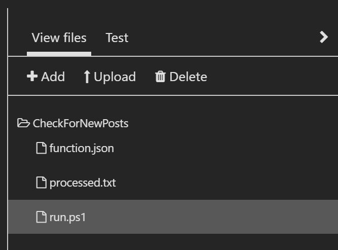 Just click upload on the right side

Uploading files is easy, just click the upload icon on the far right side then give it a moment.  It may take up to a minute for your file to appear, so don't hit Upload over and over, or you'll end up with multiple copies of it.  I uploaded the `Refresh-Token.ps1` and `Send-RedditMail.ps1` functions as well.

Next, to modify my full script to work with settings stored in a `.JSON` file, and update the code to reflect its new headless life.



You'll notice that I had to change the directory at the head of the script.  All the source files for an Azure function will be copied onto a VM and placed under `D:\home\site\wwwroot\<functionName>\`, so in order to find my content, I needed to `Set-Location` over to there.  In a future release of Azure Functions, we will likely see them default to the appropriate directory immediately.

With all of this completed, I hit Save and then...waited.

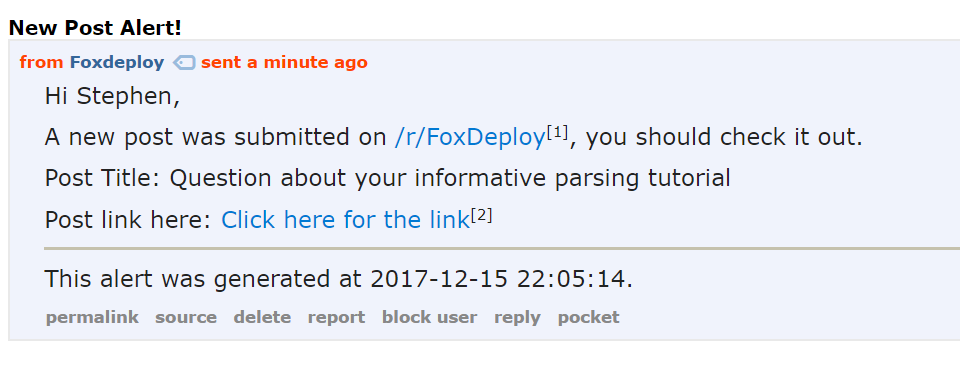 

The first version of this function never checked to see if an alert had been sent before, so every four hours I received a private message for every post on my subreddit!

With this in place, I received notices every few hours until I was caught up, and had personally responded to every post on the sub!  And I now get a PM within hours of a new post, so posts will never go unanswered again!  It was a huge success and is still running today, smoothly.

#### In conclusion...how much does it cost?

I was curious to see how expensive this would be, so after a month (and about ~100 PMs sent), here's my stats.  Mind you that as of this moment, Microsoft allows for a super generous free plan, which "...includes a monthly free grant of 1 million requests and 400,000 GB-s of resource consumption per month."  More pricing details [here](https://azure.microsoft.com/en-us/pricing/details/functions/).

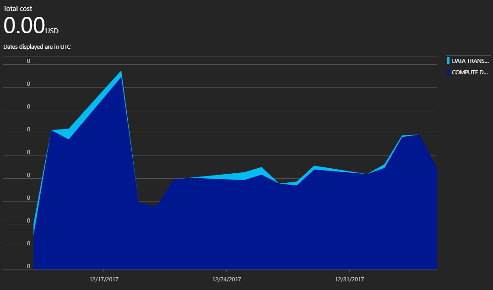

To date, it has still yet to cost me a penny.  I think function apps are a wonderful addition to Azure, and will definitely be deploying them over VMs in the future!

I could not have written this blog post within the help of Mark Kraus, so you should definitely follow him on [Twitter](https://twitter.com/markekraus) and check out his [blog](https://get-powershellblog.blogspot.com/).

I also learned a lot about Azure Functions from [Stefan Stranger's](https://twitter.com/sstranger?lang=en) post on the topic, [here](https://blogs.technet.microsoft.com/stefan_stranger/2017/01/29/powershell-azure-functions-lessons-learned/).

And last, but not least, I learned a load from [David O'Brien](https://twitter.com/david_obrien) as well.  Not just on Functions, but on a number of other topics too over the years from his wonderful [blog](https://david-obrien.net/2016/07/azure-functions-PowerShell/).  He's a super star!
