If you've been following my blog for a while, you know that I LOVE making PowerShell cmdlets, especially ones that consume an API or scrape a web site.

However when it comes to tools that peruse the web, this can get a bit tricky, especially if a site doesn't publish an API because then you're stuck parsing HTML or loading and manipulating an invisible `Internet Explorer -COMObject` __barfs in Japanese_._  And even this terrible approach is closed to us if the site uses AJAX or dynamically loads content.

In that case, you're restricted to making changes on a site while watching Fiddler 4 and trying to find interesting looking method calls (this is how I wrote my PowerShell module for Zenoss, by the way.  Guess and checking my way through with their ancient and outdated Python API docs my sole and dubious reference material, and with a Fiddler window MITM-ing my own requests in the search to figure out how things actually worked.  It...uh...took a bit longer than I expected...)

This doesn't have to be the case anymore!  With the new release of Chrome 65 comes a PowerShell power tool so powerful that it's like moving from a regular apple peeler to this badboy.


### What's this new hotness?

For a long time now if you load the Chrome Developer Tools by hitting `F12`, you've been able to go to the Network tab and copy a HTTP request as a `curl` statement.

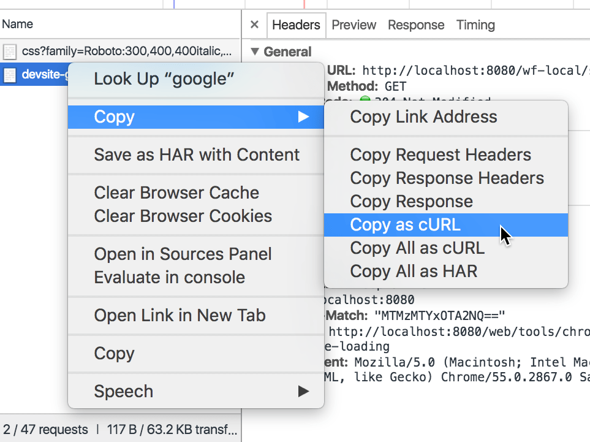 Image Credit : google developers blog

This is super useful if you use a Linux or Mac machine, but cURL statements don't help us very much in the PowerShell Scripting world.  But as was recently brought to my attention on Twitter, Chrome now amazingly features the option to copy to a PowerShell statement instead!

https://twitter.com/0daySimpson/status/979705974901657600

I had to check for myself and...yep, there it was!  Let's try and slap something together real quick, shall we?

#### How do we use it

To use this cool new feature, we browse to a page or resource, interact with it (like filling out a form, submitting a time card entry, or querying for a result) and then RIGHT when we're about to do something interesting, we hit `F12`, go to the network tab then click 'Submit' and look for a `POST` , `PUT` or `UPDATE` method.

More often than not, the response to this web request will contain all or part of the interesting stuff we want to see.

I check the pollen count online a lot.  I live in the South-Eastern United States, home to some of the worst pollen levels recorded on the planet.  We get _super high_ pollen counts here.

Once, I was out jogging in the pine forest of Kennesaw Mountain, back before I had children, when I had the time to exercise, or perform leisure activities, and a gust of wind hit the trees and a _visible cloud of yellow pollen flew out_.  I breathed it in deeply...and I think that was the moment I developed allergies.

Anyway, I often check the pollen counts to see how hosed I'll be and if I need to take some medicine, and I really like Weather.com's pollen tracker.

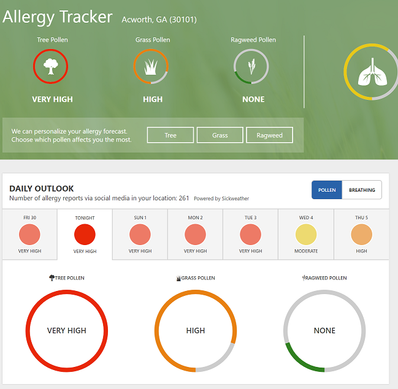

So I thought to see if I could test out this neat new feature.  I started to type in my zip code in the lookup form and then, decided to record the process.

**Full screen recommended!** I've got a 4k monitor and recorded in native resolution, you'll probably need a magnifying glass if you don't full screen this.



So, to break that down:

- Prepare to do something interesting - you need to know exactly what you're going to click or type, and have an idea of what data you're looking for.  It pays to practice.
- Open Developer Tools and go to the Network tab and click `Record`
- Look through the next few requests - if you see some to a different domain (or an end-point like `/api/v1` or `api.somedomain.com` then you may be on the right track.

In my case, I ran through the steps of putting in my zip code, and then hitting enter to make the pollen count display.  I noticed on my dry run with the network tab open that a lot of the interesting looking stuff (**and importantly, none of the .js or images)** came from a subdomain with API in the name.  You can apply a filter at any point while recording or after using the filter box, so I added one.

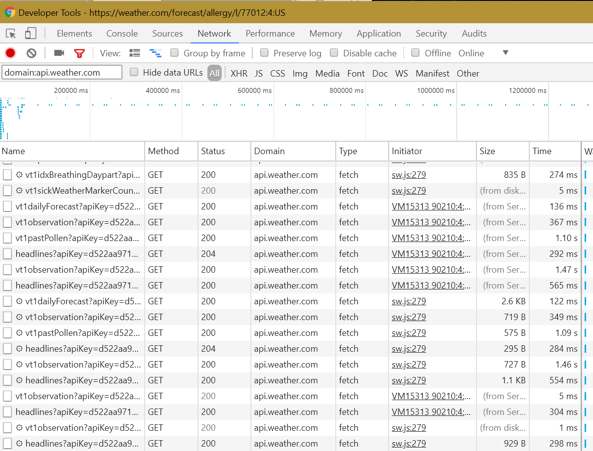 Filtering out the cruft is a MUST. Use the filter box in the upper left to restrict which domains show up here.

Now, to click through these in Chrome and see the response data.  Chrome does a good job of formatting it for you.

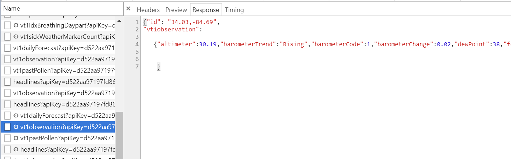

Finally I found the right one which would give me today's pollen count (actually I'm being dramatic, I was amazingly able to find the right one in about a minute, from the start of this project!)

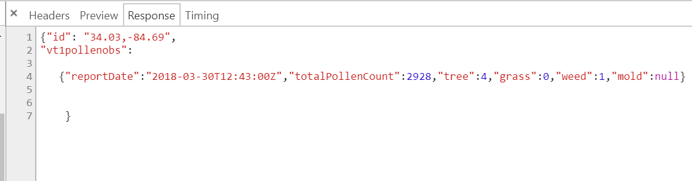 All the values I need to know that it is the pine trees here which are making my nose run like a faucet.

All that remained was to see if this new stuff actually worked...

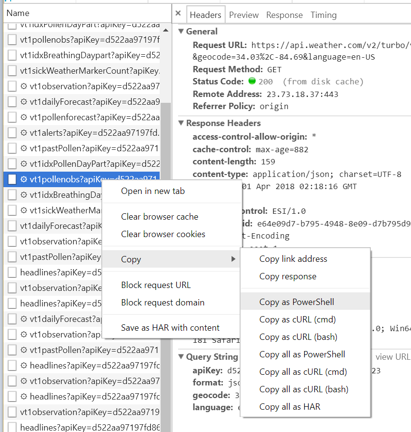 Simply Right Click the Request - Copy - Copy Request as PowerShell!

#### And now, the real test...

I popped over to the ISE and Control-V'ed that bad boy.  I observed this following PowerShell command.

```powershell
Invoke-WebRequest -Uri "https://api.weather.com/v2/turbo/vt1pollenobs?apiKey=d522aa97197fd864d36b418f39ebb323&format=json&geocode=34.03%2C-84.69&language=en-US" \` -Headers @{"Accept"="\*/\*"; "Referer"="https://weather.com/"; "Origin"="https://weather.com"; "User-Agent"="Mozilla/5.0 (Windows NT 10.0; Win64; x64) AppleWebKit/537.36 (KHTML, like Gecko) Chrome/65.0.3325.181 Safari/537.36"} 
```

We can see in the `geocode=` part of the URL that entering my zip code converted the location code into lat/long coordinates and then the actual request for the local counts present the coordinates to the `vt1PollenObs` endpoint of their Turbo internal API.  You can learn a lot from a request's formatting.

In all likelihood we could probably omit the majority of those Header values and it would still work.  We could likely truncate the URL as well, but I had to see what would happen!

```
StatusCode : 200 StatusDescription : OK Content : {"id": "34.03,-84.69", "vt1pollenobs":

{"reportDate":"2018-03-30T12:43:00Z","totalPollenCount":2928,"tree":4,"grass":0,"weed":1,"mold":null}

} RawContent : HTTP/1.1 200 OK Access-Control-Allow-Origin: \* X-Region: us-east-1 Transaction-Id: e64e09d7-b795-4948-8e09-d7b795d948c6 Surrogate-Control: ESI/1.0 Connection: keep-alive Content-Length: 159 Cac... {...}

```

I mean, you can see it right there, in the Content field, a beautiful little JSON object!  At this point, sure, you could pipe the output into `ConvertFrom-JSON` to get back a PowerShell object but I would be remiss (and get an ear-full from Mark Krauss) if I didn't mention that `Invoke-RESTMethod` automatically converts JSON into PowerShell objects!  I swapped that in place of  `Invoke-WebRequest` and stuffed the long values into variables and...

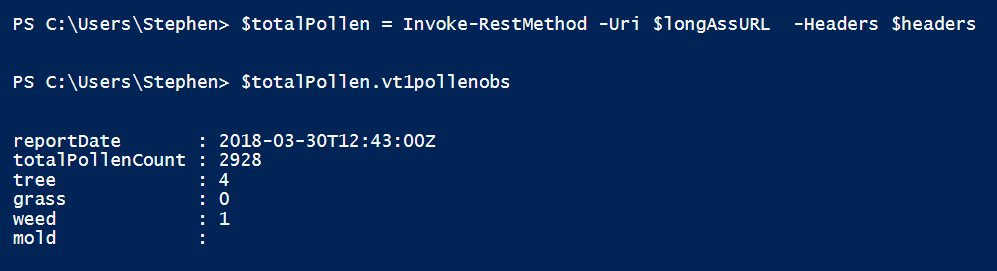 Wow, that 'Just worked'! That never happens!!

#### Let's make a cmdlet

OK, going back to that URL, I can tell that if I presented a different set of lat and lng coordinates, I could get the pollen count for a different place.

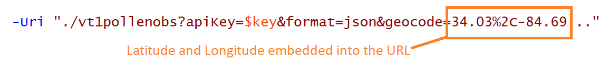

We could make this into a cool `Get-PollenCount` cmdlet if we could find a way to convert a ZIP over to a real set of coordinates...

A quick search lead me to [Geoco.io](https://geocod.io/docs/#geocoding), which is very easy to use and has superb Documentation.

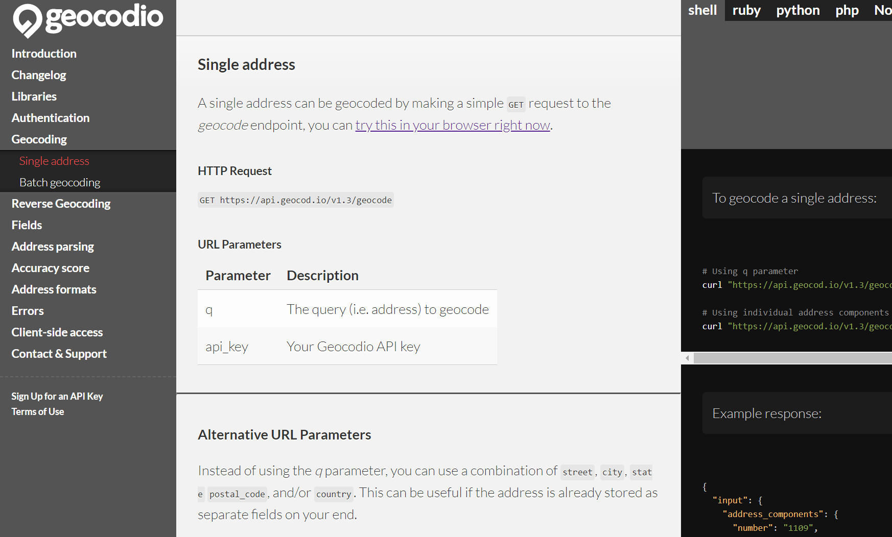 Zenoss, why can't you have docs like this?

Sign up was a breeze, and in just under a minute, I could convert a ZIP to Coords (among many other interesting things) in browser.

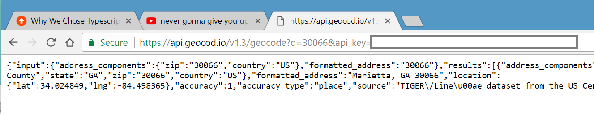

I needed them back in the format of `[$lat]%2c[$lng]`, where `$lat` is the latitude to two degrees of precision and `$lng` is predictably also the same.  This quick and dirty cmdlet got me there.

```powershell
Function Get-GeoCoordinate{ param($zip) $lookup = Invoke-RestMethod "https://api.geocod.io/v1.3/geocode?q=$zip&api\_key=$($global:GeocodeAPI)" "$(\[math\]::Round($lookup.results\[0\].location.lat,2))%2c$(\[math\]::Round($lookup.results\[0\].location.lng,2))" }

```

Make sure to set `$global:GeocodeAPI` first.  So, now a quick test and...

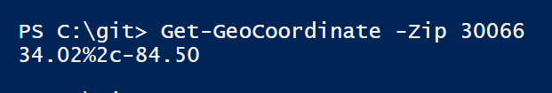

Okie doke, that was easy enough.   Now to simply modify the URL to parameterize the inputs

```powershell

Function Get-PollenCount{ param($coords)

$headers = @{"Accept"="\*/\*"; "Referer"="https://weather.com/"; 
  "Origin"="https://weather.com"; 
  "User-Agent"="Mozilla/5.0 (Windows NT 10.0; Win64; x64) AppleWebKit/537.36 (KHTML, like Gecko) Chrome/65.0.3325.181 Safari/537.36"
  } 
  
  $urlbase = "https://api.weather.com/v2/turbo/vt1pollenobs?apiKey=$global:PollenAPI&format=json&geocode=$coords&language=en-US" $totalPollen = Invoke-RestMethod -Uri $longAssURL -Headers $headers $totalPollen.vt1pollenobs

}

```

On to the final test...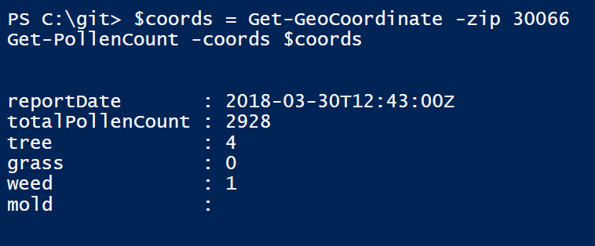

It was...that easy??


#### What's next?

This new tool built in to Chrome really is a game changer to help us quickly scrape together something working to solve an issue.  It's AWESOME!

Do you need help developing a cmdlet for your scenario?  We can help!  Post a thread on reddit.com/r/FoxDeploy and I'll respond in a timely manner and help you get started with a solution _for free!_ 