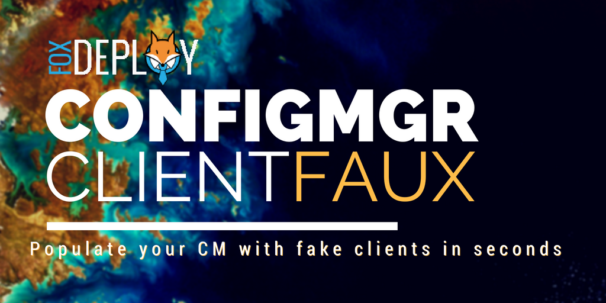
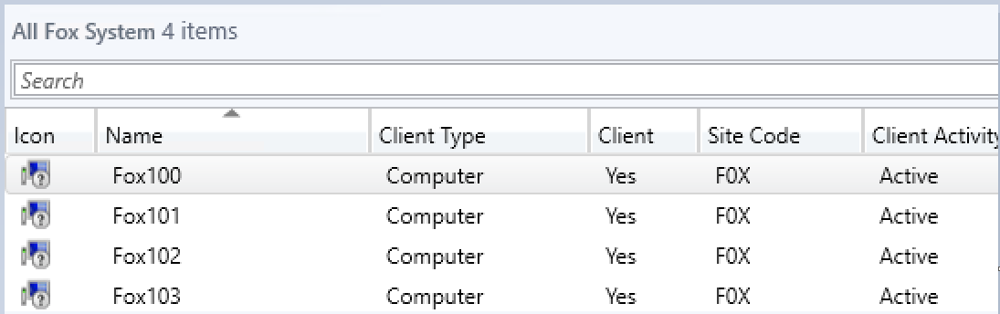
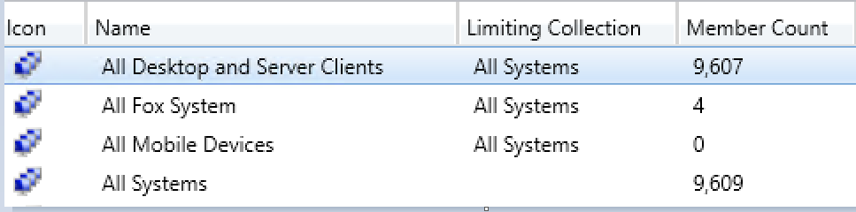
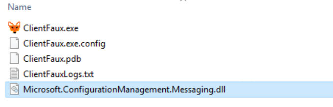
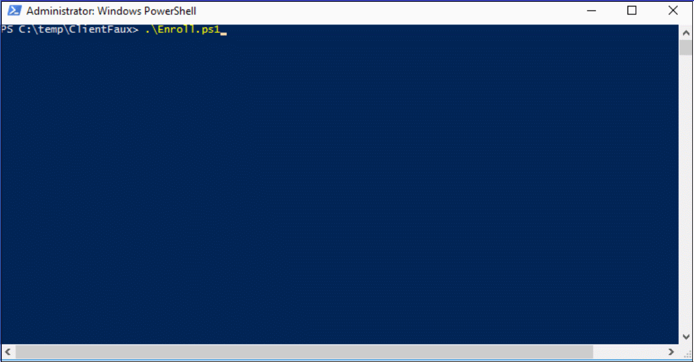
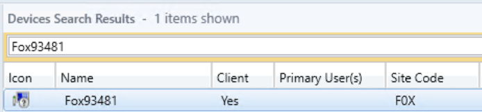

Recently at work, we were debating the best way to handle mass collection moves in ConfigMgr.  We're talking moving 10,000 or more SCCM devices a day into Configuration Manager collections.

To find out, I installed CM in my beastly Altaro VM Testlab (the build of which we covered [here),](http://foxdeploy.com/2017/11/13/backing-up-your-testlab-with-altaro-backup/) and then wondered...

> how the heck will I get enough clients in CM to test in the first place?

#### Methods we _could_ use to populate CM with Clients
<!--more-->
At first I thought of using SCCM PXE OSD Task Sequences to build dozens of VMs, which my lab could definitely handle.  But a PXE Image was taking ~24 minutes to complete, which ruled that out.  **Time to thousand clients** even running four images at a time would be over one hundred hours, no go.

Then I thought about using differencing disks coupled with AutoUnattend images created using WICD, like we covered here on  ([Hands-off deployments](../2016/12/12/hands-off-deployments/)), but that still takes ~9 minutes per device, which is a lot of time and will use up my VM resources.  **Time to thousand clients**, assuming four at a time? 36 hours.

I thought I remembered seeing someone come up with a tool to create fake ConfigMgr clients, so I started searching...and it turns out that other than some C# code samples,  I had a fever dream basically, it didn't exist.

So I decided to make it, because after all, which is more fun to see when you open the console in your testlab, this?



Or this?



And it only took me ~40 hours of dev time and troubleshooting.  But my time per client?  Roughly eight seconds!  That means 450 clients PER hour, or a **time to thousand clients** of only two hours!  Now we're cooking...

#### How is this possible?

This is all made possible using the powerful ConfigMgr SDK, available here.

But really, none of this would have been possible without the blog posts by [Minfang Lu of Microsoft](https://blogs.msdn.microsoft.com/minfangl/2012/04/25/step-by-step-on-how-to-simulate-a-client-using-system-center-2012-configuration-manager-client-sdk/) and the help of [@Adam Meltzer](https://twitter.com/adammeltzer) also of Microsoft.  Minfang's post provided some samples which helped me to understand how to Simulate a SCCM Client.   And Adam is a MSFT SUPERSTAR who responded to my emails at all hours of the night and helped me finally solve the pesky certificate issue which was keeping this from working.  His [blog posts](https://blogs.msdn.microsoft.com/ameltzer/2012/07/12/sdk-in-depth-sample-on-how-to-use-the-client-messaging-sdk/) really helped me get this working.  It was his samples that got me on the right path in the first place.

#### So, what does it even do?

The ClientFaux Client Simulation tool allows us to use the super powerful ConfigMgr SDK and its assemblies to simulate a ConfigMgr Client.  We can register a client, which will appear in CM as a new Device. We are able to specify the name of our fake client, and some of its properties, and even run a client discovery.  This concludes the list of what is working at this point :)

On the roadmap, we will be able to populate and provide custom fake discovery classes which we can see in Resource Explorer (though this has some issues now).  Imaging testing queries in your test CM and being able to exactly replicate a deployment of an app with multiple versions, for Collection Queries or reporting...This is only the beginning, and I hope that with a good demo of what this does, we'll quickly add more and more features.  If you're interested...

[Here's the source, help make this better!](https://github.com/1RedOne/ClientFaux)

**Standard Boiler -Plate warning**

The focus of this tool is to allow us to stage our CM with a bunch of clients, so we can do fun things like have huge numbers of devices appear in our Console, test our skills with Querying, and have interesting and real looking data to include as we practice our custom SQL Reporting skills.  **This should be done in your test lab.**  I don't see how this can cause your CM serious issues, but I've only got a sample size of one so far.  Consider yourself warned, I can't help you if you create 100K devices and your donut charts in CM suddenly look weird.  **Do this is test.**

#### How do I use the ClientFaux tool

Getting up and running is easy, simply click on the releases tab and download the newest [binary listed there](https://github.com/1RedOne/ClientFaux/releases).  Extract it somewhere on your PC.

Next, download and install the [ConfigMgr SDK](https://www.microsoft.com/en-us/download/details.aspx?id=29559), then open up Explorer and copy the ​`Microsoft.ConfigurationManagement.Messaging.dll` file from ("C:\\Program Files (x86)\\Microsoft System Center 2012 R2 Configuration Manager SDK\\Redistributables\\Microsoft.ConfigurationManagement.Messaging.dll") to the same path where you put the ClientFaux.

Your directory should look like this now.

\[caption id="attachment\_5600" align="alignnone" width="679"\] Yes, that IS a handdrawn icon

At this point you're probably noticing the .exe file and wondering...

**Wait, no PowerShell Cmdlets?!**

I know, I know, I deserve shame.  Especially given the theme of my blog is basically shoe-horning and making everything work in PowerShell.  I've been working in C# a bit at work now, and sort of have a small clue, it felt easier to start in C# and then, plan to add PowerShell later.  (It's on the plan, I swear!)  I also have a GUI planned as well, worry not, this is the early days.

To start creating clients, we need five things:

- A desired name for the new client in CM
- The path to a CM Compatible Certificate in PFX format
- The Password to the above cert
- The ConfigMgr Site Code
- The Name of the CM Server

Making the certs was kind of tricky (I'll cover the woes I faced in the upcoming 'ClientFaux Build Log' post, to come next week), so I wrote a PowerShell script to handle all of this.  Run this from a member server which can route to CM.  In my lab, I have a small domain with a CM Server, an Admin box and a Domain Controller.  I ran this from the Admin box.

```powershell 
$newCert = New-SelfSignedCertificate \` -KeyLength 2048 \` -HashAlgorithm "SHA256" \` -Provider "Microsoft Enhanced RSA and AES Cryptographic Provider" \` -KeyExportPolicy Exportable -KeySpec KeyExchange \` -Subject 'SCCM Test Certificate' -KeyUsageProperty All -Verbose

start-sleep -Milliseconds 650

$pwd = ConvertTo-SecureString -String 'Pa$$w0rd!' -Force -AsPlainText

Export-PfxCertificate -cert cert:\\localMachine\\my\\$($newCert.Thumbprint) -FilePath c:\\temp\\ClientFaux\\CMCert.pfx -Password $pwd -Verbose Remove-Item -Path cert:\\localMachine\\my\\$($newCert.Thumbprint) -Verbose

ClientFaux MynewPC123 c:\\temp\\ClientFaux\\CMCert.pfx 'Pa$$w0rd!' F0X SCCM 
```

This will create the cert (which has to use the SHA1 or SHA256 Hashing Algorithm, and be 2048 bits long), then export it with a password, and then delete the cert from your cert store. I ran into issues when I had more than 10,000 certs, and we don't need it in our store anymore to actually use it.

Then, it will trigger ClientFaux.exe with those params.

This particular configuration above says: "Register a new client using the Cert found at C:\\temp\\ClientFaux\\CMCert.pfx, with the password of 'Pa$$w0rd!', and then register with the F0X ConfigMgr site using the Management Point SCCM.  Here's what it will look like:



If you run into errors, there will be a log file created with every enrollment in the same directory as the binary.  The log file is super verbose, but you can also find logging info on the Management Point itself, look to MP\_Registration.log and report any errors you see (but if you use this configuration, you should not run into any).

#### What will it do?

At this point, we can see the log files on the Management Point, which will be found under the SCCM Drive\\SMS\_CCM\\Logs\\MP\_RegistrationManager.log file, a completed request will look like this:

```
 Mp Reg: Reply message MP Reg: Processing completed. Completion state = 0 MP Reg: Message ReplyTo : direct:DC2016:SccmMessaging MP Reg: Message Timeout : 60000 Parsing done. Processing Registration request from Client 'Fox93481.FoxDeploy.local' Successfully created certificate context. MP Reg: Successfully created context from the raw signing certificate. Begin validation of Certificate \[Thumbprint 941D7F46903BEE8A7A67BF7B416453BFC0F18FFE\] issued to 'SCCM Test Certificate' Completed validation of Certificate \[Thumbprint 941D7F46903BEE8A7A67BF7B416453BFC0F18FFE\] issued to 'SCCM Test Certificate' Successfully created certificate context. MP Reg: Successfully created context from the raw encryption certificate. Registration Signature: SuperLongHashHere MP Reg: DDR written to \[E:\\CM\\inboxes\\auth\\ddm.box\\regreq\\RPB886P6.RDR\] for Client \[GUID:A698D203-C0F9-4E5D-8525-3AA55572BF5F\] with Certificate Thumbprint \[941D7F46903BEE8A7A67BF7B416453BFC0F18FFE\] Mp Reg: Reply message 
```

Give it a moment, and it will appear in the ConfigMgr console!



#### But, how do I get--like--10k of them

If you want to get your console _really_ filled with devices, then you can run this script to create boatloads of devices!  I'm assuming you placed ClientFaux under C:\\Temp\\ClientFaux. Simply edit line 1 and 2 with the starting and ending numbers, and then edit line 7 with your desired name. If you change nothing, this will create PCs labeled Fox1, Fox2, and so on up to 50,000.

```powershell
 $str = 1 $end = 50000 while ($str -le $end){ if(-not(test-path C:\\temp)){ new-item -Path C:\\temp -ItemType Directory -Force } $NewName = "Fox$str" $newCert = New-SelfSignedCertificate \` -KeyLength 2048 \` -HashAlgorithm "SHA256" \` -Provider "Microsoft Enhanced RSA and AES Cryptographic Provider" \` -KeyExportPolicy Exportable -KeySpec KeyExchange \` -Subject 'SCCM Test Certificate' -KeyUsageProperty All -Verbose timeout 3

$pwd = ConvertTo-SecureString -String 'Pa$$w0rd!' -Force -AsPlainText

Export-PfxCertificate -cert cert:\\localMachine\\my\\$($newCert.Thumbprint) -FilePath "c:\\temp\\Client\_$NewName.pfx" -Password $pwd -Verbose Remove-Item -Path cert:\\localMachine\\my\\$($newCert.Thumbprint) -Verbose C:\\temp\\ClientFaux\\ClientFaux.exe $NewName c:\\temp\\Client\_$NewName.pfx 'Pa$$w0rd!' 'F0X' 'SCCM' $str+=1 }


```

You can also run three or four instances of this at a time as well! If you do that, I'd recommend using multiple copies of the .exe in their own folder, one per thread, to prevent two instances from trying to create the same named log file.

### What's Next

So, this is represents my alpha build.  It is working reliably but it could use a lot of features and testing.  For one, how about named parameters?  How about making a GUI for it?  What about making PowerShell cmdlets instead of a binary (more in-line with the theme of this blog!)?

These are all planned and will come...eventually. But I could use some help!  If you'd like to contribute, please test the project here, and send me issues as you come across them.  If you want to resolve issues, I'll happily accept pull Requests too!

[Source Code here on GitHub!](https://github.com/1RedOne/ClientFaux)

[Compiled Binary - Alpha](https://github.com/1RedOne/ClientFaux/releases) 

### Sources

I learned so much writing this post and so I wanted to call out down here a listing of all of the resources I used to write this project.  In the build-log post, we'll talk about each of this and how they came up, in the hopes that it will help you on your own ConfigMgr integrations :)

- How to check to see if a cert uses the appropriate Algorithm https://msdn.microsoft.com/en-us/library/system.security.cryptography.x509certificates.x509certificate2.signaturealgorithm(v=vs.110).aspx https://stackoverflow.com/questions/28413742/x509certificate2-public-key-signature-algorithm-http-www-w3-org-2001-04-xmldsi
- How to open a .pfx cert when it has a password https://msdn.microsoft.com/en-us/library/ms148419(v=vs.110).aspx
- How to post a PowerShell multiline string example within a C# program https://stackoverflow.com/questions/1100260/multiline-string-literal-in-c-sharp
- Catching errors in c# (I forgot how to do this again) https://stackoverflow.com/questions/1056324/calling-console-writelineex-message-to-prevent-warning-message
- How to specify which algorithm to use for a certificate https://stackoverflow.com/questions/36733439/keyalgorithm-for-sha256
- How to enable verbose logging in CM (needed for Managemnet points) https://canadianitguy.wordpress.com/2016/06/24/turning-on-verbose-logging-for-sccm/
- How to get a domain name in c# https://stackoverflow.com/questions/4161246/get-domain-name
- How to create unique log file names https://stackoverflow.com/questions/11001822/copy-files-from-one-project-to-another-using-post-build-event-vs2010
