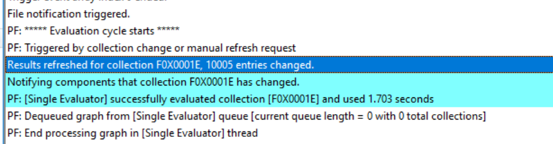

Recently at work, we had a task come up which saw us needing to move tens of thousands of devices between collections in CM. We decided to run some tests to find the fastest way! We compared:

- The SCCM 1511 Era Collection Cmdlets
- The newly released speedier Collection Cmdlets which shipped with Tech Preview 1803
- Using Keith Garner's super powerful CMPSLib Module
- Query Based Membership
- AD Group Query Membership
- Direct SQL Membership Tampering ☠

I'd always kind of wondered myself, so it was a fun challenge to come up with some hard numbers.  And for the last item in the list...this is just for fun, I do not recommend using this in your production...or your testlab.  Or anywhere.
<!--more-->
#### The test lab

All testing occurred in my VM Testlab, a Ryzen 7 1700 with 64 GB of RAM, with storage served on NVMe m.2 SSD drives.   A beastly machine (also hello to viewers from the year 2025 where we have 6TBs of storage on our phones and this is laughably quaint.  Here in 2018, we believed more RBG = more better, and we were happy, damn it!)

My ConfigMgr VM runs on Server 2016, 32 GB of RAM, SQL gets 16GB of that, and the SQL database and log files live on a separate NVMe drive for maximum performance.

#### The testing methodology

In this test, we'll test two scenarios: adding 10,000 devices to a collection, and adding 30,000 devices to a collection.  In our experience we start to see collection slow down at around 30K, and this amount isn't too big as to exclude the majority of CM Environments in the world.  Let me know if you think of something I forgot to test though!

We will resolve our input devices using DBATools Invoke-DBASqlQuery, with the following Syntax:

```powershell
 Function Get-CMDevice{ param($CollectionID)

Invoke-DbaSqlQuery "Select Distinct Name,ResourceID from dbo.v\FullCollectionMembership where CollectionID = '$CollectionID'" -SqlInstance SCCM -Database CM\F0x } 
```

I used this method because I found it more performant than using the built-in command, and gave me just the two columns I needed, Name and ResourceID.

We will conduct add the users (resetting the collection count between tests) and measure both the time it takes to complete the Membership alter command with a refresh at the end of the process, then monitor CollEval.log for the following line items:

```powershell
 Results refreshed for collection F0X0001E, 30300 entries changed. Notifying components that collection F0X0001E has changed. PF: \[Single Evaluator\] successfully evaluated collection \[F0X0001E\] and used 2.875 seconds


```

Specifically the final line indicates that Collection Rules have finished processing and the devices will now be visible in CM.  Now let's dive in!

#### The SCCM 1511 Era Collection Cmdlets

These cmdlets have something of a bad wrap, I feel, for being slow.  Without digging into the code, I couldn't tell you specifically how they're written, but I've heard it described that when you use them to add multiple devices to a collection, rather than adding all of the rules and saving the changes once, it would add each rule one at a time.

When I tried to directly add 10,000 rules at once, I ran into out-of-memory errors!

```powershell


$d = Get-CMDevice -CollectionID SMS00001 | 
   select -First 10000 -Property Name,ResourceID Add-CMDeviceCollectionDirectMembershipRule -CollectionId "F0X00016" -ResourceId $UniqueDevices.ResourceID

\>Add-CMDeviceCollectionDirectMembershipRule : One or more errors occurred. At line:1 char:1 + Add-CMDeviceCollectionDirectMembershipRule -CollectionId "F0X0001F" - ... + ~~~~~~~~~~~~~~~~~~~~~~~~~~~~~~~~~~~~~~~~~~~~~~~~~~~~~~~~~~~~~~~~~~~~~ + CategoryInfo : NotSpecified: (:) \[Add-CMDeviceCol...tMembershipRule\], AggregateException + FullyQualifiedErrorId : System.AggregateException,Microsoft.ConfigurationManagement.Cmdlets.Collections.Commands.AddDeviceCollectionDirec tMembershipRuleCommand


```

This would continue no matter what, until I found a stable amount of devices to add at a time.  527 was the max I could ever add with one step, so for consistencies sake, I added just 500 rules at a time.

```powershell


$d = Get-CMDevice -CollectionID SMS00001 |  select -First 10000 -Property Name,ResourceID 
for ($i = 0; $i -lt $d.Count; $i += 500) { 
    "processing $i -- $($i+500)" 
    Add-CMDeviceCollectionDirectMembershipRule -CollectionId "F0X00016" -ResourceId $d.ResourceID[$i..($i+500)]

}


```

The performance wasn't _okay._ Well, bad.

**10,000** Devices took a leisurely 05:02 minutes to process, while **30,000** took a snooze inducing 50:51 to process!  Nearly FIFTY ONE Minutes.  Clearly something slow is happening under the covers here.

#### Super Speed Collection Moves CMPslib

Keith Garner wrote his own set of PowerShell cmdlets to deal with collection rules, after we experienced some frustration with the options that ship in the box.  [You can download them here](https://github.com/keithga/CMPSLib/tree/master/PSCMLib/Collections), and to use the them you pass in a collection of devices with Name and ResourceID properties to the `-System` parameter.

```powershell
 $d = Get-CMDevice -CollectionID SMS00001 |  Select -First 10000 -Property Name,ResourceID 
Add-CMDeviceToCollection -CollectionID F0X0001E -System $d -Verbose 
```

The performance is **awesome.** 

10,000 rules are applied in only 1:54 seconds, and CollEval processed the devices in practically no time at all:


This is a very nice improvement over the built-in cmdlets, and I was eager to see what happened with 30K rules.

It turns out that when we applied 30,000 rules, we saw performance scale linearly, taking 4:44  to create and apply the rules, with processing taking just a bit longer.


The total processing time for 30K devices is 4 minutes, 52 seconds using this method of adding direct rules.  By far the fastest!

#### 1806 Cmdlets

The 1806 CM Cmdlets bring some nice features, and bug fixes.  On top of that, something has changed under the covers of the Collection Direct Membership Add cmdlet, giving us a **HUGE** speed improvement too! 

**One Caveat** the syntax has changed quite a bit, and you need to use the new cmdlets in a specific manner to ensure that you'll experience the SUPER Speed!

First, don't batch your collection addition rules, like we did previously.  Or, if you do batch them, do it in batches of 10K.  Next, the parameters have changed.  If you use the cmdlet in stand-alone mode, like so `Add-CMDeviceCollectionDirectMembershipRule -CollectionID <SomeCollection> -ResourceID $arrayOfResourceIDs`

You will end up with the _previous cmdlet performance._ From what I can tell, it looks like there may be an internal branch in the logic and the old code is alive and kicking down there!  **What, I told you it was weird!** 

The sweet spot to get super speed is like so:

```powershell
 #Load devices to add to the collection (should be a full device from Get-CMDevice) 
 $devices = Get-CMDevice -CollectionID SMS00001 | 
  select -first 30000 Get-CMCollection -CollectionId F0x00025 | 
    Add-CMDeviceCollectionDirectMembershipRule -Resource $devices 
```

Note that we **are not using `-ResourceID`**, and furthermore we must pipe `IResultObject#SMS_Collection` object into Add-..Member to get it to work.  It's wonky, it's weird, and it's _always verbose_ too.

Like, it's mega SUPER verbose (note that this is line thirty THOUSAND of the output)

But you're allowed the be weird when you're fast as hell!  This cmdlet is the Usain Bolt of CM Cmdlets.

Adding 10,000 device rules is **five times** faster than the old way, clocking in at 1:05!  And adding 30,000 rules took only  3:16!!

> For comparison, the new cmdlet is a beast for big collection moves, as it completes the same operation in 6% of the time of the old cmdlet, a performance increase of 17 times!

#### Query Rules

I'm going to go on the record and say that I was wrong about Query rules.  When I asked on Twitter, you guys had some interesting feedback for me about my ideas of what to do with Query rules...

https://twitter.com/FoxDeploy/status/1005188080071069696

So, I decided to test for myself...and they were amazing!  My plan was to add a query rule containing a big IN WQL Statement with the resource IDs I wanted to include, like this:

```sql
```select ResourceId, Name, SMSUniqueIdentifier, ResourceDomainORWorkgroup, SMS\R\System.Client from SMS\R\System where ResourceID in ('$IDArray') 
```

and bundle them up in batches of 1k devices at a time. Here's the code I used , edited for your viewing pleasure.  **You will need to make** _**sure your own WQL query is on one-line**,_ SCCM doesn't like a multi-line string:

```powershell

 $d = Get-CMDevice -CollectionID SMS00001 | select -First 10000 -Property Name,ResourceID $d.Count 
 for ($i = 0; $i -lt $d.Count; $i += 1000) { 
    Write-Host "processing $i..$($i+1000) ..." 
    $IDArray = $d\[$i..($i+1000)\] 
    $IDArray = $IDArray.ResourceID -join "','" 
    $query = " select SMS\R\System.ResourceId, SMS\R\System.Name, SMS\R\System.SMSUniqueIdentifier, SMS\R\System.ResourceDomainORWorkgroup, SMS\R\System.Client from SMS\R\System where ResourceID in ('$IDArray') " 
    #Add Query rule built in Add-CMDeviceCollectionQueryMembershipRule -CollectionID F0X0001C -RuleName "AddRule$(($i+1000)/ 1000)" \` -QueryExpression $query write-host -NoNewline "Done!" } 
```

At first I thought I had a typo in my code!


The speed...AMAZING! Only seven seconds to apply the rules!

CollEval fired up a few seconds later, and interestingly it does take a longer time to crunch the Query rules than it did the Direct Rules, but we're talking 10K devices added to a collection in under 20 seconds.


At this point, I knew 30K would be equally fast.

 Wow.  Only 26 seconds to apply the rules, and a total crunch time of 45 seconds to calculate membership.  Just one minute...let's see what happens if we...

#### Let's just add every device using a query rule

This was required of me at this point, all 115K machines in my testlab would be added with massive IN queries to really test performance.

\[caption id="attachment\5639" align="alignnone" width="702"\] A weird screen shot. The PowerShell line reflects the total time to run the command (2:18 for 115K rules), while the bottom half is the relevant lines from Collection Evaluation

Only 2 minutes, 18 seconds to apply the rules, and two minutes to run the query!  Incredible!   This is a huge improvement compared to adding devices with direct rules, in which case using CMPSLib took 1 hour, 15 minutes to add 115K rules.

#### Using AD Membership Queries

Using AD Group Membership queries is super super fast.  If your AD Replication is good and healthy.

If you begin to use AD Groups for membership in CM, keep in mind that if you make group changes at the periphery of your network, it will take some time to replicate from your remote site, to a global catalog, and then have to wait for CM to requery the Active Directory to see the change. Unfortunately I don't have a giant AD environment to play with Group Membership, but from what I've seen I would expect very good speed here too.  Sorry this section is lame.

#### Direct Membership Control using SQL

I've always kind of wondered _what_ Collection Evaluation was doing under the covers.  We know that when you add rules to a collection, they're processed in this order:

 Image from Scott's blog 'Collection Evaluation Overview'

Which was covered in detail in [this awesome blog post by Scott Breen \[MSFT\] titled 'Collection Evaluation Overview'](https://blogs.technet.microsoft.com/scott/2017/09/13/collection-evaluation-overview-configuration-manager/).  But what does CollEval _do_ with this information?  Just keep it in memory?  Write it to a file?  E-mail it to DJam who is the furiously working Mechanical Turk inside the machine?  ...Or does it store the information in the CM Database somewhere?

#### How it _really_ works

In digging around under the covers, I spent a lot of time watching arcane log files and trying to make sense of strange views in SQL trying to uncover where certain info was stored.  I had to grant myself super admin rights, break all of the warranty labels and in the end, took the CM Database out to dinner and then dug around with my flashlight under the covers, looking for goodies.  And I found a totally unsupported method to directly manipulate collections with shocking speed.

> How do I do it?

Well, a gentleman never tells. What I will share though is the impressive speed.  Using this method to directly control collection membership, I was able to place 30K devices in a collection in 0:00:01.  One second.

\[caption id="attachment\5646" align="alignnone" width="636"\] Code pixelated to protect you from yourself. Seriously, I'm not going to be the one arming you wild monkeys with razor bladed nunchuks

> But at what cost?

Well, if we don't actually add rules, but instead manipulate the collection via getting fresh with the database, we lost a lot.  We lose RBAC.  We don't have include rules, we don't have exclude rules, the collection membership would _just be what we said it should be._ 

Oh, and since we skipped CollEval, CollEval is going to have something to say about the weird ass stuff we've done to this poor innocent collection.  For instance, if we ever forget about the wonky, dark-magic joojoo we have performed on this poor collection and click 'Update Membership', CollEval will have its revenge.

 

*CollEval Checked, found no rules, then deleted everyone*

CM will helpfully look at the collection, look at its rules and say 'WTF are you doing bro, are you drunk?' and then delete everyone from the collection.  Not a member via a valid rule?  You're not gonna stay in the collection.

**I would not recommend using this approach.** 

The speed of direct query rules is mindblowing enough, and the new CM Cmdlet aren't far behind them, so we have plenty of performance options.  Seriously, don't explore this route, if you do, the air conditioner will catch on fire with spiders coming out of it.

 

*Don't do this to your CM. And if you DO, don't ask MSFT for support.*

#### In Conclusion

So, to summarize our data in a chart


Basically any method is much, much better than the Old CM Cmdlets!

\[caption id="attachment\5656" align="alignnone" width="636"\] Basically anything is faster than using the old Cmdlets

If you're considering your options outside of the old cmdlets, I'd recommend giving CMPSLib a try.  Lovingly written by Keith Garner, with help from yours truly, we believe this is a very resilient method of adding devices to a collection, without the wonky-ness of the new Add-DeviceDirectRule cmdlets kind of odd syntax.


Want the new ones?  It's easy, just download the media for the tech preview, and use it to Install the CM Console on your machine.  The CM Console will give you the new cmdlets and they'll work on an old environment, super easy!  Just be mindful of the syntax!

Of course, for true performance, if you're looking to manage your collections from outside of CM, I would only recommend maintaining membership using query rules, it's just too fast not to mention.

Let me know if I missed anything!
