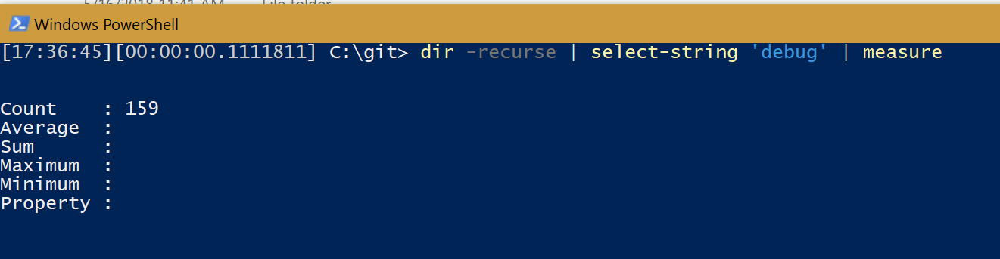
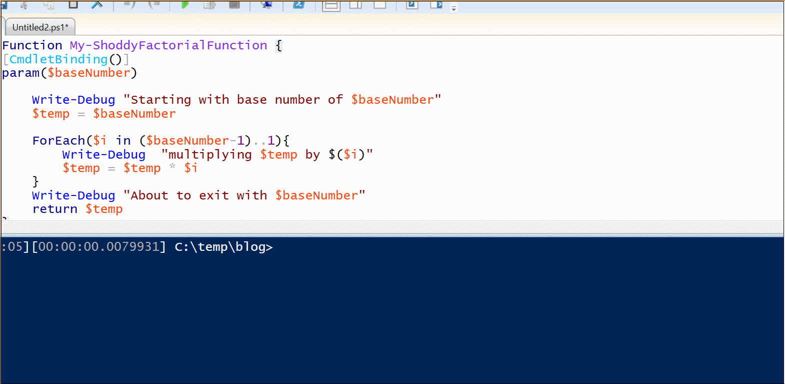
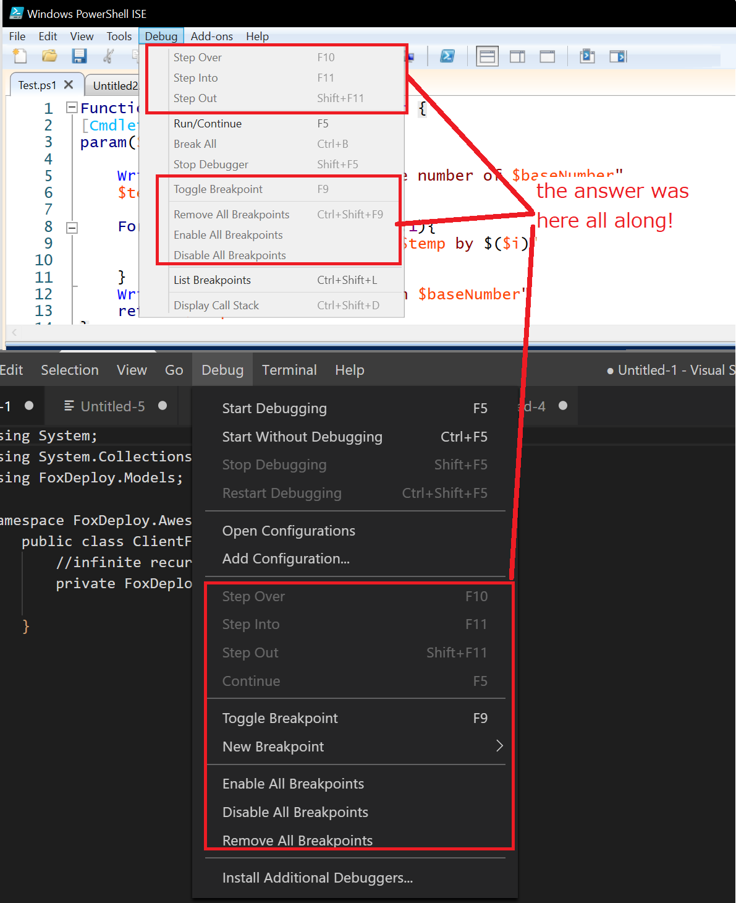
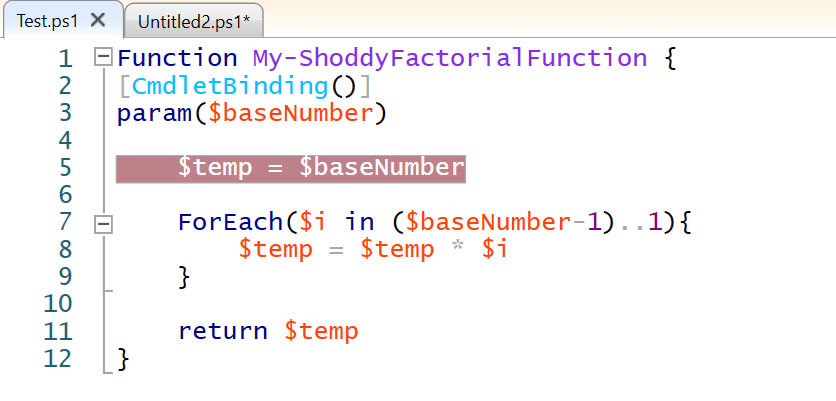
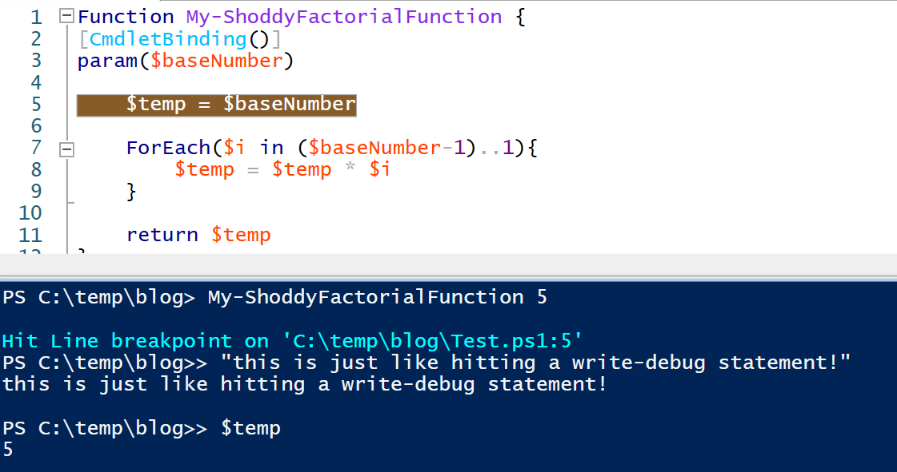
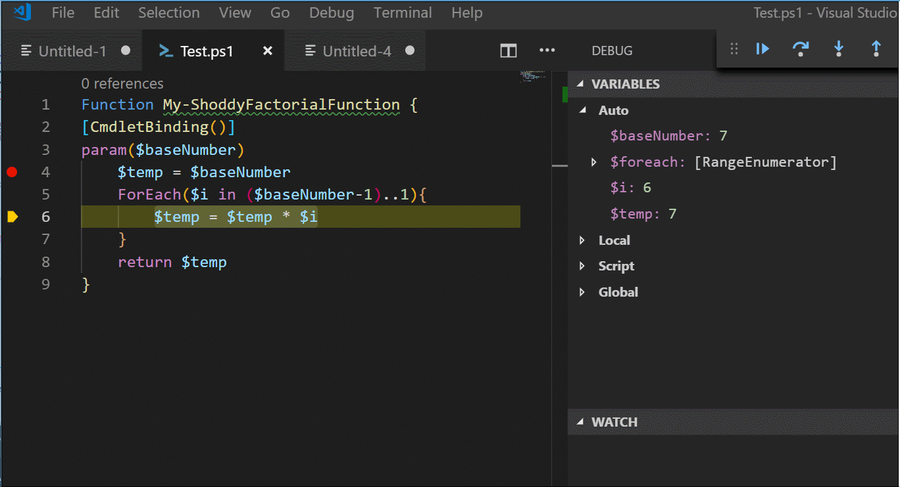

Hey y'all.  I need to come clean.  I am a bad debugger.

Why?  Because until recently, I was notorious for leaving Write-Debug statements everywhere.  I mean, just take a look at my local git folder.
 <!--more-->
\[caption id="attachment\_5693" align="alignnone" width="1321"\] I \*wasn't\* expecting it to be \*this\* bad. I'm so, so sorry.\[/caption\]

My code was just littered with these after practically every logical operation...just in case I needed to pause my code here at some point in the future.  Actually, someone could look at my code in the past and every Verbose or Debug cmd was basically a place that I got stuck while writing that cmdlet or script.  I mean, using the tools is not wrong, but it always felt like there should be better ways to do it.

Recently, I **have** learned of a much better way and I want to share it with everybody.


### Why not use Write-Debug?

> Write-Debug is wrong and if you use it you should feel bad

I'm just kidding!  You know, to be honest, something _**really**_ gets under my skin about those super preachy posts like you always find on medium that say things like 'You're using strings wrong', or "You're all morons for not using WINS" or something snarky like that.

It's like, I might have agreed with them or found the info useful, but the delivery is so irksome that I am forced to wage war against them by means of a passive aggressive campaign of refusing to like their Tweets any more as my retribution.

That being said, here's why I think we should avoid Write-Debug.  It ain't wrong, but you might like the alternative better.

#### Pester will annoy you

If you're using Pester, you might like to use -CodeCoverage to help you identify which logical units of your code may not have test coverage.  Well, Pester will view each use of `Write-Debug` as a separate command and will prompt you in your code coverage reports to write a test for each.  A relatively simple function like this one:

```
Function My-ShoddyFactorialFunction {param($baseNumber)

Write-Debug "Starting with base number of $baseNumber"

$temp = $baseNumber

ForEach($i in ($baseNumber-1)..1){

Write-Debug "multiplying $temp by $($i)"

$temp = $temp * $i

}

Write-Debug "multiplying $temp by $($i)"

return $temp

}

```

When this short script is run through `CodeCoverage`, Pester will call out each `Write-Debug` as a separate entities that need to be tested.  We both know that there's no reason to write a Pester test for something like this, but if you work with sticklers for pristine CodeCoverage reports then you'll have to look out for this.

#### Not guaranteed to be present on every PowerShell host

Did you know that not every PowerShell host supports `Write-Debug`?  Since it is an interactive cmdlet, consoles that operate headlessly don't support it.  This means that Azure Automation for one does not support the cmdlet, so it will basically be ignored, at best.

As developers of PowerShell scripts and tools, we're accustomed to having the fully fledged PowerShell console available to us, but our code may not always execute in the same type of environment.

For instance, once I was working on a project for a customer with very long PowerShell Run Script steps embedded into System Center Orchestrator.  I wrote some functions for them, one of which involved creating and deleting ServiceNow Tickets.

I was very big at that time on creating 'Full and Proper' advanced cmdlets and _"Doing it the right way™"_ so I went totally overboard with `$ConfirmImpact` and PSCmdletShouldProcess usage.  The code worked great in my local IDE so we deployed it to production and our runbooks started failing.

Why?  Well the host in which Orchestrator runs PowerShell Scripts runs headless, and when it tried to run my cmdlets, it threw this error.

```
Exception calling "Invoke" with "0" argument(s): 
```

This lesson taught me the point that I shouldn't always count on all input streams and forms of user interaction being available in my code.

#### Not a great user experience anyway

Back to our first function, imagine if I wanted to debug the value of the output right before we exited.  To do so, look at how many times I have to hit 'Continue'!



This **sucks.** And it really sucks when you're doing code reviews.

#### Write-Debug make Peer Reviews super suck

If you're fortunate enough to work on a team of Powershell slingers, you almost definitely have (and if you don't, start on Tuesday!) a repository to check in and review code.

And if you're doing this the right way, no one has access to push untested code until it goes through review in the form of a pull request.

So what happens when you need to test 'why' something happens in your coworkers code? If you were me, you would have to litter your colleagues (hopefully) clean code with tons of debug statements. These you have to remember to roll back or you get annoying messages from git when you try to change branches again.

> I was changing my peers code while reviewing it.  It was bad and I feel bad.

#### **So what should I do instead?**


It turns out that there has been an answer to this problem just hiding in my consoles for years and I've mentally ignored them this whole time.



If you've never used a breakpoint before, prepare to be amazed!  Whether you use the ISE, Visual Studio, or VS Code, breakpoints are a great tool that let you set an ephemeral debug point without editing the original file!


They essentially function just the same as a `Write-Debug` statement, but you can add and remove them without editing the original code, and are deeply integrated into our favorite editors to unlock all kinds of goodness.

#### How to use them

If you're in the PowerShell ISE (obligatory WHAT YEAR IS THIS.png) , simply highlight a line on which you'd love to pause your code, then hit `F9`. Then run the code and PowerShell will automatically stop in a debug command line.

\[caption id="attachment\_5703" align="alignnone" width="636"\] Hit 'F9' to set the breakpoint, then run the code.\[/caption\]

The code will execute like it normally would until it reaches the breakpoint line at which point...

\[caption id="attachment\_5721" align="alignnone" width="636"\] You get a Write-Debug style command prompt but never had to change the source code!\[/caption\]

The same goes for Visual Studio Code, which is even better, as it includes a point-in-time listing of all variable values as well!


It doesn't stop here!  You can **also hover over variables to see their value in real time!** 

This was a huge game changer for me, as I used to type the names of variables over and over and over into the shell to see their current values.  Now, I just hover, like you see below.  Note the little boxes which appear over the cursor!



#### But the awesomeness doesn't stop there!

When you're paused at a breakpoint, you can also proceed through your code line by line.  The same keys work in either VS Code, VS or ISE.

| Key | Function |
| --- | --- |
| F5 | Continue running when paused |
| F9 | Set a breakpoint on this line |
| F10 | Step Over - run this line and stop |
| F11 | Step Into - go INTO the functions called on this line |
| Shift+F11 | Step Out - move your paused breakpoint out to the calling function |

These commands will change your debugging life.

In the demo below, I show how Step-Over works, which runs the current line but doesn't jump into the definition of any functions within it, like Step-Into does.

## make youtube Link DebugInCode

Now, let's go back to our initial example and set a breakpoint to test the value on that last line.


## make you tube link Debugging.mp4

See how easy that was?  This is why I believe that once you learn of the power of ultra instinct--er, once you learn about Breakpoints, you'll simply _**never need Write-Debug again!**_

\[caption id="attachment\_5715" align="alignnone" width="592"\] Security camera footage of me using Breakpoints for the first time\[/caption\]

Still confused about the difference between Step Over, Step Into and Step Out?  I don't blame you, [checkout this great answer from StackOverflow which does a good job shining light on the distinction.](https://stackoverflow.com/a/3580905/1238413)
