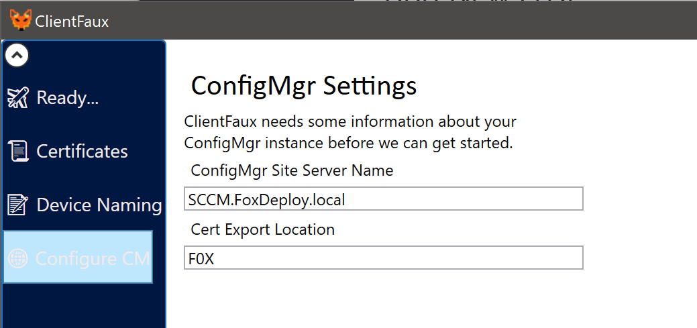
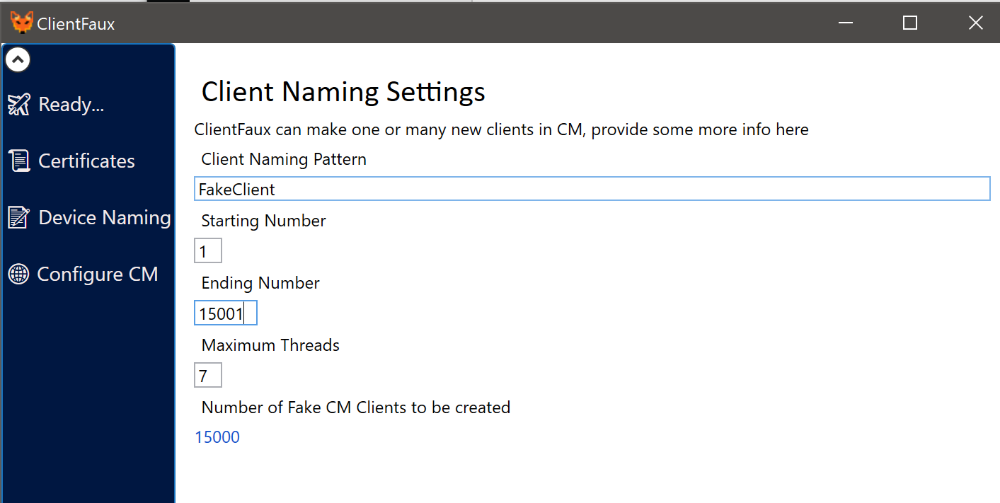

As mentioned on the stage at MMSMOA, ClientFaux 2.o is now available.  Completely re-written with as a WPF GUI with automated certificate generation, multi-threading, and all the bells and whistles.

Oh, and Hardware inventory now works!

Download it and give it a try now!  To use, install it on a desktop/laptop/VM which is on a network segment which can reach your CM server.
<!--more-->
http://bit.ly/ClientFaux

Launch ClientFaux and click to the `Configure CM` tab and provide your CM Server FQDN and three letter Site code.

Then click to the Device Naming page and provide your desired naming pattern and starting and ending numbers.

You can also increase the number of threads (I've tested up to 12 threads and seven is a good happy medium for resource usage, but feel free to go crazy).

Then to see it in action...click to the 'Ready' page and hit 'Ready!' and away we go!



### The Big Warning

This is designed for DEMO or TestLab CM instances.  I do not recommend running it against your Production CM instance as it can create thousands and thousands of CM clients if left running for a few hours!  This can be hard to filter out of data for reporting, dashboards and the like.
