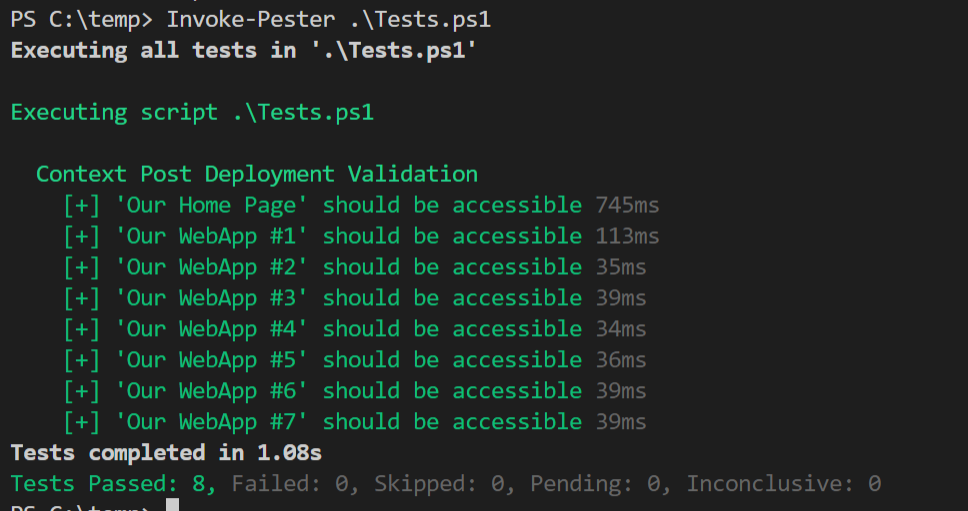
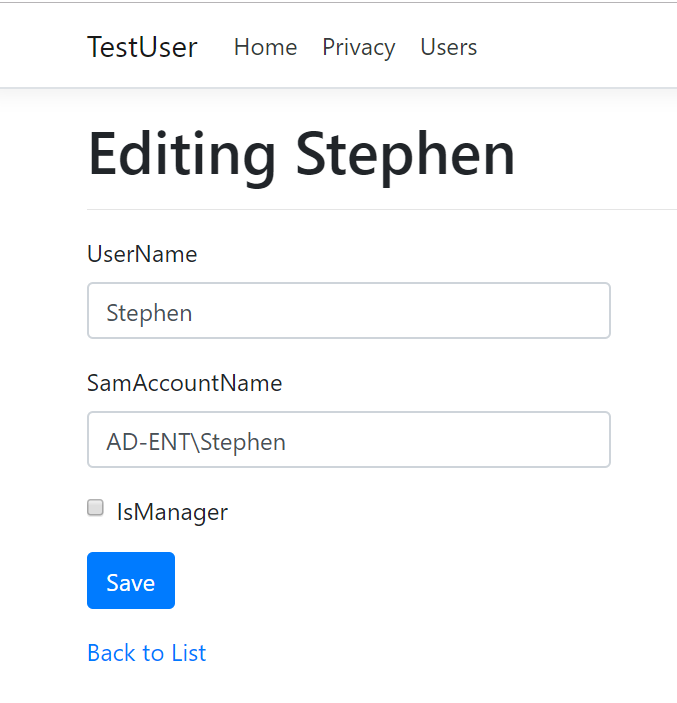
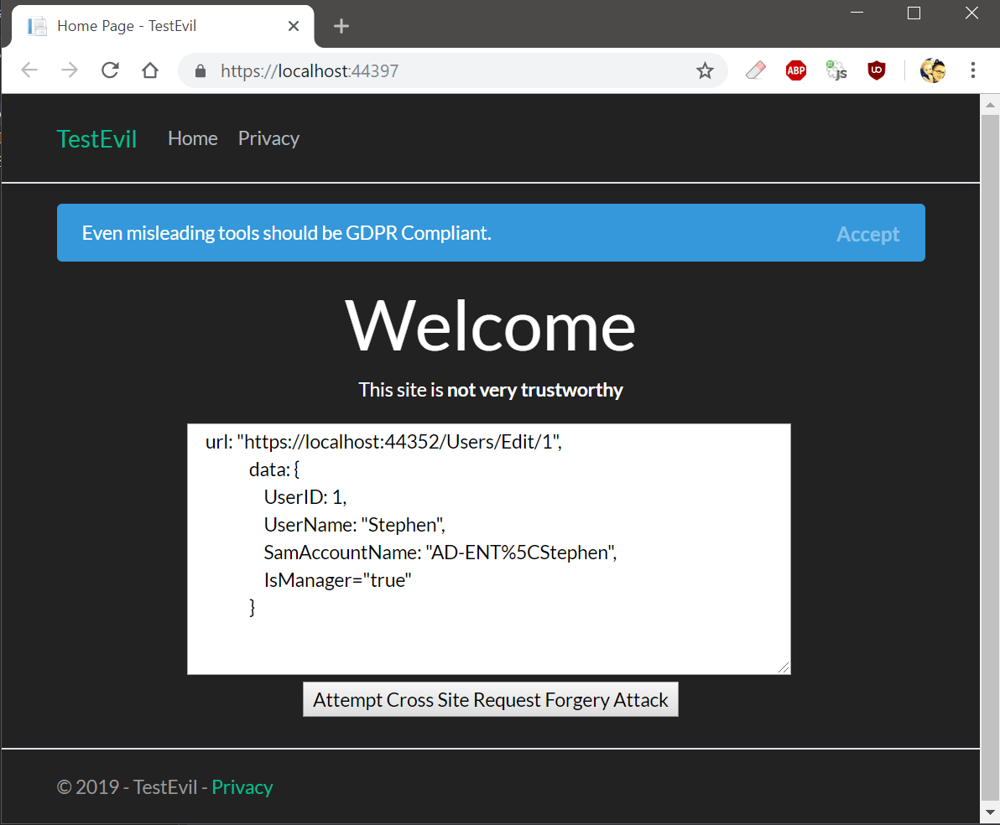
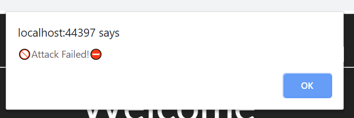

First off, big thanks go to 🐦[Ryan Ephgrave](https://twitter.com/EphingPosh), an incredibly talented and easy to work with PowerShell and dotnet god I have the pleasure to learn from over at #BigBank™ (its a great thing LinkedIn doesn't exist...)

We had a situation arise recently where we needed to create some Integration tests in Pester to validate a long list of web pages to be sure they responded after a deployment.  I started out manually writing a litany of Pester tests by hand like this:
<!--more-->
```
Context 'Post Deployment Validation' {
    It 'Website #1 should be accessible' {
        $url = 'https://someserver:someport/someEndpoint'
        $results = Invoke-WebRequest -Uri $url -UseDefaultCredentials
        $results.StatusCode | should be 200
    }
 
    It 'Website #2 should be accessible' {
        $url = 'https://someOtherserver:someport/someEndpoint'
        $results = Invoke-WebRequest -Uri $url -UseDefaultCredentials
        $results.StatusCode | should be 200
    }[...]
}
```

I spoke with the team about what I was doing and Ryan drew my attention to the very neat `TestCases` of Pester, which you can [read more about here](https://mikefrobbins.com/2016/12/09/loop-through-a-collection-of-items-with-the-pester-testcases-parameter-instead-of-using-a-foreach-loop/).

With a bit of work, I converted my long list of tests (which I typed by hand...why?  Because I finally got a PS4 and I stayed up too late playing Sekiro!) into a JSON file like this.

```
 [
    {
        "SiteName" : "Our Home Page",
        "Url" : "https://someserver:someport/someEndpoint"       
    },
    {
        "SiteName" : "Our WebApp #1",
        "Url" : "https://someOtherserver:someport/someEndpoint"       
    }
]

```


Then to hook this up to our Pester test from before and...

```
Context 'Post Deployment Validation' {
    $EndPointList = Get-Content $PSScriptRoot\Endpointlist.json | ConvertFrom-Json
    $paramArray = @()
    ForEach($instance in $EndPointList){
        $paramArray+= @{
            'SiteName' = $instance.SiteName
            'URL' = $instance.URL
        }
    }
 
    It '<SiteName> should be accessible' -TestCases $paramArray {
        Param(
            [string]$EndpointName,
            [string]$URL
        )
 
        $results = Invoke-WebRequest -Uri $url -UseDefaultCredentials
        $results.StatusCode | should be 200
    }
}

```

Then we run it to see...



#### But what about the post title?

You guys, always sticklers for details.  So this covered a lot of our use cases but didn't cover an important one, that of making sure that one of our internal apps worked after a new deployment. It was a generic MVC app where an authorized user could enter some information and click a button to perform some automation after an approval process.

The issue was that as you could imagine, security is a concern, so time has been spent [hardening tools against attacks like Cross-Site Request Forgery attacks.](http://blog.stevensanderson.com/2008/09/01/prevent-cross-site-request-forgery-csrf-using-aspnet-mvcs-antiforgerytoken-helper/)  Which is great and all, but made automated testing a pain, namely because any attempt I made to submit a test request resulted in an error of one of the following:

> The required anti-forgery form field `__RequestVerificationToken` is not present.
> 
> The required anti-forgery cookie `__RequestVerificationToken` is not present

So what's a dev to do?  Send a PR to disable security features?  Create some new super group who isn't subject to the normal processes, just used for testing?

Of course not!

#### How MVC Antiforgery Tokens work

Any good production app is going to first and foremost use `AspNet.Identity` and some kind of user authorization system to ensure that only approved users have permission to use these tools.  If you don't anyone who can route to the web app can use it.  This is bad.

So let's assume we've done our diligence and we have our web app.  A user has permission to the app and they're following safe browsing behavior.

Let's imagine the app is a simple user management app, something like this, which has a simple class of Users, perhaps with a field to track if they have admin rights or not.

```
class FoxDeployUser
{
    public String UserName {get;set;}
    public String SamAccountName {get;set;}
    public bool IsManager {get;set;}
}
```

Now imagine if your user account has administrative rights to make changes to this system. If so, your account could easily navigate to a `Users/Edit` endpoint, where you'd be prompted with a simple form like this to make changes to a user account.



The scary thing...if the account we are using for this portal is always permitted, and doesn't have a log in process, then **any site while we are browsing the web could make a change to this portal.**

Here's how it would work, assume I want to make a change to this user.  I load up the `/Users/Stephen` endpoint and type in my values and hit Save, right?  What happens in the background (And which we can see in Chrome Dev tools) is that a form Submission is completed.


It simply `POSTS` back to the web server the contents of a form.  And you know what else?  Any website you visit can contain JavaScript that performs the exact same kind of AJAX Post to the web server.  There are even [JavaScript utilities that will automatically discover webservers on your network.](http://http.jameshfisher.com/2019/05/26/i-can-see-your-local-web-servers/)  So with this in mind, imagine visiting a webpage that looks pretty innocuous:

 Black mode = evil website\[/caption\]

Clicking the Post button there will send an AJAX Post formatted like the following:

```
$("button").click(function (e) {
            e.preventDefault();
            $.ajax({
                type: "POST",
                url: "https://MyInternalApp:44352/Users/Edit/1",
                data: {
                    UserID: 1,
                    UserName: "Stephen",
                    SamAccountName: "AD-ENT\\Stephen",
                    IsManager: "true"
                },
                success: function (result) {
                    alert('ok');
                },
                error: function (result) {
                    alert('error');
                }
            });
        });
```

So this is an attack from one-website, through the user's PC, to another website they have access to!

Will it work? If it does, I'll click the button from one site and we'll see the user's 'InManager' property change in the other site.



### Wow that's terrifying

Yep, I thought so too.  Fortunately for all of us, there are a lot of ways to mitigate this attack, and most MVC frameworks (citation needed) ship with them out of the box.  In ASP.net MVC you signal that we should protect an endpoint against a CRSF attack by adding this Annotation to the method.

```
// POST: Users/Edit/5
        [HttpPost]
        [ValidateAntiForgeryToken]
        public async Task<IActionResult> Edit(int id, [Bind("UserID,UserName,SamAccountName,IsManager")] User user)
        {
```

This adds a novel little hidden form box to the UI which contains a one-time use token, embedded in both the form **and the cookies**.

Here's an example of the normally hidden element, which I've revealed using Chrome Dev tools.


Now if I attempt to submit this form, I'll encounter an error, since my attack won't be able to retrieve the form as the user, get the cookies, and then repost back to the endpoint.  Since my post won't have the one-time code needed to do this, it will be rejected at the Controller level.



#### Testing an endpoint which has CSRF Protection

Now, to the meat of the issue.  As part of my Test Suite, I need to run a post through this endpoint and validate that the service after an update is able to perform this business function.

I can do this by maintaining a PowerShell WebSession to get the matching cookies and then submit them using `Invoke-RestMethod`.

```
Describe 'WebApp Testing' {
$Request = Invoke-WebRequest -Uri https://someserver:someport/Users -SessionVariable Session -UseBasicParsing -UseDefaultCredentials
$TokenValue = ''
ForEach($field in $Request.InputFields){
    if ($field.Name -eq '__RequestVerificationToken'){
        $TokenValue = $field.value
    }
}
 
$header = @{
    '__RequestVerificationToken' = $TokenValue
}
 
$fields = @{
    '__RequestVerificationToken' = $TokenValue
    'UserName' = 'TestUser'
    'SamAccountName' = 'QA\TestUser'
    'IsManager' = $false
}
 
It 'WebApp1 : Should edit a User' {
    $Response = Invoke-WebRequest -Uri https://someserver:someport/Users -SessionVariable Session `
        -Method Post -UseBasicParsing -UseDefaultCredentials -Body $fields -Headers $header
    $Response.StatusCode | should be 200
}
 
It 'WebApp1 : Should throw when the user has no token' {
    {Invoke-WebRequest -Uri https://someserver:someport/Users `
        -Method Post -UseBasicParsing -UseDefaultCredentials -Body $fields -Headers $header } | should throw    
}
}
```


My first integration tests.  I'm so proud.  And I'm also kind of ashamed too, because up to this point I'd been manually loading two dozen web pages and making requests by hand to validate deployments.

Thanks for reading!
