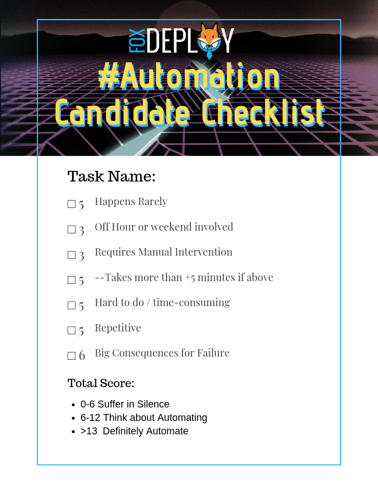
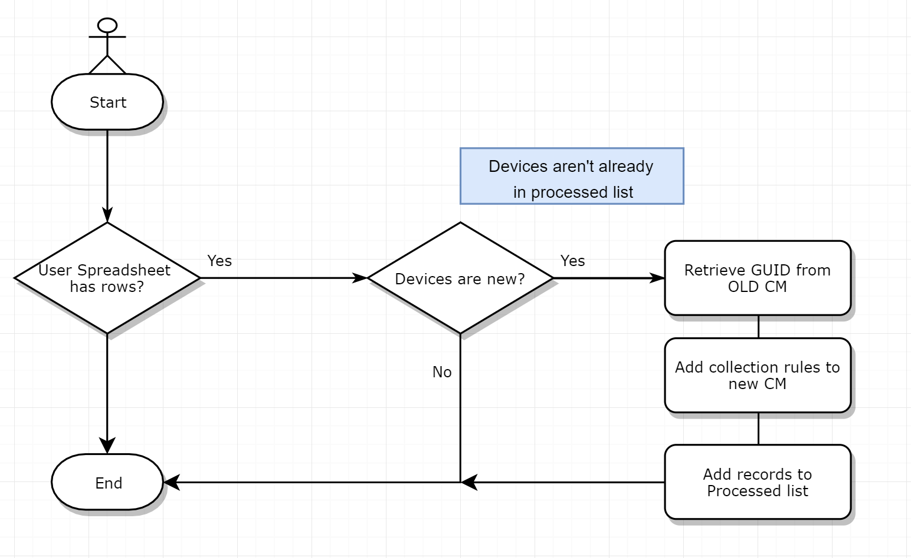

[](/series/LearningGUIs)

**This post is part of the Learning GUI Toolmaking Series, here on FoxDeploy. Click the banner to return to the series jump page!**

* * *


In this series, I thought it'd be fun to walk through the common phases of an automation initiative and specifically show how I love to handle this sort of situation when it arises today.

We'll walk through recognizing a good opportunity to move a manual task to automation covering these three main steps, over the next few posts here:

- Begin with something terrible and manual and ease the pain by adding a simple script
- Increase the sophistication and take it to the next level by adding a User Interface
- Migrate our Automation from a PowerShell UI to a simple and easy [asp.net](http://asp.net/) portal which calls a script to run the task
<!--more-->
Depending on the amount of steam I have left, we may even go one step further and make our dotnet site more advanced, if you all are interested ☺

Our goal is to go from 'hey it actually worked' to 'It works pretty well now', to 'hey it actually still works!'

### Tell me where it hurts

You should always start your automation by finding the biggest pain points or wastes of time and starting there.  Ideal cases are things that:

- Require your specific manual intervention (+3 points)
- Have to happen in an off hour or over the weekend (+5 points)
- Are hard to do, or repetitive  (+5 points)
- Have a nasty penalty if you get them wrong (+5 points)

Add them up and if you're over 10 then you should think about automating it. Hell, if it's over 6, you should automate it.

 Surely Stephen didn't really spend three hours on this thing. Or make a 'chillwave' version of it for basically no reason!\[/caption\]

[😎🌴Alternate Super Synth Wave Version also available🌴😎](../assets/images/2019/09/images/automationchecklist-2.png)

### Background for the task at hand

A sysadmin and engineer friend of mine posed an interesting question at MMSMOA this year (easily the best conference I've been to in a long time, I'd go if you have the chance!)

He has a domain migration taking place at a client and they needed to put just the devices that were migrating that week into a collection which would have the appropriate Task Sequences and software available for it.  The penalty for missing this?  Machines not getting upgraded (**+5 points)**

When the primary sccm client is installed on the machine in the acquisition domain, he needed the machines to go into a collection in the primary sccm environment. That collection would have the cross-domain migration TS advertised to it as required.

His process for this had been to have some technicians deploy the client out to the target devices and then they'd e-mail him the computer names, and he would have to go edit the Collection, adding those new devices to it. 

Other folks couldn't do it because they weren't familiar with CM, so it had to be him too!  (Requires his attention?  **+3 points)** He ended up having to very closely watch his email during migration weekends... Working over the weekend?  (**+5 points)**

People, we are at a thirteen here, this of course is totally unacceptable. Get stuff from an email? Do things manually? No no we had to engineer a fix (and this kind of thing is why MMS is awesome, we had a few wines, enjoying the music and atmosphere of the Welcome Reception and whiteboarded out a solution)

### Solving this problem with automation

If the technicians were trained in CM, they could have simply set the devices as collection members and called it a day. But there was no time or budget to train 5-10 people in CM. So we had to think of an alternative.

We couldn't just add all devices ahead of time to a collection because their device name would change in the process, and furthermore we didn't want to disturb users during the day with the migration and the tons of apps they would be getting. So we then thought about using the device's BIOS Serial Number (GUID) which would stay the same even after a reimage (since he wanted the devices to stay in the collection as well).

But the devices who would get migrated could fluctuate even up to the hours before a migration, when my friend was already out of the office.  Furthermore, for reporting purposes, they wanted to 'babysit' the recently migrated devices for a few days to ensure they recieved all software, so we couldn't just put everybody there.

But we were getting close to a solution.

- Line of business admins would know who were definitely going to migrate towards the end of day on Friday
- Those Users would leave their devices in the office to be updated over the weekend
- Inventory data from their devices in the old CM environment would be available and the user's computer names would be known and confirmed
- Devices would be manually F12'ed and PXE boot into the USMT Migration Task Sequence for the new CM Environment and domain
- If their devices could only somehow end up in the 'Migrated Devices' collection in the new CM, we would be set, because the Required apps in that collection would have all of the apps those users would need

### The Process we came up with

There are probably a number of different and better ways this could be handled (I was thinking of something clever using the time since the devices were added to the new CM instance as a Query Rule for the collection, but didn't vet it out), but we hashed out retrieving the BIOS Serial Number and using that as a query rule for the Collection.

We came up with a simple scheduled task that would run a script. It ain't amazing but it's enough to get though this need and we can then use the bought time to make something a bit nicer too.

The script will :

- Look for devices which have been added to a CSV file by the LOB guys
    - If nothing there, exit
- Compare them and see if any of them are not already in our Processed list ( a separate CSV file we will control which they cannot alter)
    - If all devices have been processed, exit
- Hit the old CM server via SQL and retrieve the needed GUID info from V\_R\_System
- Add new collection rules for each item found, trigger a collection refresh
- Add records to processed list and then exit

Or, in flowchart form, complete with a little XKCD guy.

 Guess how long it took to make this flowchart? Now multiply it by four. Now we're in the neighborhood of how long it took\[/caption\]

Since we will only ever add a device once to the new collection, we could safely set this to run on a pretty aggressive schedule, maybe once every 15 minutes or so.  If the new CM were really under a lot of load, of course this could be altered greatly.

### And now, let's code

OK, enough theory and planning (although this is kind of my favorite part about having been an automation consultant, and now my current role).

To begin with, users have their own spreadsheet they update like this, it's a simple CSV format.

```
HostName    Processed   ProcessedDate
SomePC123
SomePC234
SomePC345
```

They are free to add new hostnames whenever they like.   Their files live on a network drive which the central automation server can access.  The script is pretty self-explanatory for the first half, standard checking to see if the file shares are there, then checking the files themselves to see if we have any rows which we haven't marked as processed yet.

```
$Date = Get-date
$LOBDrives = "\\someDC\fileShare\ITServices\LOB_01\migrationfile.csv",
             "\\someDC\fileShare\ITServices\LOB_02\migrationfile.csv",
             "\\someDC\fileShare\ITServices\LOB_03\migrationfile.csv"
$masterLog = "\\someDC\fileShare\ITServices\master\migrationfile_reference.csv"
$ValidLobFiles = @()
$RecentlyMigratedCollectionName = "w10_Fall_Merger_RecentlyMigratedDevices"
 
Write-Verbose "Online at $($date)"
Write-Verbose "Looking for new items to process"
Write-Verbose "Found $($LOBDrives.count) paths for processing"
 
If (Test-path $masterLog){
    Write-Verbose "Found master file for reference"
    $ProcessedLog = import-csv $masterLog -Delimiter "`t"
}
else{
    Throw "Master file missing!!!"
}
ForEach($LOBFile in $LOBDrives){
    If (Test-Path $LOBFile){
        Write-Verbose "Found $($LOBFile)"
        $ValidLobFiles += $LOBFile
    }
    else{
        Write-warning "Could not resolve $($LOBFile) for processing"
    }
}
 
$itemsToProcess = New-Object System.Collections.ArrayList
ForEach($validLObFile in $ValidLobFiles){
    $fileCSV = Import-CSV $ValidLobFile -Delimiter "`t"
    ForEach($item in $fileCSV){
        If ($item.Processed -ne $true){
            If($ProcessedLog.hostname -notContains $item.HostName){
                [void]$itemsToProcess.Add($item)
            }
            else {
                Write-warning "$($item.Name) was already processed, ignoring"
            }
 
        }
    }
}
 
Write-Verbose "Found $($itemsToProcess.Count) items to process"
```


This was all pretty boiler plate, but it's about to get more interesting. Next up, we have a short custom PowerShell cmdlet which uses a custom SQL cmdlet one of my peers--the venerable and always interesting [Fred Bainbridge](https://www.fredbainbridge.com/)\--[published for lightweight SQL Queries.](https://github.com/fredbainbridge/mmsSQL/tree/master/Commands)

```
Function Get-FoxCMBiosInfo {
    param([string[]]$ComputerNames)
 
    $items = New-Object System.Collections.ArrayList
    ForEach($computerName in ($ComputerNames.Split("`n").Split())){
        If ($computerName.Length -ge 3){
            [void]$items.Add($computerName.Trim())
        }
    }
 
    $inStatement = "('$($items -Join "','")')"
 
    $query = "
    select vSystem.Name0,vSystem.ResourceID,BIOS.Caption0,Bios.SerialNumber0
        from v_r_system as vSystem
        join dbo.v_GS_PC_BIOS as BIOS on BIOS.ResourceID = vSystem.ResourceID
 
    where vSystem.Name0 in ($inStatement"
 
    Invoke-mmsSQLCommand $query
}
```

It returns objects like this.

```
Name0   ResourceID  SerialNumber0                     Caption0
SCCM    16777219    4210-1978-6105-2643-9803-3385-35  NULL
DC2016  16777220    7318-9742-4948-8961-3362-1212-32  NULL
W10-VM  16901071    6145-4101-5130-6042-4046-8711-91  NULL
SomeFox 16901086    7318-9742-4948-8961-3362-1212-32  Hyper-V UEFI Release v3.0 
```

This lets me then run the rest of the script, stepping through each item we need to process and adding Query Rules for the BIOS Serial Number to CM in the new environment.

```
#Look up SQL values
$BIOSValues = Get-FoxCMBiosInfo $itemsToProcess.Name
 
#Add new direct rules
 
$Collection = Get-CMDeviceCollection -Name $RecentlyMigratedCollectionName
 
ForEach($item in $BIOSValues){
Add-CMDeviceCollectionQueryMembershipRule -CollectionName $CollectionName `
  -QueryExpression 'select SMS_R_System.ResourceId, SMS_R_System.ResourceType, SMS_R_System.Name, SMS_R_System.SMSUniqueIdentifier, SMS_R_System.ResourceDomainORWorkgroup, SMS_R_System.Client from  SMS_R_System inner join SMS_G_System_PC_BIOS on SMS_G_System_PC_BIOS.ResourceId = SMS_R_System.ResourceId where SMS_G_System_PC_BIOS.SerialNumber = "$($item.SerialNumber0)"'
  -RuleName '$($item.Name0)'
} 
 
#loop back through original files and mark all as processed 
 
ForEach($LOBFile in $LOBDrives){
    If (Test-Path $LOBFile){
        Write-Verbose "Found $($LOBFile)"
        $fileCSV = Import-CSV $ValidLobFile -Delimiter "`t"
        forEach($line in $fileCSV){
            if ($itemsToProcess.HostName -contains $line.HostName){
                $line.Processed = $true
                $line.ProcessedDate = get-date
 
            }
 
            $newCSV += $line
        }
        export-csv -InputObject $newCSV -Path $LOBFile -Delimiter "`t"
    }
    else{
        Write-warning "Could not resolve $($LOBFile) for processing"
    }
}
 
#update master file
ConvertTo-Csv $itemsToProcess -Delimiter "`t" | select-object -skip 1 | add-content $masterLog

```

Finally, we update the migration files for each LOB, as well as our central master record and then sleep until the next hour comes along.

> Why don't you use the Pipe anywhere?

We found at work that there are various performance penalties which can add up when performing complex operations in the PowerShell Pipeline.  For that reason, we still use the pipeline for one off automation tasks but in scripts, it just much easier to debug and test and support to use `ForEach` commands instead.

#### Next time

So that takes us from the task, through ideation, through a pretty good working solution to handle this terrible task.

Join us in phase two where we make this more sophisticated with a UI, and then phase three where we move the whole process to a centralized web UI instead.  Have some other ideas?  Drop me a line on twitter or reddit and we'll see if we can work it into a future post.
