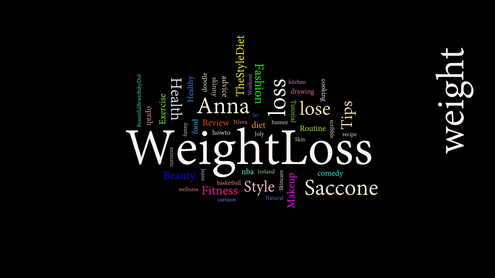
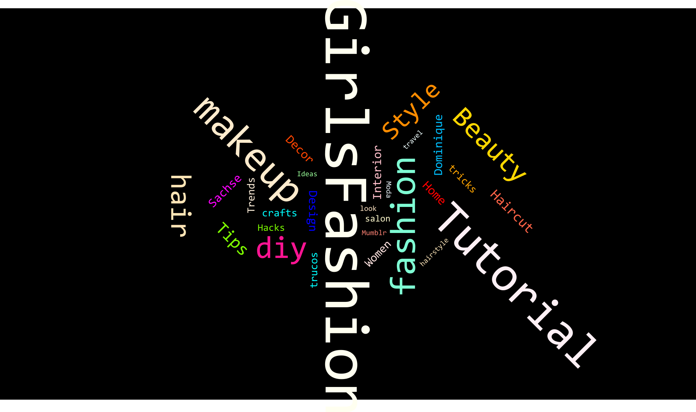
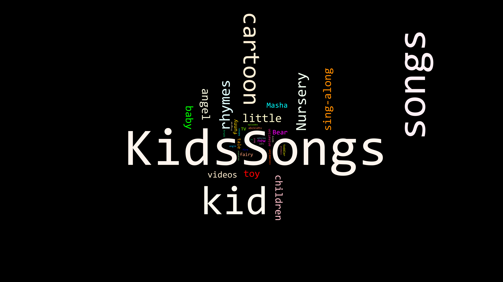

**Trigger Warning** : _I discuss eating disorders and my opinions pro-eating disorder media briefly in this post. If this content is difficult for some, I recommend scrolling past **The Background** and resuming at **The Project** instead._

#### Background

I ❤ YouTube. I have learned so much about development from folks like [I am Tim Curry](https://www.youtube.com/watch?time_continue=2&v=vN9NRqv7xmY&feature=emb_logo), or from the amazing [Microsoft Virtual Academy courses from Jeffrey Snover and Jason Helmick](https://www.youtube.com/watch?v=nMn8-BbRsN8&list=PLyJiOytEPs4etH7Ujq7PU7jlOlHL-9RmV) ([original link )](https://channel9.msdn.com/Series/Advanced-PowerShell-DSC-and-Custom-Resources?l=3DnsS2H1_1504984382).
 <!--more-->
Most days I catch the repeats from [Stephen Colbert](https://www.youtube.com/channel/UCMtFAi84ehTSYSE9XoHefig), and then jam out to [synthwave](https://www.youtube.com/watch?v=a0O616pwkYk) or [chillhop](https://www.youtube.com/watch?v=VaZYyx0ae_s). In fact, [I listened to one particular mix](https://www.youtube.com/watch?v=glHtYwHidUY) so many times while learning c# that I still get flashbacks when I hear the songs on it again...sleepness nights trying to uncover everything I don't know. I even have my own Intro to PowerShell Video that I [think my mom watched 70,000 times](https://www.youtube.com/watch?v=YHtZY6pASAI).

My kids grew up [singing songs from Dave and Eva](https://www.youtube.com/watch?v=kNPsqzzoekw), [Little Baby Bum](https://www.youtube.com/watch?v=Cfb-qp1h_E0), [Super Simple Songs](https://www.youtube.com/watch?time_continue=2&v=PDnXXgK-OXI&feature=emb_logo) and now [Rachel and the TreeSchoolers](https://www.youtube.com/watch?v=NDqOcpRSExU), and it was one of the first services I signed up for and still pay for today (aside from NetFlix, and that one stint where I got CDs through the mail, yeah...)

But a few months ago I heard that YouTube will recommend videos which are pro eating-restriction and bulimia within four videos of the sorts of content targeted at young children. I have a history with people who experience these disorders and want to be sure we face it head on in my family, but that doesn't mean I will allow impressionable minds to be exposed to content which presents this issue in a positive light.

If YouTube is _not_ going to be safe for the type of stuff my children want to watch, I needed to know.  Unfortunately the person who told me of this can not remember their source, nor could I find any decent articles on the topic, but I thought that this smelled like a project in the making.

####  The Project

I wanted to see which sorts of videos YouTube will recommend as a user continues to watch videos on their site. I started with two sets of videos, one for girls fashion and the other for weight loss information.

[Fashion](https://www.youtube.com/watch?v=ml2E8TnU-oA) 1, Fashion 2, Fashion 3

[Weight 1,](https://www.youtube.com/watch?v=Jhq23NKsjjg) [Weight 2](https://www.youtube.com/watch?v=PWCNtdR9DN0), Weight 3

For each video, we would get the video details, its tags, its thumbnail and then also the next five related videos.  We'd continue until we hit 250 videos.

####  Getting set up

Setting up a YouTube API account is very simple. [You can sign up here](https://developers.google.com/youtube/v3/). Notice how there is no credit card link? Interestingly from what I could tell, there is no cost to working with the YoUTube API. But that is not to say that it's unlimited. [YouTube uses a Quota based program where you have 10,000 units of quota](https://developers.google.com/youtube/v3/getting-started#quota) to spend a day on the site. Sounds like a lot but it is _**really**_ not when doing research.

| Operation | Cost | Description |  |  |
| --- | --- | --- | --- | --- |
| v3/videos?part=snippet,contentDetails | 5 | retrieves info on the video, the creator, and also the tags and the description |  |  |
| v3/Search | 100 | retrieves 99 related videos |  |  |
| SaveThumbnail | 0 | retrieves the thumbnail of a video given the videoID |  |  |

I hit my quota cap within moments and so had to run my data gathering over the course of a few days.

As for the thumbnail, I couldn't find a supported method of downloading this using the API, but I did find [this post on StackOverflow](https://stackoverflow.com/questions/2068344/how-do-i-get-a-youtube-video-thumbnail-from-the-youtube-api) which got me started.

#### The Functions

Once I wrote these functions, I was ready to go:

- [Connect-PSYouTubeAccount](https://github.com/1RedOne/PSYouTube/blob/master/Public/Connect-PSYouTubeAccount.ps1)
- [Get-PSYouTubeRelatedVideo](https://github.com/1RedOne/PSYouTube/blob/master/Public/Get-PSYouTubeRelatedVideo.ps1)
- [Get-PSYouTubeVideoInfo](https://github.com/1RedOne/PSYouTube/blob/master/Public/Get-PSYouTubeVideoInfo.ps1)
- [Get-PSYouTubeVideoThumbail](https://github.com/1RedOne/PSYouTube/blob/master/Public/Get-PSYouTubeVideoThumbail.ps1)

Connect-PSYouTubeAccount is just another credential storage system using SecureString.  Be warned that other administrators on the device where you use this cmdlet could retrieve credentials stored as a SecureString.  If you're curious for more info, [read up on the DPAPI here](https://stackoverflow.com/questions/6982236/how-is-securestring-encrypted-and-still-usable) , [or here](https://giuliocomi.blogspot.com/2019/08/insecure-secrets-encryption-at-rest.html),  or ask [JeffTheScripter](https://twitter.com/JeffTheScripter), as he is very knowledgable on the topic.  FWIW this approach stores the key in memory as a SecureString, then converts to string data only when needed to make the web call.



#### The Summary

You can access the data I've already created here [in this new repository, PSYouTubeScrapes](https://github.com/1RedOne/PSYouTubeScrapes).   But just be aware that it is kind of terrible UX looking through 8,000 tags and comments, so I took a dependency on the [awesome PSWordCloud PowerShell module](https://github.com/vexx32/PSWordCloud) which I used to make a wordcloud out of the most common video tags.

> A note on YouTube Comments: they contain the worst of humanity and should never ever be entered by any person.  I intentionally decided not to research them or publish the work I did on them, because, wow.

So, here is a word cloud of the two datasets, generated using this script.

https://gist.github.com/1RedOne/8ceb22e662d6b75af2a956bec7407ad6

 Anna Saccone has a LOT of fashion and weight videos, but seemed pretty positive from what I saw\[/caption\]

#### The Conclusion

All in all, I felt that the content was pretty agreeable!  if the search for children's videos DID surface some [stranger children's videos like this one,](https://www.youtube.com/watch?v=OqDXIC_brT0) I have to say that I didn't think any of the videos were overly negative, exploitative, nor did I see any 'Elsagate' style content.  That's not to say that YouTube is perfect, but I think it seems safe enough, even if I will probably review their YouTube history and let them use YouTube Kids instead of the full app.

Have a set of recommended videos you'd like me to search like this?  Post them in a thread on /r/FoxDeploy or leave a comment with your videos and I'll see what we come up with.

If you conduct your own trial with this code and example and want to share, feel free to submit a pull request to the repo as well (note that we `.gitignore` all jpeg and png files to keep the repo size down).  You can access the data I've already created here [in this new repository, PSYouTubeScrapes](https://github.com/1RedOne/PSYouTubeScrapes).
