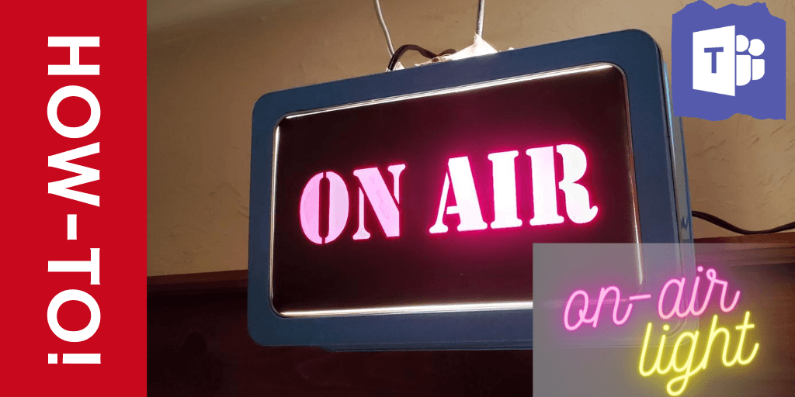
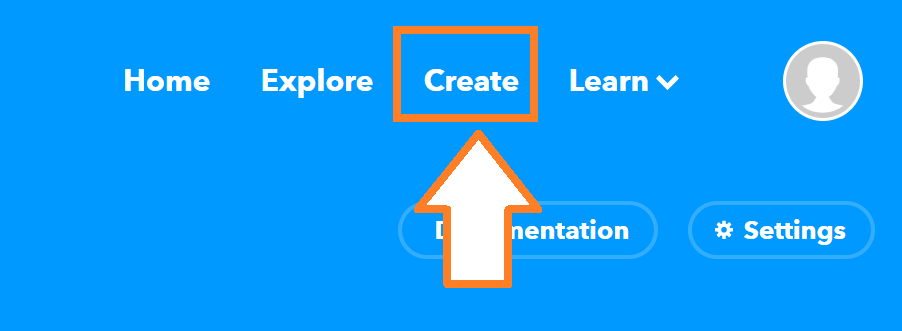
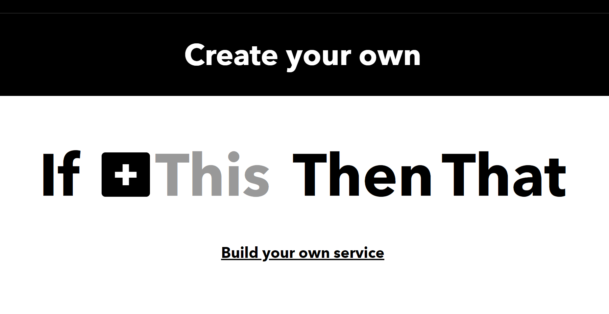
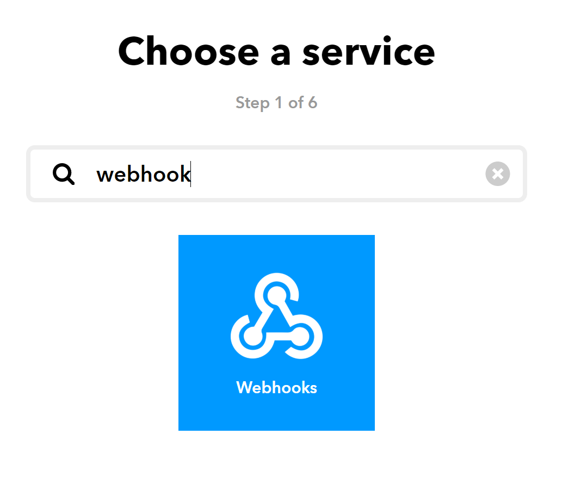
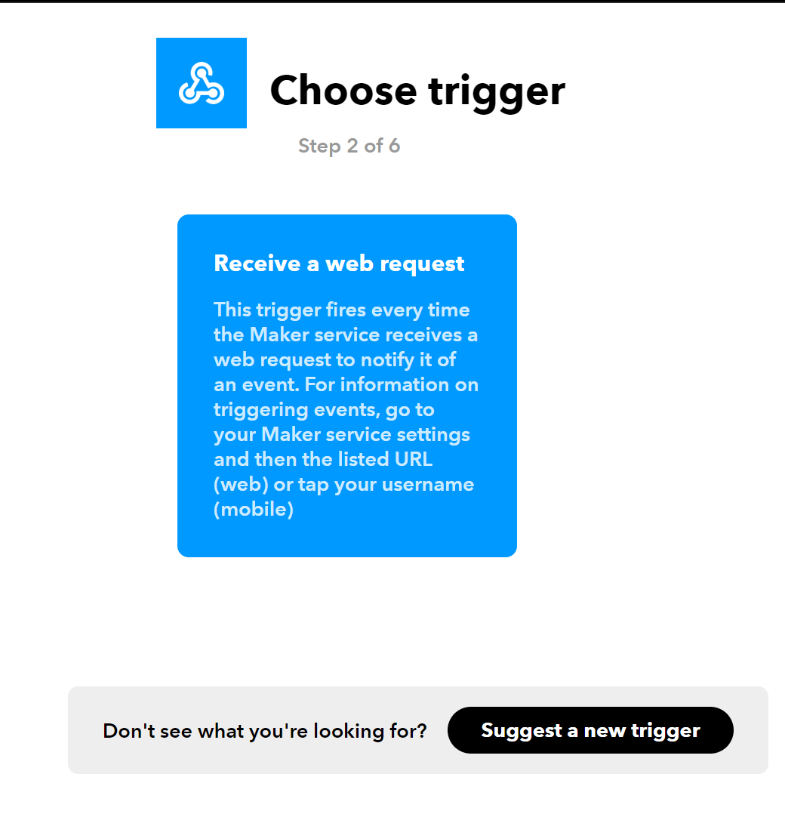
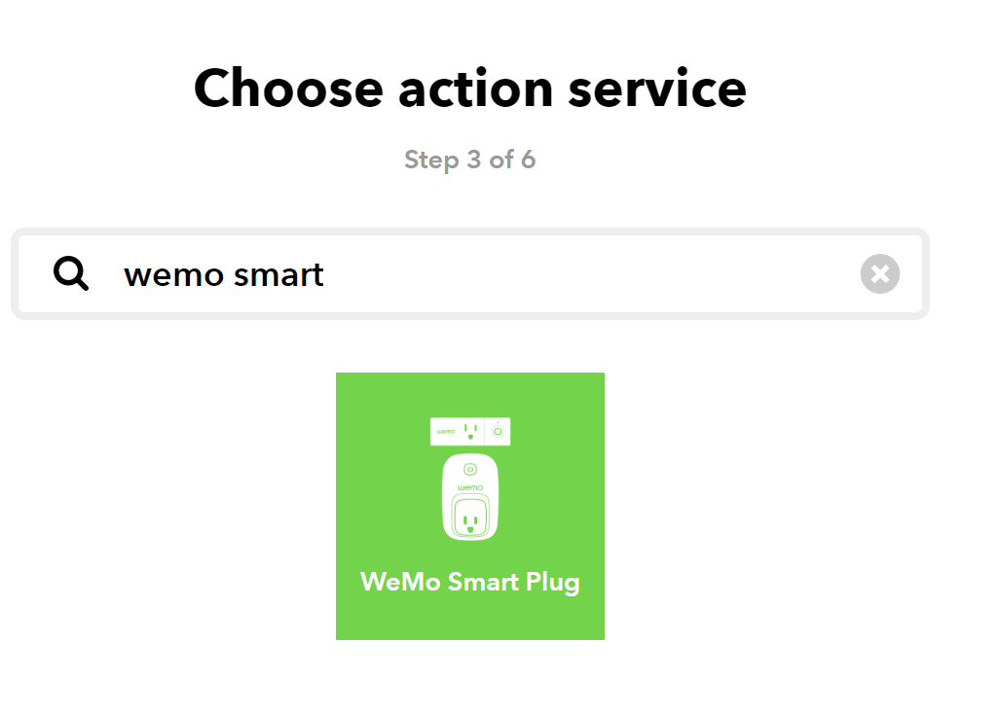
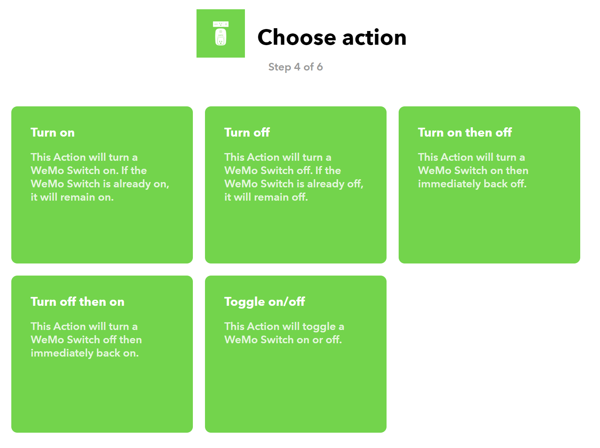

Children. You love them. They in turn, run into your meetings all the time. Sometimes wearing pants.

Wouldn't it be great to have a way to keep them informed of when Daddy or Mommy is in a meeting? Something nice and big and obvious that they can just totally ignore, right?

That's why I sought to design my own perfect on-air light, to automatically turn on when I joined Teams Meetings.  Won't you join me in this journey together, and you can build your own?



## Why make one?

Great question, and if either of these describe you, you can probably just stop and buy one of the off the shelf products that answer this need.

- I don't have a closed door I can work behind.
- It would be ok to just have something for my desk
- I enjoy inflicting my children upon others

But if you do want to make your own...read on!

### You will need...

- Wemo Smart Switch (I'm using the small rectangular ones)
- Wemo App installed on a device
- A free Account for IFTT
- The Lync 2013 SDK (just the \`Microsoft.Lync.Model.dll\` to be precise)
- A suitable Lightbulb
- A very talented partner to lovingly fashion your On-Air light for you!

With all of the products acquired, let's get started.

### Setting up the Smart Switch

This can be surprisingly hard. If you buy the three or five packs of the Wemo Mini Smart Switch, rectangular style, they will likely be the Mini.82C or F7C063. Depending on your luck and if you buy the bulk packaging, you might end up with ones like I got, which had Firmware so old the Wemo Smart app as of July 2020 would be unable to configure them.

If that happens to you, here's how to get them going.

1. Plug in Smart Switch
2. On your phone, disable automatic Wireless Switching in your WiFi settings (this is on you to find, but it's probably under Advanced settings)
3. When the Switch blinks White/Orange, connect directly to its WiFi network manually.
4. Now open the Wemo App.
5. It will launch in the 'Add new device' experience, so proceed to now connect as usual, give the device a good name, then update the Firmware.

Do this for each switch to make your life easier.

I'm calling my device 'MeetingLight'.

**Before moving on**, you should have one plug connected to a light or fan or whatever that responds when you turn it on and off with the Wemo app.

### Connecting Switches to IFTTT

If-This-Then-That is an awesome resource, an automation engine that provides endless capabilities and is really amazing and wonderful.

I like it. I like it a lot.
https://www.youtube.com/watch?v=FD2qrBRy84k&feature=emb\_logo

In this section, we'll create a new flow we can use that starts with a Web Push and ends with asking Wemo nicely to do something for us.

Login to [https://ifttt.com](https://ifttt.com)/ and click on Create.



Click on 'This' and choose 'Webhooks':

* You actually do click the plus sign or the word This!*

This is the icon you are looking for.

 The Webhook logo is so pretty!\[/caption\]

Select 'Recieve a web request'

 This is so cool!\[/caption\]

Next, choose 'That', where we'll tell IFTTT what to do when this flow happens.

 The User interface speaks to me! See, it's the same logo but now it calls out that the flow begins with a Webhook. Excellent UX.

Search for Wemo Smart Plug and you'll have to login to an oAuth process to connect the services together.

 You'd pick your smart bulb, fan or crockpot if you were turning those on and off when entering a meeting...

Hm, maybe a flow to trigger my George Forman grill to make some bacon for me?

 There are a lot of possibilites here!

### Connecting to the Device

Now, pick the smart device we setup way back in section one to enact the action upon.


I am picking 'Meeting light'.


Finally, click 'Finish' on the review and finish page, and go ahead and try it out to confirm your flow works.

💡 Do this one more time to setup a 'TurnOffTheLight' flow too! 🤓

My two flows are named `meetingStart` and `meetingStop`.

### Retrieve the URL and convert to a PowerShell Function

This part is so easy, still within IFTTT, click on 'Documentation' from the [Maker:Webhooks](https://ifttt.com/maker_webhooks) page.

 Clicking here on the Documentation button shows you how to formulate your requests to IFTTT.\[/caption\]

I only drew a big box in the screen shot because I, embarrassingly, just couldn't find it!  The next page shows you your API key and how to trigger your events.


This will show you how to formulate your request and the URL to hit.

``` 
https://maker.ifttt.com/trigger//with/key/ 
```

> But aren't these tokens in the clear?

 

No they are not. With HTTPS, as we have discussed before on this blog in [The Case of the Spooky Certificate](http://foxdeploy.com/2016/09/16/winrm-https-and-the-case-of-ghost-certificate/), even the URL itself is secured and passed as an encrypted body parameter. Only the target server, in this case maker.ifttt.com is transmitted in clear.

Now let's make these into the worlds ugliest PowerShell functions.

```
Function meetingStart { irm https://maker.ifttt.com/trigger/meetingStart/with/key/apiKeyGoesHere -method Post }

Function meetingStop { irm https://maker.ifttt.com/trigger/meetingStop/with/key/apiKeyGoesHere -method Post } 

```

And to test them...

\[wpvideo UwujNGe0\]

## Connecting to Microsoft Teams

Here you will need the [Microsoft Lync 2013 SDK](https://www.microsoft.com/en-us/download/details.aspx?id=36824). You don't have to install it, just open the .exe with 7Zip then manually run the x86 flavored `.msi`.

Or if you're _really cool_, extract that too and just get this dll file, `Assemblies\Desktop\Microsoft.Lync.Model.dll`.

You can also just search for it on the web, some folks bundle it on Github with their projects.

**_Once you have that..._**

As of this writing, retrieving user presence through the Graph API requires special permissions. Some tenants, like your companies Office 365 tenant might allow regular users a token to retrieve delegated info, but not all tenants do this. If they don't then you may require Tenant Admin permissions to hit the Graph API and get presence state back.  I felt that was kind of overkill to turn on a light, if you ask me so I looked to other options.

> Wait, what is user presence?

It's the the Office Unified Communications (sometimes called Office UC) term for being Away, Present, Presenting).

Next up, I had poor luck using the modern OfficeUC SDK to connect directly to Teams to retrieve the status and gave up after a few hours, in the interests of staying true to the 'pressures on' hackathon spirit.

So, to retrieve status, we will query it from Skype4Business! How elegant, right?

### Getting into it

The root of our woes is that the presence of a person is protected info, and rightly so. Imagine if a vendor knew the second you sat down at your desk and could call you every time.  It would get old, and fast.

To be trusted with presence info, apps like Office, Teams and Skype all had to do some heavy lifting to retrieve and set our Presence state, and we can only view that info about peers if we authenticate and use our account, or are federated, which means using an account.  Again, heavy lifting.

So, in order for us to do it in code, here's what we can do.

```

Add-Type -Path "C:\Program Files (x86)\Microsoft Office 2013\LyncSDK\Assemblies\Desktop\Microsoft.Lync.Model.dll";

#Gets a reference to the currently running Skype4Business client $lyncclient = [Microsoft.Lync.Model.LyncClient]::GetClient()

#Gets a reference to our special contact object from Skype $myContact = $lyncclient.Self.Contact;

#Calls our contact to update the status and retrieve an \`Availability\` property back $myState = $myContact.GetContactInformation("Availability") 

```

See, even retrieving our own state results in a call that Lync/Skype4Business processes for us.

But it works! Now to bake the whole thing into some code to run...


And it works! When I join a call or a meeting, in just a few moments, the light outside my door turns on!

 Ain't she a beaut!\[/caption\]

I realize that my instructions on how to actually make the On Air light fixture are akin to this.


My wife made the whole thing for me!  She used a leftover children's crafting lunchbox and some black and red vinyl for the graphic, which she cut out using a Cricut machine.

### What's next?

I'll update this as I find better ways to do it, of course. Wait, before you leave, do you know of a better way!?

Share it in the comments or on our subreddit! Did you make your own? I'd love to see it!

Tag me on Twitter @FoxDeploy and I'll retweet the coolest on-air lights folks create.
