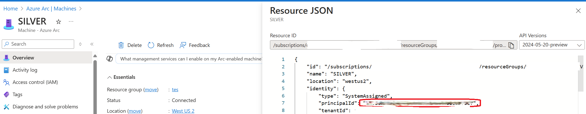
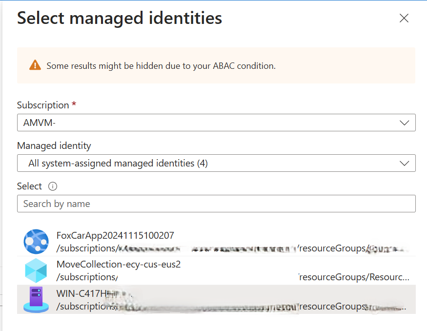
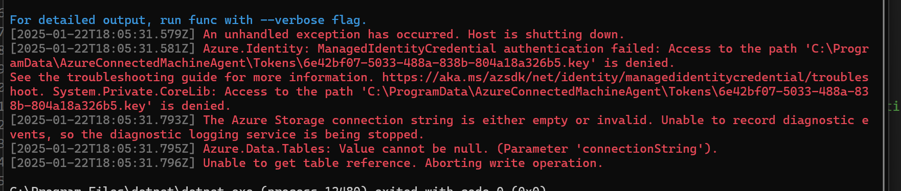
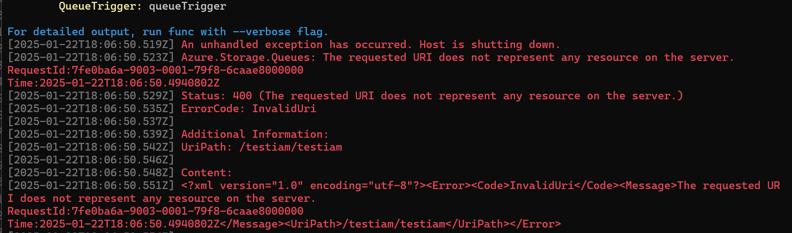
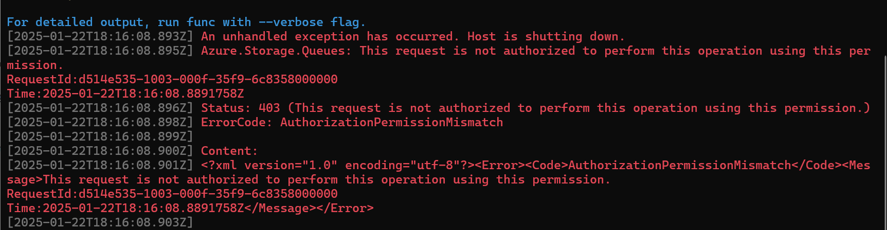
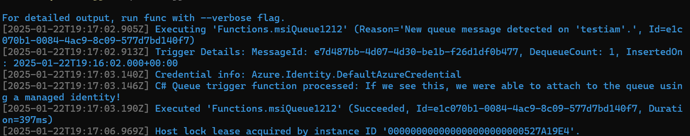
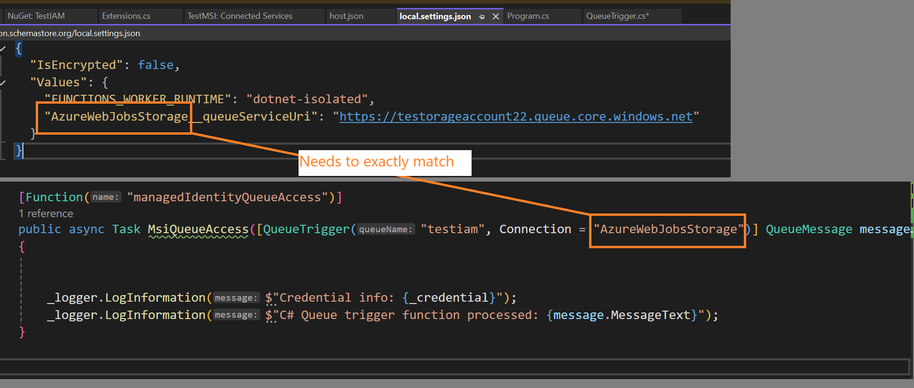

Recently I came upon the need to harden how some Azure Functions were setup.  Specifically, they were Azure Functions setup to fire and run some c# code when a message was dropped into a message queue.  They worked great, but we would much rather use the security of a Managed Identity to connect, instead using of using a connection string.


So, the process I took here was to first build a new Function App of type Queue Trigger, and configure it to use a Connection String to connect.

Once I had my Queue Trigger created, I looked at the docs for Azure Functions to see the requirements for using Managed Identities.

[Docs Link](https://learn.microsoft.com/en-us/azure/azure-functions/functions-reference?tabs=blob&pivots=programming-language-csharp#configure-an-identity-based-connection)

According to these docs, I need to update to Azure Queues Extension version 5.0.0 or later, so I did that first.

Next, the docs say that to configure Azure Functions to use an MSI instead of an environmental variable for connectionString, we simply add a new variable to our `local.settings.json` file.


```local.settings.json
{
  "IsEncrypted": false,
  "Values": {
    "FUNCTIONS_WORKER_RUNTIME": "dotnet-isolated",
    "AzureWebJobsStorage__queueServiceUri": "https://testorageaccount22.queue.core.windows.net/testiam"
  }
}
```

I added the `AzureWebJobsStorage__queueServiceUri` value, this is just set to the storage account I am using.  According to the docs, when you're using Azure Function Extensions v5 or higher, setting this config value instructs the Azure Function runtime to try and connect using a MSI.  

>To me, this is extremely non-intuitive and very confusing, but that's how it's done right now.  

Next, I updated the signature of my function to be sure it is referencing the value from my settings file.

```c-sharp
//from 
//public void Run([QueueTrigger("testiam2", Connection = "connectionString")] QueueMessage message)

//to
public async Task MsiQueueAccess([QueueTrigger("testiam", Connection = "AzureWebJobsStorage")] QueueMessage message)

```

Note how the Connection contains 'AzureWebJobsStorage', while the same settings prefix is found in the `json` file as well.  That specific value is what triggers the new MSI features.


 So let's see what happens when I fire it up!


```
Host lock lease acquired by instance ID '000000000000000000000000527A19E4'.
[2025-01-22T16:48:16.609Z] An unhandled exception has occurred. Host is shutting down.
[2025-01-22T16:48:16.612Z] Azure.Identity: ManagedIdentityCredential authentication failed: Service request failed.
[2025-01-22T16:48:16.614Z] Status: 503 (Service Unavailable)
[2025-01-22T16:48:16.615Z]
[2025-01-22T16:48:16.616Z] Content:
[2025-01-22T16:48:16.616Z] {"error":"service_unavailable","error_description":"Service not available, possibly because the machine is not connected to Azure or the config file is missing. Error: missing required agent config properties. Current agent config: {Subscriptionid: Resourcegroup: Resourcename: Tenantid: Location: VMID: VMUUID: CertificateThumbprint: Clientid: Cloud: PrivateLinkScope: Namespace: CorrelationID: ArmEndpoint: AtsResourceId: AuthenticationEndpoint:} (config file location: C:\\ProgramData\\AzureConnectedMachineAgent\\Config\\agentconfig.json). Connection status: Disconnected. Check Agent log for more details.","error_codes":[503],"timestamp":"2025-01-22 11:48:16.5491276 -0500 EST m=+544299.660283901","trace_id":"","correlation_id":"97f841ea-68cd-4521-8278-3e8537341acf"}
```

### Do I even have a Managed Identity Yet?

Hmm, that does not look like success.  I noticed that the Subscription, Rg and all of those fields are all empty, likely because my dev laptop does not have an MSI on it.  I was assuming this would be smart enough to try and use the same flow as DefaultAzureCredential, but I guess not.  

So let's instead enroll my machine in ARC to see what happens when there is an MSI associated...

With that done I can now view the resource in Azure and see the Managed Identity which was created for me.

You can view the MSI created for an Arc device by looking at the 'Resource JSON view', and see it's GUID.



Now, to go to my storage account and give this identity (which Helpfully I can assign just by the name of the machine, not the guid displayed) some permissions to interact with the storage account.  

I assigned it 'Storage Blob Data Owner' perms and then restarted the app.



Now I have a different problem, instead of an error saying that I don't have an Managed Identity, I get this error that I can't access the Tokens directory.  



To fix this, I navigated to the directory and gave myself owner rights (suitable for debugging, and not needed in prod when this is deployed to a *real worker* with a *real MSI*).

And now a different error.  The storage account does not exist?



OH I had the format of the URL incorrect, it should not include the name of the queue as I had done.

```
Before
    "AzureWebJobsStorage__queueServiceUri": "https://testorageaccount22.queue.core.windows.net/testiam"

After
    "AzureWebJobsStorage__queueServiceUri": "https://testorageaccount22.queue.core.windows.net/"
```
And now to restart once more...and now a new error!  




I thought about it and realized I granted Azure Blob Storage Data owner perms but don't recall doing anything related to queues, so lets try adding that too.  I specifically added the `Azure Queue Storage Contributor` role this time and when I fire it up....

Success!


## Quick Takeaways
The big takeaways here are:

 - It IS possible to test Managed Identities on a normal dev machine or laptop, you'll just need to enroll the machine in Arc to assign a managed identity
 - You can use the automatic System Assigned MSI for your machine or any user created MSI
 - You will need to assign these permissions to the Managed Identity 
 - - Subscription Reader for the sub holding the Storage Account
 - - Storage Data Owner permission for the Storage Account
 - - Storage Queue / Table / Blob Contributor for the Storage Account
 - When assigning to Prod, instead use User Assigned Managed Identities so one MSI can be shared on your prod devices within a region, for ease of management

Some other weird takeaways is that all of this is configured using appSettings.json files, and namely some properties with very unintuitive names, like `AzureWebJobsStorage_StorageAccountUri`. To me, this feels like something that will likely change in a future release, so I would keep my eyes on this area.

## TLDR

The three  most important things are:
* be sure you upgrade to Extensions version 5 or higher
* change your Queue Triggers Connection parameter to match the *prefix* of the setting in your json file (see example image below)
* go to your `local.setttings.json` file and add a setting of `prefix___queueServiceUri` for queues, or the other values for other types of Azure Storage based triggers

Service Type | Value
--|--
Azure Blob Service | AzureWebJobsStorage__blobServiceUri	
Azure Queues | AzureWebJobsStorage__queueServiceUri	
Azure SQL Tables | AzureWebJobsStorage__tableServiceUri	

## Wait, prefix what?

I know, I know, this stuff was rather hard for me to understand too and took a half a day to figure it out.


