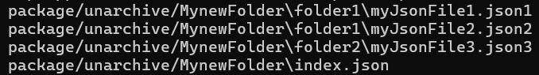
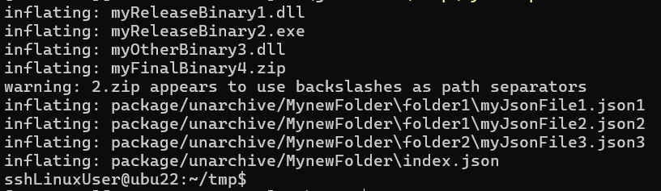

Recently, I ran into one of those DevOps nightmares that only shows up when all the stars are aligned just wrong. The kind where you stare at the screen and say, "This should work," and then it **doesn’t**. And worse **PowerShell lies to you**.  I thought PowerShell and I had something special...how could it treat me of all people like that.

This is the story of how an innocent ZIP file became haunted, how PowerShell 5 doomed a build, and how I barely escaped with my sanity (and deployment pipeline) intact.

---

## Observed behavior: things looked... fine?

We use YAML Pipelines in ADO which not surprisingly I find that I really enjoy.  This is like the evolution of using System Center (or Opalis) Orchestrator to achieve complex automation.  

And if you are surprised that I enjoy this, then you must be new here!

**Well**, Recently I needed to add a new folder into a zip we produce in our build process.  I told management that this would be trivially easy, barely an inconvenience, only three days at max.

Previous to this point, all of our artifacts in our build would be single binary files, like .exe and .dll files and things.  We'd take all the built bits, put them into our OUT dir and make a zip file out of the whole mess.  Then our Release would grab the output and push it out to our regions and bam, it all just worked.

But we never added a folder to our build before.  

How hard could it be?  

## Step 1: This should be easy, barely an inconvenience

I added a simple step to my `PowerShell@2` task, copying recursively an entire directory and preserving its output structure

Then I ran my release script, which was super simple, just launching a task on one of my Linux agents to run the task of grabbing my content and pushing it out to the expected location on this storage account.

So I ran my release process and saw that it looks like we see the files, but uploading them to a storage account failed with `Cannot find the specified file` 

## What do you mean you can't find the files?  But it's right there!!

I made sure that my output appeared under 'Artifacts\Published'.  

Ok, let me open the zip file too just to be safe.  

## Step 2: Add logs like a panicked developer

I cracked open the logs and saw the files were *definitely* there. PowerShell said so!  
And yet... `Set-AzStorage` would just give me a shrug emoji and die.

At this point I began adding all sorts of logging, `Get-ChildItem`, `ls`, `dir` and even `[System.IO.FileSearcher]` dumps, even ASCII art.  

The files seemed to be visible, **but** any operation trying to *touch* them would explode:

- `Get-Item`? Nope.  
- `Upload-Item`? Also broken.  
- Even using `-Include` or `-Filter`? Instant failure.

Check this out for proof!  Even a `Get-ChildItem`, the holiest and most chosen of cmdlets would explode.

### *Look at this, I cannot even GCI in here*

Have you ever seen that?  `Get-ChildItem` throwing!?

## Step 3: this has *got* to be related to the host environment

At this point I began questioning a lot of things.  My Career choices, political affiliation, even my preference for coffee over tea and bourbon over tequila.  

What could this possibly be?

I decided to remote out to one of our Release env boxes, which is in ADO so its really just a container running some remote os to run a PowerShell script and do stuff.

I noticed these are `Linux` containers...so I used SSH.  I found here that doing directory commands on the new files were really odd... like I couldn't `CD` into the `myNewFolder` folder at all.  

But I *could* `cat` or `grep` on them using bash commands. However using PowerShell commands would fail.  Now why would that be?

### Fine, I guess I will try reading

`>ls`

Wait a minute...
## The Slashes Were Wrong

The paths weren’t just inconsistent. They were... **interleaved**.

How the hell do you even end up with Slashes in this direction on a Linux machine?!

At this point I was just impressed with the degree of my mess up. I deleted the directory, pushed the zip file back over again and opened it in front of my own eyes.

>zip appears to use backslashes as path separators

## How did I manage to get a Zip file wrong?

Honestly I was kind of proud of myself.  This was a whole new genre of spectacular disaster.  I was charting new territory here.

I had succeeded in making files exist on a linux box was the full *Amuse-bouche* of possible characters in their names:
*  some with backslashes
*  some with forward slashes. 
* some with **both**.

I wouldn't have been surprised to find that some had a cream filling!

Here's the crux of the issue then, for some files, the slash wasn’t a *path separator* - it was part of the **literal file name**.

In Linux, a slash facing the wrong way doesn’t mean that the file is safely nestled in a folder like that guy inside of the Bantha in Star Wars, it means a file **named** `"Controllers\HomeController.cs"`.

Like, no folder at all. Just one cursed file.

## Root cause: PowerShell v5 Zips Wrong™

The ZIP file had been created using PowerShell 5 in a Windows container. And here’s where the real goblin comes in:

> PowerShell v5’s `Compress-Archive` writes entries with **Windows-style backslashes**.  
> Not as path separators. As actual **filename characters**.

When you unzip that on Linux? Congratulations, you've just summoned a cursed archive where:

- `Controllers\HomeController.cs` is a file, not a folder + file
- Nothing works because **no tools expect this**
- PowerShell is confused, .NET is confused, *I'm* confused

[Yes](https://superuser.com/questions/1382839/zip-files-expand-with-backslashes-on-linux-no-subdirectories?utm_source=chatgpt.com), [this](https://stackoverflow.com/questions/27289115/system-io-compression-zipfile-net-4-5-output-zip-in-not-suitable-for-linux-mac?utm_source=chatgpt.com) [has](https://github.com/MicrosoftDocs/PowerShell-Docs/issues/4975?utm_source=chatgpt.com) [been](https://mikebridge.github.io/post/windows-tar-gzip-for-linux/?utm_source=chatgpt.com) [a](https://qa.fmod.com/t/bug-fmod-engine-download-uses-backslashes-in-archives-which-do-not-expand-correctly-on-linux/21977?utm_source=chatgpt.com) [known](https://stackoverflow.com/questions/27289115/system-io-compression-zipfile-net-4-5-output-zip-in-not-suitable-for-linux-mac?utm_source=chatgpt.com) [bug](https://mikebridge.github.io/post/windows-tar-gzip-for-linux/?utm_source=chatgpt.com) [for](https://superuser.com/questions/1382839/zip-files-expand-with-backslashes-on-linux-no-subdirectories?utm_source=chatgpt.com) [*years*](https://github.com/MicrosoftDocs/PowerShell-Docs/issues/4975?utm_source=chatgpt.com).

But PowerShell v5 is built into Windows and I do not think this particular thing is getting fixed because you never know, some company out there making critical life saving widgets might have built their entire production line workflow depending on this behavior of zip files.  

I don't know, not my department.

## Wrapping it all up

- `Get-ChildItem` could see the file just fine, since PowerShell is slash agnostic
- But `$_ .FullName` or `.ToString()` rewrote the slashes to forward ones
- So `Upload` failed because it passed the wrong path
- `-Include` and `-Filter` (which hit the provider layer) failed completely due to the implicit conversion of slash direction
- Meanwhile piping into `Where-Object` *worked*, because it stayed object-based and so PowerShell could navigate around that

This led to the haunting bug where **I could see a file, but not act on it**.  
Even `Copy-Item` and `Test-Path` failed.

And yes you are right, I could have fixed this by using `-LiteralPath` but I really wanted to fix the underlying issue.  You deserve a cookie for thinking about this as a fix, treat yo' self.

## The Fix: PowerShell Core (v7+) to the Rescue

Once I figured this out (after many wasted hours and caffeine), the fix was simple:

**Run the ZIP creation step in PowerShell Core**.  

PowerShell 7 uses `System.IO.Compression.ZipArchive` in a way that correctly encodes folders using **forward slashes** as expected. And not as part of the file name. Wild, right?

Suddenly:

- Files extracted into real folders
- Uploads worked
- Slashes stayed in their lane
- I slept better

It was literally as simple as adding `pwsh: true` to my YAML pipeline file.

## Why the eff is this even a difference in Windows and Linux?

This is really interesting.  I'd heard a lawsuit was involved in some distant point in the path but maybe not, maybe it was all just as simple as 'This is how IBM did it'.  In any case, [you can read for yourself here](https://www.os2museum.com/wp/why-does-windows-really-use-backslash-as-path-separator/)

## Final Thoughts: Don't Let This Happen to You

This was a perfect example of a cross-platform edge case that *seemed* fine—until it hit a different environment. PowerShell did what it was told… it just told no one what it actually did.

If you're:

- Using **Windows-based build agents**
- Creating ZIPs in **PowerShell v5**
- Deploying those ZIPs on **Linux containers**

> **Switch to PowerShell Core now.** Save yourself. Save your pipeline. Save your sanity.

This bug was never fixed in Windows PowerShell.  
The fix is easy—just **use the modern shell**.

But if you're like me, you can still use PowerShell ISE just to annoy your coworkers.