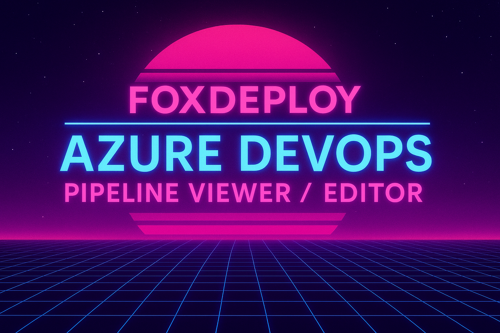

Ever find yourself staring at a 2,000-line Azure DevOps pipeline JSON file, wondering if the YAML crowd is secretly laughing at you?  Ever miss the classic pipeline viewer?  Ever wonder why we have to check in pipelines before we can preview them, graphically?

Do you kind of just want to go back to using Orchestrator again, or hell, just go back to 2007 again?  Maybe get back out your old emo clothes?  Do you miss $2 Pabst Blue Ribbons at dive bars, fighting games and Halo and chatting with your friends till 2 AM a few nights a week?  Staying up, just to watch the sunrise?

Yeah… me too. Anyway now I am despressed so I guess I will have to build something new!

### Well that was depressing, let's pivot

## Introducing: **[Azure DevOps Pipeline Viewer / Editor](https://www.foxdeploy.com/AdoPipelineView/)** 🎉

This little web app lets you **open, browse, and edit** your ADO pipeline JSON files in a clean, easy to read view.

No more having to check your pipeline in or put up with pesky peer reviews, just to see if you got your stages in the right order.

Think of it as “Windows Explorer for your pipeline,” except it won’t randomly decide to apply dark mode at 2 AM.

### Features
- Expand and collapse pipeline sections like a file tree
- Inline JSON editing without losing your place
- Quick search to jump to the setting you need
- Runs entirely in your browser — no installs required
- Total privacy

### It's private!
There's no telemetry, monitoring, exporting, downloading or anything else.  So long as you upload or paste in your pipeline, it will all stay 100% within your browser tab.

If you’ve ever spent ten minutes scrolling to find *that one* step buried in a nested job definition, this will save your sanity (or at least reduce your coffee bill).

Give it a try here: **[https://www.foxdeploy.com/AdoPipelineView/](https://www.foxdeploy.com/AdoPipelineView/)**  
And if you break your pipeline JSON, don’t worry — that’s called *job security*. 😉
