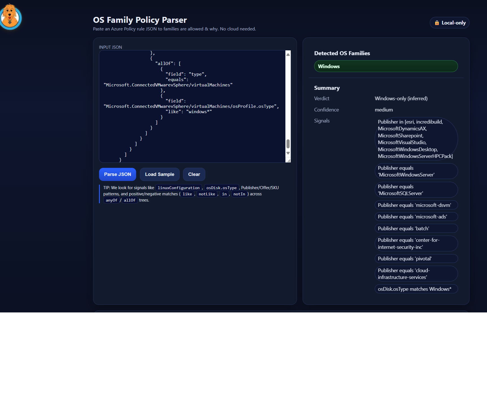

Ever cracked open an Azure Policy JSON file and felt like you needed a PhD in *indentation archaeology* just to figure out what OSes are allowed?  
Ever find yourself squinting at a sea of `anyOf` and `allOf` blocks like they’re some arcane magical incantation?  
Ever thought: *“surely there must be a better way than ctrl+F’ing for `Ubuntu` for the fifteenth time”*?

Yeah, me too. So I built something.

### Introducing: **[Azure Policy OS Allowlist Viewer](https://www.foxdeploy.com/PolicyOSView/)** 🎉

This little single-page app lets you **paste in a Policy JSON blob** and instantly see:

- A **Publisher Allowlist**: the raw, explicit `imagePublisher` values your policy permits  
- An **OS Version Summary**: a concise cheat sheet of “Versions like 8* / 9*” or “Versions NOT like 6* / 7*”  

Think of it as “Clippy for Azure Policy,” except instead of asking if you’re writing a letter, it tells you if you’re about to allow RHEL 6 (spoiler: you’re not).

### Features
- Expand and collapse nested policy clauses like a file tree  
- Auto-builds a human-readable summary table for quick reference  
- Zero dependencies: runs entirely in your browser  
- Total privacy: nothing leaves your tab  

### It's private!
No telemetry, no API calls, no uploads. Everything happens in-memory.  
Paste your JSON, hit Parse, and get instant clarity. When you close the tab, it’s gone.

---

If you’ve ever tried explaining to your boss which OSes your policy *actually* allows and felt like you were doing improv stand-up with JSON, this will save you.  

Check it out here: **[https://www.foxdeploy.com/PolicyOSView/](https://www.foxdeploy.com/PolicyOSView/)**  
And if your summary table shows "Versions NOT like 6* / 7*," just tell your auditors you know what you don't like!
