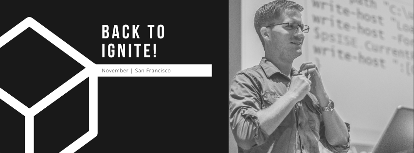

It’s been **seven years** since I last attended Ignite, and I couldn’t be more excited to finally be heading back!  I miss the energy, the pizza, the inevitable colds you get from conferences.  I especially miss the subzero artic air conditioning which is always on at conventions!  

This year, I’ll be helping run the **Configuring a Modern Workplace lab** and spending time at the **Microsoft Booth in the Azure / Configuration areas**. If you’re walking the floor and want to chat about Policy, Configuration, or distributed systems, swing by—I’d love to connect.

### Why this year matters
Ignite has always been about the crowd, the connections, and the energy. After so long away, I can’t wait to see the community again, share stories, and hear how everyone is using these tools in the field.  

I’ll also be dropping into the **PowerShell meetups** during the week. PowerShell is still one of my favorite ways to build, automate, and experiment—and I know that crew always brings the best energy.  

### Where to find me
- **Configuring a Modern Workplace Lab** – I’ll be co-hosting and helping folks get hands-on.  
- **Microsoft Booth (Azure / Configuration)** – Stop by, say hi, and let’s talk shop.  
- **PowerShell Community Meetups** – You know where the cool kids hang out.  

---

If you’ve ever read one of my blog posts and thought *“hey, I should say hi if I ever see him at an event”*—this is the time!  
I’m looking forward to seeing old friends, meeting new ones, and getting back into the Ignite groove.  

See you in San Francisco! ✨

{% include carousel.html height="50" unit="%" duration="7" number="1" %}
