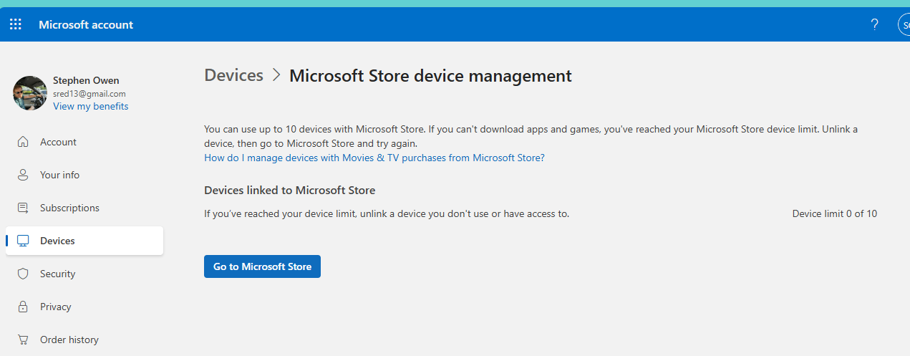

Recently, I ran into a *weird* issue but at this point in my life I feel like I only encounter these.

I launched **Minecraft for Windows** on my PC (signed into my Game Pass account, active subscription, everything totally normal)… and got this:

> *"You're at your limit for the number of devices you can use with Xbox Account."*

Alright, fair enough. I’ve been around the block. I’ve owned a *lot* of PCs over the years. 

So I clicked **Manage Devices**... and saw **nothing**.

An empty list?  Secret Stones?  Imprisioning war?

---

## What’s Going On?

At first, I suspected this was triggered by a recent hardware change. I had just upgraded my motherboard, which can make your machine look like a brand new device from Microsoft’s perspective.  And I was prompted to login to my Microsoft account which had me like "no time for this, I need to see how good my games look with the new hardware!"

But the *real* issue turned out to be something much more interesting...phantom device list?  

Possible internal api-version differences between systems?  Leading question to inspire you to read more?  Secret Dungeon?  Magic Stones?

---

## The Fix (Workaround)

Here’s the trick:

**Don’t trust the browser-based device management page.**

Instead, use the **Microsoft Store app itself**, which appears to use a newer backend.

### Steps

1. Open the **Microsoft Store** (not the Xbox app, not Game Pass)
2. Try installing **Minecraft** (or any app)
3. When the install fails:
   - Click the **error message**
   - Or click **Manage Devices**
4. This opens an **internal Store dialog**
5. Suddenly… your real device list appears
6. Remove old devices until you're under the limit
7. Retry the install

Unfortunalely I forgot to take screenshots but it looked like this:

Then clicking the Error looked like this:

*Again, I forgot to take a screenshot of the exact list view, and can't find my way back to it, but this is what it looked like.  **Importantly, this is _not_ the same list view you see clicking the user icon / profile icon in the upper right***

**Warning**: this UX you'll see when there is an install error if different than what you see if you'd click here

This won't brick your system but this entry point to the manage devices experience might show an empty list for you.

## How We Actually Discovered This

This wasn’t something I stumbled into alone.

Huge shout out to **Darryl from Xbox Support** who was a boss for the following reasons:

- Picked up on the **first ring**
- On a **Saturday afternoon**
- Stayed on the call for about an hour

Our big take away was that we should be sure we were also logged into the Microsoft store since some Xbox games (all?) on PC seem to install from there and that's where the real logging and error behavior can be observed

👉 *Log into the Microsoft Store using a different account and observe the behavior.*

That let us watch the **entire device-check flow happen in real time**, and it became obvious that the Store UI was calling into a different (newer) backend than the public website.

Absolute legend.

## Why This Might be happening from a dev who doesn't work on this team (pure speculation)

If you’ve worked on large-scale services, this pattern is instantly recognizable.

You can’t just change production APIs. Too many customers depend on existing behavior.  Like, no matter how something works, someone builds a whole production workflow based on the count of whitespace characters in your response, or uses undocumented properties of items to store the entirety of the Bee Movie.  (Real issue I had to solve)

Anyway you don't want to break users so you don't changet the GA Prod Api, but instead add a new preview-api where you can begin to change things.  So my theory of whats happening here is that the device management process for Microsoft accounts

- Maybe introduced a **new API version**
- Gradually roll it out
- Update newer clients (like the Microsoft Store)
- Leave older endpoints in place for compatibility

If I had to guess then

- `accounts.microsoft.com/devices` → older API
- Microsoft Store internal device management → newer API

Only one of those reflects reality.  Or maybe my account (and a few others who left comments in the feedback hub) are too old or have something else going on and so the list the device view doesn't reflect reality.

## TL;DR

If you see:

> *"You're at your device limit"*  

...but your device list is empty

Try uninstalling Minecraft from Xbox or Microsoft Store, then reinstall Minecraft from the Microsoft Store and closely look for an 'Error' button to appear in the store UX.   

If you use the pop-up that appears when you encoutner an install error from within the store it has a different manage devices experience which seems to actually list your devices.  

