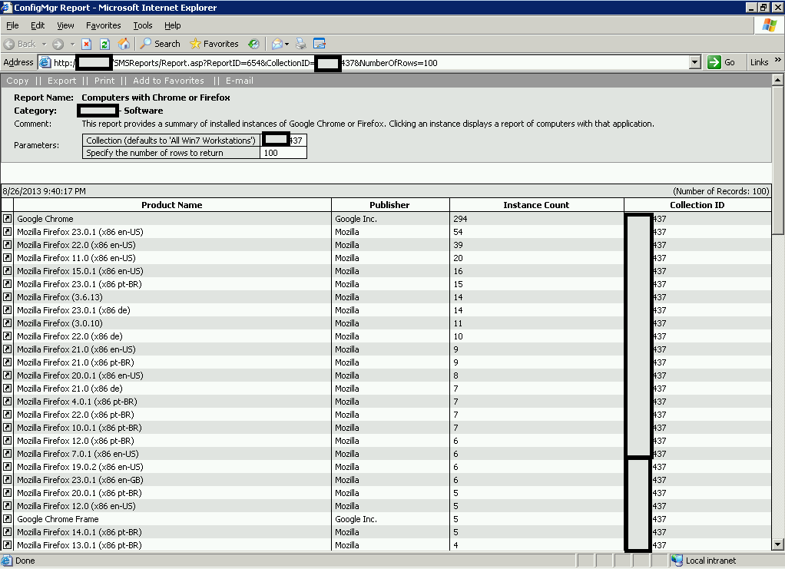
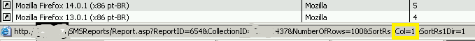
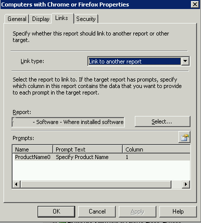
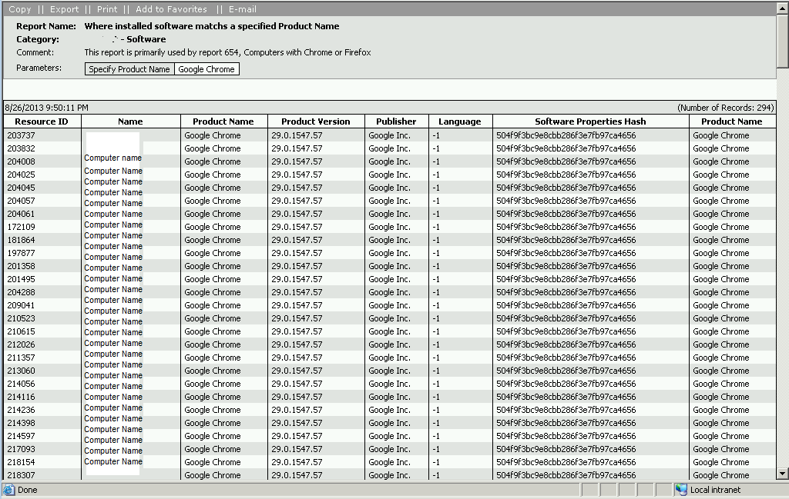
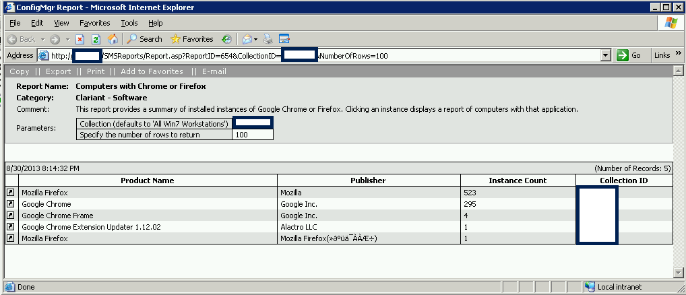

Today at a Client, the need arose to create a report which would list computers that have any of two applications installed.  The principles used could easily be modified to fit a much larger list of applications, if the need arises.

I started by modifying the canned "Search for Installed software" by stripping a number of the default prompts, and then altering the comparison line of the query to include two or comparisons, one for Mozilla Firefox and another for Google Chrome.  The result was this report, showing a count of how many instances of each version of the app was found, which was pretty neat.

It was desired to know beyond this which computers actually have a particular application installed. This was done by using the SCCM reports linking function. However, out of the box we didn't have any good reports available, so we created one.

As I normally do, I began in the SQL Management Studio. I was able to identify the ProductName0 Column of the v\_GS\_INSTALLED\_SOFTWARE\_CATEGORIZED Table as a good identifier to locate the software we needed.  For the actual code, see the link below.

After creating our new report which asks for the input of a Product name and then shows you all of the juicy details including computers which have that product name installed, I went back to the original report in the ConfigMgr console and added a link to the newly created report. In order to link reports, you need to specify one of the columns on the output rows of one report as an input for a prompt on the receiving report. An easy tip to determine which column number is which is to mouse over the header of each line, and note the code tip in your status bar (for most browsers). We'll mouse over the Product Name field and see what happens.

Note the 'Col=' bit of the asp.net url, highlighted in Yellow. This is our clue which column to select in the linked field, as depicted below.

And, now, in the final product, clicking the Linked icon in the front of any row will launch another report, listing all of the computers with this software installed.

Sorry for the somewhat gratuitous redacting of information.  Some of my clients are a bit sensitive when it comes to serial numbers and collection names, etc.

I hope that this demonstration was helpful! As always, please let me know if you see any room for improvement or if you have any questions.

**Edit:  I now have a better way of doing this, which joins all product versions together.** 

**Thanks go out to Simon Cartin for helping me figure out how to do the IF Then and SubString commands!**

**Here is a screen shot of this output.**

The code for this is also included in the below link.

All source code is available here - [http://foxdeploy.com/code-and-scripts/code\_computerswfirefoxorchrome/](http://foxdeploy.com/code-and-scripts/code_computerswfirefoxorchrome/)
