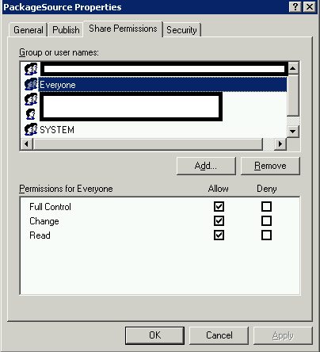

From time to time, you may need to make a new WIM file in SCCM with MDT integration, and run into this nasty error message.

\[caption id="" align="alignnone" width="487"\] Oh no, things are never good when you're getting raw Stack Trace data back in an error screen!\[/caption\]

Text:

Started processing.

Creating boot image.

Error while importing Microsoft Deployment Toolkit Task Sequence.

System.ServiceModel.FaultException: The server was unable to process the request due to an internal error.  For more information about the error, either turn on IncludeExceptionDetailInFaults (either from ServiceBehaviorAttribute or from the <serviceDebug> configuration behavior) on the server in order to send the exception information back to the client, or turn on tracing as per the Microsoft .NET Framework 3.0 SDK documentation and inspect the server trace logs.

Server stack trace:

at System.ServiceModel.Channels.ServiceChannel.ThrowIfFaultUnderstood(Message reply, MessageFault fault, String action, MessageVersion version, FaultConverter faultConverter)

at System.ServiceModel.Channels.ServiceChannel.HandleReply(ProxyOperationRuntime operation, ProxyRpc& rpc) \[...\]

**Reason** : Through the process of creating a new WIM file, SCCM will test for write permissions to the output directory (UNC path) using your credentials.  If you don't have write permission to the root of the share, this process will fail.  I've seen this happen where a new user ID isn't setup with the same permissions as the original user, thus causing the failure.

**Resolution** : Temporarily give the 'Everyone' group 'Full Control' levels of permission for the root of the location at which you're trying to create your new WIM image.

\[caption id="attachment\_237" align="alignnone" width="585"\] Use Server Manager to set the share permissions.\[/caption\]

\[caption id="attachment\_238" align="alignnone" width="404"\] Keys to the kingdom level access to everyone, I love it!\[/caption\]

So, If for instance you were making your new WIM file at [\\\\servername\\Images\\2013Q4\\boot.wim](///\\servername\Images\2013Q4\boot.wim) then you would go to the .\\Images share in server manager and grant the permissions there.  I have not tested it yet, but I believe you could get away with giving only the computer account Full Control permissions to the share instead.

Don't forget to remove the permissions after the fact!
