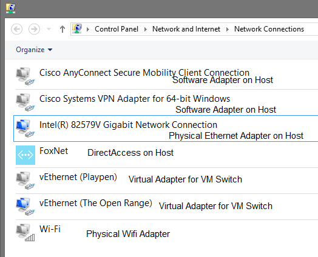

Recently I began to support a client remotely, and noticed a huge spike in blue screen events on my PC, after I installed their VPN client. I was using a Server 2012 R2 box configured with desktop experience, and as a Hyper-V host.

**Symptom** The errors would only come up during name resolution (if I pinged or performed an NSLookup on a server or workstation within the remote domain, or when trying to connect to a remote system within their network), and the Blue Screen Error Code was: UNEXPECTED\_KERNEL\_MODE\_TRAP (7f).

I fired up WinDBG (Wind Bag, as it is affectionately referred to) and loaded up my minidmp file, found under C:\\Windows\\MiniDmp. When I performed the !analyze -v command, I received the following explanation:

> This means a trap occurred in kernel mode, and it's a trap of a kind that the kernel isn't allowed to have/catch (bound trap) or that is always instant death (double fault). The first number in the bugcheck params is the number of the trap (8 = double fault, etc) Consult an Intel x86 family manual to learn more about what these traps are.

Looking at the Stack text for the memory at the time, I can see the following:

> nt!KeBugCheckEx nt!KiBugCheckDispatch+0x69 nt!KiDoubleFaultAbort+0xb4 vmswitch!VmsMpNicSendNetBufferLists+0xa7 NDIS!ndisMSendNBLToMiniport+0xf4 NDIS!ndisInvokeNextSendHandler+0x40 NDIS!NdisFSendNetBufferLists+0x2ed dnelwf64+0x3243

NDIS Commands…smells like networking. Finally, the output of the analyze command pretty much dropped the faulting module into my lap. I'm bolding the most pertinent part:

> vmswitch!VmsMpNicSendNetBufferLists+a7 fffff800\`beef63d3 e8c81e0000 call vmswitch!**VmsMpCommonSanitizeNblOffloadInfo** (fffff800\`beef82a0)
> 
> SYMBOL\_STACK\_INDEX: 3
> 
> SYMBOL\_NAME: **vmswitch!VmsMpNicSendNetBufferLists**+a7
> 
> FOLLOWUP\_NAME: MachineOwner
> 
> MODULE\_NAME: vmswitch
> 
> IMAGE\_NAME: vmswitch.sys
> 
> DEBUG\_FLR\_IMAGE\_TIMESTAMP: 53649c59
> 
> IMAGE\_VERSION: 6.3.9600.17114
> 
> BUCKET\_ID\_FUNC\_OFFSET: a7
> 
> FAILURE\_BUCKET\_ID: 0x7f\_8\_vmswitch!VmsMpNicSendNetBufferLists
> 
> BUCKET\_ID: 0x7f\_8\_vmswitch!VmsMpNicSendNetBufferLists
> 
> ANALYSIS\_SOURCE: KM
> 
> FAILURE\_ID\_HASH\_STRING: km:0x7f\_8\_vmswitch!vmsmpnicsendnetbufferlists

**Cause:** VMswitch.sys does not like me installing a VPN on my Hyper-V host. This makes sense, as in Hyper-V's Type 1 Hypervisor, the host machine is treated as an elevated VM, which is exposed to both the virtual and the physical hardware on the machine. This is the reason you'll see so many network and other devices listed in device manager:

!\[/caption\]

 

And also why you'll see so many network devices appear in Network Devices within the host. One for each Virtual Switch.

 Again, some of these are only placeholders for VMswitch network devices, which you're exposed to only from within the parent partition (that special sort of VM which can see physical and virtual devices).\[/caption\]

And to illustrate the correlation, here are the matching virtual switches from within Hyper-V.

 If you note the names, these are the same as the entries from the above two pictures.\[/caption\]

When a Hyper-V guest requests access to a network resource, its request goes to the VM queue which is passed along to the Virtual Switch agent within the Hypervisor (which is running on the hardware, not your parent partition / Host VM).

**WorkAround:** Some have reported success using the following KB (http://support.microsoft.com/kb/2913659) but my work around was to use VPN Clients only within guest VMs, and not within the parent partition.

Unfortunately I never was able to determine the root cause of the problem, but I'm certain it has something to do with the Cisco VPN Client attempting some operation against the synthetic network adapter, which will not respond in the same manner as a physical device.
