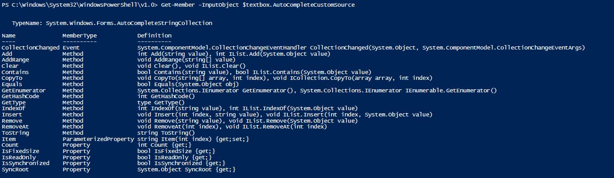

Today I had a fun little challenge come-up: how do I go about adding Auto-completion records to my forms?

Turns out it is pretty easy! Let's start very simply. The following will draw out a small box with an OK button, a textbox, and...thats it. Hitting OK will pass along the output of the box.

\[code language="powershell"\] #Load the assemblies needed for drawing forms with PowerShell \[void\] \[System.Reflection.Assembly\]::LoadWithPartialName("System.Windows.Forms") \[void\] \[System.Reflection.Assembly\]::LoadWithPartialName("System.Drawing")

#region to draw the background form $Form = New-Object System.Windows.Forms.Form $Form.Text = "Autocompletion Tool" $Form.Size = New-Object System.Drawing.Size(300,140) $Form.StartPosition = "CenterScreen" $Form.KeyPreview = $True $Form.MaximumSize = $Form.Size $Form.MinimumSize = $Form.Size

#begin to draw text box $textbox = New-Object System.Windows.Forms.TextBox $textbox.Location = New-Object System.Drawing.Size(10,40) $textbox.Size = New-Object System.Drawing.Size(200,20) $textbox.Height = 80 $textbox.Name = 'TextBox\_UserName'

$Form.Controls.Add($textbox)

#begin to draw an OK button $OKButton = New-Object System.Windows.Forms.Button $OKButton.Location = New-Object System.Drawing.Size(220,38) $OKButton.Size = New-Object System.Drawing.Size(40,25) $OKButton.Text = "OK" $OKButton.Add\_Click({$xdept=$ListBox.SelectedItem;$xname=$TextBox.Text;$xfname=$TextBoxfName.Text;$Form.Close()}) $Form.Controls.Add($OKButton)

#Make our form topmost, then show it $Form.Topmost = $True $Form.Add\_Shown({$Form.Activate()}) \[void\] $Form.ShowDialog()

#Return the value $textbox.Text \[/code\]

There we go, basic-basic.

The difference is simply adding the following lines starting on line 20:

\[code language="powershell" firstline="20"\] $textbox.AutoCompleteSource = 'CustomSource' $textbox.AutoCompleteMode='SuggestAppend' $textbox.AutoCompleteCustomSource=$autocomplete \[/code\]

And with that, you can now directly add entries to the AutoCompleteCustomSource using it's method .AddRange()

You could Import from a file

\[code language="powershell" light="true"\] #Importing from a file Get-content 'C:\\TEMP\\User Records.txt' | % {$textbox.AutoCompleteCustomSource.AddRange($\_) } \[/code\]

Or you could add individual entries, or the output of a script

\[code language="powershell" light="true"\] #Adding single entries to the inherited AutoCompleteSource object of the textbox "1","blam","foxdeploy","stephen.owen" | % {$textbox.AutoCompleteCustomSource.AddRange($\_) } \[/code\]

!\[/caption\]

As always, feel free to modify for your own purposes, and I hope that this helps you in the future.
