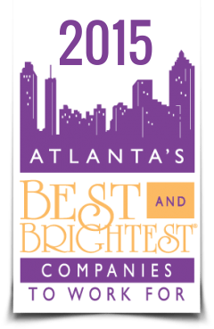

Come see me speak on my home turf!

https://www.eventbrite.com/e/atlanta-powershell-user-group-september-meeting-tickets-13037013057

 

Session Topic

Stephen Owen of iVision will give a review of the best new features in PowerShell version 5, including what’s new in the recent WMF and Resource Kits.  He will cover usages cases for some interesting new cmdlettes like Convert-FromString, and also do an overview with examples of some of the recent DSC Goodness released

* * *

Meeting Location

iVision, a long time community sponsor,  has graciously agreed to allow to hold our meeting at their offices in Midtown Atlanta.

1430 West Peachtree Street NW Suite 425 Atlanta, GA 30309 - See more at: http://ivision.com/company/contact-us/#sthash.TTyjn77t.dpuf

1430 West Peachtree Street NW Suite 425 Atlanta, GA 30309 - See more at: http://ivision.com/company/contact-us/#sthash.TTyjn77t.dpuf

1430 West Peachtree Street NW Suite 425 Atlanta, GA 30309 - See more at: http://ivision.com/company/contact-us/#sthash.TTyjn77t.dpuf

Directions: [http://ivision.com/company/directions](http://ivision.com/company/directions/) Parking: **The venue does not have free parking. It should cost you about $5 to park.**

Have questions about Atlanta PowerShell User Group September Meeting?[Contact Atlanta PowerShell User Group](https://www.eventbrite.com/e/atlanta-powershell-user-group-september-meeting-tickets-13037013057#lightbox_contact)
