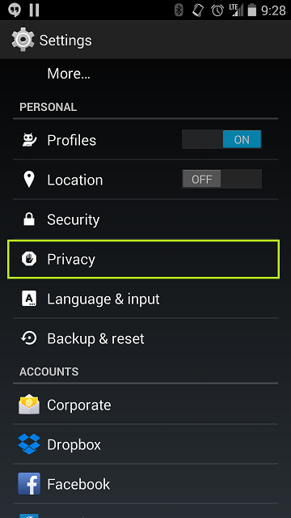
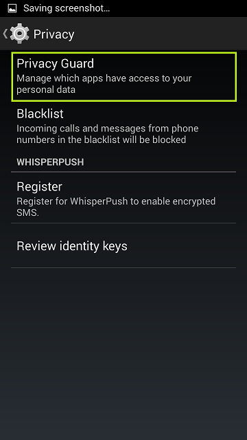
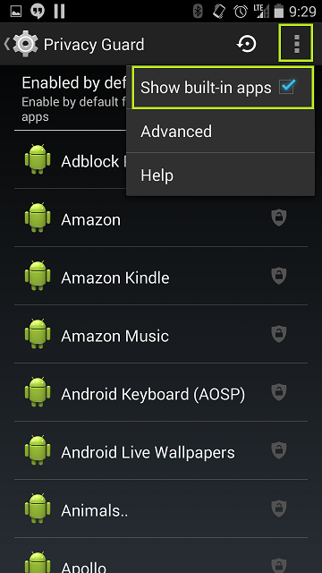
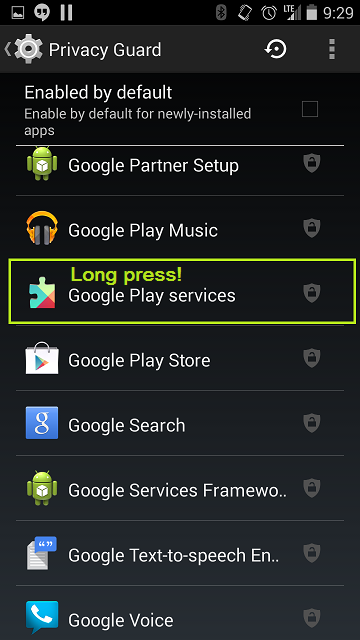
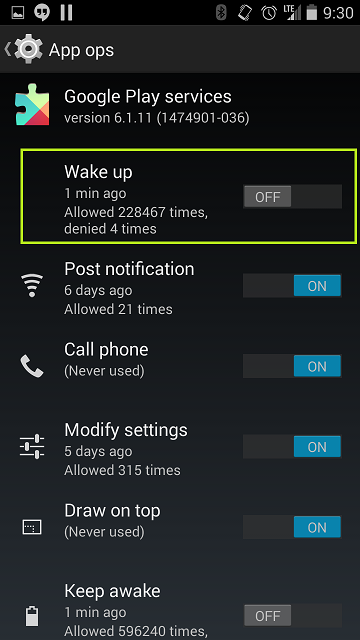
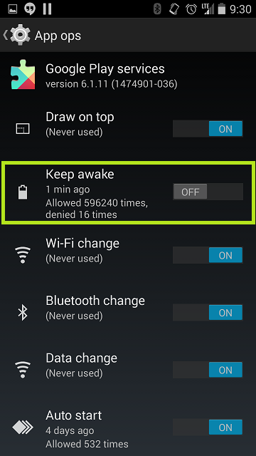
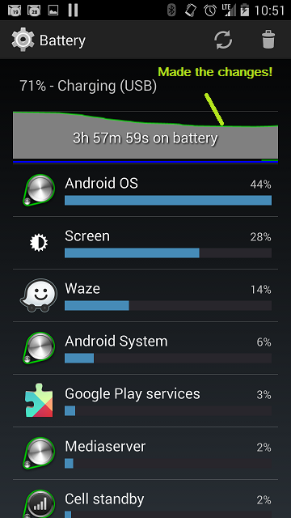

### Update 12/22/2014-

I've come across another excellent method of resolving these GPS wake locks! As seen [in this forum thread here](http://forum.xda-developers.com/showthread.php?t=1755180&page=19), if you are running into very poor battery performance _after_ running your GPS (for instance if using Waze in the morning on the way into the office, especially if the issue is resolved after a reboot, you should use the 'rename Gsiff daemon' method first, before trying the rest below.

You'll know if you're impacted when using Wakelock Detector or CPU monitor and you see the 'gsiff\_daemon' process at the top of the CPU consumption list during a trace.  From my research, the process involved polls for screen rotation and acceleratorometer data when your GPS has been turned on, most likely to allow for highly responsive rotation of the map when using a direction finding app, or to tell if you're still moving, which would be used to update your location on a fitness tracking app, or things like that.

* * *

In addition to being a PowerShell and System Center guy, I also LOVE me some Android. Anyone who has had an Android phone before the modern generation of monster batteries can relate to seeing Google Play Services completely eating up all of their devices battery over the course of the day.

### The Problem

!\[/caption\]

The reason for this is that for the last year or so, Google has been recommending developers use Google Play Services for Android Device location GPS functionality which allows for Google Play Services to batch GPS requests, hopefully preserving battery life. However, developers still have access to the native Android location APIs which they could leverage to request device location.

Additionally, no aspect of Google Play Services really keeps a developer from lazily asking

\[code language="java"\]

while(retval.Equals(False)) { Wait.Seconds (15) CurrLocation = LocationClient.getLastLocation() boolean retval = GeoFence.contains(CurrLocation);

} \[/code\]

Which would effectively wake the phone every 15 seconds to perform a relatively battery expensive GPS current location check. This is super bad practice, as the Dev should calculate the distance to a geoFence and then if distance is greater than $x kilometers, check every 30 mins, if less than 10 km check every 10 and if less than 1 km check every minute or something along those lines.

### The Resolution

Fortunately if you're using Cyanogenmod on your device, you can use the built-in Privacy Guard feature to limit Google Play Services ability to wake the device, which will permit your device to stay asleep unless you're actively using it. You can also keep Google Play from being able to keep the phone awake, which will allow your device to sleep quicker, preserving battery for Angry Birds and Pandora.

Keep in mind, there are pros and cons to everything.

<table style="direction:ltr;border-collapse:collapse;border:1pt solid #A3A3A3;" border="1" cellspacing="0" cellpadding="0"><tbody><tr><td style="vertical-align:top;width:1.0868in;padding:4pt;border:1pt solid #A3A3A3;">
Option
</td><td style="vertical-align:top;width:1.8222in;padding:4pt;border:1pt solid #A3A3A3;">
Pro
</td><td style="vertical-align:top;width:4.9138in;padding:4pt;border:1pt solid #A3A3A3;">
Con
</td></tr><tr><td style="vertical-align:top;width:1.0868in;padding:4pt;border:1pt solid #A3A3A3;">
Disable 'Keep Awake'
</td><td style="vertical-align:top;width:1.8222in;padding:4pt;border:1pt solid #A3A3A3;">
Device sleeps much faster
</td><td style="vertical-align:top;width:4.9138in;padding:4pt;border:1pt solid #A3A3A3;">
Potentially your GPS could sleep while you're running or driving somewhere, turning off your location
</td></tr><tr><td style="vertical-align:top;width:1.0868in;padding:4pt;border:1pt solid #A3A3A3;">
Disable 'Wake up'
</td><td style="vertical-align:top;width:1.8222in;padding:4pt;border:1pt solid #A3A3A3;">
Device stays asleep when you're not needing it
</td><td style="vertical-align:top;width:4.9138in;padding:4pt;border:1pt solid #A3A3A3;">
Expect delayed output for things like Google Now alerts (based on location), weather apps, anything that depends on location could take a while to spin up
</td></tr></tbody></table>

So, it's not my fault if your everything begins to suck once you do this. The easy thing is that you can make changes, then toss your phone in your pocket and check back later and see if there is a noticable improvement in battery life. You will see in the same UI I'll show below a long listing of how many times permissions were requested and if they were denied or not.

Consider denied events to be your battery life getting longer and longer :)

So, step one, go to settings on your device.  Go down to Privacy.

Go to Privacy Guard

Click the three dots / hamburger bun / overflow menu and check the box for Show built-in apps.

Wait…it takes a LOOONG time to list all of the apps.  Browse down to Google Play Services and then long press on the icon.

Scroll down to the options and based on the pros/cons above, choose your destiny and toggle some of the options.

So, after a few days, I'll check back and let you know how much my battery improves.  But for now, I know that I've plugged in my device, which skews the graph, but notice how the precipitous drop of my battery curve stops? That’s where I made the changes to my Google Play Services.

As I learn more about this change and the effects it can have, I'll periodically update this page.

I welcome your feedback, and please feel free to correct me if you feel I've factually erred somewhere.
