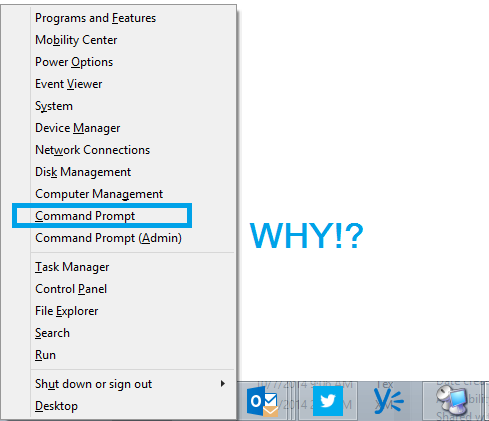

In a conversation on Twitter, I lamented with some friends that Hitting Windows+X in Windows 8 and above opens up the admin window, but still--In 2014--lists Command Prompt as the CLI.

 Maybe in Windows Vista this would have made sense...but PowerShell had already been out for SIX YEARS when Windows 8 shipped.\[/caption\]

With one single line of PowerShell, we can right this grieveous wrong.

\[code language="powershell" light="true"\]Set-ItemProperty HKCU:\\Software\\Microsoft\\Windows\\CurrentVersion\\Explorer\\Advanced \` -Name "DontUsePowerShellOnWinX" -Value 0 \[/code\]

 

And to test it...

 

