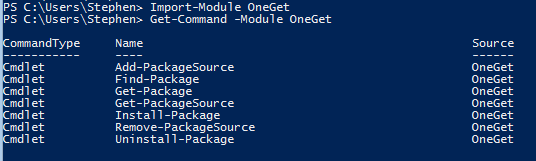
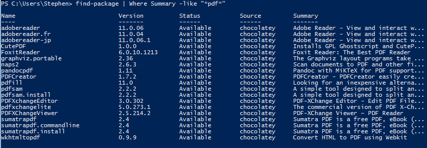
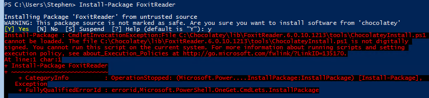
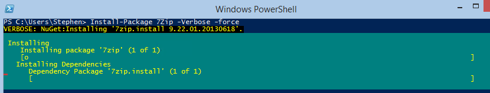

## PowerShell native switch configuration

I'm not going to dig into this too deeply, instead, read Jeffrey Snover's [great post on the topic here](http://blogs.technet.com/b/windowsserver/archive/2014/04/03/windows-management-framework-v5-preview.aspx).

## APT-GET comes to PowerShell!

The Coolest new feature is OneGet, which is PowerShell's adaptation of the community-based software repository Chocolatey.  Chocolatey supports a tremendous catalog of software, allowing you to silently install software directly from the command line.  Some examples of software found in the Chocalatey gallery:

- 7Zip
- NotePad++
- Google Chrome
- Java
- Flash
- VLC Player
- Microsoft C++
- Puddy
- Fiddler
- DotNet Framework
- Virtual Box
- Virtual Clone Drive
- FoxIT

You can see a full catalog of software here, http://chocolatey.org/packages.

###  Sample of using OneGet to install packages

First and foremost, you'll need to temporarily allow remote script execution in order to use this version of OneGet.  That is because behind the scenes to install a program using OneGet, PowerShell will download a Chocolatey install script and execute it, and if your execution policy prohibits it from running, you won't be having any fun. To get started, first install WMF 5.0, available [here](http://www.microsoft.com/en-us/download/details.aspx?id=42316).  This may or may not require a restart for you.  Now, launch PowerShell and check out the version of PowerShell you're running with Get-Host.

 Aw, yeah...Upgrayedd\[/caption\]

Now, let's Import the OneGet module and see what new commands are available.    PowerShell exposes some very nice functionality here.  Out of the box, we're able to add our own corporate PackageSource repository, and do some other interesting things:

<table border="1" cellspacing="0" cellpadding="0"><tbody><tr><td>Command</td><td>Purpose</td></tr><tr><td>Add-PackageSource</td><td>Add your own Package Source other than Chocolatey</td></tr><tr><td>Find-Package</td><td>Search your package sources for software</td></tr><tr><td>Get-Package</td><td>Get information about packages installed locally</td></tr><tr><td>Get-PackageSource</td><td>Get a listing of Package Sources available</td></tr><tr><td>Install-Package</td><td>Install a package</td></tr><tr><td>Remove-PackageSource</td><td>Remove a Package Source</td></tr><tr><td>Uninstall-Package</td><td>Uninstall a package from your system</td></tr></tbody></table>

Let's say that we needed a tool to work with PDFs, and had never heard of Adobe before.  We might run Find-Package, and pipe that into Where-Object to filter.

 You could potentially discover software to install from the command line.\[/caption\]

Let's choose Foxit Reader.  Remember when I said to allow script execution?  Well this is why.  If you try to install without specifying this, you'll get the following error.

 The install script can't run if you don't allow for UnSigned Scripts during your Install-Package session\[/caption\]

This is what is really happening when you use OneGet to install FoxitReader.  PowerShell first downloads the configuration script (C:\\Chocalatey\\lib\\FoxitReader\\tools\\ChocolateyInstall.ps1) that looks like this:

  Install-ChocolateyPackage 'FoxitReader6010.1213\_L10N\_Setup.exe' 'EXE' '/quiet' '[http://cdn01.foxitsoftware.com/pub/foxit/reader/desktop/win/6.x/6.0/L10N/FoxitReader6010.1213\_L10N\_Setup.exe](http://cdn01.foxitsoftware.com/pub/foxit/reader/desktop/win/6.x/6.0/L10N/FoxitReader6010.1213_L10N_Setup.exe)'

Which as you can see, downloads the .EXE from the CDN for the provider, then passes quiet install parameters on to the exe.

**EDIT 12/16/2014: As of this writing the problem with Chocolatey packages not installing unless you run with the signing policy as 'Unrestricted' has been resolved.  Leaving the below for posterity.**

\[...\]So, hopefully you've launched an administrative session of PowerShell and set your execution policy to UnRestricted for the moment.  Assuming you've done so, you should see the following when you run your install for 7Zip or FoxitReader.  If you're not running as an administrative user, you'll get a UAC prompt, which I personally feel is good behavior, then the install will continue.  Since these scripts are configured by the application owners, some will be silent installs, some will not.  For instance, if you run the install of Visual C++ 2010 from an administrative PowerShell prompt, the application will install with no prompt whatsoever. All in all, very powerful stuff, and finally brings App-Get like functionality to PowerShell.  10/10 would download again. **EDIT**: I've noticed that Install-Packages has parameters to pass your switches along to the .exe files, and you can see there are a lot of parameters available.  However, it's early in the game and as of this writing the help files don't exist for this and other PowerShell v5 resources.   PARAMETERS -AllVersions   -AllowPrereleaseVersions   -Confirm   -Force   -ForceX86   -Hint <string>   -IgnoreDependencies   -InstallArguments <string>   -InstallationOptions <hashtable>   -LeavePartialPackageInstalled   -LocalOnly   -MaximumVersion <string>   -Metadata <hashtable>   -MinimumVersion <string>   -Name <string\[\]>   -OverrideArguments   -Package <SoftwareIdentity\[\]>   -PackageParameters <string>   -Provider <string>   -RequiredVersion <string>   -Source <string\[\]>   -WhatIf
