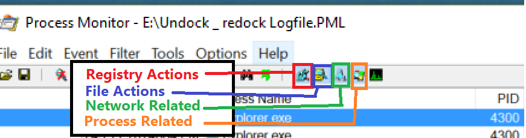
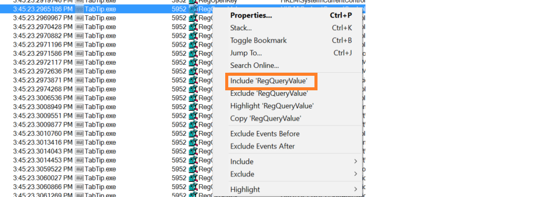
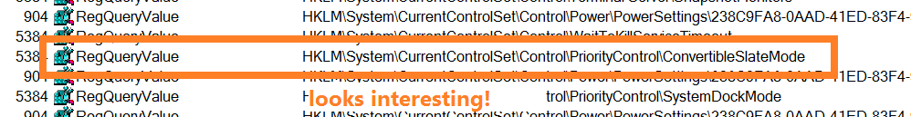
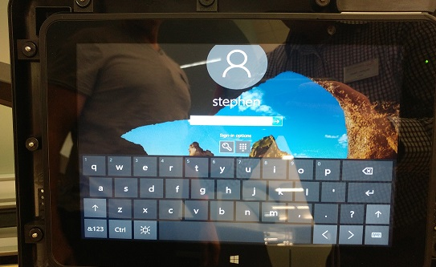
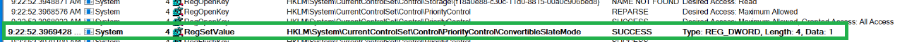

Recently, I had a customer looking at setting up potentially tens of thousands of Point of Sale Kiosks running Windows 10 on an LTSB branch.  We wanted users to have to input their password, but noticed that if a Windows 10 machine is in the docking station, the Touch Keyboard will never display!

Paradoxically, if the user has a Windows Hello Pin specified, that version of the touch keyboard will appear. But for a regular password?  Nope, no On-Screen Keyboard.  And using the dated compatibility keyboard (OSK.exe) was not an option.

To illustrate how weird this confluence of conditions was, I've provided a video

https://twitter.com/FoxDeploy/status/839504876820447232

While we wait for Microsoft to create a patch to fix this, I've created my own workaround, using WMI Events and PowerShell!

In a perfect world, we'd wait for a hotfix. If it affected many people, Microsoft would roll out a patch for it.

Life isn't perfect and we don't have time to wait!  Sometimes all you really need is to open up Process Monitor and then write your own hack.

#### Why is this happening?

Regardless of the values you set elsewhere on the system for keyboard preference (like these keys below):

```
HKEY_LOCAL_MACHINE\SOFTWARE\Microsoft\TabletTip\1.7\EnableDesktopModeAutoInvoke=1
LastUsedModalityWasHandwriting = 1
```

while these values allow the Windows keyboard to appear anywhere within Windows, it has no affect on the lock screen if the system is in a docking station.

The weirdest part?  If the tablet is undocked, even if you plug a USB Keyboard into the tablet...the On Screen keyboard will display!

#### The Cause

This strange behavior told me that something was happening related to the system being docked, which was telling Windows to suppress the keyboard on the login screen.  All of this pointed to some specific registry key being set when the tablet was docked, which instructed the Touch Keyboard (TableTip.exe) to be suppressed at login when docked.

#### How to use ProcMon

Because we could control the behavior (i.e. recreate the issue) we could narrow down the scope and look for changes.  This spells ProcessMonitor to me!  Now ProcMon can DROWN you in data and bring even a powerful system even to its knees so effective filtering is key to getting anything done.

I opened the program, started a trace and then logged off, tried to bring up the keyboard, then logged back in and paused the trace.  Next.. because I suspected that (and I hoped, as it would be easier for me if it were a simple regkey) it was a regkey hosing me up here, I filtered everything else out by clicking these icons. Remember, we need to filter out superfluous data so we can find what we want!



This dropped me down to only 235K events instead of 267K.

Next, I knew the program for the keyboard is called TabTip so I filtered for just that.  If you need to, you can click the cross hairs and drag down onto a process to lock to just that.This should really drop down the number of entries (down to 30k for me!)


Finally, let's filter for only `RegQueryValue` events, which tells us that ProcMon looked for a Regkey.  This is a hint that we are able to possibly influence things by changing a key.



And now...hit `Control+F` and get clever trying to find your value!  I knew that Windows called this SlateMode, so I searched around for that...and this one kept calling my name.



Both CSRSS and TabTip kept checking for this value, so I changed from 1 to zero and then logged out and...BOOM baby!



I finally had a keyboard on the lock screen while docked!  Oh yeah!


\[HKEY\_LOCAL\_MACHINE\\SYSTEM\\CurrentControlSet\\Control\\PriorityControl\]

"ConvertibleSlateMode"=dword:00000000

If this key is set to 0, the Touch Keyboard will always be available.

Unfortunately, when a device is docked or undocked, Windows recalculates the value of this key and no amount of restrictive permissions can prevent Windows from changing the value.  Furthermore, when a device is booted, Windows System (make sure to change your ProcMon rules to Include System, as this process is excluded by default) checks the value then as well and rewrites it.



Nothing prevents us from changing the value right back though!  To sum it up in GIF form, this is what we're about to do here:

[](http://foxdeploy.files.wordpress.com/2017/03/wp-1489444187634.gif)

#### The Fix

To resolve this issue, the following PowerShell script should be deployed as a scheduled task, to execute at boot and with the highest privilege.  It will run silently in the background and recognize docking/undocking events.  When one occurs, it will reset the value of the key to 0 again, ensuring the keyboard is always available.

\[code lang="powershell"\]set-ItemProperty HKLM:\\SYSTEM\\CurrentControlSet\\Control\\PriorityControl -Name ConvertibleSlateMode -Value 0 -PassThru

#Register for device state change Register-WMIEvent -query "Select \* From Win32\_DeviceChangeEvent where EventType = '2'" \` -sourceIdentifier "dockingEvent\_Ocurred" \` -action {#Do Something when a device is added $val = get-ItemProperty HKLM:\\SYSTEM\\CurrentControlSet\\Control\\PriorityControl | select -expand ConvertibleSlateMode write-output "$(get-date) current value of $val" >> c:\\utils\\reglog.log set-ItemProperty HKLM:\\SYSTEM\\CurrentControlSet\\Control\\PriorityControl -Name ConvertibleSlateMode -Value 0 -PassThru $val = get-ItemProperty HKLM:\\SYSTEM\\CurrentControlSet\\Control\\PriorityControl | select -expand ConvertibleSlateMode write-output "$(get-date) current value of $val" >> c:\\utils\\reglog.log

}

while($true){ start-sleep 3600 #perform garbage collection in case we're getting clingy with our memory \[System.GC\]::Collect()

}\[/code\]

 

##### Is this safe for production?

Certainly! Now, ideally, I'd rather find and set a single registry key value and I think that Microsoft will eventually fix this in a Windows Update or new release of LTSB. If that happens, I'll update this post, but as of today, this is the necessary work around for Windows 10 2016 LTSB and release 1702.

Have you solved this problem too?  Have a better way?  I'd love to hear it!  Normally I would lock down permissions to the registry key to keep Windows from changing the value back, but that wouldn't work in this case.  I'm open to other options if you'd like to share.

**Update**

Someone has helpfully linked me to this post on MSDN, which contains Microsoft's instructions to OEMs on how to control keyboard behavior.  Strangely enough, they advise that we do precisely the same thing we're doing here!

https://msdn.microsoft.com/windows/hardware/commercialize/customize/desktop/unattend/microsoft-windows-gpiobuttons-convertibleslatemode
