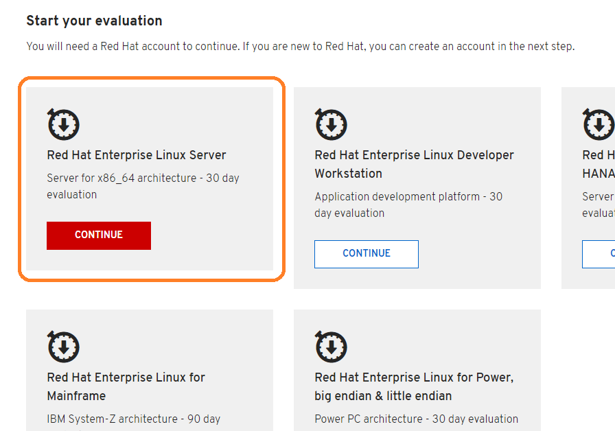
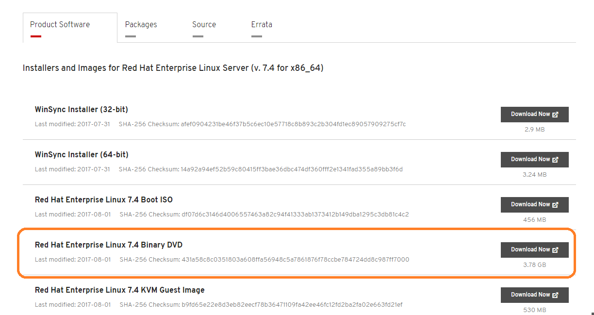
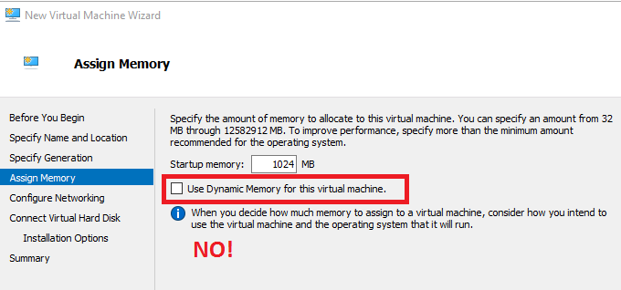
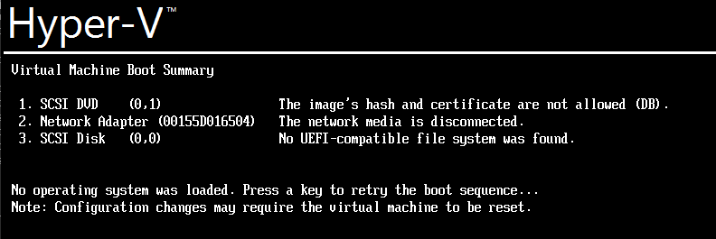
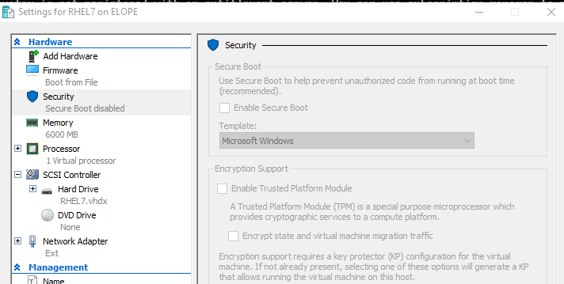
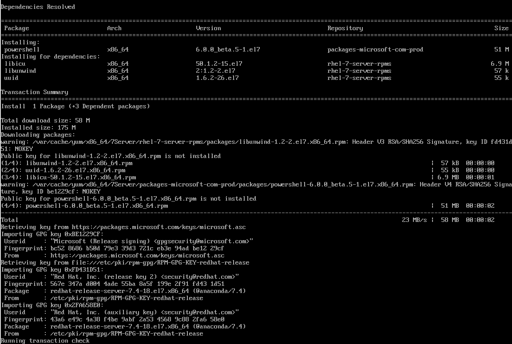
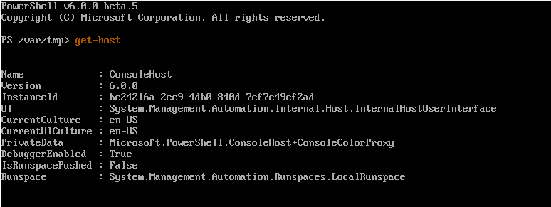

## Configuring PowerShell on RHEL 7

Hey y'all. There are a lot of guides out there to installing PowerShell on Linux, but I found that they expected a BIT more Linux experience than I had.

In this post, I'll walk you through installing PowerShell on a RHEL 7 machine, assuming you are running a RHEL 7.4 VM on Hyper-V. There are a couple stumbling blocks you might run into, and I know, because I ran into ALL of them.

\[caption id="attachment\_5053" align="alignnone" width="355"\] Real footage of my attempts\[/caption\]

#### Downloading RHEL

Much like Microsoft's approach to ISO access, Red Hat greedily hordes their installer dvd's like a classic fantasy dragon.

You'll need to register here to download it.

[RHEL Download Page](https://access.redhat.com/products/red-hat-enterprise-linux/evaluation)

Once you have an account, choose to Continue to Red Hat Enterprise Linux Server

You'll download this one here, the 7.4 binary DVD.

#### Installing RHEL in Hyper-V

Once you have the image, follow the standard process to create a Gen 2 Hyper-V VM, **disabling Dynamic Memory** but otherwise making everything the same as you normally do.

> _Why disable Dynamic Memory?_
> 
> Good question,as we typically just leave this on for all Windows Systems!
> 
> Dynamic Memory AKA Memory Ballooning allows an enlightened VM Guest to release unneeded memory, allowing for RAM Over subscription and increased VM density.
> 
> Depending on the amount of RAM you have on your system, VMs may have PLENTY of free RAM and not feel 'pressure' to release memory, and in my new Altaro-Sponsored Ryzen 7 build with 64 GB of RAM, my VMs have plenty of resources.
> 
> However, I have witnessed many installs of Ubuntu and CentOS fail to complete, and in all cases, this was due to Dynamic Memory. So, don't enable Dynamic Memory until at least the install has completed.

The next hurdle you'll encounter is a failure to mount the ISO, as seen here.

The image's hash and certificate are not allowed (DB).

This is due to the Secure Boot feature of Hyper-V. Secure Boot keeps your system from a number of attacks by only allowing approved boot images to load. It seems that Red Hat and Ubuntu boot images still are not included in this list.

You'll need to disable Secure Boot in order to load the image. Right-click the VM, choose Settings \\ Security \\ Uncheck 'Enable Secure boot'

With these obstacles cleared, we can proceed through the install.

#### Installing PowerShell

The next step, downloading the shell script to install PowerShell for us!

Because I couldn't copy-paste into my VM, I made a shell script to install PowerShell using the [script Microsoft Provides here](https://github.com/PowerShell/PowerShell/blob/master/docs/installation/linux.md#red-hat-enterprise-linux-rhel-7)

I stored it in a Gist, and you can download and execute it in one step by running this.

`bash <(curl -L https://bit.ly/RhelPS)`

The -L switch for curl allows it to traverse a redirector service like Bit.Ly, which I used to download the shell file in Gist, because Gist URLs are TOO damned long!

And that's it. Now you've got PowerShell installed on Red Hat and you're ready to go!

### References

[How to traverse short-link](https://quantumtunnel.wordpress.com/2015/02/25/using-curl-to-download-for-a-shortened-url-dropbox-bit-ly/)

[How to download and execute](https://stackoverflow.com/questions/5735666/execute-bash-script-from-url)

Image credit  [Benjamin Hung](https://unsplash.com/@benjaminhung?utm_medium=referral&utm_campaign=photographer-credit&utm_content=creditBadge "Download free do whatever you want high-resolution photos from Benjamin Hung")
