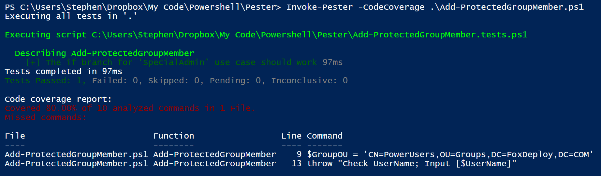
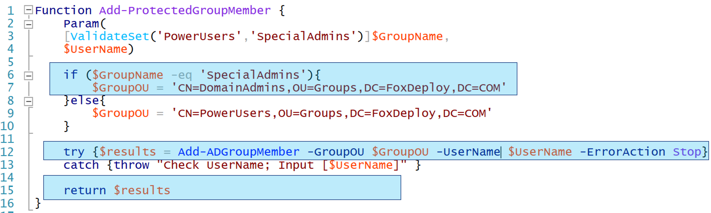
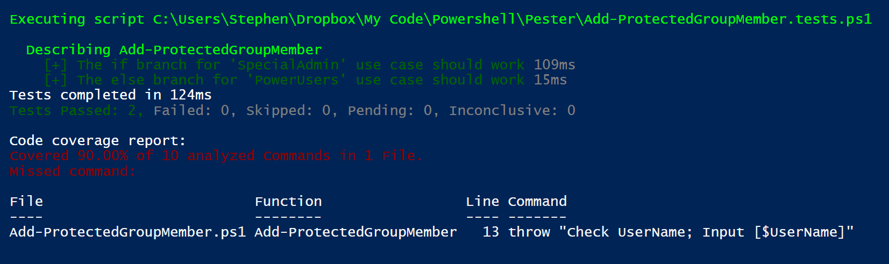
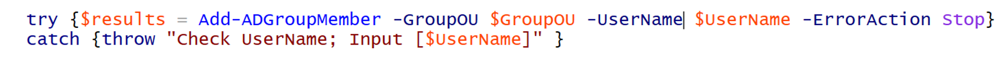
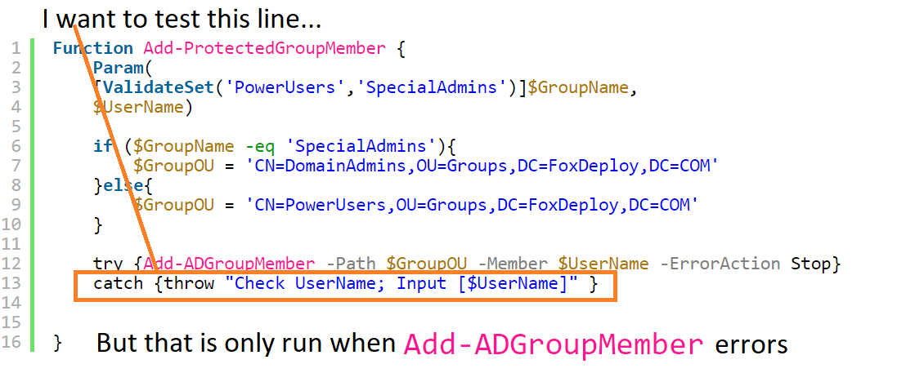
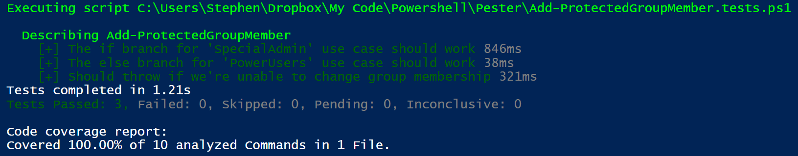

Recently at work I have finally seen the light and begun adding Pester tests to my modules.  Why is this a recent thing, you may ask?  After all, I was at PowerShell Summit and heard the good word about it from Dave Wyatt himself way back in 2015, I've had _years_ to start doing this.

#### Honestly, I didn't get it...

To tell the truth, I didn't understand the purpose of Pester. I always thought 'Why do I need to test my code? I know it works if it accomplishes the job it's supposed to do'.

For instance, I understood that Pester was a part of test-driven development, a paradigm in which you start by writing tests before you write any code.  You'd write a 'It should make a box' test and wire it up before you actually wrote the `New-Box` function.  But I was only looking at the outside of my code, or where it integrates into the environment.  In truth, all of the tests I wrote earlier on were actually integration tests.

See, Pester is a Unit Driven Test Framework.  It's meant to test the _internal logic_ of your code, so that you can develop with certainty that new features to your function don't break your cmdlet.

#### CodeCoverage made Pester finally click

It wasn't until I learned about the powerful `-CodeCoverage` parameter of Pester that it actually clipped.  For instance, here's a small piece of pseudo code, which would more or less add a user to a group in AD.

\[code lang="powershell" light="true" collapse="true"\] Function Add-ProtectedGroupMember { Param( \[ValidateSet('PowerUsers','SpecialAdmins')\]$GroupName, $UserName)

if ($GroupName -eq 'SpecialAdmins'){ $GroupOU = 'CN=DomainAdmins,OU=Groups,DC=FoxDeploy,DC=COM' }else{ $GroupOU = 'CN=PowerUsers,OU=Groups,DC=FoxDeploy,DC=COM' }

try {Add-ADGroupMember -Path $GroupOU -Member $UserName -ErrorAction Stop} catch {throw "Check UserName; Input \[$UserName\]" }

} \[/code\]

And to go along with this, I made up a pseudo function called `Add-ADGroupMember`, defined as the following.

\[code lang="powershell" light="true" collapse="true"\] Function Add-ADGroupMember { param($GroupOU, $UserName) \[pscustomobject\]@{Members=@('EAAdmin','Calico','PB&J', $UserName);Name=$GroupOU} } \[/code\]

When I run Pester in `-CodeCoverage` mode and pass in the path to my `Add-ProtectedGroupMember` cmdlet,  Pester will highlight every branch of logic which probably needs to be tested.  Here's what it looks like if I run the Pester again in that mode, without having created any tests.

\[code lang="powershell" light="true"\] PS>Invoke-Pester -CodeCoverage .\\Add-ProtectedGroupMember.ps1 Code coverage report: Covered 0.00% of 5 analyzed commands in 1 file.

Missed commands:

File Function Line Command ---- -------- ---- ------- Add-ProtectedGroup Add-ProtectedGrou 6 if ($GroupName -eq 'SpecialAdmins'){... Add-ProtectedGroup Add-ProtectedGrou 7 $GroupOU = 'CN=DomainAdmins,OU=Groups,DC=FoxDeploy,... Add-ProtectedGroup Add-ProtectedGrou 9 $GroupOU = 'CN=PowerUsers,OU=Groups,DC=FoxDeploy,DC... Add-ProtectedGroup Add-ProtectedGrou 12 Add-ADGroupMember -Path $GroupOU -Member $UserName ... Add-ProtectedGroup Add-ProtectedGrou 13 throw "Check UserName; Input \[$UserName\]"

\[/code\]

As we can see, Pester is testing for the **Internal Logic** of our Function.  I can look at this report and realize that I need to write a test to make sure that the logic on line 6 works.  And more than highlighting which logic needs to be tested, it's also basically a challenge.  Can you cover every case in your code?

Pester was stirring something within me, this gamified desired for completion and min-maxing everything.  (If it had Achievement Messages too, I would write Pester tests for everything!)

So, challenge accepted, let's think through how to write a test to cover the first issue, line 6.  If a user runs my cmdlet and chooses to place the object in the `SpecialAdmins` OU, the output will always be ''CN=DomainAdmins,OU=Groups,DC=FoxDeploy,DC=COM''.  I can test for that with the following Pester test, saved in a file called `Add-ProtectedGroupMember.tests.ps1`

\[code lang="powershell" light="true"\] Describe "Add-ProtectedGroupMember" { It "The if branch for 'SpecialAdmin' use case should work" { $A = Add-ProtectedGroupMember -GroupName SpecialAdmins -UserName FoxAdmin $A.Name | Should -Be 'CN=DomainAdmins,OU=Groups,DC=FoxDeploy,DC=COM' } } \[/code\]

I run the Pester test again now and...

Wow, with one test, I have now covered 80% of the guts of this cmdlet, that was sweet. That's because for this one test to execute successfully, all of these lines in my cmdlet are involved.

\[caption id="attachment\_5518" align="alignnone" width="636"\] All of the lines in Blue were covered under just one test!\[/caption\]

#### Completing The Tests

The next line that needs to be covered is called when the user runs with `-GroupName PowerUsers`, so we can cover that with this test.

\[code lang="powershell" light="true"\] It "The else branch for 'PowerUsers' use case should work" {

$A = Add-ProtectedGroupMember -GroupName PowerUsers -UserName FoxAdmin $a.Name | Should -Be 'CN=PowerUsers,OU=Groups,DC=FoxDeploy,DC=COM' } \[/code\]

After this test, we're practically done

All that's left now is to write a test for this chunk of code.

But I can only test that my error handling works if I can find some way to force the cmdlet in the try block to error somehow.  How the heck do I make my cmdlets poop the bed to test that this cmdlet has good error handling?

#### How to test your error handling

This is where the Pester keywords of `Mock` and `Context` come into play.  Pester allows you to 'Mock' a command, which basically replaces that command for one of your own design to 'Mock' up what a cmdlet would do.  **For instance, when I'm running a test that uses Active Directory commands, I don't want the tests to actually touch AD**.  I would `mock Get-ADUser` and then have this fake function just output the results from one or two users.

Run the function, Select the first two results, then paste them into the body of the Function as a PowerShell Object.  Easey-peasey.

> 🦊Take-away 🦊 Mock clips the wings of any cmdlet, preventing them from actually running

If I want to test error handling, I write a new test showing when I expect my function to error (when it should throw).  To make it throw, especially when I am calling external cmdlets, I just `mock` that cmdlet, and replace that cmdlets guts with something that will throw an error.   To paraphrase:

So, in order to write a test to see if my code respects error handling, I need to overwrite the default behavior of `Add-AdGroupMember` to a state which will reliably fail.  It's really simple to do!

\[code lang="powershell" light="true"\] #We need to be able to test that try/catch will work as expected Mock Add-ADGroupMember { throw }

It "Should throw if we're unable to change group membership" {

{Add-ProtectedGroupMember -GroupName PowerUsers -UserName FoxAdmin } | Should -Throw

}\[/code\]

I run the tests again and now...

Oh yeah, 100%!   In my development work, I work towards 100% code coverage to ensure that the guts of my logic is well covered by tests.  **This is worth the time to do (so build it into your schedules and planning timelines)** **because having the tests ensures that I don't break something when I come back to make changes three months from now**.

Let's move on to some of the scenarios which really stumped me for a while, as I'm still basically a newbie at Pester.

#### Verify Credentials or params are passed as expected

I wrote a cmdlet which called `Get-CIMInstance`,it was something like this.

\[code lang="powershell" light="true"\] Function Get-DiskInfo { param ($Credential)

Get-CimInstance Win32\_DiskDrive | select Caption,@{Name=‘SerialNumber‘;Expression={$\_.SerialNumber.Trim()}},\` @{Name=‘Size‘;Expression={$\_.Size /1gb -as \[int\]}}

}

\[/code\]

We decided to add support for an optional `-Credential` param, for cases in which we would need to use a different account.  The difficulty appeared when we wanted to ensure that if the user provided a Parameter, it was actually handed off down the line.

To solve this problem, first we had to rewrite the cmdlet a little, to prevent having multiple instances of `Get-CimInstance` in the same cmdlet.  Better to add some extra logic and build up a hashtable containing the parameters to provide than to have multiple instances of the same command in your function.

\[code lang="powershell" light="true"\] Function Get-DiskInfo { param ($Credential)

if ($Credential){ $ParamHash = @{Credential=$Credential;ClassName='Win32\_DiskDrive'} } else{ $ParamHash = @{ClassName='Win32\_DiskDrive'} } Get-CimInstance @ParamHash | select Caption,@{Name=‘SerialNumber‘;Expression={$\_.SerialNumber.Trim()}},\` @{Name=‘Size‘;Expression={$\_.Size /1gb -as \[int\]}}

} \[/code\]

Next, to test if the `$Credential` param was passed in, we mocked `Get-CimInstance` and configured the code to save the input param's outside of the function scope for testing.

\[code lang="powershell" light="true"\] Mock Get-CimInstance { param($ClassName) $script:credential = $credential $global:ClassName = $ClassName

} -Verifiable \[/code\]

Finally, in the test itself, we run the mocked cmdlet and then validated that after execution, the value of $Credential was not null.

\[code lang="powershell" light="true"\] It 'When -Credential is provided, Credential should be passed to Get-CimInstance' { $somePW = ConvertTo-SecureString 'PlainPassword' -AsPlainText -Force $cred = New-object System.Management.Automation.PSCredential('SomeUser', $somePW) Get-DiskInfo -Credential $cred $Credential | should -Not -be $null } \[/code\]

Once we came up with this structure to validate parameters were passed in to child functions, it really opened up a world of testing, and allowed us to validate that each of our parameters was tested and did what it was supposed to do.

#### Test Remote Types which won't exist in the test environment

Recently I was [working on a PowerShell module](https://github.com/keithga/CMPSLib/blob/master/PSCMLib/Collections/Add-CMDeviceToCollection.ps1) which would reach into ConfigMgr over WMI and pull back an instance of the SMS\_Collection Class, and then we would call two methods on it.

\[code lang="powershell" light="true"\] $CollectionQuery = Get-WMIObject @WMIArgs -class SMS\_Collection -Filter "CollectionID = '$CollectionID' and CollectionType='2'" \[/code\]

This gives a `SMS_Collection` object, which we can use to call the `.AddMemberShipRules()` method and add devices to this collection.

I didn't want my Pester tests to be dependent on being able to reach a CM Server to instantiate the object type (nor did I want my automated testing pipeline to have access to ConfigMgr) so...I just mocked everything that I needed.  It turns out that you can easily fake the methods your code needs to call using the `Add-Member -MemberType ScriptMethod` cmdlet.

\[code lang="powershell" light="true"\]

Mock Get-WmiObject { param($ClassName) $script:credential = $credential $global:ClassName = $ClassName

$mock = \[pscustomobject\]@{CollectionID='FOX0001' CollectionRules='' CollectionType =2 Name = 'SomeCollection' PSComputerName = 'SomePC123'}

Add-Member -InputObject $mock -MemberType ScriptMethod `AddMemberShipRules`{ Write-Verbose 'Mocked' } -Verifiable \[/code\]

Now I could validate that this line of code is run and that the rest of my code later on calls this method with the following code.

\[code lang="powershell" light="true"\] It 'Should Receive an Instance of the SMS\_Collection object'{ Add-CMDeviceToCollection -CollectionID SMS0001 Assert-MockCalled -CommandName Get-WMIObject -Time 1 -Exactly -Scope It -ParameterFilter {$Class -eq 'SMS\_CollectionRuleDirect'}

} \[/code\]

#### Move method calls into their own functions

[Looking back to the code](https://github.com/keithga/CMPSLib/blob/master/PSCMLib/Collections/Add-CMDeviceToCollection.ps1#L84) for `Add-CMDeviceToCollection`, note line 84.

\[code lang="powershell" light="true" firstline="83"\] $MemberCount = Get-WmiObject @WMIArgs -Class SMS\_Collection -ErrorAction Stop -Filter $Filter $MemberCount.Get() \[/code\]

You can try until you are blue in the face, but Pester does not have the capability to mock .Net objects, or handle testing for methods being called. But it DOES excel with functions, so let's just put the Method call from above into its own function, then we can check to see if the method was called by adding Assert-MockCalled.

\[code lang="powershell" light="true" highlight="9"\] Function Call-GetMethod { param($InputObject) $InputObject.Get() } Function Add-CMDeviceToCollection {

$MemberCount = Get-WmiObject @WMIArgs -Class SMS\_Collection -ErrorAction Stop -Filter $Filter $MemberCount = Call-GetMethod -InputObject $MemberCount Write-Verbose "$Filter direct membership rule count: $($MemberCount.CollectionRules.Count)" \[/code\]

And the test to validate that this line of code works as expected.

\[code lang="powershell" light="true"\] It 'Should call the .Get() method for the collection count'{ Add-CMDeviceToCollection -CollectionID SMS0001 Assert-MockCalled -CommandName Call-GetMethod -Time 1 -Exactly -Scope It

} \[/code\]

#### And that's it!

And that's all for now folks!  Have you encountered any of these situations before?  Or run into your own tricky case that you've solved?  Leave a comment below or post it on [reddit.com/r/FoxDeploy](http://reddit.com/r/foxdeploy) to share!
