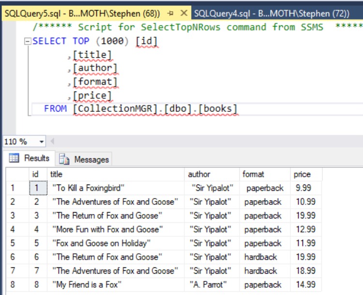
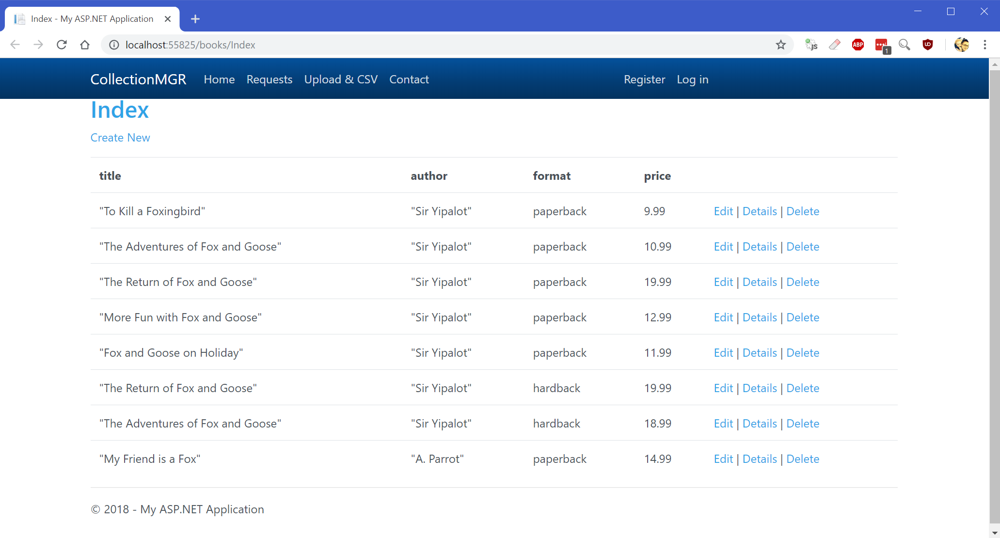
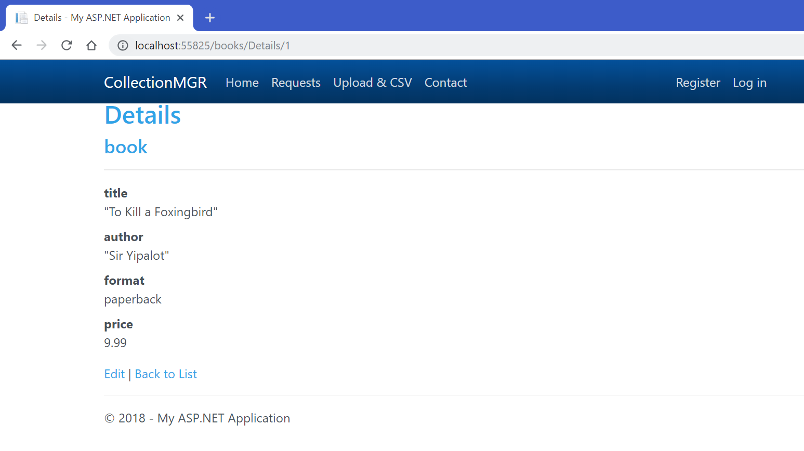

Well, it's been a minute, hasn't it?  This 🦊 needed a break after speaking at MMS and PSChatt! (both awesome events!  If you're shopping for a big conference, I can't recommend #MMSMOA enough!  And early bird pricing is [open now!](https://www.mmsmoa.com/registration.html)).

Since then at work I've had to dive deep and learn a whole new skill set.

Fortunately, I had a scuba tank and now that I'm back up for air, I'd love to share a bit of what I learned.

#### This is kind of different

It's been a long term goal of mine to expand beyond my PowerShell capabilities and learn as much as I can of this 'programmer' stuff. I'd always wanted to learn C#, and my first deliverable was the 'at least kind of working' [Client Faux](http://foxdeploy.com/2018/06/08/how-to-populate-cm-with-fake-clients/) (big updates to come).

Our goal was to make a cool website where end users could go and type in manually, or provide a CSV file of devices, and I'd use that to spin up new collections with deployments and then perform some automation on those devices within SCCM.  I want to talk through how I'm doing that, and the goal of this post should lay a foundation to answer the question of: _what is a model view controller(mvc)?_ Spoilers, MVCs are all around us!

So to recap our goal:  I needed to have a user give me input and a csv, then parse and slice it and show them the results to edit or tweak. That's going to be our end game for this guide. But before we talk about the technology...

> But Stephen, are you qualified to teach me about this?

Uhhhh...maybe. I may not have all of the terminology down pat, and there might be a more efficient way of doing things than I have figured out.  But, ya know, I did **just** figure this out, plus I'm willing to share with you, so what else are you gonna do? 😁🦊

#### The technology stack

The goal was to host the site in IIS, with an [ASP.Net](https://www.asp.net/get-started) [Model View Controller](https://mva.microsoft.com/en-US/training-courses/introduction-to-aspnet-mvc-8322) and the powerful [Entity Framework](https://docs.microsoft.com/en-us/ef/ef6/) to handle my DB interactions. To throw some jargon, an [ASP.net](http://asp.net/) MVC with EF 6.

If I lost you... Don't worry, the rest of the post will be talking through what an MVC is, with a simple demo. Once we've laid down the foundation, in the next post, we'll talk through how I solved this master-detail scenario.  Wanna follow along?  I'd recommend you read the post first, but there are walkthrough steps at the bottom!

> What's a model view controller?

You've seen and been using MVCs forever (and it's not Marvel vs Capcom (but on to that topic I **love** fighting games, and I promise that my Ken and Gambit team would whip the floor with you!)).

 The most balanced team possible in Marvel Vs Capcom\[/caption\]

If we are brand new to web design and only know HTML and CSS, when it comes to making a website we take a simple approach and just make our site by hand. You have your About Page, your Contact Page, your Home page, not much to do, you know?

Now, imagine [Amazon.com](http://amazon.com/). There are simply GOBs and of GOBs of items on the site. Do we think that there are people who are spending all day long adding new items to the site? They could (and in the beginning they probably did) create their listings one at a time. But it's super inefficient.

So, instead, sites like that--not sure what Amazon uses, [though it _is_ written in C++](https://www.wikiwand.com/en/Programming_languages_used_in_most_popular_websites--they), probably-- use what's called a Model - View - Controller.

#### M is for Model, M-m-m-model

In an MVC, rather than spending bajillions of years writing pages that look super similar, instead you start with a database.

You fill your your database up with all of the books you're going to sell, like this:

and then you write the conceptual model of a book one time. It could look something like this.

\[code lang="csharp" light="true"\] namespace MVCDemo.Models { using System; using System.Collections.Generic; public partial class book { public short id { get; set; } public string title { get; set; } public string author { get; set; } public string format { get; set; } public Nullable<float> price { get; set; } } } \[/code\]

That's the M of MVC. (borrowing that line holehog from this [walkthrough](https://docs.microsoft.com/en-us/aspnet/mvc/overview/getting-started/introduction/accessing-your-models-data-from-a-controller))

Now that we have modeled the data in our Database, our app will know how to access it (_**without having to write queries**_).

#### Views are basically webpage generators

Then, you write a View to render the content, which is in enlightened HTML files with the extension of CSHTML.

\[code lang="csharp" collapse="true"\] @model MVCDemo.Models.book

@{ ViewBag.Title = "Details"; }

<h2>Details</h2>

<h4>book</h4>

<dl class="dl-horizontal">

<dt> @Html.DisplayNameFor(model => model.title) </dt>

<dd> @Html.DisplayFor(model => model.title) </dd>

<dt> @Html.DisplayNameFor(model => model.author) </dt>

<dd> @Html.DisplayFor(model => model.author) </dd>

<dt> @Html.DisplayNameFor(model => model.format) </dt>

<dd> @Html.DisplayFor(model => model.format) </dd>

<dt> @Html.DisplayNameFor(model => model.price) </dt>

<dd> @Html.DisplayFor(model => model.price) </dd>

</dl>

@Html.ActionLink("Edit", "Edit", new { id = Model.id }) | @Html.ActionLink("Back to List", "Index")

\[/code\]

Remember the columns from the database? The view has those same columns here too! But...how does the view know >WHICH< book is the one we're referencing here in this view?

#### Controllers - piping data into the View and other stuff

Finally, the last piece of the MVC, the controller

No not that type of controller!

The controller is a piece of code that runs on our server. When a user tries to access something in the dB (either by clicking around in the website or by exploring around by typing in urls) the controller is the piece that controls whether the user can do what they're wanting to do, and also defines how we relay it back to the user.

So, the controller is the most 'code like' piece of this whole pie.  Here's what a controller looks like.

\[code lang="csharp" collapse="true"\] using System; using System.Collections.Generic; using System.Data; using System.Data.Entity; using System.Linq; using System.Net; using System.Web; using System.Web.Mvc; using CollectionMGR.Models;

namespace CollectionMGR.Controllers { public class booksController : Controller { private CollectionMGREntities db = new CollectionMGREntities();

// GET: books public ActionResult Index() { return View(db.books.ToList()); } } } \[/code\]

This controller above states that when the user navigates to my web site, localhost, and goes to the **books** endpoint, we have an action called **Index** which shows us all of the available books.

Now, I've added an additional action called **Details**, which will render that view I showed earlier.

\[code lang="csharp"\] // GET: books/Details/5 public ActionResult Details(short? id) {

if (id == null) { return new HttpStatusCodeResult(HttpStatusCode.BadRequest); } book book = db.books.Find(id); if (book == null) { return HttpNotFound(); } return View(book); } \[/code\]

The end result?  Well, here's the index view.

And if someone clicks the Details button next to one of those books, the Details view I showed earlier is called to render the whole thing!

#### But what about the Entity Framework?

Did you notice that there was basically zero querying done, though we could still retrieve and save results in our database?  That flexibility and ease of use that we're enjoying here all comes to us courtesy of the Entity Framework.  H[ere's a great site to dive deep into what it does](http://www.entityframeworktutorial.net/what-is-entityframework.aspx), but it should suffice to say that the EF abstracts away the need for queries to pull data for a views, allowing us to instead retrieve results like this.

In a traditional data connection framework, you'd often see code like this, note the native SQL query baked right into the page.

\[code lang="php"\]

<tbody> <?php $connect = mysql\_connect("localhost","root", "root"); if (!$connect) { die(mysql\_error()); } mysql\_select\_db("apploymentdevs"); $results = mysql\_query("SELECT \* FROM demo LIMIT 10"); while($row = mysql\_fetch\_array($results)) { ?> <tr> <td><?php echo $row\['Id'\]?></td>

<td><?php echo $row\['Name'\]?></td>

</tr>

<?php } ?> </tbody>

\[/code\]

Compare that to this approach, first the user requests the Index page, where we paginate and return 10 results at a time. So here's the code to actually retrieve the first 10 of those results.

\[code lang="csharp" light="true"\] public ActionResult Index() { private MVCDemoEntities db = new MVCDemoEntities(); return View(db.books.ToList().Take(10)); } \[/code\]

The connection to the db is handled for us via the Entity Framework, which generates the models for us when we first connect our app to our DB (covered below in the 'How to play along?' section). So, to distill down a bit further, the Entity Framework gives us a lot of tools to keep us from having to be SQL experts in addition to C# experts.

#### Recapping

In this post, we covered some of the basics of what an MVC is, and I showed an example of how using one can result in some massive time savings, especially when coupled with the Entity Framework. In the next post, we'll drill further into the MVC as I cover how to bundle requests with a parent request, using a programming model called the Master-Detail Scenario!

#### Wanna play along with the rest of this blog series?

I've got you covered :)

[Follow the walkthrough here to get started.](https://github.com/1RedOne/BlogPosts/tree/MVC/MVC)
