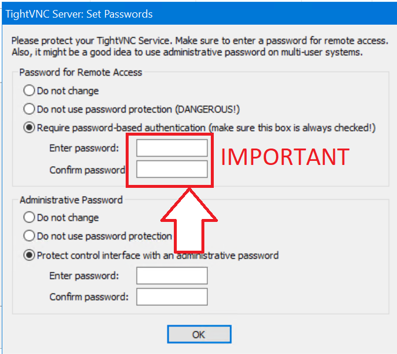

With everyone working remote now, it's really helpful to have a method to remote control your kid's computers, _especially_ if they are hard to keep on task like mine.

So I wrote this short guide to help you get a handle. **This guide expects you to have two computers, one for you, one for your kids to use.**

### Whoa I need a computer for the kids?

This guide is only going to cover PCs, not tablets.  Sorry.

If you need to buy one, this is what I'm now recommending.  Walmart has a new in-store brand of computers which is surprisingly great for the money, called their Motile line. It can do light to moderate gaming like Minecraft and Fortnite, and also handle video editing if you've got a budding YouTuber, as well as programming. And the best point? It's user upgradable so you can add more RAM or get a bigger hard drive down the road.

[Motile 14" AMD Laptop with Radeon 3 Graphics, 128 GB SSD and 4GB RAM](https://www.walmart.com/ip/Vega-HDMI-Front-RAM-FHD-4GB-display-AMD-128GB-Tuned-Camera-Radeon-14-Ryzen-720P-THX-Graphics-IR-SSD-Silver-Laptop-3-MOTILE-Spatial-Performance-Audio-/715635402?selected=true&irgwc=1&sourceid=imp_ylrx6S3oMxyOU1UwUx0Mo38QUknSpzwNr2JTSQ0&veh=aff&wmlspartner=imp_2098076&clickid=ylrx6S3oMxyOU1UwUx0Mo38QUknSpzwNr2JTSQ0)

[Linus Tech Tips did a great and funny video on this laptop too if you're interested.](https://www.youtube.com/watch?v=0hMdQAjy43A) 

/\\ The above are **not my** affiliate links.

> Note: a word about Remote Management

_This method will setup Remote Viewing and control of your child's computer_

It is **imperative that you treat your children with maturity, allow them breaks and make sure they know you can remote into their PC.**

You don't want to be stuck at home with kids who feel you've abused their trust by spying on them.  Only use these powers for good.

If you disagree with this, I don't care so please keep that perspective to yourself.

### How to enable Remote Management

On the child's computer, login using the administrator's account.

This is simple, just login using the main account, our goal here is to setup an account for our homeschooler child to use which will have restricted permissions.

Hit Start, then type 'User Accounts', then **Add, edit or remove other users.**

Next, under 'Other Users', click 'Add someone else to this PC'.

Then select 'I don't have this persons sign-in information'

 I know, the UX is pretty weird here, because it's shuttling you into setting up a Microsoft account, which you don't need for this guide.\[/caption\]

Finally, provide a user name and a password, if you'd like, for your new user.

> We're doing this to make sure your child isn't able to install programs or 'mess up' the computer. When they want to install an app, they'll have to come to you for the admin password (hint: this is the account you used to login and make this account for them).

Now, before you logoff, it's time to setup the Remote Management Client.

### Installing TightVNC

We're going to do this with the awesome and free TightVNC, [it's available here.](https://www.tightvnc.com/download.html)

[Direct Download](https://www.tightvnc.com/download/2.8.27/tightvnc-2.8.27-gpl-setup-64bit.msi)

On the computer we want to control, we'll going to launch the installer we just downloaded and then click **Next, Accept the Terms of the Agreement and Next.** 

This will bring us to image three below, where we choose **Custom Install** .

 Next, Next, Custom, Next, Disable Viewer, Next Finish\[/caption\]

Now, on screen four, **right-click 'TightVNC Viewer' and then choose 'This Feature will not be available', then click Next.**

Next, on screen 5, make SURE to check 'Register TightVNC Server as a System Service' is selected.

 Configuring 'Register TightVNC Server as System Service' makes the remoting app launch when Windows boots, no matter who is using it.\[/caption\]

And then click Next until at the below screen '**TightVNC Server : Set Passwords"**

 Do not leave a remote client open with no password.  Seriously, don't do it.\[/caption\]

**It is critically important to use a password.  This password is required any time you want to remote in to your child's PC.** Create a password and keep it safe, this is very important.

You should also password protect the Administrative Interface too, possibly with a different password.

### Last step - note the computer name!

You will need the computer name to connect to this PC.  You can get it, or set it, by hitting 'WindowsKey+X -> System Management'

That's it, now you can remote into this PC from another computer on the network!

AND, because your child will be running as a standard user account, this means that they cannot uninstall the app either, and also need your consent (and for you to login) to install new apps, great for keeping the PC pristine.  Running as a Standard User mitigates the vast majority of hacks, and Cryptolocker too!

###  Setting up Remote Viewer

On the computer you are going to connect from -  run the same installer as above.  However, this time when you get to screen 4, right-click 'TightVNC Server' and choose 'this feature will not be installed'.

The PC you're connecting from doesn't need and shouldn't have TightVNC Server running on it.

 This time, on image 4, disable TightVNC Server, and only install Viewer\[/caption\]

To connect, hit Start -> TightVNC Viewer.  Then type in the name of your kid's computer and hit Connect. Bam, it's that easy.

This setup has worked great for me to be able to quickly pop in and reopen the Scholastic Learn from Home courses and other materials when my kids accidentally close it every three minutes.

Where to go from here? I'm thinking of adding some additional guides, like how to prohibit certain apps from running, or keeping a Chrome browser window open
