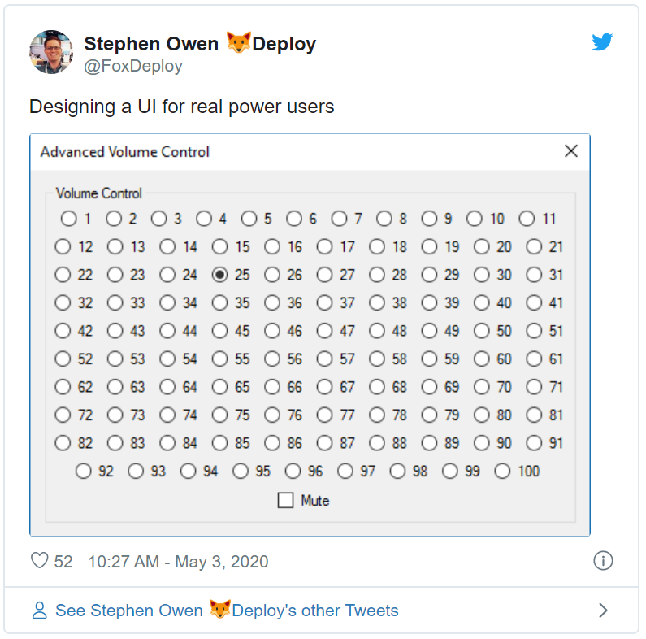
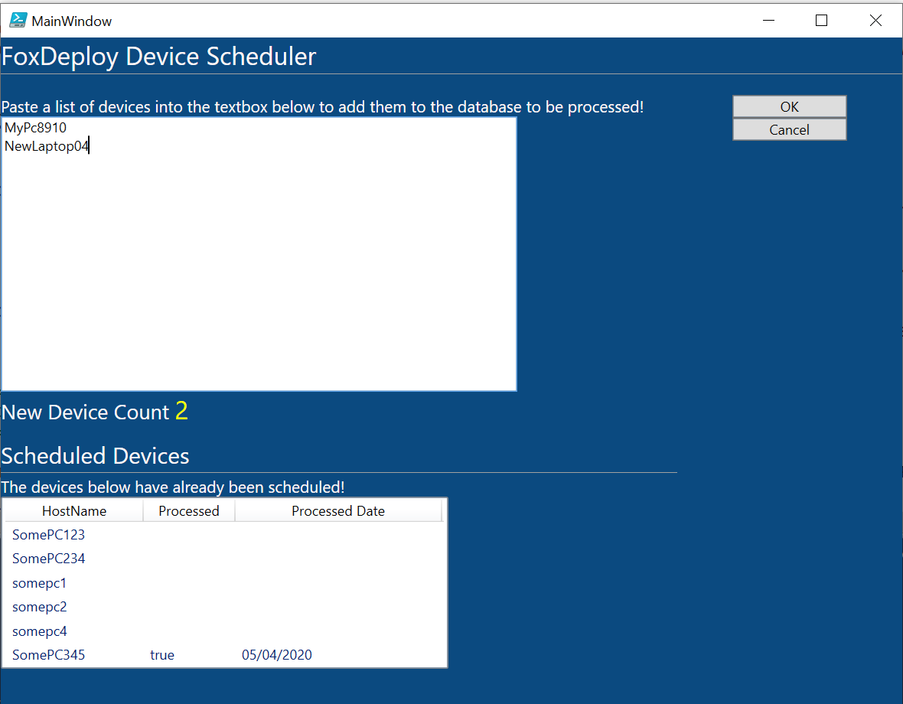

[In our previous post in the series](http://foxdeploy.com/2019/09/10/progressive-automation-part-i/), we took a manual task and converted it into a script, but our users could only interface with it by ugly manual manipulation of a spreadsheet. And, while I think sheetOps [(configuring and managing a Kubernetes cluster with a GoogleSheets doc!)](https://twitter.com/danielepolencic/status/1254330583380979712) are pretty cool we can probably do better.

So in this post, I'll show how I would typically go about building a PowerShell WPF GUI from an existing automation that kind of works OK.

### Analysis

To begin making a UI we need to start by analyzing which values a user will be entering, considering what inputs make sense for that, and then thinking if there is anything the user will need to see in the UI as well, so, looking back to the first post...

> To begin with, users have their own spreadsheet they update like this, it’s a simple CSV format.

 

\[code\] HostName Processed ProcessedDate SomePC123 SomePC234 SomePC345 \[/code\]

Previous our users were manually adding computers to a list of computer names. That kind of scenario is best handled by the TextBox input. Or if we hate our users, we can make them provide input with a series of sliders.

Me: The ideal phone number input control doesn't exis-- \[wpvideo 8HfEBT6J\] [Gif Credit - Twitter](https://twitter.com/RandomNoun7/status/1256961724936097792)

So we need at least a TextBox.

We need a confirmation button too, to enter the new items. We also need some textblocks to explain the UI. Finally, a Cancel/Reset button to zero out the text box.

We should also provide feedback of how many items we see in their input, so we should add a label which we can update.

That brings us up to:

- **Inputs**
    - TextBox for ComputerNames
    - Buttons
        - OK
        - Cancel
- **Display Elements**
    -  Welcome / Intro Text
    -  Confirmation Area
    -  Updatable Label to show count for devices input
    - DataGrid to show current contents

> **A note on TextBoxes:** As soon as we provide TextBoxes to users, all kinds of weird scenarios might happen.  Expect it!

For instance, users will copy and paste from e-mails in Outlook, or from Spreadsheets in Excel. They might also type in notepad a list of computers separated by Newlines (`/r/n`) carriage returns. Or maybe they're more of the comma-separated type, and will try to separate entries with Commas.  These are all predictable scenarios we should account for in our UI, so we should give the user some kind of confirmation of what we see from their typing in the TextBox, and our form should handle most of the weird things they'll try.

**That's why we need Confirmation.** If you provide UI without confirmation, users will hate you and e-mail (or worse, they might call you!!) for help, so be sure to do it the right way and think of their needs from the get go, or you will enjoy getting to hear from them a lot.

Don't make UI that will make your users hate you, like this one 

With all of these components in mind, time to get started.

### Making the thing

We're going to open up Visual Studio, pick a WPF app and then do some drag and dropping. If you are getting a bit scared of how to do it, or what you should do to install it, check out some of the previous posts in my GUI Series, here!

You should end up with something like this:

https://gist.github.com/1RedOne/7ca9e036f29a97bbfafae2cbd485cc9b

Which will look like this when rendered!

\[caption id="attachment\_5909" align="alignnone" width="636"\] Easily the ugliest UI we've done so far\[/caption\]

To wire up the buttons, I wrote a few helped functions for the logic for the buttons, which look like this.

\[code lang="powershell"\]

function loadListView(){ $global:deviceList = new-object -TypeName System.Collections.ArrayList $devices = import-csv "$PSScriptRoot\\devices.csv" | Sort-Object Processed ForEach($device in $devices){ $global:deviceList.Add($device) } $WPFdevice\_listView.ItemsSource = $global:deviceList }

function cancelButton(){ $WPFok.IsEnabled = $false $wpfdeviceTextbox.Text = $null $wpflabelCounter.Text="Reset" }

$wpfdeviceTextbox.Add\_TextChanged({ if ($wpfdeviceTextbox.Text.Length -le 5){ return } $WPFok.IsEnabled = $true $deviceTextbox = $wpfdeviceTextbox.Text.Split(',').Split(\[System.Environment\]::NewLine).Where({$\_.Length -ge 3}) $count = $deviceTextbox.Count $wpflabelCounter.Text=$count })

$WPFCancel.Add\_Click({ cancelButton })

$WPFok.Add\_Click({ $deviceTextbox = $wpfdeviceTextbox.Text.Split(',').Split(\[System.Environment\]::NewLine).Where({$\_.Length -ge 3}) ForEach($item in $deviceTextbox){ $global:deviceList.Add(\[pscustomObject\]@{HostName=$item}) } set-content "$PSScriptRoot\\devices.csv" -Value $($deviceList | ConvertTo-csv -NoTypeInformation) cancelButton loadListView })

\[/code\]

To walk through these, we set an arrayList to track our collection of devices from the input file in `loadListView`, then define behavior in the `$WPFok.Add_Click` method to save the new items to the output.csv file. This is simple, and much harder to mess up than our previous approach of telling users to update a `.csv` file manually.

[🔗Get the complete source here 🔗](https://gist.github.com/1RedOne/377f4c0d1ae209844f7f34ce9ecf581e#file-foxdeploy_newgui-xaml)

### Wait, where's the beef XAML Files?

You may also notice a new method of loading up the `.XAML` files.

\[code lang="powershell"\] \[void\]\[System.Reflection.Assembly\]::LoadWithPartialName('presentationframework')

$xamlPath = "$($PSScriptRoot)\\$((split-path $PSCommandPath -Leaf ).Split(".")\[0\]).xaml" if (-not(Test-Path $xamlPath)){ throw "Ensure that $xamlPath is present within $PSScriptRoot" } $inputXML = Get-Content $xamlPath $inputXML = $inputXML -replace 'mc:Ignorable="d"','' -replace "x:N",'N' -replace '^<Win.\*', '<Window' \[xml\]$XAML = $inputXML \[/code\]

After some time away from writing PowerShell GUIs, I now think it is unnecessarily verbose to keep your `.xaml` content within the script, and now recommend letting your `xaml` layouts live happily next to the script and logic code. So I've modified the template as shown here, to now automatically look for a matching named `.xaml` file within the neighboring folder. Simple and easy to read!

#### Next time

And that's that! Was this the world's best GUI? Yes. Yes of course it was!

**Join us next time where we explore a whole new world,** don't you dare close your eyes, of aspnet core as an alternative way of approaching automation.

If you're still looking for something to do, [try this out this great walkthrough of terrible UI traits](https://www.bagaar.be/insights/user-inyerface) by a UI design consulting firm. Whatever you do, don't do this in your UI and you'll be off to a good start.
