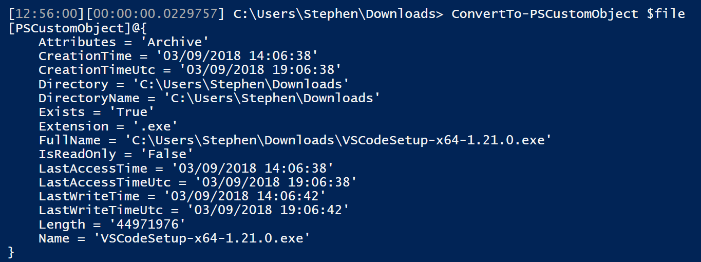

Do you ever need to quickly hop between PowerShell tabs in VScode, or have data you want to move from one session to another?

Sure, you _could_ output your data into a .CSV file, a .JSon file, or one of hundreds of other options.  But sometimes it's nice to just paste right into a new window and get up and running again.  For that, I wrote this small little cmdlet.

\[code lang='powershell' light='true'\] Function ConvertTo-PSCustomObject{ Param($InputObject) $out = "\[PSCustomObject\]@{\`n" $Properties = $InputObject | Get-Member | Where MemberType -eq Property ForEach ($prop in $Properties){ $name = $prop.Name if (\[String\]::IsNullOrEmpty($InputObject.$name)){ $value = $null } else { $value = $InputObject.$name }

$out += "\`t$name = '$value'\`n" }

$out += "}" $out } \[/code\]

And the usage of it:

