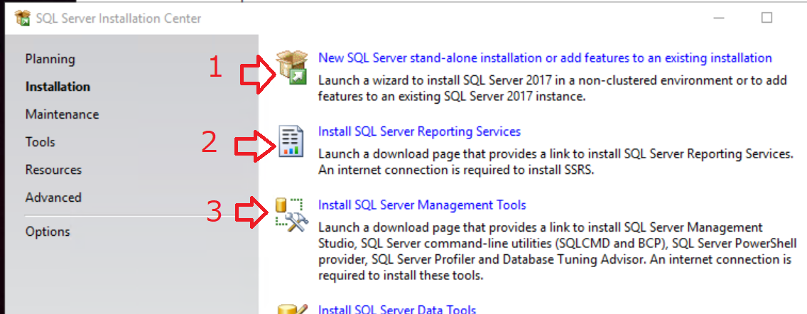
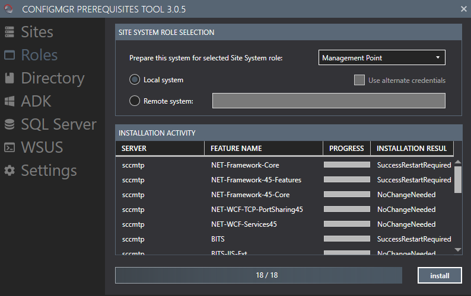
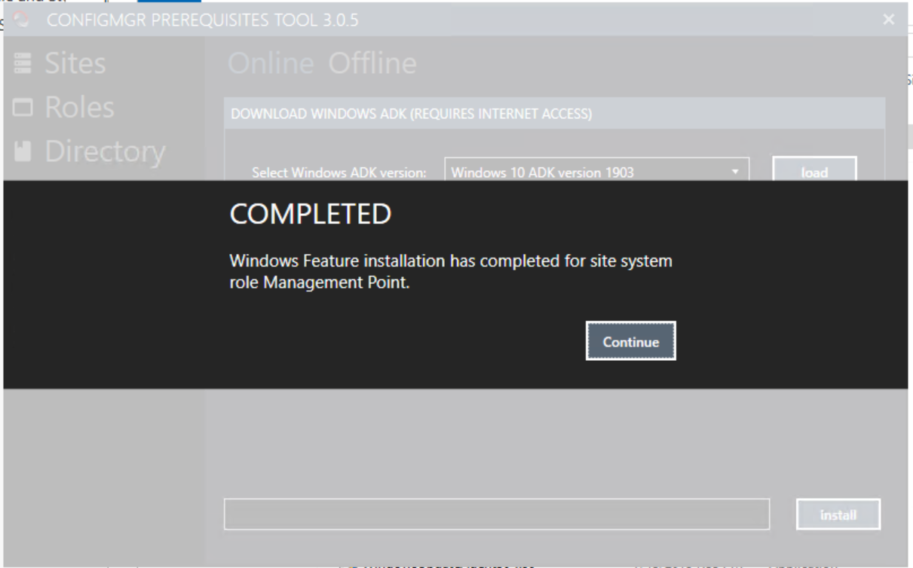
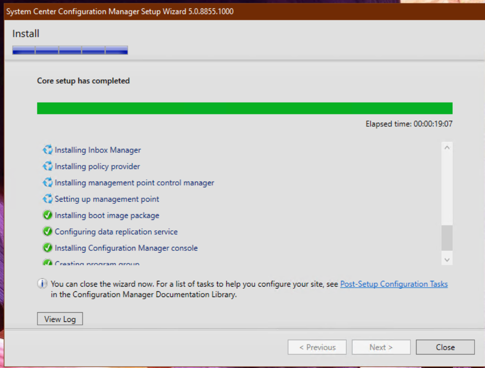
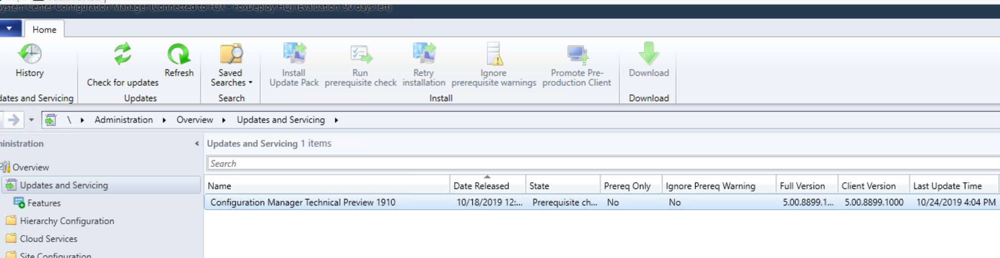

Hey all,

After seeing Adam Gross' very interesting content on [CM TechPreview's new AdminService](https://www.asquaredozen.com/2019/02/12/the-system-center-configuration-manager-adminservice-guide/) feature, I immediately started to wonder how I could go about using it in place of remote WMI Operations.

<blockquote class="twitter-tweet">
I'm so late the the <a href="https://twitter.com/hashtag/SCCM?src=hash&amp;ref_src=twsrc%5Etfw">#SCCM</a> <a href="https://twitter.com/hashtag/ConfigMgr?src=hash&amp;ref_src=twsrc%5Etfw">#ConfigMgr</a> 1910 TP Game, but here we go. Just testing the <a href="https://twitter.com/hashtag/AdminService?src=hash&amp;ref_src=twsrc%5Etfw">#AdminService</a>. A new Class has been added to the V1.0 Controller - Device. You can get all devices or a single without WMI. <a href="https://twitter.com/hashtag/StillDigging?src=hash&amp;ref_src=twsrc%5Etfw">#StillDigging</a>
https://server/AdminService/v1.0/Device(16777219) <a href="https://t.co/wKM3W38fSv">pic.twitter.com/wKM3W38fSv</a>

— Adam Gross (ASquareDozen.com) (@AdamGrossTX) <a href="https://twitter.com/AdamGrossTX/status/1186878008805773312?ref_src=twsrc%5Etfw">October 23, 2019</a></blockquote>

So I connected to my stale Tech Preview Environment (it was TP 1806, lol!) and found it had expired 😢.

After googling for 14 seconds, I found no one had made a completely slap-dash guide to deploying the current version of CM Tech preview complete with all of the links you'll need, so I decided to do that here.

> note: I am assuming you've installed ConfigMgr \*\*a lot of times\*\* before this, so I won't go too in-depth into what you need to do for each step.  Where relevant I provide a link to a post with the exact step you need to do, in case you're not sure.

#### Have an AD domain

You must have a domain to setup ConfigMgr.  Womp womp.  If you need a domain controller, make a new Server 2019 VM and follow this blog post for a [one-click domain controller install.](http://foxdeploy.com/2015/06/11/2349/)

#### Make a Service Account

You don't want to be stuck doing this when you get to the SQL Install step so do it now.  Make a new account and set it to never expire and give it limited perms.

**Do not place it in Domain Admins or Enterprise Admins**

#### Install an OS

 Make a VM first, give it two-four cores, give it two NICs one on the same subnet as your Domain Controller and the other with External Web Access.

 Spec it out, give it 12-16 GB of RAM.  Give it fast disks.  Give it at least two disks.  One for OS only and the other for CM and SQL.  You could go for the three drive config and put SQL and CM binaries on separate drives, you do you.

\[code lang="powershell" light="true"\] C:\\ - OS D:\\ - SQL

E:\\ - ConfigMgr \[/code\]

 For OS, I choose Server 2019.  [Download the ISO here. 🔗](https://www.microsoft.com/en-us/evalcenter/evaluate-windows-server-2019)

> FoxDeploy's Patented Bad Idea Tip:You can _dramatically improve the speed_ of a CM install if you disable Windows Defender Real Time protection first!
> 
> SQL installs much quicker without it and CM installs in 50% of the time, from 44 minutes down to just 20 with my hardware!
> 
> **Just remember to turn Defender Back On!**

#### First Boot

 Rename your machine first then reboot then join to a domain.

 Reboot your new CM machine.

 While this is rebooting RDP to your Domain Controller and go to ADSI Edit and give your CM Server Full Control permissions on the SystemsManagement container.  [Follow this to make the container if you don't know how.](https://www.sccmtst.com/2017/02/installing-sccm-create-system.html) 

  Now is a good time to extend ADSchema with ExtAdSch.exe if you haven't yet.

 Back on the Server, start downloading and installing updates. If you begin downloading updates you need to let the first batch of updates before you can do a SQL Install (or you'll get all the way to the end and it won't allow your to install because of a pending reboot)

####  Install SQL

  I like to do SQL first so I can setup WSUS DB 'the right way' by co-locating it on my CM SQL.  If you want to have a holy war about it, I'm ready for it, 1v1 me irl.

  For SQL Version, I choose [SQL Server 2017 SP1. Download Link 🔗](https://www.microsoft.com/en-us/sql-server/sql-server-downloads SQL 2017 SP1)

  Install SQL, nexting your way through and then choosing '**Database Engine**' only when prompted for features.

> Where's Reporting Services?

  I know, how weird!  Turns out in the time we've been away from ConfigMgr consulting the world went and changed and now Reporting Services is a second process.

   Install SQL Server Features and DB to your SQL drive D:\\ if you're following along.

  Follow [this post if you've never installed SQL Server before and need your hand held.](https://www.experiencingit.net/sccm/install-sccm-current-branch-part-9-install-sql-server-2016/)  Some highlights:

- Provision your SCCM Service account as an admin in the SQL Install process
- Set the services to auto start using your Service account too.  (You can make a separate SQL Service account if you'd like, but since it's a lab, I am lazy on this regard)

  When SQL Server finishes, you can install SSMS and Reporting Services without rebooting.    [Download link for SQL Reporting Services. 🔗](https://www.microsoft.com/en-us/download/details.aspx?id=55252 SQL Reporting Services)

> Where's management studio?!

  It's separate now too!  [Here's the download link for SSMS 🔗.](https://aka.ms/ssmsfullsetup SSMS)

  You can also find links for all of the above directly within the SQL Installer, as shown here.

  Last Step for SQL: Reboot (SQL Server requires it) then set the max RAM amounts.  I use 8192-9002 MB.

#### Install CM PreReqs

 I used to do this with a one liner in PowerShell but I love that the PreReq tool from the Nikolaj Anderson from SCConfigMgr is just amazing and does it all for you!  [ConfigMgr Prerequisite tool download link 🔗](https://gallery.technet.microsoft.com/ConfigMgr-2012-R2-e52919cd)

Go to the Sites tab and choose 'Primary Site' and click install.

Then go to Roles Tab and choose Management Point and click install as well.

 Then go to the ADK tab and choose:

- Windows 10 ADK Version 1903
- Windows 10 ADK Version 1903 (WinPE Add-on)

The ADK steps take a few minutes each so wait until you the 'Install Completed' Prompt before moving on.

Next, 'WSUS' and choose 'SQL SERVER" then click install.

> ℹ  You can also use this tool to configure your SQL Memory limits too if you'd like and you skipped this before.  Just Click 'Settings' then 'Connections' and type 'localhost' for your SQL Server name.  You can then go to the SQL Server tab and use it to lock in the needed memory limits for SQL

#### Install CM

  If you've been fast we might be at only 25 minutes by this point!

 [Download CM Tech Preview Here 🔗](https://www.microsoft.com/en-us/evalcenter/evaluate-system-center-configuration-manager-and-endpoint-protection-technical-preview)

  This will download all of the content to "C:\\SC\_Configmgr\_SCEP\_TechPreview1907\\".

  You can launch the Installer by running `"C:\SC_Configmgr_SCEP_TechPreview1907\SMSSETUP\BIN\X64\setup.exe"`, but first I recommend running `"C:\SC_Configmgr_SCEP_TechPreview1907\SMSSETUP\TOOLS\CMTrace.exe"` and setting it as your default log file viewer.

  The install is dead simple, just install CM to your E:\\ drive we provisioned earlier.

You can close the wizard when you see this message.

#### Update to TP 1910

  Open up the console and Click to Administration\\Updates and Servicing and then install 'Configuration Manager Technical Preview 1910'.  Download should take -30 mins or less!

> **IMPORTANT:** Watch CMupdate.log for info, rather than babysitting the Update Pack Installation Status viewer.  If you click 'Refresh' at the wrong time for the Install Viewer, it will lose connection to the Provider and stop updating.
> 
> However, the install is still in process, as you can see in the CMUpdate.Log file.

Last Step : [enable Enhanced HTTP if you want to use the CM Admin Service](https://docs.microsoft.com/en-us/sccm/core/plan-design/hierarchy/enhanced-http)!

  And now that you're here...time to visit Adam's post and learn all about the exciting [CM TechPreview new and improved AdminService!](https://www.asquaredozen.com/2019/02/12/the-system-center-configuration-manager-adminservice-guide/)
