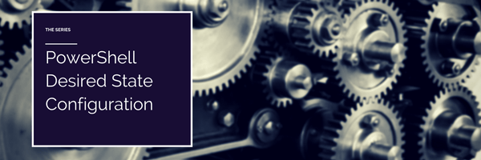

## Learning DSC Series

<em>Learning PowerShell DSC.</em>

PowerShell Version 4 brought to the Windows World our first deeply integrated look at the work of declarative configuration, similar to the model seen in Chef and Puppet.  If you’ve been following along to the world of server computing for the last few years, you’ve definitely heard both Chef and Puppet mentioned before.

This page is the jump page to my series on Desired State Configuration, which will walk you through building a plain vanilla VM up to a fully fledged Active Directory test lab, all through an easy follow-along walkthrough format, using the power of PowerShell Desired State Configuration.

* Step 1 Getting Started, renaming our machine and joining a workgroup
* Step 1.5 Creating our first local user
* Step 2 Making our user a local administrator
* Step 3 Making our system a Domain Controller
* Step 4 One-Click Domain Controller with DSC
* Step 5 DSC Revisited.  The simplest Domain Controller config, Ever.
* FoxDeploy DSC Designer – A point and click driven, guided DSC Configuration tool

### DSC Background

* DSC – What it is and why you should care
* DSC – Solving the Chicken and the Egg Problem
* DSC v. GPO v. SCCM – The Case for Each
