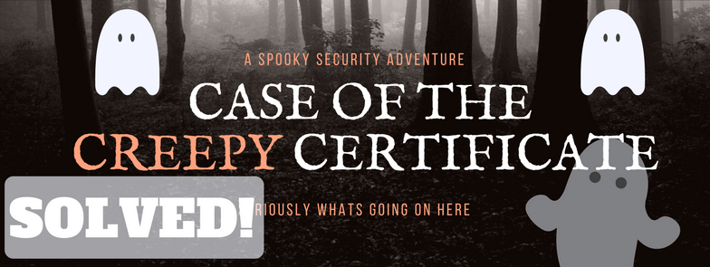

## Learning WinRM

Organizations are flocking to WinRM in droves (DROVES I SAY) for the awesome ease and simplicity afforded by PowerShell remoting.

Natively, PowerShell Remoting will use a variety of encryption protocols, including the mighty Kerberos.  In fact, if you want your PowerShell commands to go over the wire in plaintext, you have to really prop up, aim and then shoot yourself in the foot.  It ain’t easy to make it plaintext.

But for some companies, Can = Should, and since PowerShell offers HTTPs remoting, that becomes the de facto standard.

In this series, I cover my research and findings into exactly what happens to WinRM in a variety of situations related to certificates, including what happens when they expire and are renewed!

* [WinRM HTTPs and the Case of Spooky Certificate](/2016/09/16/winrm-https-and-the-case-of-ghost-certificate)
* [WinRM and HTTPs — What happens when certs die](/2016/09/13/winrm-and-https-what-happens-when-certs-die)
* [SOLVED: What happens to WINRM when certs die](/2017/01/13/solved-what-happens-to-winrm-when-certs-die)