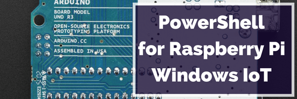

## Learning Raspberry Pi

With Windows 10 Server Nano, you can now deploy Windows to smaller systems than ever before, and still get the rich Windows management experience afforded by WMI.

In this series, I’ll walk you through my experiences with running Windows on a $35 Raspberry Pi 2, and share what I’ve learned about programming for this tiny device.

 

* Building a Windows 10 IoT C# traffic monitor: Part I
* Building a Windows 10 IoT C# traffic monitor: Part II
* How to add an image to your Raspberry Pi application with Visual Studio
* Running Windows 10 on Raspberry Pi, what it’s like
* Solving the DISM ‘The drive can’t find the sector requested’ error when imaging for Windows 10
